# 简而言之，10 种常见的软件架构模式

> 原文：<https://towardsdatascience.com/10-common-software-architectural-patterns-in-a-nutshell-a0b47a1e9013?source=collection_archive---------0----------------------->

想知道大型企业级系统是如何设计的吗？在主要的软件开发开始之前，我们必须选择一个合适的架构，它将为我们提供期望的功能和质量属性。因此，在将它们应用到我们的设计之前，我们应该理解不同的架构。

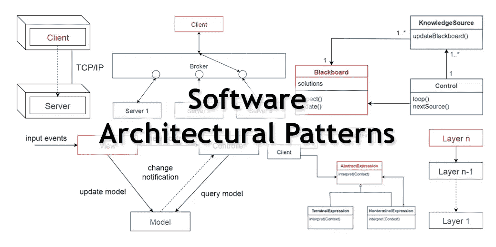

# 什么是架构模式？

根据维基百科，

> 一个**架构模式**是一个通用的、可重用的解决方案，用于解决给定环境下软件架构中常见的问题。架构模式类似于软件设计模式，但是范围更广。

在本文中，我将简要解释以下 10 种常见的架构模式及其用法和优缺点。

1.  **分层图案**
2.  **客户机-服务器模式**
3.  **主从模式**
4.  **管道过滤器模式**
5.  **经纪人模式**
6.  **点对点模式**
7.  **事件总线模式**
8.  **模型-视图-控制器模式**
9.  **黑板图案**
10.  **口译员模式**

# 1.分层模式

这种模式可以用来构建程序，这些程序可以分解成子任务组，每个子任务都处于特定的抽象层次。每一层都向上一层提供服务。

一般信息系统最常见的 4 层如下。

*   **表示层**(又称 **UI 层**)
*   **应用层**(又称**服务层**)
*   **业务逻辑层**(也称**域层**)
*   **数据访问层**(也称为**持久层**)

## 使用

*   一般桌面应用程序。
*   电子商务网络应用。

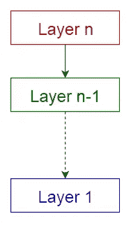

Layered pattern

# 2.客户机-服务器模式

这种模式由两方组成；一个**服务器**和多个**客户端**。服务器组件将向多个客户端组件提供服务。客户端向服务器请求服务，服务器向这些客户端提供相关服务。此外，服务器继续监听客户端请求。

## 使用

*   电子邮件、文档共享和银行业务等在线应用。

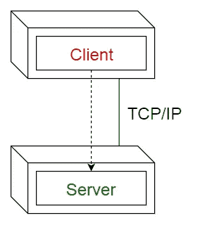

Client-server pattern

# 3.主从模式

这种模式由两方组成；**主人**和**奴隶**。主组件在相同的从组件之间分配工作，并根据从组件返回的结果计算最终结果。

## 使用

*   在数据库复制中，主数据库被视为权威来源，从属数据库与之同步。
*   计算机系统中连接到总线的外围设备(主驱动器和从驱动器)。

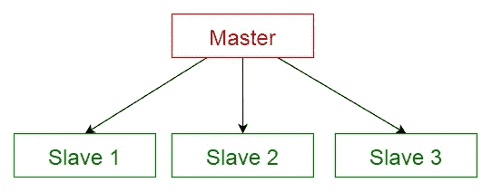

Master-slave pattern

# 4.管道过滤模式

这种模式可以用来构建产生和处理数据流的系统。每个处理步骤都包含在一个**过滤器**组件中。待处理的数据通过**管道**传递。这些管道可用于缓冲或同步目的。

## 使用

*   编译器。连续过滤器执行词法分析、解析、语义分析和代码生成。
*   生物信息学的工作流程。

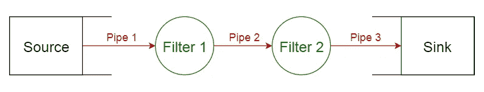

Pipe-filter pattern

# 5.经纪人模式

这种模式用于构建具有解耦组件的分布式系统。这些组件可以通过远程服务调用相互交互。一个**代理**组件负责**组件**之间的通信协调。

服务器向代理发布它们的能力(服务和特征)。客户端向代理请求服务，然后代理将客户端从其注册中心重定向到合适的服务。

## 使用

*   消息代理软件如[**Apache ActiveMQ**](https://en.wikipedia.org/wiki/Apache_ActiveMQ)[**Apache Kafka**](https://en.wikipedia.org/wiki/Apache_Kafka)[**rabbit MQ**](https://en.wikipedia.org/wiki/RabbitMQ)和[**JBoss Messaging**](https://en.wikipedia.org/wiki/JBoss_Messaging)。

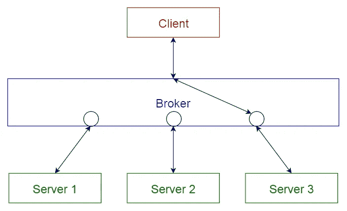

Broker pattern

# 6.对等模式

在这种模式中，单个组件被称为**对等体**。对等体既可以作为客户端**向其他对等体请求服务，也可以作为服务器**向其他对等体提供服务。对等体可以充当客户端或服务器，或者两者兼而有之，并且它可以随时间动态地改变其角色。

## 使用

*   文件共享网络，如[**Gnutella**](https://en.wikipedia.org/wiki/Gnutella)**和 [**G2**](https://en.wikipedia.org/wiki/Gnutella2) )**
*   **多媒体协议如[**P2PTV**](https://en.wikipedia.org/wiki/P2PTV)**[**PDTP**](https://en.wikipedia.org/wiki/Peer_Distributed_Transfer_Protocol)。****
*   ****基于加密货币的产品如 [**比特币**](https://bitcoin.org/en/)[**区块链**](https://www.blockchain.com/)****

****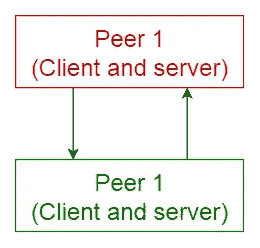****

****Peer-to-peer pattern****

# ****7.事件总线模式****

****该模式主要处理事件，有 4 个主要组成部分；**事件源**、**事件监听器**、**通道**和**事件总线**。源将消息发布到事件总线上的特定通道。听众订阅特定的频道。侦听器会被通知发布到它们之前订阅的通道的消息。****

## ****使用****

*   ****Android 开发****
*   ****通知服务****

****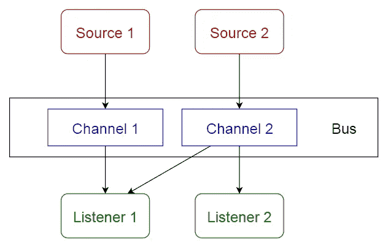****

****Event-bus pattern****

# ****8.模型-视图-控制器模式****

****这种模式，也称为 MVC 模式，将交互式应用程序分为 3 个部分，****

1.  ******模型** —包含核心功能和数据****
2.  ******视图** —向用户显示信息(可定义多个视图)****
3.  ******控制器** —处理来自用户的输入****

****这样做是为了将信息的内部表示与向用户呈现信息以及用户接受信息的方式分开。它将组件解耦，并允许高效的代码重用。****

## ****使用****

*   ****主要编程语言的万维网应用程序的体系结构。****
*   ****Web 框架如[**Django**](https://en.wikipedia.org/wiki/Django_(web_framework))[**Rails**](https://en.wikipedia.org/wiki/Ruby_on_Rails)。****

********

****Model-view-controller pattern****

# ****9.黑板模式****

****这种模式对于不知道确定性解决策略的问题很有用。黑板模式由 3 个主要部分组成。****

*   ******黑板** —包含来自解空间的对象的结构化全局存储器****
*   ******知识源** —具有自身表示的专门模块****
*   ******控制组件** —选择、配置和执行模块。****

****所有组件都可以访问黑板。组件可以产生添加到黑板上的新数据对象。组件在黑板上寻找特定类型的数据，并可能通过与现有知识源的模式匹配来找到这些数据。****

## ****使用****

*   ****语音识别****
*   ****车辆识别和跟踪****
*   ****蛋白质结构鉴定****
*   ****声纳信号解释。****

****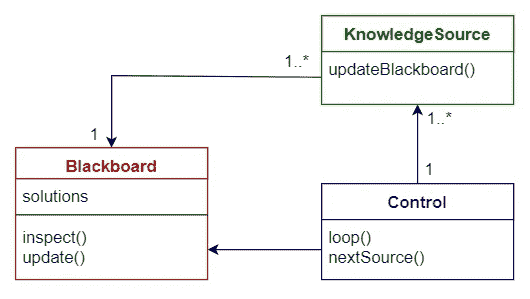****

****Blackboard pattern****

# ******10。解释器模式******

****该模式用于设计一个组件，该组件解释用专用语言编写的程序。它主要规定了如何评估程序行，即用特定语言编写的句子或表达式。基本思想是为语言的每个符号创建一个类。****

## ****使用****

*   ****数据库查询语言，如 SQL。****
*   ****用于描述通信协议的语言。****

****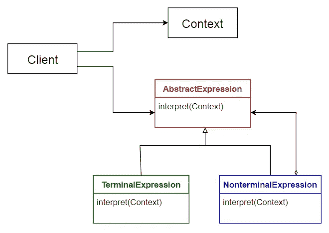****

****Interpreter pattern****

# ****建筑模式的比较****

****下表总结了每种架构模式的优缺点。****

****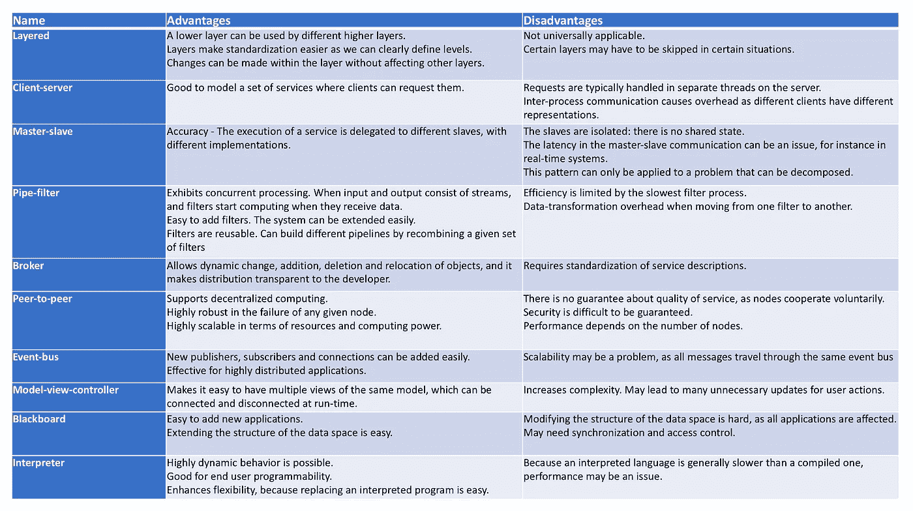****

****Comparison of Architectural Patterns****

****希望这篇文章对你有用。我很想听听你的想法。😇****

****感谢阅读。😊****

****干杯！😃****

# ****参考****

****[https://www . ou . nl/documents/40554/791670/im 0203 _ 03 . pdf/30 DAE 517-691 e-b3c 7-22ed-a55ad 27726d 6](https://www.ou.nl/documents/40554/791670/IM0203_03.pdf/30dae517-691e-b3c7-22ed-a55ad27726d6)****