# 10 幅完美诠释日常生活的有趣图表

> 原文：<https://towardsdatascience.com/10-funny-graphs-that-perfectly-explain-everyday-life-bdaa6565baa0?source=collection_archive---------6----------------------->

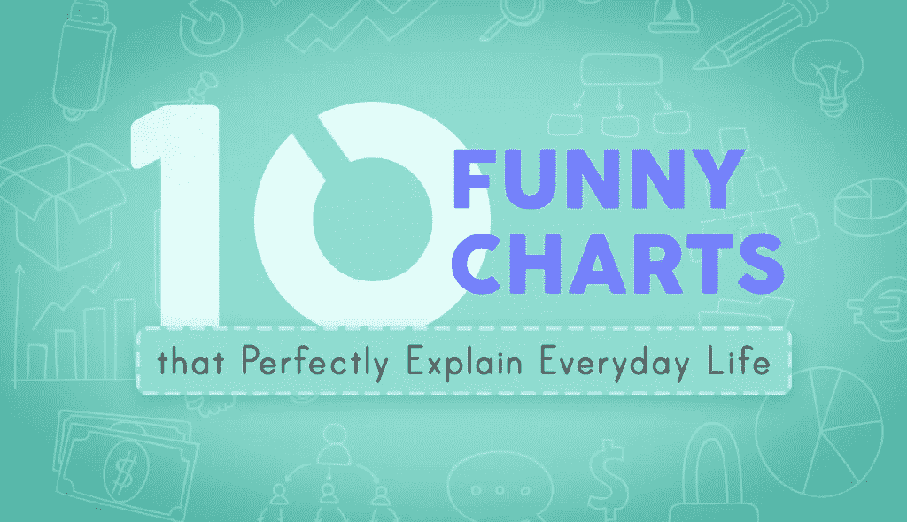

我们日常生活中的一些元素，几乎每个人都能很容易地联想到。有些很有趣，很有娱乐性，有些则完全令人沮丧。

为了让你的一周有一个好的开始，我们分享了 [10 幅由](http://blog.visme.co/funny-graphs/) [Visme](https://www.visme.co/make-charts-and-reports/) 制作的有趣图表，它们完美地解释了日常生活。我们希望他们会给你一个开怀大笑！

# 1.狗和猫:它们有多想念你

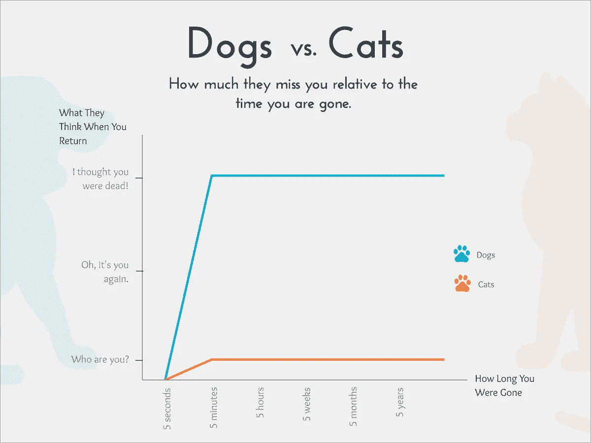

每一个拥有这些宠物中任何一种的人都能体会到狗和猫在情感依恋水平上的差异。

到你的邮箱走一趟，狗会焦急地看着，以确保你没有被外星人绑架。另一方面，猫对人类的依赖程度稍低，人类生存的唯一目的就是为它们服务。

# 2.我女儿是如何打发时间的

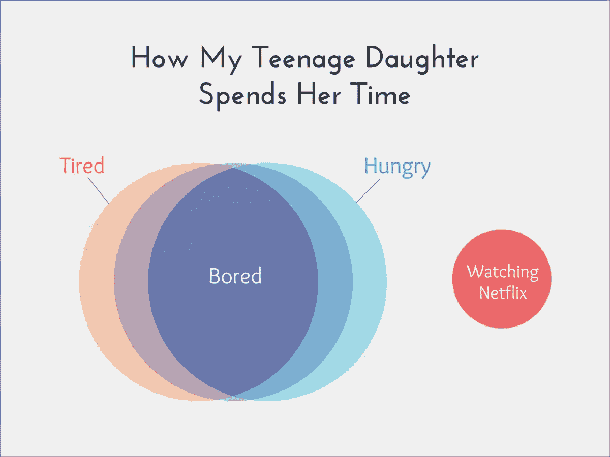

青少年已经把狂看网飞带到了一个完全不同的水平。任何一个成功存活到两位数的孩子的父母都会立即理解维恩图所传达的信息。如果你剥夺了他们的机会，他们会立刻变得无聊、疲倦和/或饥饿。

# 3.自由职业者的理想日程与现实

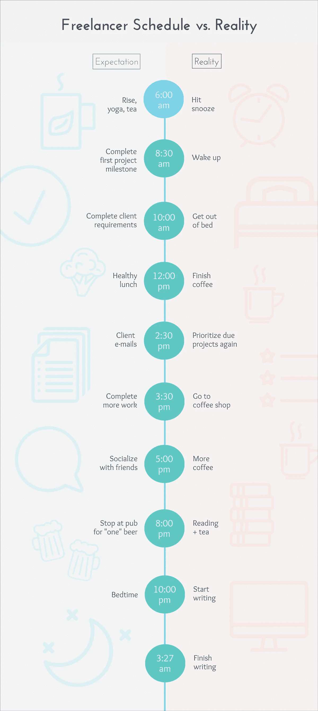

Create infographics like this for free with [Visme](http://www.visme.co/make-infographics?vc=Graphic-CTA).

通往地狱的道路是由良好的意愿铺成的，尤其是对我们这些在家工作的自由职业者来说。完全控制你的时间表既美好又危险。尽管制定了最好的计划，每个人都有过 100%没有收获的一天。明天再试！

# 4.我应该喝咖啡吗？

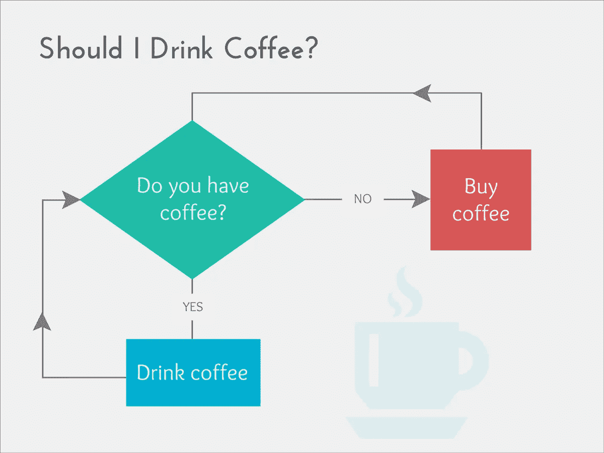

“咖啡，是为冠军梦想加油的命脉！”如果迈克·迪特卡说这是真的，我们有什么理由不同意呢？有更复杂的流程图来解决这个问题，但在我们看来，这是一个简单的问题和简单的答案，总是导致喝更多的咖啡！

# 5.电视消费效率

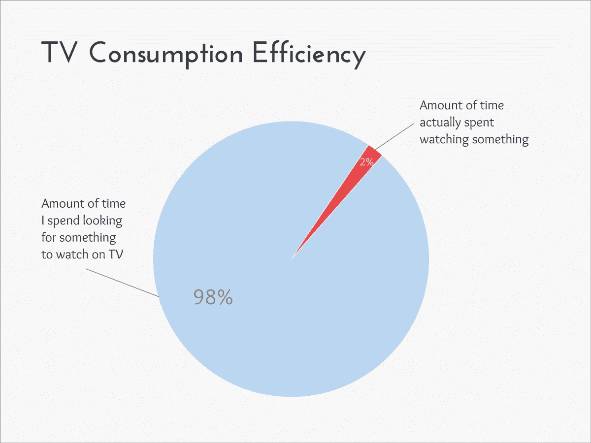

有人会认为，在我们高度互联的数字世界里，打开电视，迅速找到值得观看的东西会容易得多。即使有线电视、卫星电视、网飞、Hulu 和许多其他流媒体服务上有数百个频道，在你试图找到一些东西观看的时候，它似乎仍然是一个电影荒原。

# 6.图形故障

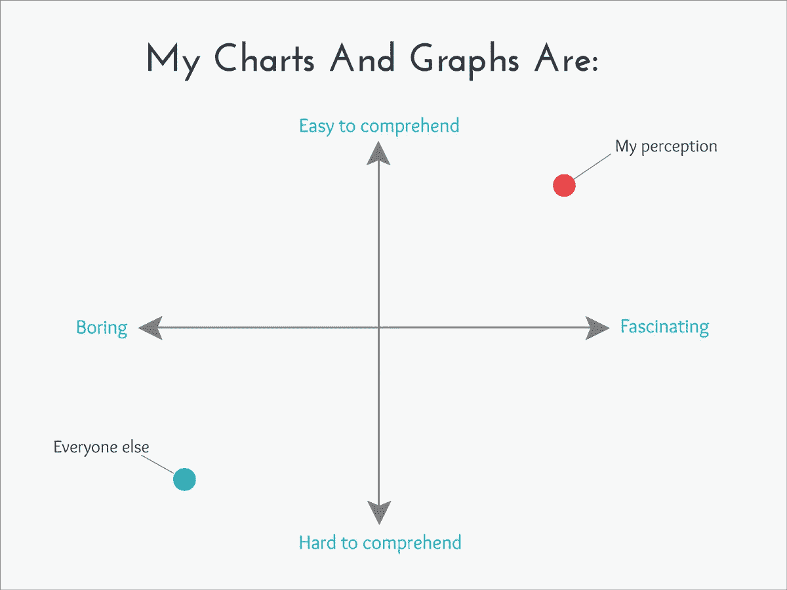

有效的图表通常容易理解，并向受众传达感兴趣的信息。如果你试图创建有趣的图表更像是没有人理解的内部笑话，那么这个图表会引起你的共鸣。

# 7.iPhone 相对焦虑图

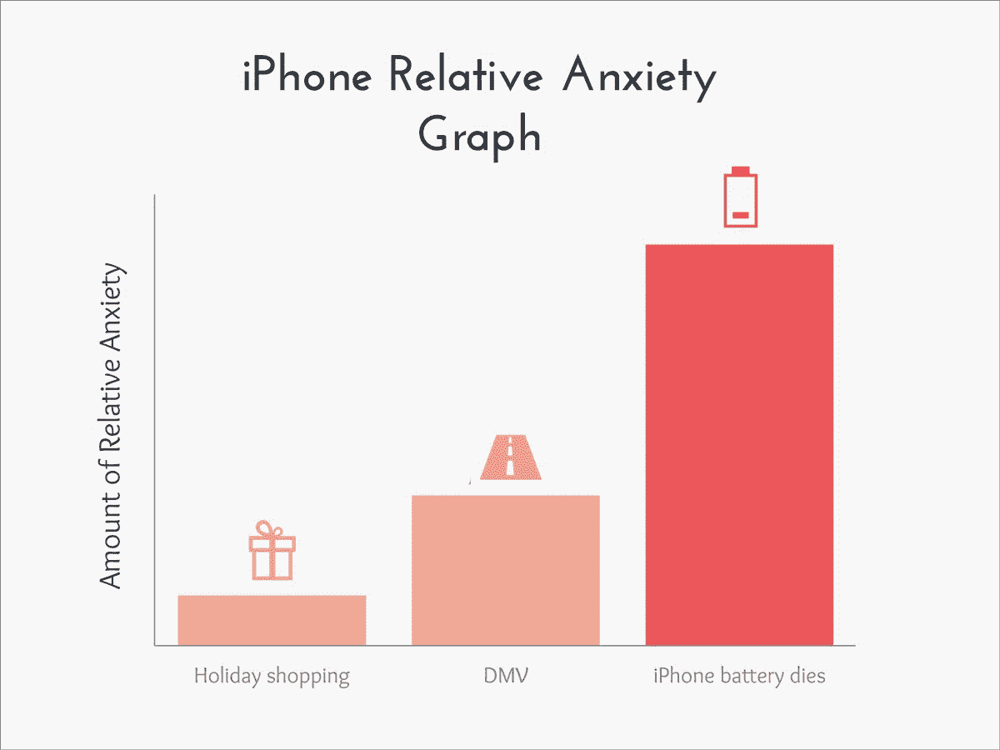

在这个世界上，每个人都认为有些活动和任务会产生焦虑和恐惧的时刻。12 月份逛商场或进入当地的车管所绝对是最重要的事情。

但是，没有充电器，看着你的 iPhone 电池寿命像沙漏中的沙子一样溜走，这就相当于在撒哈拉沙漠中耗尽了水。

# 8.你想去哪里吃饭？

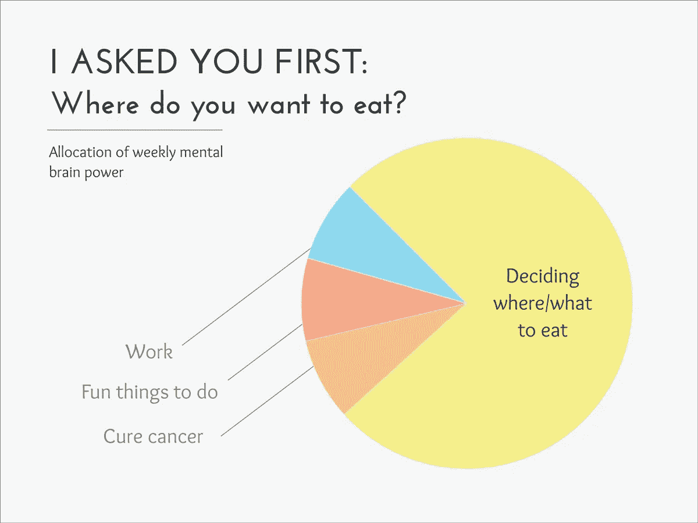

这个话题在人们的生活中引起了更多的冲突，并且可能是大多数夫妻之间争吵的根源。做出错误的决定，你会后悔一辈子，或者至少，直到明天你面临同样的困境。

# 9.社交媒体类型的阴暗面

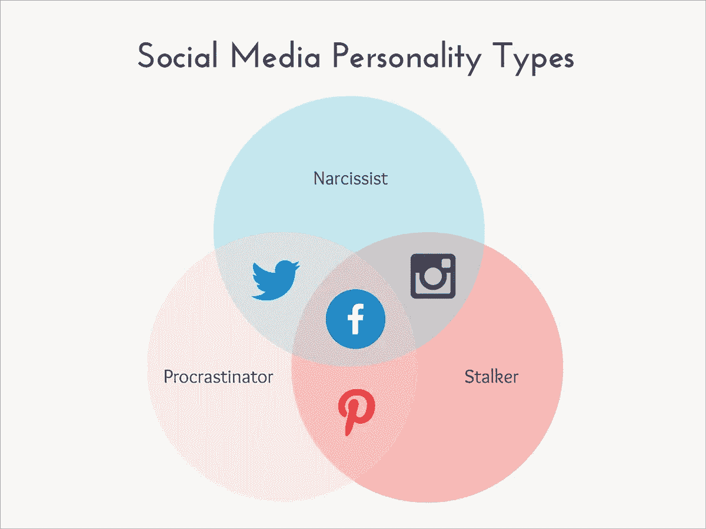

Create graphs like this for free with [Visme](http://www.visme.co/make-infographics?vc=Graphic-CTA).

我们知道社交媒体的一切都不是负面的，但你必须接受好的一面。想想脸书是如何开始的:大学男生在网上看女孩的照片并给她们打分。现在把这个数字乘以 12 亿人，你就会得到这个人格粪坑。

# 10.恶性循环

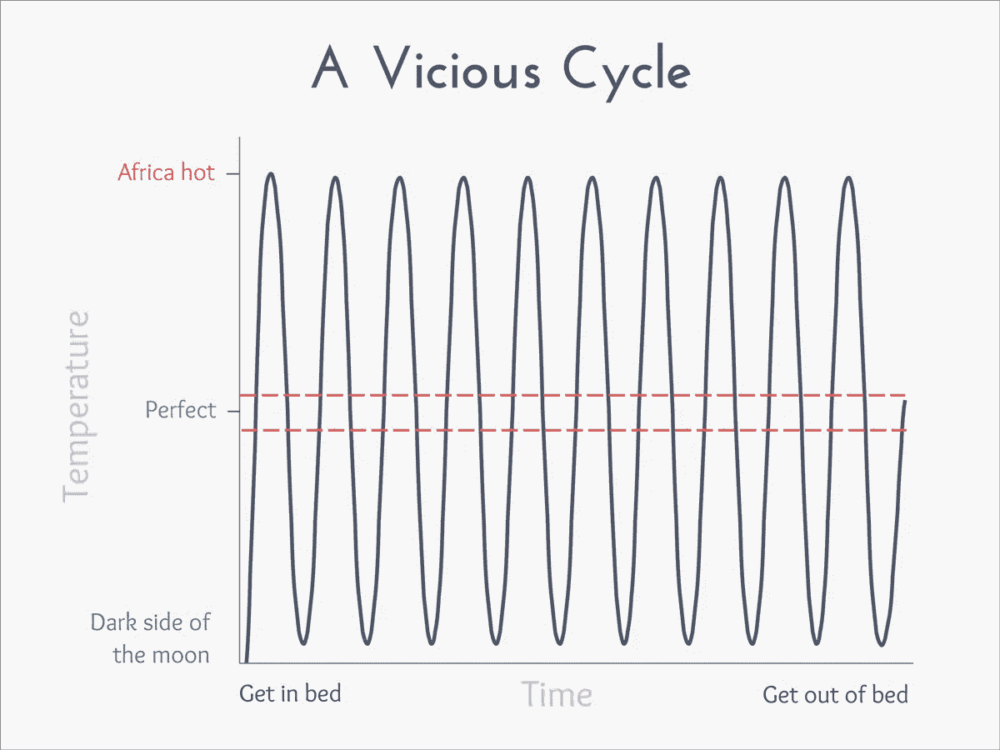

在冬天，在被窝里的头两分钟就像跳进一个冷水淋浴。从那以后，尝试用床单和毯子的正确组合来调节你的体温，以找到完美睡眠温度的难以捉摸的区域，似乎只是一种徒劳的练习。

太热时，把一条腿伸出被窝。把枕头翻过来。扔掉被子。10 分钟后再次冷醒，并重复令人作呕的动作。呃。

# 有什么好主意吗？

现在轮到你了。你对每个人都能理解的巧妙的图表有什么想法吗？在这里创建你自己的[有趣的图表，并分享你的视觉效果，解释那些我们都在试图应对的日常、世俗的灾难。](https://www.visme.co/make-charts-and-reports/)

*本帖* [*原版*](http://blog.visme.co/funny-graphs/) *最早出现在 Visme 的* [*视觉学习中心*](http://blog.visme.co/) *。*