# 10 种随机梯度下降优化算法+备忘单

> 原文：<https://towardsdatascience.com/10-gradient-descent-optimisation-algorithms-86989510b5e9?source=collection_archive---------3----------------------->

Photo by [Julian Zett](https://unsplash.com/photos/y8iR4t4MTF8?utm_source=unsplash&utm_medium=referral&utm_content=creditCopyText) on [Unsplash](https://unsplash.com/search/photos/mountain?utm_source=unsplash&utm_medium=referral&utm_content=creditCopyText)

## 深度学习你应该知道的随机梯度下降优化算法

*(我在我的博客* [*这里*](https://remykarem.github.io/blog/gradient-descent-optimisers.html) *里维护了一张包括 RAdam 在内的这些优化者的小抄。)*

*变更日志:【2022 年 1 月 5 日—2020 年 5 月 4 日
修正附录 2 中那达慕公式的错别字
2020 年 3 月 21 日—分别用* m *和* v *替换* V *和* S *，更新死链接，回顾学习率和梯度组件的概念，更新直觉
2019 年 10 月 6 日—改进*

梯度下降是一种寻找函数最小值的优化方法。它通常用于深度学习模型中，通过反向传播来更新神经网络的权重。

在这篇文章中，我将总结流行的深度学习框架(如 TensorFlow，Keras，PyTorch)中使用的常见梯度下降优化算法。这篇文章的目的是使使用一致的命名法阅读和消化公式变得容易，因为没有很多这样的总结。在这篇文章的末尾有一张小抄供你参考。

本帖假设读者对[梯度下降](https://en.wikipedia.org/wiki/Gradient_descent) / [随机梯度下降](https://en.wikipedia.org/wiki/Stochastic_gradient_descent)有所了解。

(有关使用梯度下降优化器(如 SGD、momentum 和 Adam)的线性回归问题的演示，请单击此处的。)

## 随机梯度下降优化器是做什么的？

回想一下，标准随机梯度下降(SGD)通过用其梯度的因子(即 *α* ，学习率)减去当前权重来更新权重。

Eqn. 1: The terms in stochastic gradient descent

这个方程的变体通常被称为随机梯度下降优化器。它们的区别主要有三个方面:

1.  **调整“梯度分量”(***【∂l/∂w】***)**
    不是像在随机香草梯度下降中那样仅使用一个单一梯度来更新权重，而是采用多个梯度的*集合**。具体来说，这些优化器使用梯度的[指数移动平均值](https://en.wikipedia.org/wiki/Moving_average#Exponential_moving_average)。*
2.  ***调整“学习率分量”(***α***)**，根据梯度的*大小*调整学习率，而不是保持恒定的学习率。*
3.  ***(1)和(2)** 适应梯度分量和学习率分量。*

*正如您将在后面看到的，这些优化器试图改进用于更新权重的信息量，主要是通过使用先前(和未来)的梯度，而不仅仅是当前可用的梯度。*

*下表总结了正在调整的“组件”:*

**

*Fig. 2: Gradient descent optimisers, the year in which the papers were published, and the components they act upon*

*<change log="" sep="" removed="" evolutionary="" map=""></change>*

## *内容*

1.  *随机梯度下降*
2.  *动力*
3.  *阿达格拉德*
4.  *RMSprop*
5.  *阿达德尔塔*
6.  *困扰*
7.  *圣经》和《古兰经》传统中）亚当（人类第一人的名字*
8.  *阿达马克斯*
9.  *那达慕*
10.  *阿姆斯格勒*

*附录 1:备忘单*

*附录 2:直觉*

*附录 3:学习率调度器与随机梯度下降优化器*

## ***符号***

*   **t —* 时间步长*
*   **w —* 我们要更新的权重/参数，其中下标 *t* 索引时间步长 *t* 的权重。*
*   **α —* 学习率*
*   **∂l/∂w—*l*的梯度*，最小化的损失函数，w.r.t .到 *w**
*   *我还标准化了本文中使用的符号和希腊字母(因此可能与论文不同)，以便我们可以在滚动时探索乐观主义者是如何“进化”的。*

## *1.随机梯度下降*

*正如我们前面看到的，标准 SGD 使用当前梯度 *∂L/∂w* 乘以某个称为学习率的因子 *α来更新当前权重。**

*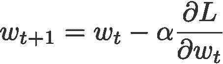*

## *2.动力*

*带动量的梯度下降( [Polyak，1964](https://www.researchgate.net/publication/243648538_Some_methods_of_speeding_up_the_convergence_of_iteration_methods) )不是仅依赖于当前梯度来更新权重，而是用 *m* (“动量”)替换当前梯度，这是梯度的集合。该集合是当前和过去梯度的指数移动平均值(即，直到时间 *t* )。在这篇文章的后面，你会看到这个动量更新成为大多数优化者的渐变组件的标准更新。*

**

*在哪里*

*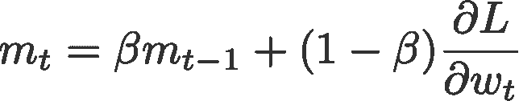*

*并且 *m* 被初始化为 0。*

*通用默认值:*

*   **β =* 0.9*

> ****论动量的起源*** *注意，许多文章引用动量法来发表由* [*、1999 年*](https://www.semanticscholar.org/paper/On-the-momentum-term-in-gradient-descent-learning-Qian/735d4220d5579cc6afe956d9f6ea501a96ae99e2) *。然而，名为* [*Sutskever 等人*](http://proceedings.mlr.press/v28/sutskever13.pdf) *的论文将经典动量归因于 Polyak 在 1964 年发表的更早的出版物，如上所述。(感谢* [*詹姆斯*](https://news.ycombinator.com/item?id=18525494#18528682) *指出这一点。)**

## *3.阿达格拉德*

*自适应梯度或 AdaGrad ( [Duchi 等人，2011](http://jmlr.org/papers/v12/duchi11a.html) )通过将学习率除以 *v* 的平方根来作用于学习率分量，该平方根是当前和过去平方梯度的累积和(即，直到时间 *t* )。请注意，与 SGD 中一样，梯度分量保持不变。*

**

*在哪里*

*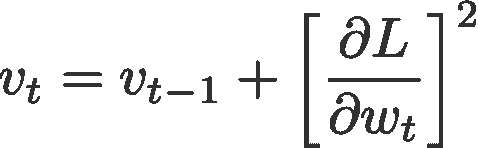*

*并且 *v* 被初始化为 0。*

*注意 *ε* 被加到分母上。Keras 称之为*模糊因子*，一个小的浮点值，以确保我们永远不会遇到被零除的情况。*

*默认值(来自 [Keras](https://keras.io/optimizers/#adagrad) ):*

*   **α* = 0.01*
*   **ε =* 10⁻⁷*

## *4.RMSprop*

*均方根 prop 或 RMSprop ( [Hinton 等人，2012](http://www.cs.toronto.edu/~tijmen/csc321/slides/lecture_slides_lec6.pdf) )是另一种试图提高 AdaGrad 的自适应学习速率。我们不像 AdaGrad 那样采用梯度平方的累积和，而是采用指数移动平均(再次！)的这些梯度。与 momentum 类似，我们将慢慢看到这个更新成为大多数优化器的学习率组件的标准更新。*

*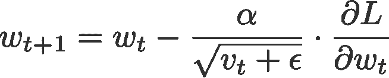*

*在哪里*

*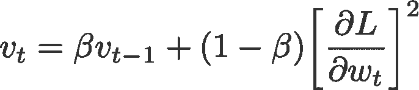*

*并且 *v* 初始化为 0。*

*默认值(来自 [Keras](https://keras.io/optimizers/#rmsprop) ):*

*   **α* = 0.001*
*   **β* = 0.9(论文作者推荐)*
*   **ε =* 10⁻⁶*

## *5.阿达德尔塔*

*像 RMSprop 一样，Adadelta ( [泽勒，2012](https://arxiv.org/abs/1212.5701) )也是 AdaGrad 的另一个改进，专注于学习率部分。Adadelta 可能是“自适应 delta”的简称，这里的 *delta* 指的是当前权重和新更新的权重之间的差值。*

*Adadelta 和 RMSprop 之间的区别在于，Adadelta 通过用 *D、*平方的指数移动平均值 *deltas* 来代替学习率参数，从而完全取消了学习率参数的使用。*

*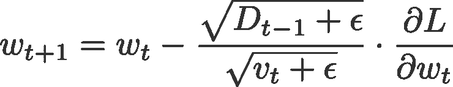*

*在哪里*

*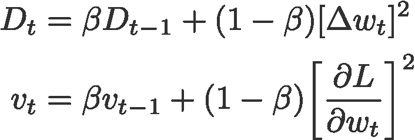*

*将 *D* 和 *v* 初始化为 0，并且*

*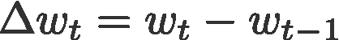*

*默认值(来自 [Keras](https://keras.io/optimizers/#adadelta) ):*

*   **β* = 0.95*
*   **ε =* 10⁻⁶*

## *6.内斯特罗夫加速梯度(NAG)*

*在 Polyak 获得了他的势头(双关语😬)，使用内斯特罗夫加速梯度进行了类似的更新( [Sutskever 等人，2013](http://proceedings.mlr.press/v28/sutskever13.html) )。这次更新利用了 *m* ，我称之为*投影梯度的指数移动平均。**

*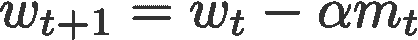*

*在哪里*

*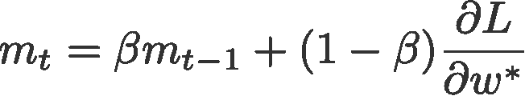*

*并且 *m* 被初始化为 0。*

*第二个等式的最后一项是投影梯度。这个值可以通过使用先前的速度“向前一步”获得(公式。4).这意味着对于这个时间步骤 *t* ，我们必须在最终执行反向传播之前执行另一个正向传播。事情是这样的:*

1.  *使用之前的速度将当前重量 *w* 更新为预计重量 *w** 。*

*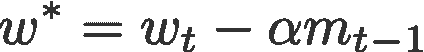*

*Eqn. 4*

*2.执行向前传播，但是使用这个投影权重。*

**3。*获得预计坡度 *∂L/∂w** 。*

*4.相应地计算 *V* 和 *w* 。*

*通用默认值:*

*   **β =* 0.9*

> ****关于 NAG 的起源*** *注意，最初的内斯特罗夫加速梯度论文(* [*内斯特罗夫，1983*](http://www.cis.pku.edu.cn/faculty/vision/zlin/1983-A%20Method%20of%20Solving%20a%20Convex%20Programming%20Problem%20with%20Convergence%20Rate%20O(k%5E(-2))_Nesterov.pdf) *)并不是关于随机梯度下降的，也没有明确使用梯度下降方程。因此，更合适的参考是上面提到的 Sutskever 等人在 2013 年的出版物，该出版物描述了 NAG 在随机梯度下降中的应用。(再次感谢 HackerNews 上詹姆斯的* [*评论*](https://news.ycombinator.com/item?id=18525494#18528682) *指出了这一点。)**

## *7.圣经》和《古兰经》传统中）亚当（人类第一人的名字*

*自适应矩估计，或 Adam ( [Kingma & Ba，2014](https://arxiv.org/abs/1412.6980) )，就是动量和 RMSprop 的简单结合。它作用于*

1.  *使用 *m* 的梯度分量，梯度的指数移动平均(如动量)，以及*
2.  *通过将学习率 *α* 除以 *v* 的平方根得到的学习率分量，即平方梯度的指数移动平均值(类似于 RMSprop 中的)。*

*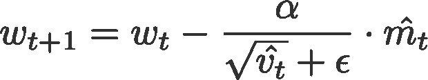*

*在哪里*

**

*是偏差修正，和*

**

*将 *m* 和 *v* 初始化为 0。*

*作者建议的默认值:*

*   **α* = 0.001*
*   **β* ₁ = 0.9*
*   **β* ₂ = 0.999*
*   **ε* = 10⁻⁸*

## *8.阿达马克斯*

*AdaMax ( [Kingma & Ba，2015](https://arxiv.org/abs/1412.6980) )是由相同的作者使用[无穷范数](https://en.wikipedia.org/wiki/Norm_(mathematics)#Maximum_norm_(special_case_of:_infinity_norm,_uniform_norm,_or_supremum_norm))改编的亚当优化器(因此称为“Max”)。 *m* 是梯度的指数移动平均值，而 *v* 是过去 *p* 的指数移动平均值——梯度的范数，近似于最大值函数，如下所示。请参考他们的收敛性证明文件。*

*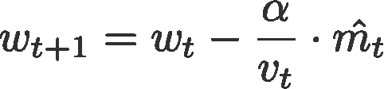*

*在哪里*

*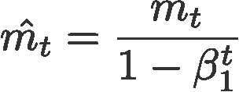*

*是对 *m* 的偏差校正*

*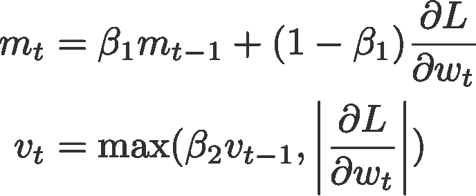*

*将 *m* 和 *v* 初始化为 0。*

*作者建议的默认值:*

*   **α* = 0.002*
*   **β* ₁ = 0.9*
*   **β* ₂ = 0.999*

## *9.那达慕*

*Nadam ( [Dozat，2015](http://cs229.stanford.edu/proj2015/054_report.pdf) )是内斯特罗夫和亚当乐观者的缩写。然而，内斯特罗夫组件是比其原始实现更有效的修改。*

*首先，我想说明亚当乐观主义者也可以写成:*

*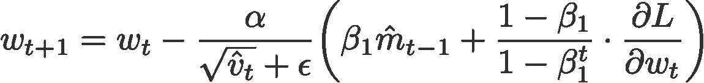*

*Eqn. 5: Weight update for Adam optimiser*

*那达慕使用内斯特罗夫提前一步更新梯度，将上面等式中之前的 *m_hat* 替换为当前的 *m_hat* :*

*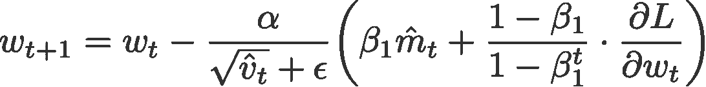*

*在哪里*

*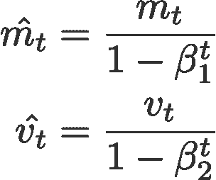*

*和*

**

*将 *m* 和 *v* 初始化为 0。*

*默认值(取自 [Keras](https://keras.io/optimizers/#nadam) ):*

*   **α* = 0.002*
*   **β* ₁ = 0.9*
*   **β* ₂ = 0.999*
*   **ε* = 10⁻⁷*

## *10.阿姆斯格勒*

*亚当的另一个变体是 AMSGrad ( [Reddi 等人，2018](https://openreview.net/pdf?id=ryQu7f-RZ) )。该变体重新访问 Adam 中的自适应学习率组件并对其进行更改，以确保当前的 *v* 始终大于前一时间步*的 *v* 。**

*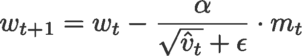*

*在哪里*

*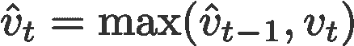*

*和*

*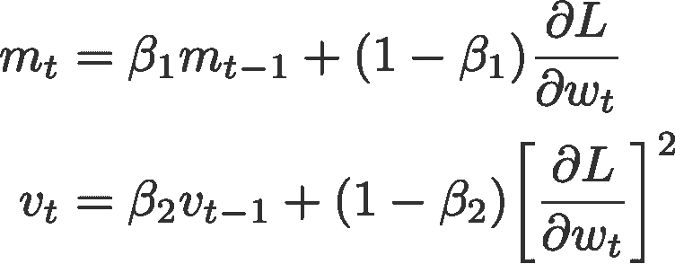*

*将 *m* 和 *v* 初始化为 0。*

*默认值(取自 [Keras](https://keras.io/optimizers/#adam) ):*

*   **α* = 0.001*
*   **β* ₁ = 0.9*
*   **β* ₂ = 0.999*
*   **ε* = 10⁻⁷*

*如果有什么不对的地方，或者这篇文章中有什么可以改进的地方，请联系我！✌🏼*

## *附录 2:直觉*

*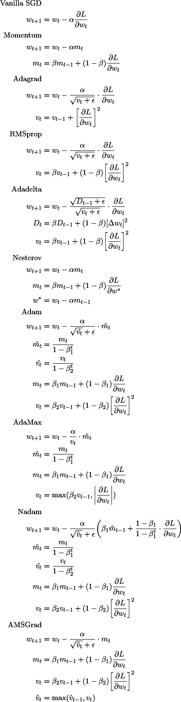**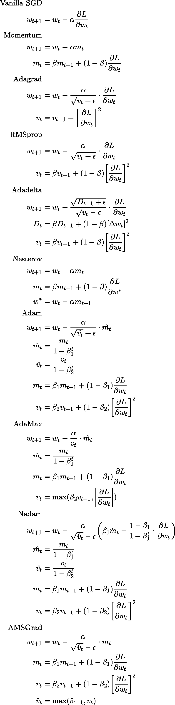*

*以上要点可在[这里](https://gist.github.com/remykarem/d5eff32a67ceeec8e653d1016525a649)找到。用 [QuickLaTeX](https://quicklatex.com/) 生成的图像。(感谢拉维指出那达慕更新中的错别字。)*

## *附录 2:直觉*

*在这里，我想和你分享一些直觉，为什么梯度下降优化器对梯度分量使用指数移动平均，对学习率分量使用均方根。*

***为什么要取梯度的指数移动平均？***

*回想一下，我们需要更新权重，为此我们需要利用*的某个值*。我们拥有的唯一值是当前的梯度，所以我们只使用这个信息来更新权重。*

*但是只取当前的梯度值是不够的。我们希望我们的更新得到“更好的引导”这是通过使用先前关于梯度的信息来实现的。因此，让我们通过*聚合*当前渐变和过去渐变来包含以前的渐变。*

*聚合这些梯度的一种方法是对所有过去和当前梯度进行简单平均。但是等等，这意味着这些梯度的权重是相等的。这公平吗？也许吧。也许不是。*

*我们可以做的是采用指数移动平均，其中过去的梯度值被赋予比当前值更高的权重(重要性)。直观上，不考虑当前梯度的重要性将确保权重更新对当前梯度不敏感。*

***为什么要用平方梯度的指数平均值的根来除学习率？***

*调整学习率的目标是通过将学习率除以多个梯度的均方根来使优化器“更聪明”。所以让我们问自己这些问题:*

1.  *为什么要走多重渐变？*
2.  *为什么要分？*
3.  *为什么要取平方梯度的指数移动平均的根？*

*前一节已经回答了第一个问题——除了当前梯度值，我们还想利用过去梯度的信息。*

*为了回答第二个问题，首先，考虑一个简单的情况，其中过去几次迭代的梯度的平均幅度为 0.01。由于该值接近于 0，这意味着我们一直在一个近似平坦的表面上(想象一段平坦的 3D 损失景观)。我们现在所在的地方，地球很平，所以我们很有信心在这个区域移动。事实上，我们想尽快离开这个区域，寻找一个向下的斜坡，这个斜坡可能会把我们带到一个全球性的最小值。(你可能会发现一些文章提到这有“加速”的效果。)因此，当梯度的幅度较小时，我们想要增加学习速率分量(学习得更快)。为了建立这种反比关系，我们取固定的学习速率 *α* 并除以梯度的平均幅度。这个适应的学习率(现在是一个大值)然后乘以梯度分量，给我们一个大的幅度的权重更新(不管是正的还是负的)。*

*直觉也适用于相反的情况。假设我们的梯度平均值很高，大约是 2.7。这意味着我们一直在陡坡上。我们希望谨慎行事，所以我们采取较小的步骤，这可以通过执行相同的划分来实现。*

*在最后一个问题中，我们采用指数移动平均线的原因在前面已经很明显了。我们取梯度的平方的原因很简单，当处理学习率分量时，我们关心的是它的大小。“抵消”这一点的自然选择是扎根。这背后可能有数学，但现在让我们用这种直觉来说服自己。*

## *附录 3: ***学习率调度器与随机梯度下降优化器****

*有些人可能会问——学习率调度器和随机梯度下降优化器之间有什么区别？这两者之间的主要区别在于，随机梯度下降优化器通过将学习率乘以一个因子来调整学习率分量，该因子是梯度的函数，而学习率调度器将学习率乘以一个因子，该因子是时间步长(或者甚至是常数)的函数。*

## *参考*

*上面提到的每一个乐观主义者的论文*

*[梯度下降优化算法概述](http://ruder.io/optimizing-gradient-descent) (ruder.io)*

*[为什么动量真的有效](https://distill.pub/2017/momentum/)*

## *深度学习相关文章*

*[RNN、LSTM 和 GRU 的动画](/animated-rnn-lstm-and-gru-ef124d06cf45)*

*[逐行 Word2Vec 实现](/an-implementation-guide-to-word2vec-using-numpy-and-google-sheets-13445eebd281)(关于单词嵌入)*

*[关于随机梯度下降线性回归的分步指南](/step-by-step-tutorial-on-linear-regression-with-stochastic-gradient-descent-1d35b088a843)*

*[统计深度学习模型中的参数数量](/counting-no-of-parameters-in-deep-learning-models-by-hand-8f1716241889)*

*[收件人:图文并茂的注意事项](/attn-illustrated-attention-5ec4ad276ee3)*

*[图文并茂:自我关注](/illustrated-self-attention-2d627e33b20a)*

**感谢* [*【任杰】*](https://medium.com/@renjietan)*[*德里克*](https://medium.com/@derekchia) *、威廉 Tjhi、陈凯、澄净、* [*詹姆斯*](https://news.ycombinator.com/item?id=18525494#18528682) *对本文的想法、建议和更正。***

***关注我上* [*推特*](https://www.twitter.com/remykarem) *@remykarem 或者*[*LinkedIn*](http://www.linkedin.com/in/raimibkarim)*。你也可以通过 raimi.bkarim@gmail.com 联系我。欢迎访问我的网站*[*remykarem . github . io*](https://remykarem.github.io/)*。***