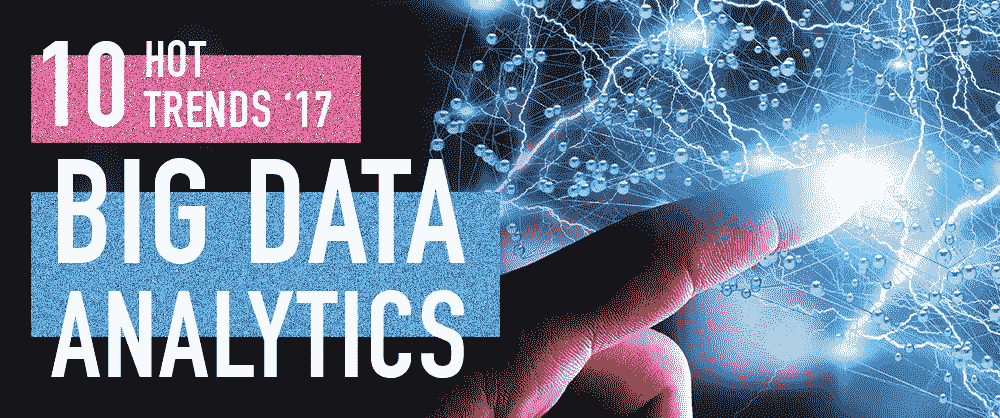
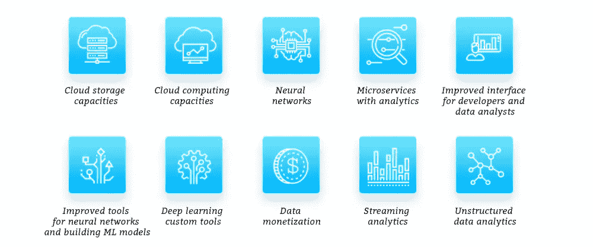

# 2017 年大数据分析的 10 大热门趋势

> 原文：<https://towardsdatascience.com/10-hot-trends-of-big-data-analytics-for-2017-857679364890?source=collection_archive---------4----------------------->

当我们谈到大数据分析的时候，首先要明白这个数据为什么这么大，分析它的实际需求是什么。

数据科学(DS)和大数据的主要目标通常是在非结构化数据流中找到模式和模板，以便简化数据，建立工作模板以供进一步分析或发现异常(如[检测欺诈](https://itsvit.com/blog/data-mining-machine-learning-used-fraud-detection/))。

据 Gartner 称，当数据流有三个大 V 时，它才被认为是真正的大数据:

*   容量—特定时间内流向系统的数据量
*   多样性—传入的数据类型的数量
*   速度—系统处理这些数据的速度

全球产生的**数据量**呈指数级增长，这导致了所谓的[信息爆炸](https://en.wikipedia.org/wiki/Information_explosion)。随着数十种新疾病、智能手机类型、服装和汽车模型、家居用品等的出现，数据的种类也与日俱增。不断出现，不断寻找新的推广手段和营销渠道。不要忘记每天都有成百上千的模因和俚语出现。数据**速度**是要记住的第三件事。任何一天都会产生数 Pb 的数据，其中近 90%的数据永远不会被读取，更不用说加以利用了。

因此，如果企业希望利用其大数据存储来发掘和利用知识的金矿，分析是必不可少的。很长一段时间以来，人们试图分析这种数据流，但随着时间的推移，一些做法变得过时，而一些趋势变得热门。
以下是 2017 年最热门的 10 大数据分析趋势:

*   云存储容量
*   云计算能力
*   神经网络
*   具有分析功能的微服务
*   面向开发人员和数据分析师的改进界面(R 语言和 Jupyter 笔记本)
*   用于神经网络和构建 ML 模型的改进工具，以及它们的进一步培训(TensorFlow、MXNet、微软认知工具包 2.0、Scikit-learn)
*   深度学习定制工具
*   数据货币化
*   流式分析
*   非结构化数据分析

我们将在下面简要描述为什么这些要点都很重要。

# 云存储容量

随着公司运营的数据变得越来越大，存储数据的成本也变得相当高。由于建设和维护数据中心不是一般公司不愿意做的投资，从谷歌、亚马逊或 MS Azure 租赁这些资源是显而易见的解决方案。使用这些服务有助于解决大数据的**量**要求。

# 云计算能力

一旦你有足够的容量来存储数据，你就需要足够的计算能力来处理它，以便提供足够的**速度**来使数据真正有价值。截至目前，亚马逊和谷歌提供了一系列有助于构建高效云计算的服务，任何企业都可以使用它们来处理大数据(谷歌云、谷歌 API 等)。)

# 神经网络

借助深度学习和其他机器学习算法，神经网络可以擅长各种各样的任务，从对罐头厂的原始植被进行分类，到在大型轨道望远镜拍摄的照片上发现新的天体。神经网络可以分析传入的数据流，并根据预先配置的参数突出显示模式或异常。这有助于大大自动化分析，并为在非结构化数据流中找到有价值的信息提供了强大的工具。

# 具有分析功能的微服务

旨在提供精确分析的微服务在规模和功能上都在快速增长。有工具可以测量一切，检查正在进行的支出和可疑支出的警报，处理照片，自动删除背景或突出图片的重要部分等。还有无数其他在线微服务，如著名的谷歌翻译，最近突然停止了胡言乱语，并开始抛出相当精美的文本，因为大量添加了各种机器学习算法。然而，随着行业的成熟，用户希望开发人员将精力转移到更复杂的应用程序上，这些应用程序将使用各种机器学习模型来分析历史数据，并更好地注意到新接收的流数据中的模式。

# 改进的界面

如今，数据分析师或决策者面临的一个问题是缺乏方便的 GUI 来在分析本身之上工作。像 R 语言和 Jupyter Notebook 这样的工具有助于提供数据分析结果的方便表示。与 Excel 电子表格相反，R 语言脚本可以轻松地调整和重新运行，使它们成为通用和可靠的工具。Jupyter 是 Julia、Python 和 R 的首字母缩写，是笔记本内核的第一个目标。这些内核允许创建带有实时代码、数据可视化、等式和解释性文本的文档，从而提供了方便的 ML 开发环境。

# 用于神经网络和构建 ML 模型的改进工具

TensorFlow、MXNet、Microsoft Cognitive Toolkit 2.0 和 Scikit-learn 等工具有助于开发人员和数据分析师摆脱特定于算法的方法，例如:

*   [CNN](https://en.wikipedia.org/wiki/Convolutional_neural_network%20target=) ，
*   [LSTM](https://en.wikipedia.org/wiki/Long_short-term_memory) ，
*   [DNN](https://en.wikipedia.org/wiki/Deep_learning) ，
*   [FNN](https://en.wikipedia.org/wiki/Feedforward_neural_network) ，
*   [装袋方式](https://en.wikipedia.org/wiki/Bootstrap_aggregating)，
*   [决策树方法](https://en.wikipedia.org/wiki/Decision_tree_learning)，
*   [随机森林法](https://en.wikipedia.org/wiki/Random_forest)。

相反，这些平台允许使用特定的方法解决特定的任务，例如:

*   使用 CNN 识别图片上的图像，
*   使用决策树评估金融机构客户的可信度和可靠性，
*   使用 LSTM 网络纠正文本中的文体和语法等。

总而言之，现在你不需要成为一名博士来获得神经网络，因为有大量有用的工具来构建专门的数据科学系统。例如，Tensorflow 是谷歌最近在翻译效率方面所有改进的背后支持者，并支撑着许多谷歌服务，有效地增加了它们的价值和业务影响。

# 深度学习定制工具

正如我们在最近关于深度学习的[文章](https://itsvit.com/blog/future-ai-deep-learning-much/)中解释的那样，虽然 AI 是机器学习、神经网络、机器智能和认知计算的总括术语，但它并不像我们预期的那样精确。截至目前，它仍然无法解释其行为的原因，做出道德选择或区分好与坏的行为。然而，在 2017 年，最大的价值将由定制的深度学习工具显示出来，这些工具基于对大型数据集重复应用的简单算法。是的，这些算法不会是万能的，但它们会在特定的任务中表现出色，在这些任务中，结果的一致性比潜在的洞察力重要得多。

# 数据货币化

预测性和规范性分析是帮助组织使用大数据工具最大限度地减少支出和盈利的方法。将分析结果作为服务出售，为客户传播和构建数据也可以成为一个有利可图的市场。

# 流式分析

实时流数据分析对于做出影响当前事件的决策至关重要。GPS 定位器使用这种逻辑来指示目的地。一个主要的好处是，来自其他用户的匿名数据流有助于避免路线创建过程中的瓶颈和交通堵塞。2017 年肯定会推出更多的流数据分析服务，因为它们的需求很高。

# 非结构化数据分析

数据可视化和机器学习算法的不断发展有助于不断提供新的和新类型的数据用于分析。对视频观看统计数据和社交媒体互动的分析是一座知识金矿，可以更好地个性化报价，并在更合适的时间显示更相关的广告，从而实现更好的转化。2017 年，此类服务将进一步发展壮大。

# 结论

总而言之，大数据分析如今正在蓬勃发展，并且没有放缓的迹象。而一些趋势，如每月商业智能报告、隔夜批量分析、以模型为中心的应用等。失去牵引力，新的热点趋势出现并获得流行。你对此有什么想法？我们是否错过了一些重要的东西或者包含了一些不太重要的东西？如果这篇文章有趣，请让我们知道并分享这个词！

最初发表于[https://itsvit.com/blog/](https://itsvit.com/blog/)