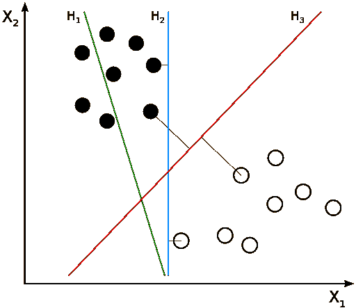
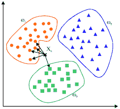
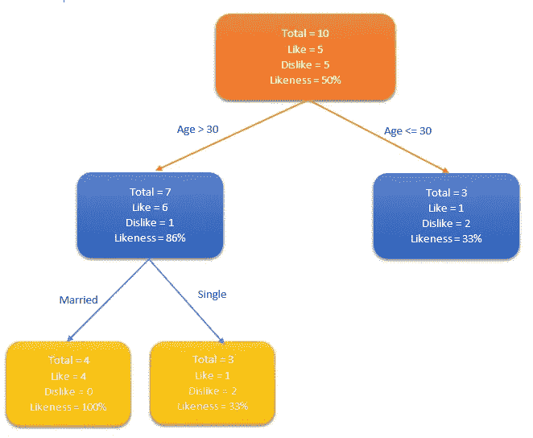
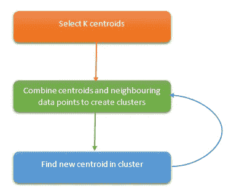
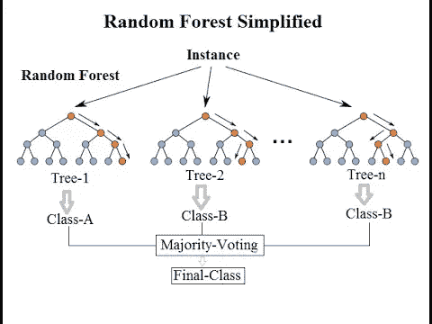
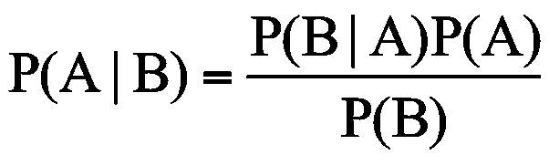

# 你需要知道的 10 个机器学习算法

> 原文：<https://towardsdatascience.com/10-machine-learning-algorithms-you-need-to-know-77fb0055fe0?source=collection_archive---------0----------------------->

Photo: [http://hpc-asia.com/wp-content/uploads/2016/02/equations.jpg](http://hpc-asia.com/wp-content/uploads/2016/02/equations.jpg)

由于数据分析、大计算能力和云计算的发展，我们生活在一个革命性时代的开端。机器学习肯定会在那里发挥巨大作用，机器学习背后的大脑是基于算法的。本文涵盖了目前使用的 10 种最流行的机器学习算法。

这些算法可以分为三大类。

1.  **监督算法:**训练数据集有输入，也有期望输出。在训练期间，模型将调整其变量，以将输入映射到相应的输出。
2.  **无监督算法:**在这个类别中，没有目标结果。这些算法将对不同组的数据集进行聚类。
3.  **强化算法:**这些算法是在做决策时训练出来的。因此，基于这些决定，算法将基于输出的成功/错误来训练自己。最终凭经验算法将能够给出好的预测。

下面的算法将在这篇文章中讨论。

*   线性回归
*   SVM(支持向量机)
*   KNN(K-最近邻)
*   逻辑回归
*   决策图表
*   k 均值
*   随机森林
*   朴素贝叶斯
*   降维算法
*   梯度推进算法

## 1.线性回归

线性回归算法将使用数据点找到最佳拟合线来模拟数据。一条线可以用方程来表示， **y = m*x + c** 其中 **y** 为因变量， **x** 为自变量。应用基本的微积分理论，使用给定的数据集找到 m**和 c**的值。

线性回归有两种类型:仅使用一个自变量的简单线性回归和定义多个自变量的多元线性回归。

[https://upload.wikimedia.org/wikipedia/commons/thumb/3/3a/Linear_regression.svg/400px-Linear_regression.svg.png](https://upload.wikimedia.org/wikipedia/commons/thumb/3/3a/Linear_regression.svg/400px-Linear_regression.svg.png)

“ [scikit-learn](http://scikit-learn.org/) ”是一个简单高效的工具，用于 python 中的机器学习。下面是使用 scikit-learn 实现线性回归。

## 2.SVM(支持向量机)

这属于分类型算法。该算法将使用直线来分隔数据点。选择这条线，使其距离两个类别中最近的数据点最远。

[https://upload.wikimedia.org/wikipedia/commons/thumb/b/b5/Svm_separating_hyperplanes_%28SVG%29.svg/512px-Svm_separating_hyperplanes_%28SVG%29.svg.png](https://upload.wikimedia.org/wikipedia/commons/thumb/b/b5/Svm_separating_hyperplanes_%28SVG%29.svg/512px-Svm_separating_hyperplanes_%28SVG%29.svg.png)

在上图中，红线是最好的线，因为它距离最近的点最远。基于这条线，数据点被分为 2 组。

## 3.KNN(K-最近邻)

这是一个简单的算法，用 k 个最近邻预测未知数据点。k 的值在这里是关于预测准确性的一个关键因素。它通过使用基本的距离函数(如欧几里德距离函数)计算距离来确定最近的距离。

[https://au.mathworks.com/matlabcentral/mlc-downloads/downloads/submissions/63621/versions/1/screenshot.gif](https://au.mathworks.com/matlabcentral/mlc-downloads/downloads/submissions/63621/versions/1/screenshot.gif)

然而，这种算法需要很高的计算能力，并且我们需要首先归一化数据，以使每个数据点都在相同的范围内

## 4.逻辑回归

逻辑回归用于预期有离散输出的情况，如某些事件的发生(例如预测是否会下雨)。通常，逻辑回归使用一些函数将值压缩到特定的范围。

Logistic function ([https://qph.ec.quoracdn.net/main-qimg-05edc1873d0103e36064862a45566dba](https://qph.ec.quoracdn.net/main-qimg-05edc1873d0103e36064862a45566dba))

“Sigmoid”(逻辑函数)就是这样一种函数，它具有用于二元分类的“S”形曲线。它将值转换到 0，1 的范围内，这解释为发生某个事件的概率。

**y = e^(b0+B1 * x)/(1+e^(b0+B1 * x))**

上面是一个简单的逻辑回归方程，其中 b0，b1 是常数。同时将计算这些的训练值，使得预测值和实际值之间的误差变得最小。

## 5.决策图表

该算法基于群体的一些选定属性(独立变量)将群体分类为几个集合。通常，该算法用于解决分类问题。分类是通过使用一些技术来完成的，如基尼系数、卡方、熵等。

让我们考虑一群人，并使用决策树算法来识别谁喜欢拥有信用卡。例如，考虑人口的年龄和婚姻状况。如果年龄超过 30 岁或已婚，人们倾向于更多或更少地使用信用卡。

Simple Decision Tree

该决策树可以通过识别合适的属性来进一步扩展，以定义更多的类别。在这个例子中，如果一个人已婚并且超过 30 岁，他们更有可能拥有信用卡(100%偏好)。测试数据用于生成该决策树。

## 6.k 均值

这是一个无监督的算法，为聚类问题提供了一个解决方案。该算法遵循一个程序来形成包含同类数据点的聚类。

k 的值是算法的输入。在此基础上，算法选择 k 个质心。然后，指向一个质心的相邻数据点与其质心相结合，并创建一个聚类。稍后，在每个聚类内创建一个新的质心。然后，靠近新质心的数据点将再次组合以扩展聚类。这个过程一直持续到质心不变。

Cluster forming process

## 7.随机森林

如其名，Random forest 可以被识别为决策树的集合。每棵树试图估计一个分类，这被称为“投票”。理想情况下，我们考虑每棵树的每一张选票，并选择投票最多的分类。

[https://www.kdnuggets.com/wp-content/uploads/rand-forest-1.jpg](https://www.kdnuggets.com/wp-content/uploads/rand-forest-1.jpg)

## 8.朴素贝叶斯

该算法基于概率论中的“贝叶斯定理”。由于朴素贝叶斯只有在特征彼此独立的情况下才能应用，因为这是贝叶斯定理的要求。如果我们试图通过花瓣的长度和宽度来预测一种花的类型，我们可以使用朴素贝叶斯方法，因为这两个特征是独立的。

Bayes Equation

朴素贝叶斯算法也属于分类类型。当问题中存在多个类别时，通常使用这种算法。

## 9.降维算法

一些数据集可能包含许多变量，这可能导致非常难以处理。尤其是现在，由于存在足够多的资源，系统中的数据收集发生在非常详细的级别。在这种情况下，数据集可能包含成千上万的变量，其中大多数也可能是不必要的。

在这种情况下，几乎不可能找出对我们的预测影响最大的变量。在这种情况下使用降维算法。它利用随机森林、决策树等其他算法来识别最重要的变量。

## 10.梯度推进算法

梯度提升算法使用多个弱算法来创建更强大的精确算法。与使用单个估计器相比，使用多个估计器将创建一个更稳定和更健壮的算法。

有几种梯度增强算法。

*   XGBoost —使用线性和树算法
*   LightGBM —仅使用基于树的算法

梯度推进算法的特点是精度更高。此外，像 LightGBM 这样的算法也具有令人难以置信的高性能。

感谢阅读。

干杯！