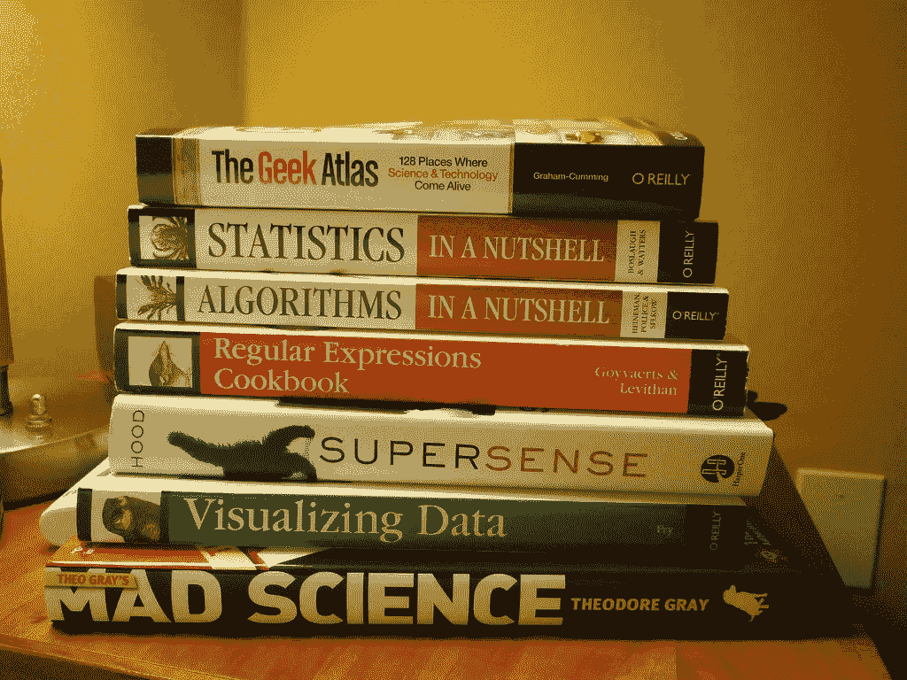

# 关于数据科学、分析和大数据的 10 本必读书籍

> 原文：<https://towardsdatascience.com/10-must-read-books-on-data-science-analytics-and-big-data-c2a30d6ba08a?source=collection_archive---------3----------------------->

Source: Flickr

作为分析专家，这是一个我们经常从高管层专家和分析新手那里听到的问题。

**“分析领域的必读书目是什么？'**

最好的分析类书籍不只是告诉你这个行业如何运作，而是帮助你有效地履行你的[日常职责](https://datafloq.com/read/the-8-actors-a-data-scientist-must-meet/2701)。他们不仅解释数据科学的细微差别或如何进行分析，还教你讲故事的艺术。

如果你想将自己定位为数字化转型的倡导者，这些书将向你展示如何解码数字化转型的艺术。它们还会让你成为一名更好的分析专家，不管你是新手还是已经在这个行业待了几十年。

以下是 [BRIDGEi2i](http://www.bridgei2i.com/) 根据亚马逊和 Goodreads 社区的读者评论和投票选出的十本最畅销的数据科学必读书籍。

**阅读更多:** [**12 张令人捧腹的 gif 图一个数据科学家会完全认同**](http://bridgei2i.com/blog/12-situations-data-scientists-will-totally-relate-to/)

# 数据分析由 Anil Maheshwari 提供

**谁应该读？**

对数据科学知之甚少或一无所知的新手或实习生。

**关于作者**:作者 Anil Maheshwari 在管理实践的各个领域拥有超过 20 年的经验，包括业务开发、市场营销、全球品牌、社交媒体、项目管理、IT 咨询和培训。

作者 Anil Maheshwari 在管理实践的各个领域拥有超过 20 年的经验，包括业务开发、市场营销、全球品牌、社交媒体、项目管理、IT 咨询和培训。

**为什么要读？**

这本书提供了一个广泛和快速的旅游，所有的主要议题和考虑因素，人们可能会期望当谈到数据分析。这些问题、例子和练习有助于你深入理解这个主题。这本书易于理解，内容丰富。它通过具体的例子涵盖了所有重要的内容，并吸引读者加入数据分析领域。

读者在说什么？

一位读者在 Goodreads 上说

> 这是你想知道的关于商业智能和数据挖掘的一切。大量的项目符号表和你需要记住的知识清单。

# 用数据讲故事:商务人士数据可视化指南

谁应该阅读它？

希望像设计师一样思考并在数据可视化中利用设计概念的数据可视化专家。

**关于作者:**

Cole Nussbaumer Knaflic 用数据创作故事。她在 www.storytellingwithdata.com 的热门博客[上写道。](http://www.storytellingwithdata.com.)她的研讨会和演讲深受全球关注数据的个人、公司和慈善组织的追捧。

**为什么要读？**

如果你对创建或设计仪表板感兴趣，你应该认真阅读这本书。这本书告诉你如何讲述数据背后的故事。通过这本书，你会发现讲故事的力量，以及如何将数据作为仪表板设计中的关键元素。

在每一章中，作者简要地讨论了业务场景，然后将仪表板分成几个组成部分，分析哪些部分工作良好，哪些部分可以做得不同。这本书展示了如何超越传统的工具，并使用您的数据来创建一个引人入胜，信息丰富，引人注目的设计故事。

**读者在说什么？**

> 与自己的教导保持一致是一件可爱的事情。Cole Nussbaumer Knaflic 通过她的第一本书实现了这一点。她提倡可视化的清晰和简洁，她的书清晰、简洁、实用。如果您是可视化的初学者，或者如果您在日常工作中难以使用 Excel、Tableau、Qlik 等工具制作出好的图表，这是开始学习核心原则的好地方。
> 
> *–Alberto Cairo，视觉新闻学骑士讲座教授，迈阿密大学可视化教授，功能艺术的作者*

**阅读更多:** [**用 R 编程可视化巴西旅游趋势**](http://bridgei2i.com/blog/visualizing-tourism-trends-in-brazil-with-r-programming-bridgei2i-vizards/)

# 大到不容忽视:获奖作家 P. Simon 的大数据商业案例

谁应该读它？

希望了解大数据能为他们和他们的业务带来什么的高管。

**关于作者**:

菲尔·西蒙擅长翻译没有术语的技术信息。他曾在 EA、思科、捷步达康和网飞等公司做过主题演讲。

**为什么要读？**

这本书告诉你为什么大数据是企业的灵丹妙药。作者为希望利用和理解大数据技术优势的管理团队和组织阐明了没有术语的建议。这本书有大量的例子、案例研究和来自世界各地的大数据专家的引用，是首席执行官、企业主和行业领导者的必读之作。这本书可以给你的组织所需的动力，将数据转化为情报，将情报转化为行动计划。

读者在说什么？

> *随着越来越多的企业家、投资者和客户谈论大数据，越来越难理解这个短语的含义。Phil Simon 在定义大数据方面做得很好，并为大数据一词中通常包含的概念提供了清晰的商业案例。忽视这本书，后果自负。*
> 
> *–Brad Feld，铸造集团董事总经理兼作者，创业社区*

# Sebastian Tonkin，Caleb Whitmore & Justin Cutroni 利用谷歌分析进行绩效营销

谁应该阅读它？

希望通过分析提升营销绩效和品牌健康的 CMO。

**关于作者**:

Sebastian Tonkin 是一名企业家，曾是谷歌分析营销团队的成员。Caleb Whitmore 是一名资深的谷歌分析顾问，也是 Analytics Pros 的创始人，该公司致力于为谷歌分析用户提供支持。Justin Cutroni 是广受欢迎的博客 Analytics Talk 的作者，Google Analytics 研讨会的领导者，以及帮助公司了解如何从 Google Analytics 获得最大价值的顾问。

**为什么要读？**

作者解释了用谷歌分析实现数字营销目标的综合方法。他们从对绩效营销策略的广泛解释开始，逐渐变得准确，通过逐步分析、示例和应用进行总结。

这些章节包含了关于增加搜索广告收入、优化现有网站、改善渠道和活动、加强品牌健康等方面的深入示例和案例研究。这本书还强调了谷歌的面向转换的工具的关键主题，包括 AdWords，AdSense，谷歌趋势，网站管理员工具，和基于搜索的关键字工具。

**读者在说什么？**

> *它让我看到并最大限度地利用基于谷歌分析的整体营销。这不仅仅是为了如何使用谷歌分析，而是为了如何在谷歌分析时代建立在线营销策略。它有许多实用的建议和例子。*
> 
> *–Goodreads 上的方敏雅*

# 你应该试试克里斯·高沃德的作品

谁应该阅读它？

寻求销售线索、转化优化和收入的战略家和变革推动者。

**关于作者**:

克里斯·高沃德是转换优化机构 WiderFunnel 的创始人兼首席执行官。他是公认的转化优化思想领袖，有一个很有影响力的博客(WiderFunnel.com/blog)。

**你为什么要读它？**

Chris Goward 解释了转换策略的“为什么”和“如何”。这本书带你创建一个销售或营销的优化策略，它可以用适当的分析工具支持你的业务目标，并产生质量测试的想法。它的特点是动手练习，案例研究，和一个全彩色插入加强关键战术。

**读者在说什么？**

> 你应该测试一下！*提供了一个易于理解的测试框架，以及许多关于如何向特定目标优化的优秀想法。这是一个非常需要的、全面的测试方法。*
> 
> *–杰西·尼科尔斯，机构合作伙伴，谷歌分析*

**阅读更多:** [**某财富 50 强 IT 公司如何优化数字营销支出**](http://bridgei2i.viewpage.co/Retail-customer-analytics-tech-case-study?_ga=2.12532852.1936176628.1505992887-661577293.1468908986)

# Peter Guerra 和 Kirk Borne 的《数据科学成熟的十个标志》

**谁应该读？**

希望培养数据科学和大数据分析能力的数据科学和分析领导者。

**关于作者**:

Booz Allen Hamilton 首席数据科学家 Kirk Borne 博士在下一代分析和数据科学领域支持战略创新团队。他是乔治·梅森大学研究生(博士)计算科学和信息学项目的教授，并在 NASA 的合同中工作了 18 年，包括担任哈勃望远镜数据档案项目科学家。

Peter Guerra 是 Booz Allen Hamilton 战略创新小组的副总裁，共同领导数据科学团队。他的专长是高可用性、大规模分布式系统和高级分析，并负责领导多个高级分析和大数据计算项目。

**为什么要读？**

在拥抱数据科学的同时，您的组织为崛起做了多少准备？你如何识别你的组织是否有成熟的数据能力？你如何帮助你的分析团队磨练技能？

如果你是一个正在寻找这些问题的答案的数据科学领导者，你应该今天就抓住这本书。这本书有一个详细的报告，对数据科学成熟的十个标志进行了简要的讨论。它鼓励分析专业人员为组织成员提供对所有可用数据的访问权限，使用敏捷，并利用“数据操作”(用于数据产品开发的开发操作)，通过公开或内部竞争帮助您的数据科学团队提高技能，并将数据科学人格化为一种做事方式，而不是一件要做的事情。

读者在说什么？

> *任何想要培养数据科学能力的数据科学领导者都应该阅读这本书，并在组织内发展成熟的分析文化和实践。*
> 
> *——美莎上 Goodreads*

# 丹尼尔·卡内曼的《思考的快与慢》

谁应该阅读它？

希望学习人们如何做决策的概念的商业领袖和高级管理人员。

**关于作者:**

丹尼尔·卡内曼是普林斯顿大学心理学荣誉退休教授，普林斯顿大学伍德罗·威尔逊公共和国际事务学院心理学和公共事务荣誉退休教授。他因与阿莫斯·特沃斯基在决策方面的开创性工作而获得了 2002 年诺贝尔经济学奖。

**为什么要读？**

卡尼曼解释了大脑中的两个“系统”是如何做出决策的。“系统 1”是大脑快速、直观的一面。“系统 2”是大脑中较慢的、逻辑的和推理的部分。他用有趣的例子探索了我们如何以及为什么经常做出非理性决定的一般主题。他提供了实用而有启发性的见解，让我们了解如何在我们的商业和个人生活中做出选择，以及我们如何使用不同的技术来克服经常让我们陷入困境的理性故障。

**读者在说什么？**

> *绝技。。。卡尼曼的书是任何对人类行为或投资感兴趣的人的必读之作。他清楚地表明，虽然我们喜欢认为自己在决策中是理性的，但事实是我们受到许多偏见的影响。至少意识到它们会让你有更好的机会避免它们，或者至少减少它们。*
> 
> *–拉里·斯威德罗，哥伦比亚广播公司新闻*

# 凯茜·奥尼尔的《摧毁数学的武器》

谁应该阅读它？

希望了解大数据驱动的数学模型的阴险一面的数据科学家和组织决策者。

**关于作者:**

Catherine Helen O'Neil 是美国数学家，是博客 mathbabe.org 和几本数据科学书籍的作者。她是哥伦比亚大学新闻研究生院 Tow 中心数据实践 Lede 项目的前主任，并被聘为约翰逊研究实验室的数据科学顾问。

**为什么要读？**

通过真实世界的例子和生动的故事，作者展示了大数据算法和数学模型如何越来越多地规范人们。所用的案例研究引人入胜、简洁有力。这本书对于想要理解已经获得商业控制权的无形算法的数据创业者来说是一张方便的地图。

对于那些好奇大数据如何帮助他们和他们的企业，或者它如何重塑他们周围的世界的人来说，*数学毁灭武器*是开始的地方。

**读者在说什么？**

> 清晰、惊人、有价值……[奥尼尔]的写作简洁而精确，因为她将自己的观点瞄准了外行观众。对于一本关于算法的书来说，这是一本引人注目的翻页读物。摧毁数学的武器应该是任何生活会受到大数据影响的人的必读书目，也就是说:每个人的必读书目。这是一个警钟——丛林和寂静的春天的新闻继承人。像那些书一样，它应该会改变美国社会的进程。
> 
> *–阿斯彭时报*
> 
> *数学毁灭武器是硅谷支持者不会讲述的大数据故事…(它)简明扼要地揭露了在如何利用信息评估从信誉到警务策略等一切方面的缺陷。对于任何倾向于相信数据不会说谎的人来说，这是一本发人深省的读物。*
> 
> *–路透社*

# 信息经济学:如何将信息货币化、管理和衡量为竞争优势的资产

**谁应该读？**

希望成功实现数据货币化并在数字经济中竞争的 CDO 和商业领袖。

**关于作者:**

道格·兰尼(Doug Laney)是 Gartner 首席数据官(CDO)研究和咨询业务副总裁兼杰出分析师。他是一位卓有成就的从业者，也是信息和分析策略领域公认的权威，并且两次获得 Gartner 年度思想领袖奖。Doug 专门研究数据货币化和估值、开放和联合数据、数据治理以及基于大数据的创新。

**为什么要读？**

《信息经济学》讲述了量化信息资产价值的方法和策略，以及将信息作为竞争优势来推动增长的策略。这本书为评估信息价值提供了有用的框架，并确定了试图最大化信息价值的公司所面临的众多挑战。Doug 提供了有趣而丰富的例子和详细的基础，CDO 可以在制定数据策略时加以考虑。

读者在说什么？

> *信息经济学是一项重要的工作，为一个新兴的研究领域和活动奠定了基础。大多数企业领导人似乎忘记了信息近乎无限的可复制性和可重用性，以及它的低存储和传输成本，加上高度的软件自动化，如何使它成为一种无与伦比的资源。这本书提供了评估信息价值的有用框架，确定了试图最大化信息价值的公司所面临的众多挑战，并且最有帮助的是，组织必须解决这些挑战以在新经济中蓬勃发展的方法。*
> 
> *–新南威尔士州政府首席数据科学家兼新南威尔士州数据分析中心首席执行官 Ian opper Mann*

**阅读更多:** [**建立一个分析学-第一组织**](http://www.bridgei2i.com/whitepapers/building-analytics-first-organization)

# 闪光男孩:迈克尔·刘易斯的华尔街反抗

**谁应该读？**

打算在显微镜下了解金融危机和高频交易的财务人员或投资者。

**关于作者:**

迈克尔·刘易斯出版了许多《纽约时报》上各种主题的畅销书。他最近的作品是《金钱球》、《大空头》和《回旋镖》,以全球金融危机为背景。他是《彭博观点》的专栏作家，也是《名利场》的特约撰稿人。

**为什么要读？**

*闪电侠*探讨高频交易现象及其复杂的腐败。迈克尔以他的叙述风格，深入解释了股票市场的机制。这本书包含引人入胜的故事和引人注目的人物。尽管这个主题很复杂，但大多数概念都解释得很清楚。这本书还精彩地解释了当前的环境及其对我们市场的潜在危害。

读者在说什么？

> *哇！太棒了。我喜欢它！娱乐性。*
> 
> 它有一个叫布拉德的家伙，他是我的英雄。这读起来像约翰·格里森姆的小说，但这是一个关于证券交易所、高频交易者和暗池的真实故事。作者非常擅长解释复杂的技术主题，并围绕这些主题讲述一个好故事。在书的中间，我对投资者的敲竹杠感到非常愤怒，我正在考虑写信。但是到了书的结尾，我就不必了。一些好事发生了。现在，各种政府机构正在调查书中描述的问题——SEC、FBI、CFTC、FINRA、纽约州总检察长和美国司法部长。
> 
> *–珍·史都华在 Goodreads 上*
> 
> *完全迷人……照亮了通常在暗处做生意的华尔街的一部分。*
> 
> *—《纽约书评》*

*今天就去书店或在线订购书籍，让自己沉浸在数据世界中。但与此同时，如果您想了解分析行业的实际情况，请联系*[*bridge i2i*](http://www.bridgei2i.com/)*了解分析行业的细微差别。*

*原载于 2017 年 9 月 21 日*[*bridgei2i.com*](http://bridgei2i.com/blog/10-must-read-books-data-science-analytics-big-data/)*。*