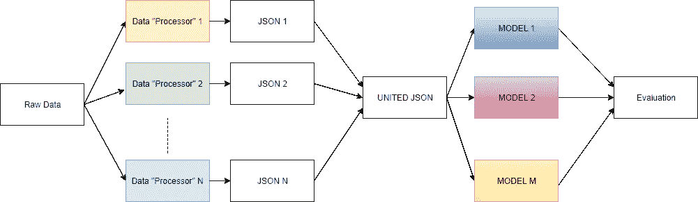
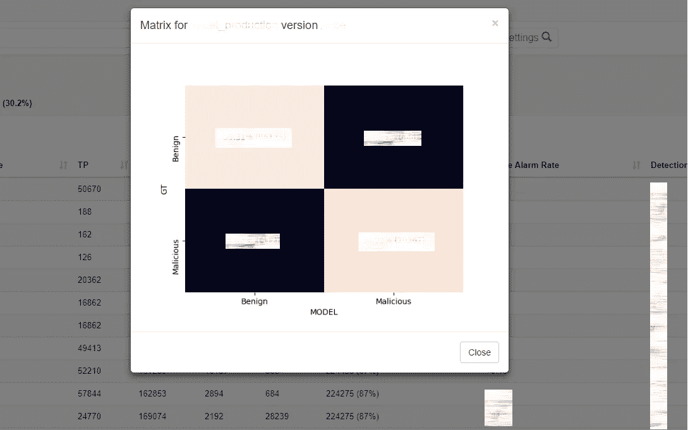
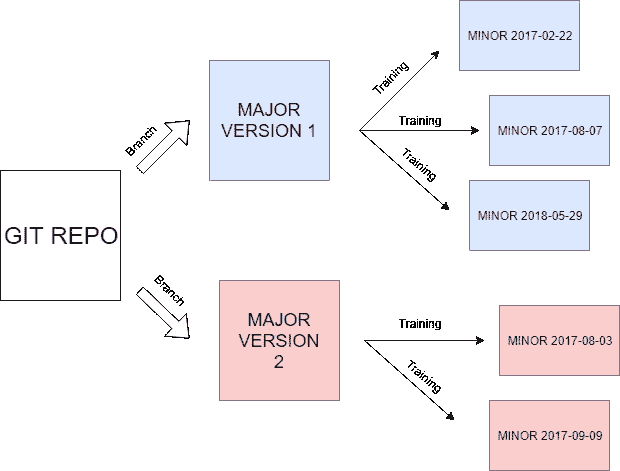

# 推进端到端数据科学项目的 10 种方式

> 原文：<https://towardsdatascience.com/10-ways-to-boost-an-end-to-end-data-science-project-dc5d6e074ecf?source=collection_archive---------5----------------------->

*从研究到生产:如何避免基本陷阱*

*by:* [*尤里【拉波波特】*](https://medium.com/u/7a973054ecda?source=post_page-----dc5d6e074ecf--------------------------------) [*拉斐尔*](https://medium.com/u/475d8117b495?source=post_page-----dc5d6e074ecf--------------------------------)

与常规软件工程项目不同，人工智能/数据驱动的产品对大多数公司来说都是相当新的，从研究到生产的最佳方式仍然不清楚。在接下来的文章中，我们将介绍一些从将机器学习解决方案部署到几个 [Checkpoint](https://www.checkpoint.com) 的主要产品中获得的经验。

# #1 在做任何事情之前，与管理层讨论评估指标

令人惊讶的是，我们通常会等到第一次结果出来后，才决定如何评价自己。在大多数情况下，你的主管或 QA 团队会选择一种完全不同的方式来评判你的工作。*“他们不懂机器学习！”你会说，但是他们了解你的客户，他们是领域专家…*

作为一名数据科学家，尤其是在非机器学习公司，需要清楚地解释你在做什么，并证明它为什么有效。这并不意味着将所有的技术细节转移到你的层级中，而是描述你如何改进当前的流程以及如何衡量它。这也包括了解公司如何运作，以及它的目标是什么。

不同的行业使用不同的关键绩效指标:*广告技术*人们喜欢点击率，在*金融*它将是投资回报或者在*网络安全*假阳性/阴性率。

只有在指标上达成一致，你才能开始你的项目。此外，你将能够校准你的模型来优化它，并向你的老板证明你确实在做一些事情。

# #2 获得一个好的数据集(我知道你知道)

这听起来似乎是一个显而易见的观点，事实也的确如此。但是我们已经看到因为这一点损失了太多的时间。

如果你不能建立一个足够大的、相关的和无偏见的数据集，就不要开始一个数据科学项目。

如果你还没有访问数据集的权限，确保构建它不会太难/太贵。不要假设你的管理层会对你的初步结果感到惊讶，并投入大量资金来获得你应得的数据。大多数情况下，它们会被扔掉。

数据集需要代表实际的生产数据，并且只有当您拥有直接来自这个生产数据的**一个重要的、可更新的测试集时，您才能检查它。**

例如，对于一个分类问题，我们经常需要从不同的来源获取不同标签的数据*(例如:来自开源存储库的钓鱼邮件和来自贵公司的良性邮件)*。这是可以的，只要您可以在生产中对来自一个数据源的数据集检查您的模型，否则您有过度拟合您的数据源的风险。

# #3 明智地在团队成员之间分配工作

在大型团队中工作时，最好**允许贡献者独立**。然而，你也希望个人的贡献能够彼此和谐地工作。对于机器学习项目的某些情况，通过使用以下方案可以相对容易地实现这一点:

单个数据科学家可以在“数据处理器 1”和“数据处理器 N”上并行工作。然后在组合功能集的子集上尝试**不同的模型**。

例如，假设我们想要构建一个检测钓鱼电子邮件的模型。例如，每封电子邮件以及作品可以分为内容(主题、正文)和附件。只要这个“内容”和“附件”预处理程序的输出是一致同意的格式，就可以很容易地将它们结合起来，并从中创建一个大矩阵。

# #4 分离训练和预测

事情是这样的:在研究阶段，训练和预测几乎同时发生，通常在同一个笔记本中(如果你使用 sci-kit，那么训练者和预测者实际上是同一个对象),所以你没有真正分开用于完全不同任务的代码。然而，有一天到了你需要发布预测模型的时候，你意识到它实际上与训练代码**耦合在一起，训练代码对你并不真正需要的东西有很多依赖性**。

因此，一个好习惯是**将预测/评估代码从训练代码中分离出来**,你可以使用来自训练的预测代码，但不能反过来。

此外，由于预测算法通常非常简单，因此可以针对不同的环境用不同的语言来实现。

# #5 数据预处理代码应该在任何地方运行

构建数据管道、预处理数据和清理数据是我们工作中最不光彩的部分，但有时大部分时间都花在这上面。

**预处理代码通常很简单，不需要复杂的生态系统。**

明智的做法是将预处理部分安装到需要较少资源的环境中*(例如:C 或 Go 而不是 Python)* 特别是当您需要在客户的机器上运行模型时。

在 Check Point 中，我们曾经不得不用有限的资源为操作系统和架构构建一个模型。该模型将 exe 文件的内容作为输入，并提供一个恶意得分。**我们使用 sci-kit 在 Python 中训练模型，但我们需要在 C 中进行预测。**为了避免编写两次代码，我们刚刚创建了一个 C 库，它能够将文件转换为矩阵，另一个库接受预测器并从矩阵中返回预测。训练代码在 Python 中导入这些 C 函数，然后运行训练。

# #6 建立报告基础设施，以便每个人都能随时看到结果

即使在早期的模型创建阶段，最好是**有一个自动的过程来重新评估你的模型**，并且让评估的结果不仅被模型创建者看到，还被一些公平、公正、温和的评审者看到。这样我们一方面不会被诱惑去欺骗自己，但另一方面也不会被仇恨者彻底摧毁。

**你不应该自己做评论，因为你不想既当法官又当当事人！**事实上，这样做很容易在结果中引入偏差(例如，通过玩弄阈值),当您展示实际生产结果时，可能会让您的上级失望。

一个好的解决方案是在一个共享网站上显示结果，并就如何自动生成预测达成一致。

[*破折号*](https://dash.plot.ly/) *对于完全不懂网络的人来说可能是个不错的解决方案*

# #7 数据科学中的版本控制

数据科学中的项目版本化与常规软件开发中的项目版本化略有不同。实际上**你的模型的新版本可以是代码的实际修改，也可以是你训练它的数据的变化。**

例如，随着网络安全世界的不断变化，Check Point 经常重新训练我们的模型，以便包含更新的数据。每个再训练输出一个新的模型，这就产生了一个新的“次要版本”,它包括一个对它所训练的数据的引用。相反，我们经常想要添加新的特性，重写一些代码，等等。这些种类的变化涉及到生产中的新部署，它们可能会导致更大的问题并需要测试。正如你所猜测的，我们称这些版本为“主版本”,它们有自己的 git 分支。**每个模型都通过其主要/次要版本**来识别，这样我们可以根据我们刚刚发布的版本类型轻松地设置回退规则，并检测任何 bug 的来源。

# #8 模型培训应该与数据库和存储无关

当处理大量数据时，不能将所有数据库都保存在内存中，训练代码需要能够从外部来源(文件系统或数据库)获取信息。

在我们的第一个项目中，我们是傻瓜，我们只是在矢量化步骤中插入了所有的数据库查询。但几个月后，我们决定改变数据库类型，并需要重写大量不相关的部分代码，以便实现这一点。然后我们被要求在不同的环境中运行我们的代码，有不同的数据库或者根本没有数据库。我们迷失了方向，在代码中添加了大量的“如果”来使它工作，这看起来很糟糕。

我们通过增加一点抽象解决了这个问题。

**对单个样品或一批样品进行抽象**。那将是你训练和预测的输入。这些抽象的实例将能够在不同的环境中运行。

# #9 数据恢复和高速缓存

当我们基于存储在数据库中的数据创建一个模型，然后更新数据库并且不能再重现这个模型时，我们遇到了一些不幸的情况。

原始数据应该被保存**，这样训练就可以一直被复制**。不然老机型调试起来真的很难。

使用缓存来存储中间预处理结果以加快速度是一个好主意。然而，我们应该**总是能够从原始数据中恢复缓存**，而绝不仅仅依赖于缓存的结果。

# 做研究的时候，总是假设你会失败

首先，尽可能快地得到结果。请记住，你正在做的事情可以扔掉。**变笨，即使这意味着你的代码看起来很糟糕**或者不是一直在运行(*你毕竟不仅仅是一个软件开发人员*)。请记住，您总是从概念证明开始。

另一个要点是**要有短期目标**，你可以有远大的梦想，但仍要有务实的计划。你总是需要确保自己不断进步。

确保你能继续下去的最好也是最著名的方法之一是将你的结果与随机预测算法进行比较。

不管怎样，如果一切都失败了，你可以写一篇 10 分的文章。

*作者是数据科学家* [*Check Point 软件技术有限公司*](https://www.checkpoint.com) *作者是*[*Yuri Rapoport*](https://medium.com/u/7a973054ecda?source=post_page-----dc5d6e074ecf--------------------------------)*和*[*Raphael Fettaya*](https://medium.com/u/475d8117b495?source=post_page-----dc5d6e074ecf--------------------------------)*在 Avi Shua 的帮助下，以及*[*Louis guth Mann*](https://medium.com/u/99193387573?source=post_page-----dc5d6e074ecf--------------------------------)*。*