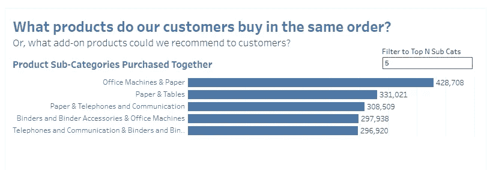
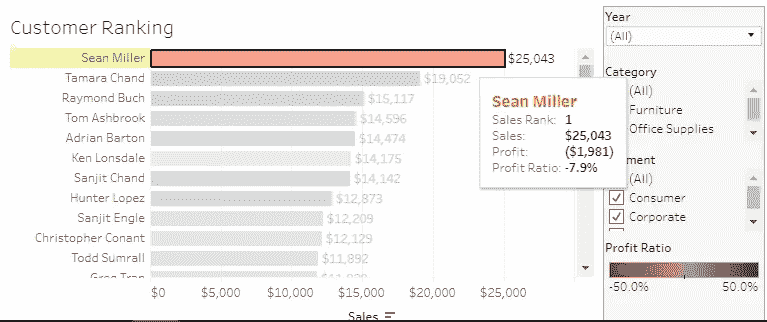
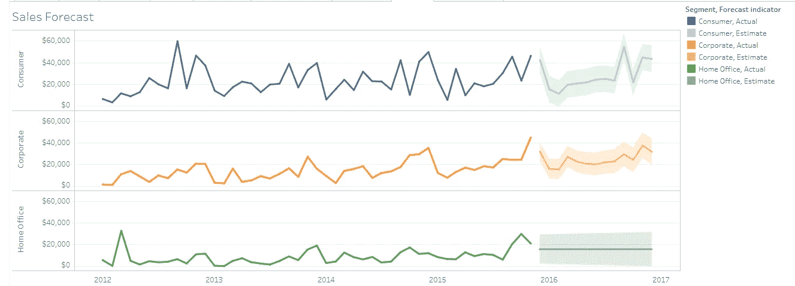
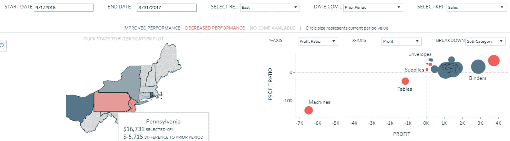
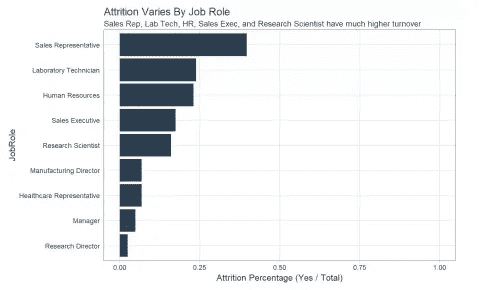
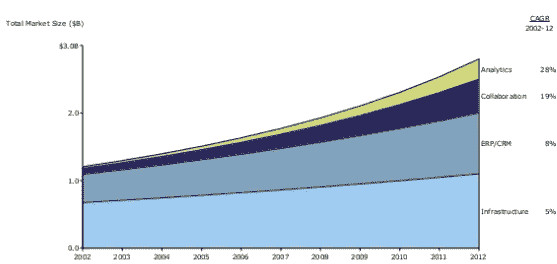
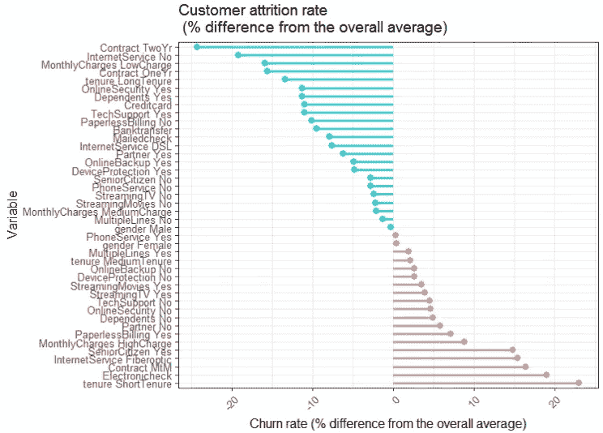
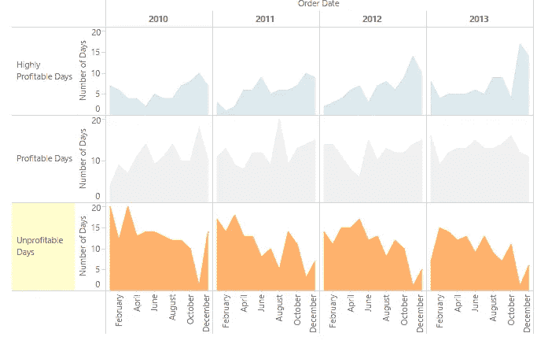
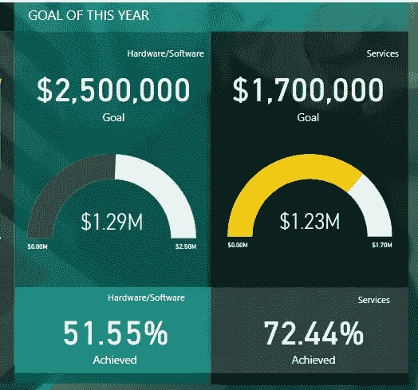
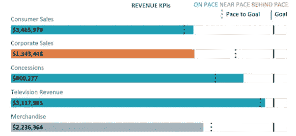

# 带领你的老板踏上数据之旅的 10 种方式

> 原文：<https://towardsdatascience.com/10-ways-to-take-your-boss-on-a-journey-through-the-data-14a3fdbb3503?source=collection_archive---------2----------------------->

Photo credit: Pexels

***“人们听到的是统计，感受的却是故事。”福布斯 2016 年 3 月***

***“用你的数据讲述一个令人信服的故事有助于你有效地表达你的观点。”信息周刊，2016 年 5 月***

我们的大脑喜欢好故事，你的老板也不例外。J.K .罗琳曾经写道，“我们最爱的故事确实永远活在我们心中”。这同样适用于数据。但是什么是数据故事呢？根据 [LeAnna Kent](https://www.elderresearch.com/company/our-team/leanna-kent) 的说法， [Elder Research](https://www.elderresearch.com/) 的数据科学家，“[数据故事讲述将数据可视化与引导式叙述结合在一起。它将数据和图表与单词配对。它不仅描述了图表中可以看到的内容，还讲述了一个故事来引导观众完成分析过程](http://www.predictiveanalyticsworld.com/patimes/data-story-telling-bringing-life-data/8278/)。

作为数据科学家，我们需要能够施加影响，我们有分析和见解，可以发现机会并指导管理层的行动，但如果我们不能激励企业接受，我们强大的机器学习算法最终将在货架上积灰。

**数据可视化**是数据分析的核心，它以图片或图形格式呈现数据，使业务用户能够直观地使用信息，无需深厚的技术专业知识。

**叙述**是关键，它有助于向你的观众解释数据中发生了什么，以及为什么某个特定的见解很重要。叙述减少了歧义，将数据与背景联系起来。

因此，在这篇文章中，我们将探索结合可视化和叙述流的数据故事，并希望我们能够说服我们的老板根据我们的见解采取行动。我们开始吧！

1.  ***可视化*** :一起购买的产品

Source: [Tableau public](https://public.tableau.com/profile/andy.kriebel#!/)

***叙述*** :我司客户频繁一起购买上述产品。本周末我们将清仓大甩卖办公设备。让我们重新安排我们的促销方案，把纸张、活页夹产品和办公设备放在一起展示。

2. ***可视化*** :销售和利润

Source: [Tableau public](https://public.tableau.com/profile/technical.product.marketing#!/)

***叙述*** :我们应该停止给这个客户大折扣。让我们找到一个既能提供折扣又能赚钱的解决方案。

3. ***可视化*** :销售预测

Source: [Tableau public](https://public.tableau.com/profile/technical.product.marketing#!/)

***叙述*** :根据我们过去和现在的销售情况以及季节规律，我们可以这样预测 2016 年的销售情况。该模型确定 2016 年销售额有 95%的可能性在阴影区域内。如您所见，二月份通常是消费者和企业产品的淡季。我们要不要为这个月策划一次促销活动？

4. ***可视化*** :利润和利润比例

Source: [Tableau public](https://public.tableau.com/profile/technical.product.marketing#!/)

***叙述*** :宾夕法尼亚州的利润率下降，原因是机器的利润率为-134%。这需要立即解决。

5. ***可视化*** :员工流动率

Source: [R-bloggers](https://www.r-bloggers.com/hr-analytics-using-machine-learning-to-predict-employee-turnover/)

***叙述*** :销售代表的离职率最高，约为 40%，其次是实验室技术人员、人力资源、销售主管和研究科学家。值得调查的是，哪些本地化问题可能会导致组织内这些团队的高人员流动率。

6. ***可视化*** :成长加班

Source: [Slideshare](https://www.slideshare.net/MekkoGraphics/market-maps-capture-a-snapshot-of-your-industry)

***叙述*** :协作和分析解决方案的增长速度超过了 ERP/CRM 和基础设施。他们可能是下一笔投资的好目标。

7. ***可视化*** :客户流失

Source: [DataScience+](https://datascienceplus.com/using-mca-and-variable-clustering-in-r-for-insights-in-customer-attrition/)

**另一方面，月租费低、合同期长、有在线安全服务、有家属或伙伴、用信用卡或银行转账付款的客户的流失率远低于平均水平。让我们开始制定一个防止客户流失的计划。**

8. ***可视化*** :无利可图的日子

Source: [Tableau public](https://public.tableau.com/profile/technical.product.marketing#!/)

***叙述*** :我们无利可图的日子更容易发生在一年的前几个月(1 月到 3 月)。让我们想办法在这几个月向每位客户追加销售，让我们盈利。

9. ***可视化*** :销售目标

Source: [Power BI](http://community.powerbi.com/t5/Data-Stories-Gallery/bd-p/DataStoriesGallery)

***叙述*** :现在是 11 月，我们不太可能达到年度销售目标，尤其是在硬件/软件组件方面。让我们找出问题所在。

10. ***可视化*** :执行摘要

Source: [Big Book of Dashboards](http://www.bigbookofdashboards.com/dashboards.html)

***叙述*** :消费销售领先步伐 5%；这可能是由我们在多伦多新开的商店推动的。由于两名销售代表辞职，企业销售远远落后于预期。商品销售落后于预期 5%;考虑尽快更换两名销售代表，并将广告预算重新分配给商品，这样我们就可以在年底实现收入目标。

# 摘要

正如您所看到的，讲述数据故事是一项艰巨的工作，因为大多数时候我们并没有处理“令人信服的”数据。我们要么处理产品销售数据，要么处理消费者(或员工)行为数据。我们必须非常有创意，把我们的数据变成美丽的、有说服力的故事。让你的信息穿过所有混乱的最好方法是合并这两种强大的交流方式——数据可视化和叙述。

正如 e .布伦德尔在他的书《特写写作的艺术和技巧》中所说

“我们应该既是故事的讲述者，也是事实的提供者。当我们没有履行这一责任时，我们就不会被阅读。”

请记住，数据不会激励人，故事会。我们需要用一个能激发情感、激励行动的故事来概括我们的愿景。

最后，如果你不想被质疑你对公司的价值，告诉他们你的故事。