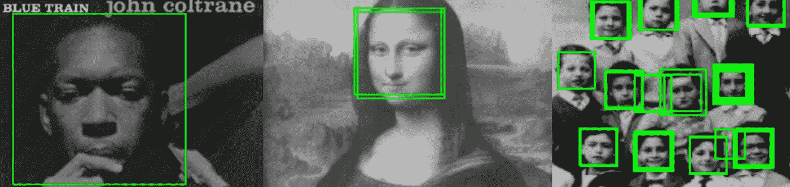
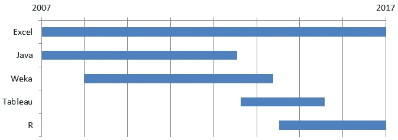
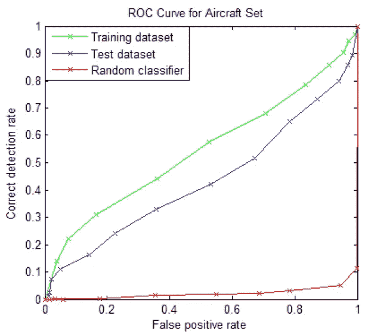
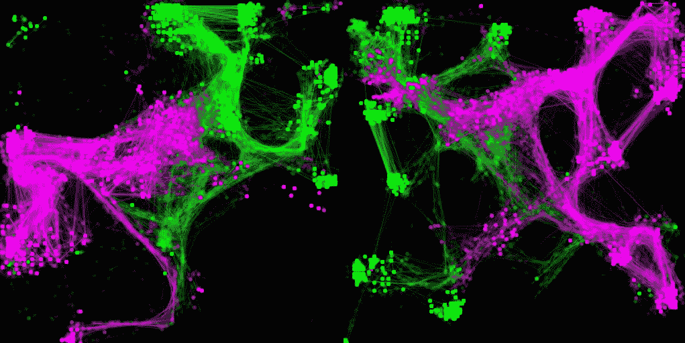
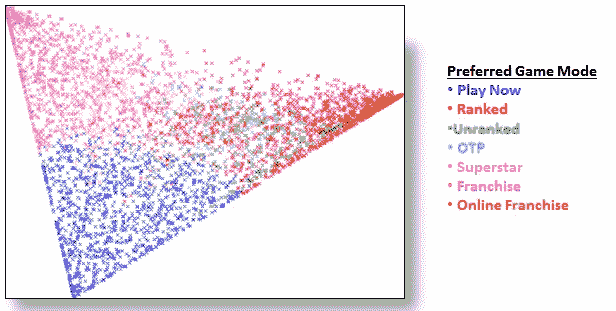
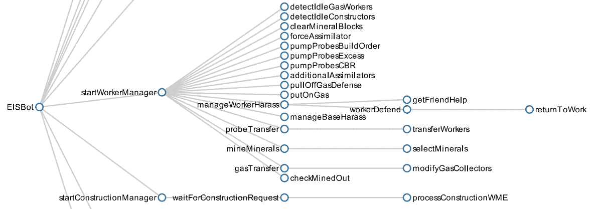
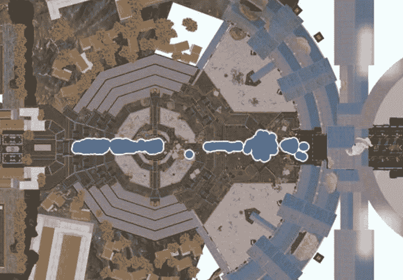
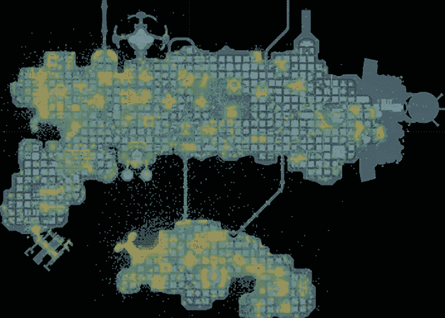
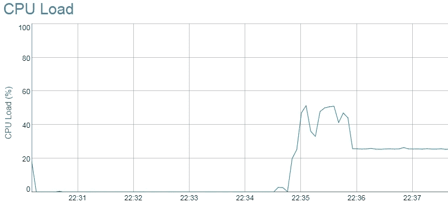
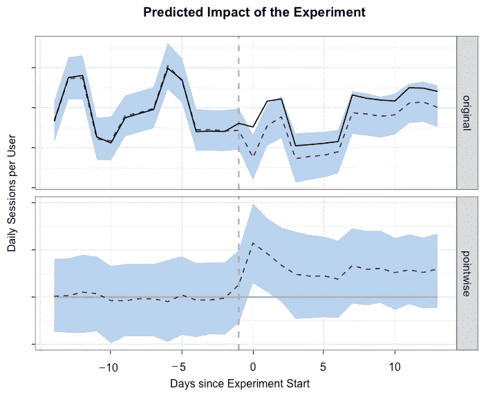

# 10 年的数据科学可视化

> 原文：<https://towardsdatascience.com/10-years-of-data-science-visualizations-af1dd8e443a7?source=collection_archive---------2----------------------->

我在数据科学领域的职业生涯始于十年前，当时我在加州大学圣克鲁斯分校(UC Santa Cruz)上了第一门机器学习课程。从那以后，我在各种团队中工作过，使用过许多不同的可视化工具。虽然我在行业中的许多经验都集中在业务和产品指标上，但我想分享一些我在过去 10 年中收集的可视化数据。我从过去十年的每一年中挑选了一个可视化的例子，目的是展示我对不同工具的偏好是如何随着时间的推移而变化的。这些不一定是每年最有影响力的可视化，因为该列表过于 excel 化，可能会暴露敏感信息。以下是过去 10 年我对可视化工具偏好的时间表:

# 2007

早在深度学习主导图像分类任务之前， [AdaBoost](http://wearables.cc.gatech.edu/paper_of_week/viola01rapid.pdf) 是机器学习任务的一种流行方法，如人脸检测。在加州大学圣克鲁斯分校研究生院的第一年，我选修了[曼弗雷德·沃穆思的](https://users.soe.ucsc.edu/~manfred/)机器学习课程。他的课程向我介绍了各种工具，包括 MATLAB 和 Mathematica。在我的[学期项目](http://citeseerx.ist.psu.edu/viewdoc/download?doi=10.1.1.211.9886&rep=rep1&type=pdf)中，我在 MATLAB 中实现了 Viola 和 Jones 的图像检测算法，并将其应用于图像中检测飞机的任务，结果如下图所示。分类器表现不佳，主要是因为缺乏高质量的训练数据和有限的特征集(Haar 基函数)。

Aircraft Image Detection — MATLAB- UC Santa Cruz (CMPS 242)

这篇博文的横幅图像是作为该项目的一部分生成的。该图像示出了一些验证数据集图像的检测到的面部。

# 2008

对于我的论文项目，我想建立一个从演示中学习的系统，并受到职业星际争霸玩家的启发。在[育雏战争 API](https://github.com/bwapi/bwapi) 发布之前，可以为星际争霸编写机器人，可以使用 [LM 重播浏览器](http://lmrb.marw.net/)等工具分析重播数据。下面的图片展示了我对专业回放分析的一些初步工作。我写了一个 Java 应用程序，在一个星际争霸游戏中画出对应于军队移动的点和线。

StarCraft: Brood War Gameplay Traces —Java — UC Santa Cruz

# 2009

在收集和挖掘了成千上万的回放后，我训练了各种分类算法来检测星际争霸 1 中不同的建造顺序。此分析的结果显示在下面的 excel 图表中。这项分析的一个有趣的结果是，一些算法优于用于标记图像的规则集分类器。我在 2009 年 IEEE CIG 会议上发表了这个结果和其他发现。

StarCraft 1 Build Order Prediction — Excel — UC Santa Cruz (EISBot)

几个月前，我在[写了一篇博文](https://medium.com/towards-data-science/reproducible-research-starcraft-mining-ea140d6789b9)，讲述了在我目前偏爱脚本和可视化工具的情况下，我会如何进行这项分析。

# 2010

在 2010 年秋季我在电子艺界实习期间，我有机会对从 Madden NFL 11 收集的万亿字节的数据进行数据挖掘。我进行的一项分析是基于偏好的游戏模式，观察《马登》中不同的玩家原型。我用 [Weka](https://www.cs.waikato.ac.nz/ml/weka/) 来执行这个任务，结果显示在下面的 PCA 可视化中。在艺电实习期间，我还参与了[玩家保持模型](https://www.aaai.org/ocs/index.php/IAAI/IAAI-11/paper/view/3526/4029)的工作，并收集了一些有趣的[商业指标](https://kotaku.com/5716199/need-a-sure-fire-first-down-in-madden-try-cougar-cross)的数据。

Player Archetypes in Madden NFL 11 — Weka — Electronic Arts

# 2011

我在制作星际机器人时面临的挑战之一是处理战争迷雾，这限制了玩家对地图的可视性。我创建了一个粒子模型来追踪以前不再被机器人观察到的敌人单位。我用 Java 写了一个脚本来创建下面的视频，它可视化了机器人的观察。结果发表在 2011 年 AIIDE 上。

State Estimation in StarCraft — Java — UC Santa Cruz (EISBot)

# 2012

我将在我的论文项目[中展示的最后一个可视化图](http://alumni.soe.ucsc.edu/~bweber/bweber-dissertation.pdf)是一个显示代理行为树中的行为的图表，它用于决策。该机器人是用 ABL 反应式规划语言编写的，我用 Java 编写了一个脚本来解析代码并输出图形格式。然后，我使用 [protoviz](http://mbostock.github.io/protovis/) 库来创建图表的渲染。

EISBot’s Behavior Tree — Protoviz— UC Santa Cruz (EISBot)

# 2013

当我在微软的工作室用户研究团队工作时，我帮助这个团队为 Ryse: Son of Rome 和 Sunset Overdrive 的游戏测试建立可视化。黛博拉·亨德森在 [GDC 2017](https://www.gdcvault.com/play/1024640/How-Design-Can-Ensure-Impartial) 上展示了这项工作的一些成果。下图显示了使用 Tableau 可视化的游戏测试中敌人的死亡地点。我们发现，除了参与者的反馈之外，还包括可视化效果会让游戏工作室更加关注这些报告。

Ryse: Son of Rome Playtesting — Tableau — Microsoft Studios User Research

# 2014

在索尼在线娱乐公司，我继续使用 Tableau 来报告业务指标，并在我们的 MMO 中整合玩家活动的可视化效果。我收集的一些最有影响力的视觉效果是玩家漏斗，它显示了玩家在游戏过程中下落的位置。我还做了一堆热图，没有那么多可操作的结果，但确实得到了游戏团队更多的关注。

Activity heatmap in DC Universe Online — Tableau — Sony Online Entertainment

# 2015

在电子艺界，我将大部分分析切换到 R，并开始探索 R 生态系统中的各种可视化工具，包括 [Shiny](https://shiny.rstudio.com/) 和 [htmlwidgets](http://www.htmlwidgets.org/) 。我在 EA 工作的一个项目是运行分析团队 R 脚本的服务器。我写了一个闪亮的脚本来创建一个可视化服务器负载的 web 应用程序，如下图所示。我在 useR 上展示了 [RServer 项目](https://channel9.msdn.com/Events/useR-international-R-User-conference/useR2016/RServer-Operationalizing-R-at-Electronic-Arts)！2016.然而，我目前的建议是让团队使用更成熟的项目，比如 [Airflow](https://airflow.apache.org/) 。

RServer Load — R(Shiny) + dygraphs package — Electronic Arts (Global Analytics & Insights)

# 2016

Twitch 的科学团队做了大量的 A/B 实验，以确定向用户群推出哪些功能。我们还遇到了 A/B 测试不实际的情况，而是使用分阶段的展示来分析重大应用程序重写的影响。我在 R 中使用了 [CausalImpact](https://google.github.io/CausalImpact/CausalImpact.html) 包来评估分阶段部署对应用会话数量的影响，结果如下所示。我之前在这里更详细地讨论了这种方法[。](https://blog.twitch.tv/a-b-testing-using-googles-staged-rollouts-ea860727f8b2)

Staged rollout impact on mobile sessions — R + CausalImpact package — Twitch

# 2017

我继续使用 R 进行可视化，尽管我最近从游戏行业转向了金融技术。我做的一个改变是在 Jupyter 笔记本上而不是 RStudio 上做更多的分析。在接下来的几个月里，我会写更多关于我在[意外收获数据](https://angel.co/windfall-data)所做的分析类型的博文。目前，这是从人口普查数据生成的美国人口热图。

US Population Map — R + ggplot2 package — Windfall Data

在过去的十年里，我使用了各种不同的工具，并且发现每种工具都有利弊。这些年来，我的关注点已经转移到了开源工具上，这些工具支持可重复的研究。