# 我在数据中的 117 天 Tinder 个人资料

> 原文：<https://towardsdatascience.com/117-days-of-tinder-in-data-755fe9ed853e?source=collection_archive---------5----------------------->

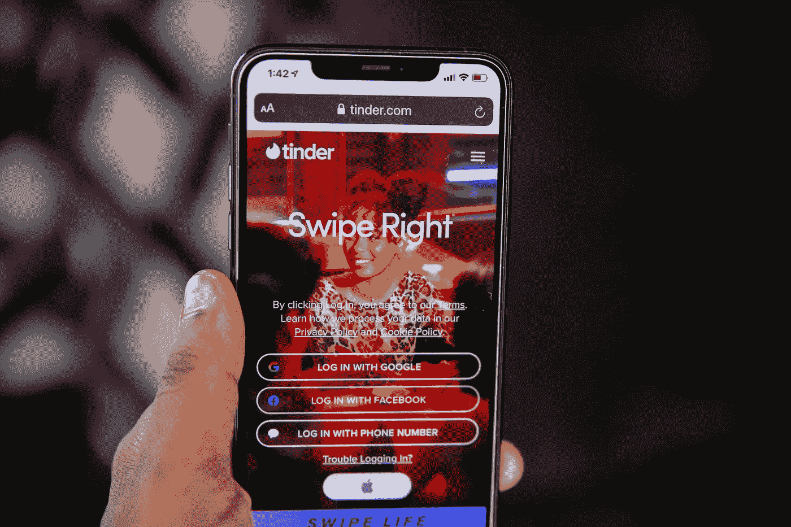

Image by [Solen Feyissa](https://pixabay.com/users/solenfeyissa-17494645/) on [Pixabay](https://pixabay.com/photos/tinder-home-page-online-dating-5409106/)

大约 4 个月前——在我结束了 3 年的恋情之后——我决定创建一个 Tinder 个人资料。以下是那个侧面的故事(有数据)。如果你很懒，不在乎细节，跳到最下面有一个 Sankey 图，总结了很多。

让我们先了解一些基础知识，因为这些话题不可避免地会出现。

**男的还是女的？**

男，22。直男。

**我住在哪里？**

拥有大约一百万人口的加拿大城市。

**我好看吗？**

我可能是一个长相相当普通的人，可能略高于平均水平，但肯定不是模特。目前在我的 Tinder 个人资料上的照片有着从 7.7 到 9.3 不等的吸引力评分。然而，请记住，我确实为我的个人资料拍了一些好照片。

我有金子吗？

是的。

**我的偏好设置是什么？**

我的偏好最初设定得很宽，但随着时间的推移已经缩小了。目前，它被设定为 100 公里内 18-25 岁的女性。

现在是有趣的事情。

# 活动

我的 Tinder 活跃度(以应用每天打开次数衡量)从 0 到 153 不等——平均值为 29 次，中位数为 20 次。

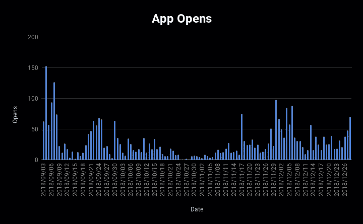

我在 Tinder 上的第一周是我最活跃的一周。然而，除此之外，我的活动没有显示出明确的趋势，但高活动期似乎确实会突然出现，中间会有间歇。

# 偷窃

在近 4 个月的时间里，我记录了 16561 次刷卡。这意味着平均每天刷卡 141.5 次，中位数为 96 次。

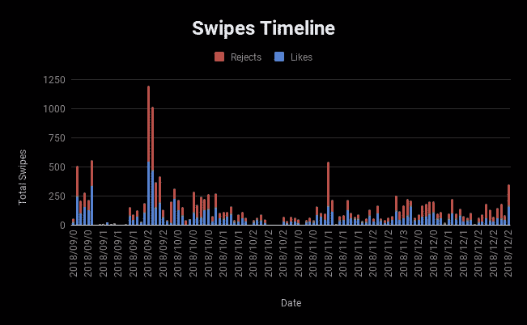

在 16，561 次刷卡中，7，886 次是赞，8，675 次是通过，总体赞率为 47.3% 。

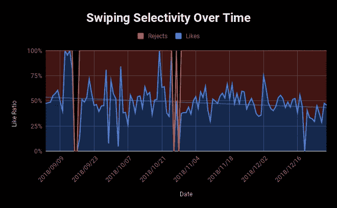

数据还显示，随着时间的推移，我的刷卡变得更加有选择性——尽管这可能是因为我的偏好发生了变化，或者 Tinder 的算法向我显示了更好的配置文件。有趣的是，我确实相信随着时间的推移，我变得更有选择性了。

# 比赛

我总共收到了 290 条匹配——平均每天 2.5 条。这意味着大约 1.75%的我的刷卡会导致匹配，大约 3.7%的我的喜欢。

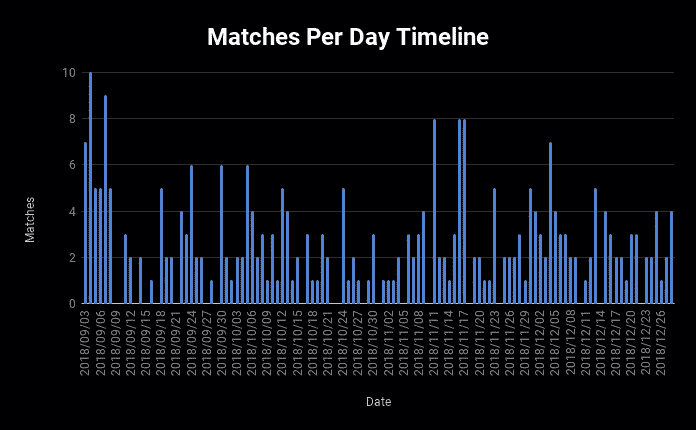

在任何一天，我都会收到 0 到 10 个匹配。每天比赛的分布严重向右倾斜，模式为 2。

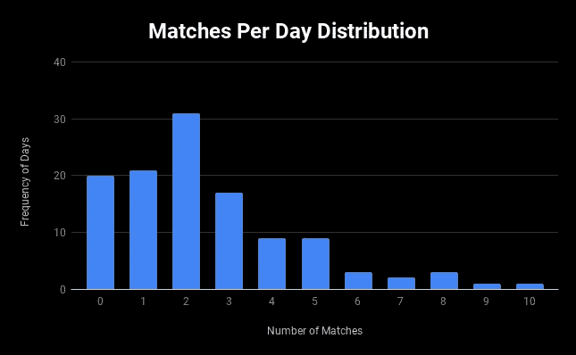

# 信息发送

我在 Tinder 上总共交换了 504 条信息——发送了 274 条，收到了 230 条。这个数字相对较低，因为我通常试图在几条消息中得到一个电话号码。

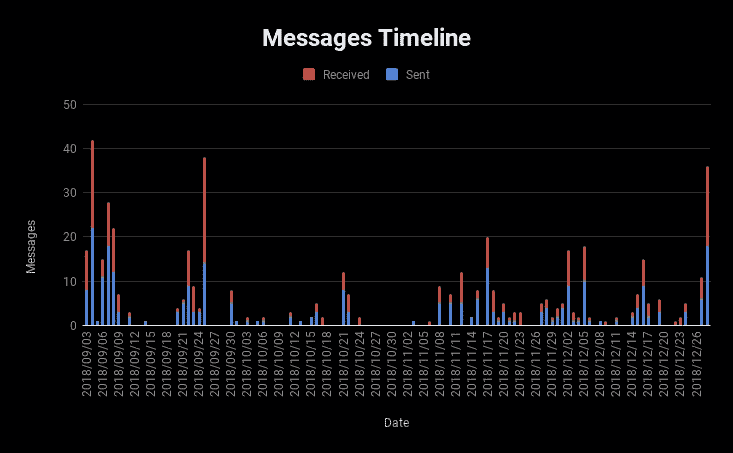

下面是我的信息是如何随着时间的推移而积累起来的:

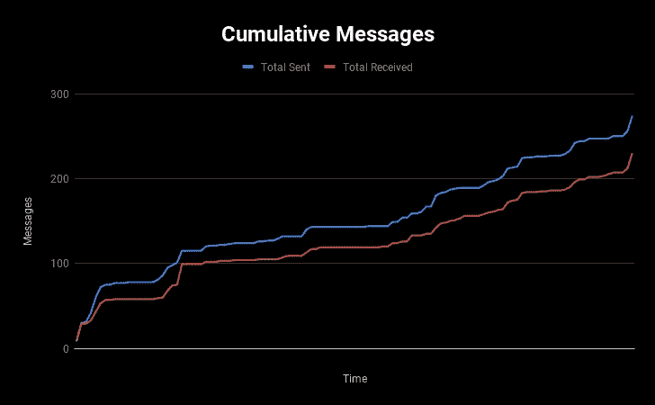

在我的 290 次匹配中，有 99 次(34%)至少交换了一条信息。在这 99 人中，有 12 人给我发了信息，但我没有回复，这意味着我给 30%的匹配者发了信息。

在我发送的 87 条匹配信息中，有 56 条至少回复了一次，回复成功率约为 64%。这个比例可能比它应该的要低，因为我经常等几天或几周才收到我不太感兴趣的比赛的消息。我自己对三天内发送的比赛信息的追踪显示回复率为 78%，而我最好的开场白的回复率为 84%。

# 超级旅行

我也开始追踪我自己的超级跑步成功率。在 183 次超级相似中，有 14 次匹配，成功率为 8%。这是按年龄划分的成功案例:

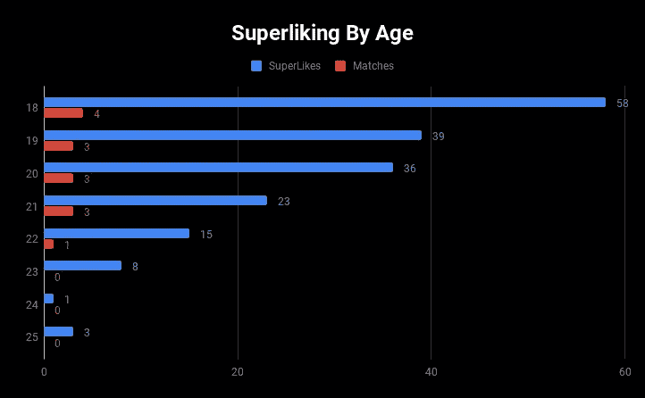

以及按年龄划分的成功率:

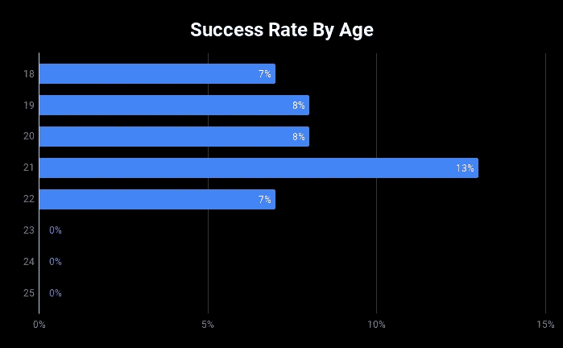

我有一个个人理论，年轻女孩的成功率会更高，但迄今为止，没有明显的趋势出现。

# 总结果

我打火的最终结果可以用这张图表来概括:

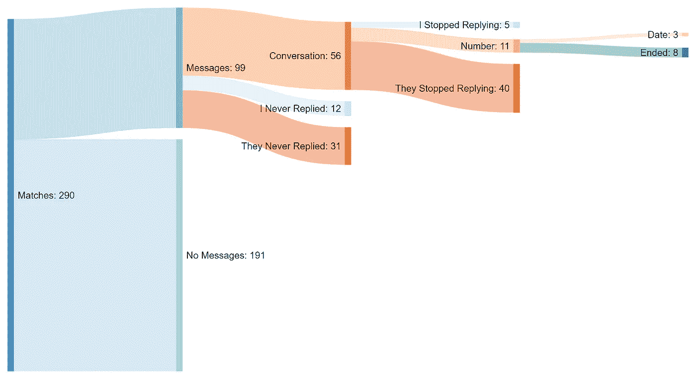

Built in SankeyMatic

总的来说，我和**约会的次数超过了我的对手**的 1%。我认为这个数字相当保守；我很有信心，如果我想的话，我可以得到更多的约会。

我选择发送多少条信息主要取决于我那周有多忙，我是否有其他约会计划(来自 Bumble 或我在现实生活中遇到的女孩)，或者我当时有多想去约会。

**数据来源**

这里所有的数据都来自我自己的 Tinder 个人资料。其中大部分来自对 Tinder 的数据请求，还有一部分是自我跟踪的。