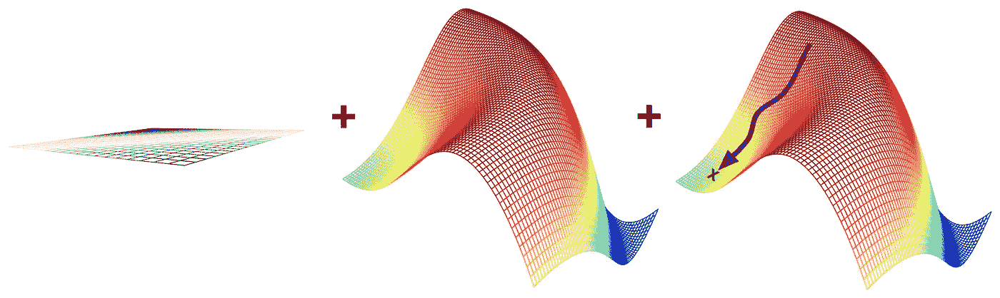
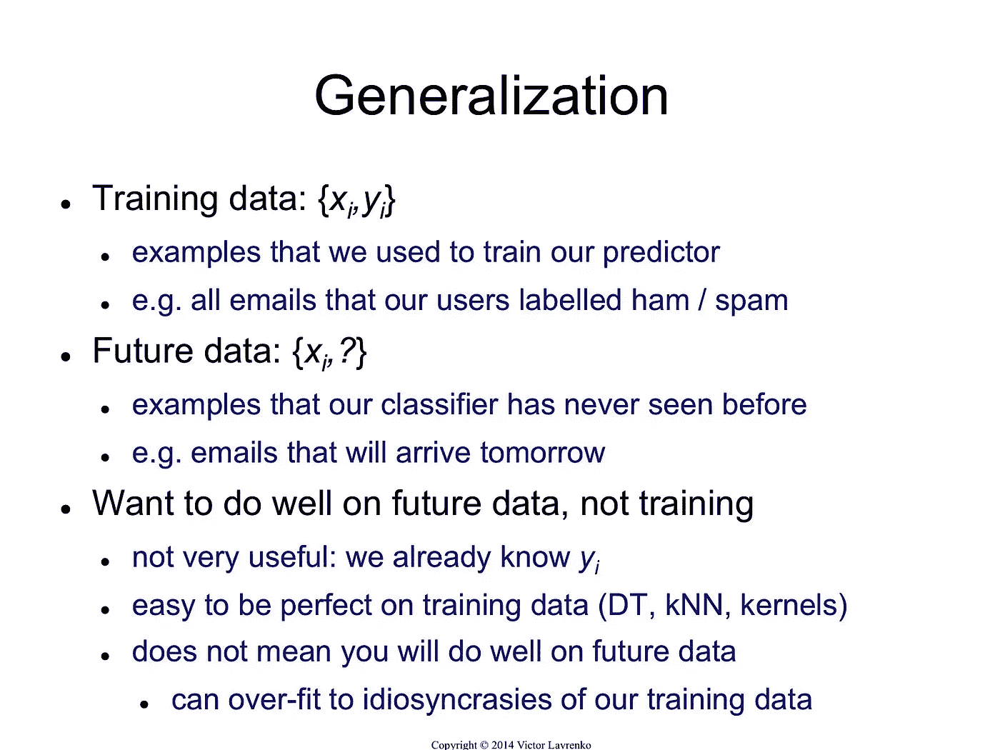
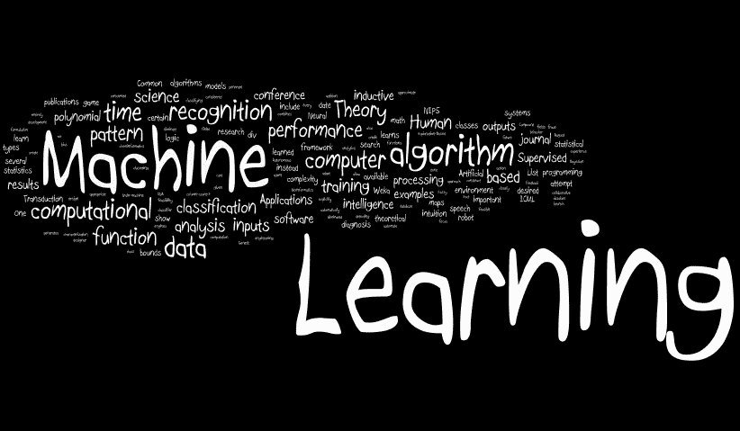
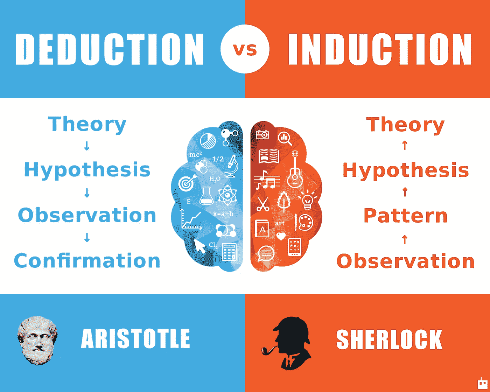
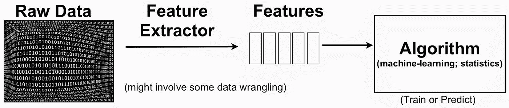
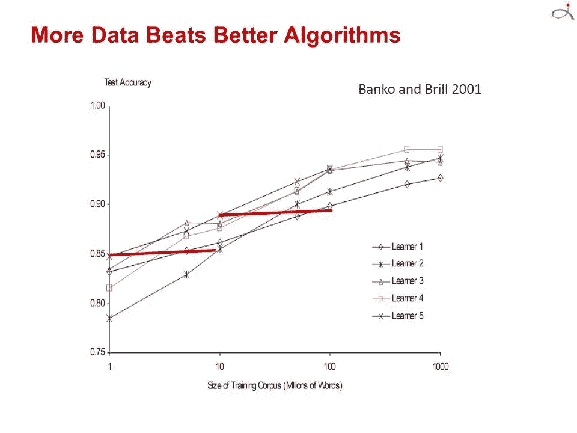
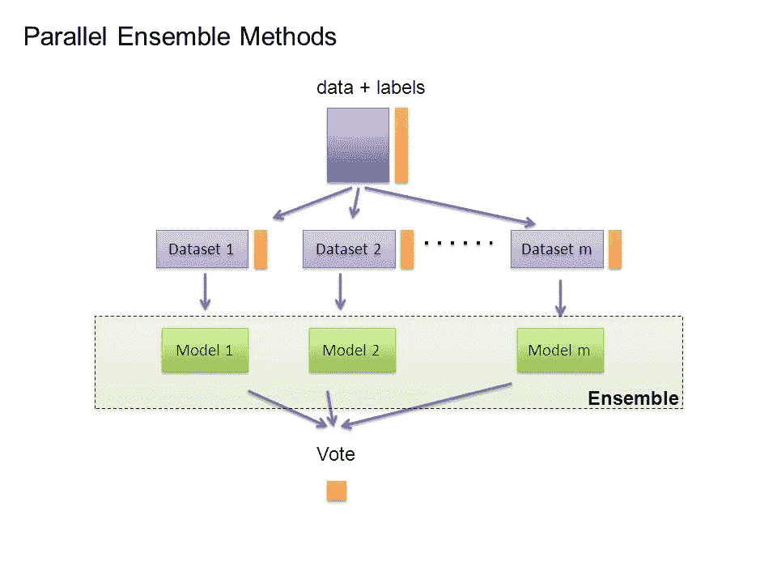
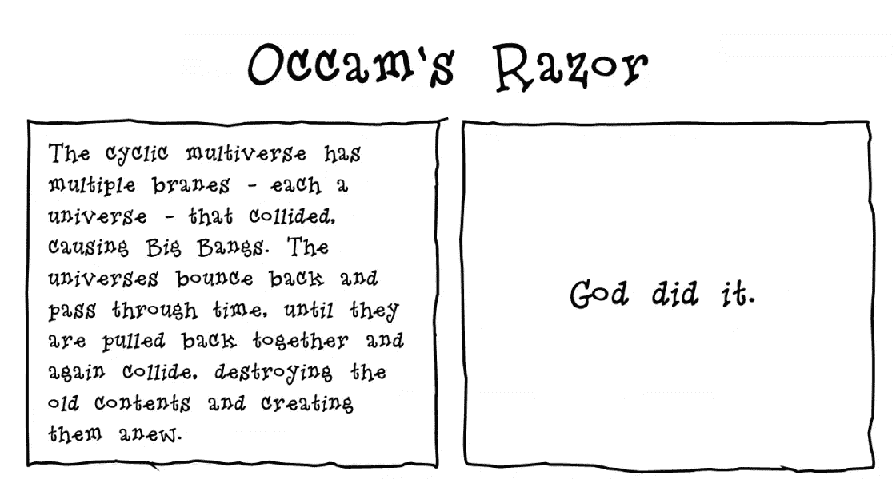
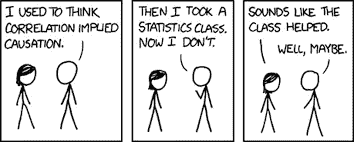

# 关于机器学习要知道的 12 件有用的事情

> 原文：<https://towardsdatascience.com/12-useful-things-to-know-about-machine-learning-487d3104e28?source=collection_archive---------1----------------------->

机器学习算法可以通过从示例中进行归纳来找出如何执行重要任务。在手动编程不可行的情况下，这通常是可行的且成本有效的。随着越来越多的数据可用，更多雄心勃勃的问题可以得到解决。因此，机器学习被广泛应用于计算机等领域。然而，开发成功的机器学习应用程序需要大量在教科书中很难找到的“黑色艺术”。

我最近读了一篇令人惊叹的技术论文，作者是华盛顿大学的 Pedro Domingos 教授，题目是“ [**关于机器学习需要知道的一些有用的事情”。**](https://homes.cs.washington.edu/~pedrod/papers/cacm12.pdf) ”它总结了机器学习研究人员和实践者学到的 12 条关键经验，包括要避免的陷阱、要关注的重要问题和常见问题的答案。我想在本文中分享这些经验，因为它们在考虑解决下一个机器学习问题时非常有用。

## 1 —学习=表示+评估+优化

所有机器学习算法通常只由 3 个部分组成:

*   分类器必须用计算机能够处理的某种形式语言来表示。相反，为学习者选择一个表示就相当于选择它可能学习的一组分类器。这个集合被称为学习者的*假设空间*。如果分类器不在假设空间中，它就不能被学习。一个相关的问题是如何表示输入，即使用什么特征。
*   **评估:**需要一个评估函数来区分好的分类器和坏的分类器。算法内部使用的评估函数可能不同于我们希望分类器优化的外部函数，这是为了便于优化，也是由于下一节中讨论的问题。
*   **优化:**最后，我们需要一种方法在语言的分类器中搜索得分最高的分类器。优化技术的选择对于学习者的效率是关键的，并且如果评估函数具有一个以上的最优值，也有助于确定产生的分类器。对于初学者来说，开始使用现成的优化器是很常见的，这些优化器后来被定制设计的优化器所取代。

## 2 —概括才是最重要的

机器学习的基本目标是*将*推广到训练集中的示例之外。这是因为，无论我们有多少数据，我们都不太可能在测试时再次看到那些精确的例子。在训练中做得好很容易。机器学习初学者最常见的错误就是在训练数据上进行测试，产生成功的错觉。如果选择的分类器然后在新的数据上被测试，它通常不比随机猜测好。所以，如果你雇人来构建一个分类器，一定要把一些数据留给自己，并在上面测试他们给你的分类器。相反，如果你被雇来建立一个分类器，从一开始就把一些数据放在一边，只在最后用它来测试你选择的分类器，然后在整个数据上学习你的最终分类器。

## 3 —仅有数据是不够的

将一般化作为目标还有另一个主要后果:不管你有多少数据，光有数据是不够的。

这似乎是相当令人沮丧的消息。那么我们怎么能希望学到东西呢？幸运的是，我们想要在现实世界中学习的函数并不是从所有数学上可能的函数集中统一得出的！事实上，非常一般的假设——比如平滑度、类似的例子具有类似的类、有限的依赖性或有限的复杂性——通常足以做得非常好，这也是机器学习如此成功的很大一部分原因。和演绎一样，归纳(学习者所做的事情)是一个知识杠杆:它把少量的输入知识变成大量的输出知识。归纳法是一个比演绎法强大得多的杠杆，它需要少得多的输入知识来产生有用的结果，但它仍然需要比零输入知识更多的知识来工作。而且，就像任何杠杆一样，我们放进去的越多，出来的就越多。

回想起来，学习对知识的需求应该不足为奇。机器学习不是魔术；它不可能无中生有。它所做的是用更少的资源获得更多。像所有工程一样，编程是一项繁重的工作:我们必须从头开始构建一切。学习更像耕作，让大自然做大部分的工作。农民将种子和养分结合起来种植作物。学习者将知识与数据相结合来开发程序。

## 4-过度拟合有许多面

如果我们拥有的知识和数据不足以完全确定正确的分类器怎么办？那么我们就有可能产生一个分类器(或它的一部分)的幻觉，这个分类器不是基于现实的，只是在数据中编码随机的怪癖。这个问题被称为*过拟合，*，是机器学习的 bugbear。当您的学习者输出一个对训练数据 100%准确，但对测试数据只有 50%准确的分类器时，实际上它可以输出一个对两者都有 75%准确的分类器，它已经过拟合了。

机器学习中的每个人都知道过度拟合，但它以许多形式出现，不会立即显而易见。理解过度拟合的一种方法是将泛化误差分解为*偏差*和*方差。*偏见是学习者总是学习同样错误的东西的倾向。方差是学习随机事物而不考虑真实信号的趋势。线性学习者有很高的偏见，因为当两个类之间的边界不是超平面时，学习者无法诱导它。决策树没有这个问题，因为它们可以表示任何布尔函数，但另一方面，它们可能会受到高方差的影响:在同一现象生成的不同训练集上学习到的决策树往往非常不同，而实际上它们应该是相同的。

交叉验证有助于对抗过度拟合，例如通过使用它来选择学习决策树的最佳大小。但是它不是万灵药，因为如果我们用它来做太多的参数选择，它本身就会开始过度适应。

除了交叉验证之外，还有许多方法来对抗过度拟合。最流行的方法是在评估函数中增加一个*正则项*。例如，这可能不利于具有更多结构的分类器，从而有利于较小的分类器，较小的分类器具有较小的过度适应空间。另一种选择是在添加新结构之前执行统计显著性测试，如卡方检验，以确定使用和不使用该结构时类的分布是否真的不同。当数据非常缺乏时，这些技术特别有用。然而，你应该对声称一种特殊的技术“解决”过度拟合问题持怀疑态度。通过陷入与欠拟合(偏差)相反的错误，很容易避免过拟合(方差)。同时避免这两者需要学习一个完美的分类器，如果事先不知道，就没有一种技术总是做得最好(没有免费的午餐)。

## 5——直觉在高维空间失效

过拟合之后，机器学习最大的问题就是*维数灾难。*这个表达是 Bellman 在 1961 年创造的，指的是当输入是高维时，许多在低维工作良好的算法变得难以处理。但在机器学习中，它指的远不止这些。随着示例维数(要素数量)的增加，正确概化变得更加困难，因为固定大小的训练集覆盖了输入空间中不断缩小的部分。

高维度的普遍问题是，我们来自三维世界的直觉通常不适用于高维度。在高维中，一个多元高斯分布的大部分质量并不在均值附近，而是在它周围越来越远的“壳”中；而且一个高维橙子的大部分体积都在果皮里，而不是果肉里。如果恒定数量的样本均匀分布在高维超立方体中，在某些维度之外，大多数样本比它们的最近邻居更靠近超立方体的面。如果我们通过在超立方体中雕刻来近似一个超球面，在高维空间中，几乎所有超立方体的体积都在超球面之外。这对机器学习来说是个坏消息，在机器学习中，一种类型的形状通常由另一种类型的形状来近似。

构建二维或三维分类器很容易；我们可以通过目测在不同类别的例子之间找到合理的边界。但是在高维度中，很难理解发生了什么。这反过来使得设计一个好的分类器变得困难。有人可能天真地认为，收集更多的特性不会有什么坏处，因为在最坏的情况下，它们不会提供关于该类的新信息。但事实上，它们的好处可能会被维数灾难盖过。

## 6 —理论上的保证并不像它们看起来那样

机器学习论文充满了理论保障。最常见的类型是对确保良好概括所需的示例数量的限制。你应该如何看待这些保证？首先，值得注意的是，它们甚至是可能的。归纳传统上与演绎相反:在演绎中，你可以保证结论是正确的；在诱导阶段，所有的赌注都是无效的。或者说这是许多世纪以来的传统观点。最近几十年的主要发展之一是认识到事实上我们可以对归纳的结果有保证，特别是如果我们愿意满足于概率保证的话。

我们必须小心像这样的界限意味着什么。例如，它并没有说，如果你的学习者返回了一个与特定训练集一致的假设，那么这个假设很可能是通用的。也就是说，给定一个足够大的训练集，你的学习者很有可能要么返回一个概括得很好的假设，要么无法找到一个一致的假设。这个界限也没有说明如何选择一个好的假设空间。它只告诉我们，如果假设空间包含真正的分类器，那么学习者输出坏分类器的概率随着训练集大小而降低。如果我们缩小假设空间，界限会改善，但是它包含真实分类器的机会也会缩小。

另一种常见的理论保证是渐近的:给定无限的数据，保证学习者输出正确的分类器。这是令人放心的，但由于其渐近保证，选择一个学习者而不是另一个学习者是轻率的。实际上，我们很少处于渐近状态(也称为“渐近状态”)。并且，由于上面讨论的偏差-方差权衡，如果给定无限数据，学习者 A 比学习者 B 好，则 B 通常比给定有限数据好。

理论保障在机器学习中的主要作用不是作为实际决策的标准，而是作为算法设计的理解来源和驱动力。在这种情况下，他们是非常有用的；事实上，理论和实践的密切相互作用是机器学习多年来取得如此大进展的主要原因之一。但是*买者自负:*学习是一种复杂的现象，仅仅因为一个学习者有理论上的正当理由并在实践中工作并不意味着前者是后者的原因。

## 7 —特征工程是关键

最终，一些机器学习项目成功了，一些失败了。有什么区别？很容易，最重要的因素是所使用的特性。如果你有许多独立的特性，并且每一个都和这个类有很好的关联，那么学习就很容易。另一方面，如果类是一个非常复杂的功能特性，你可能无法学习它。通常，原始数据不是一种易于学习的形式，但是您可以从中构建出易于学习的特征。这通常是机器学习项目中大部分努力的方向。这通常也是最有趣的部分之一，直觉、创造力和“黑色艺术”与技术一样重要。

第一次接触机器学习的人通常会惊讶于在一个机器学习项目中实际花在机器学习上的时间是如此之少。但是，如果你考虑到收集数据、整合数据、清理数据和预处理数据是多么耗时，以及在功能设计中可以进行多少尝试和错误，这是有道理的。此外，机器学习不是建立数据集和运行学习器的一次性过程，而是运行学习器、分析结果、修改数据和/或学习器并重复的迭代过程。学习通常是最快的部分，但那是因为我们已经掌握得很好了！特征工程更难，因为它是特定领域的，而学习者可以是通用的。然而，这两者之间并没有明显的界限，这也是为什么最有用的学习者是那些促进知识融合的人。

## 8-更多的数据胜过更聪明的算法

在大多数计算机科学中，两个主要的有限资源是时间和内存。在机器学习中，还有第三个:训练数据。哪一个是瓶颈，十年换十年。在 20 世纪 80 年代，它倾向于数据。今天通常是时间。海量的数据可用，但没有足够的时间来处理这些数据，因此这些数据被闲置。这导致了一个悖论:尽管原则上更多的数据意味着可以学习更复杂的分类器，但在实践中，更简单的分类器最终被使用，因为复杂的分类器需要太长的时间来学习。部分答案是想出快速学习复杂分类器的方法，事实上在这个方向上已经有了显著的进展。

使用更聪明的算法的回报比你预期的要小，部分原因是，在第一个近似值上，它们都做同样的事情。当你考虑到不同的表现形式，比如说，不同的规则集和神经网络时，这是令人惊讶的。但事实上，命题规则很容易被编码为神经网络，其他表示之间也存在类似的关系。所有的学习者本质上都是通过把附近的例子分组到同一个班级来工作的；关键的区别在于“附近”的含义使用非均匀分布的数据，学习者可以产生非常不同的边界，同时仍然在重要的区域(具有大量训练示例的区域，因此也是大多数文本示例可能出现的区域)中做出相同的预测。这也有助于解释为什么强大的学习可能不稳定，但仍然准确。

通常，首先尝试最简单的学习者是值得的(例如，在逻辑回归之前的朴素贝叶斯，在支持向量机之前的 k-最近邻)。更复杂的学习者是诱人的，但他们通常更难使用，因为他们有更多的旋钮需要你去转动以获得好的结果，也因为他们的内部更不透明)。

学习器可以分为两种主要类型:一种是表示具有固定大小的，如线性分类器，另一种是表示可以随着数据增长的，如决策树。固定规模的学习者只能利用这么多的数据。给定足够的数据，可变大小学习器原则上可以学习任何函数，但实际上，由于算法或计算成本的限制，它们可能无法学习。此外，由于维数灾难，现有的数据量可能是不够的。出于这些原因，聪明的算法——那些充分利用数据和计算资源的算法——最终往往会有回报，只要你愿意付出努力。设计学习者和学习分类器之间没有明显的界限；更确切地说，任何给定的知识都可以被编码在学习者的大脑中，或者从数据中学习。因此，机器学习项目往往以学习者设计的重要组成部分告终，从业者需要在这方面有一些专业知识。

## 9-学习多种模式，而不仅仅是一种

在机器学习的早期，每个人都有自己最喜欢的学习者，以及一些相信其优越性的先验理由。大部分的努力都花在了尝试它的许多变化和选择最好的一个上。然后，系统的经验比较表明，最佳学习者因应用程序而异，包含许多不同学习者的系统开始出现。现在努力尝试许多学习者的许多变化，并且仍然选择最好的一个。但是后来研究人员注意到，如果我们不选择找到的最佳变体，而是组合许多变体，结果会更好——通常好得多——并且对用户来说没有额外的努力。

创建这样的*模型集合*现在是标准。在最简单的技术中，称为 *bagging，*我们简单地通过重采样生成训练集的随机变化，在每个变化上学习一个分类器，并通过投票组合结果。这是可行的，因为它极大地减少了方差，而只是略微增加了偏差。在 *boosting 中，*训练样本具有权重，这些权重是可变的，以便每个新的分类器专注于先前的分类器容易出错的样本。在*堆叠中，*单个分类器的输出成为“高级”学习器的输入，该学习器找出如何最好地组合它们。

存在许多其他技术，并且趋势是越来越大的集合。在网飞奖中，来自世界各地的团队竞相打造最佳视频推荐系统。随着比赛的进行，团队发现他们通过将他们的学习者与其他团队结合起来获得了最好的结果，并合并成越来越大的团队。冠军和亚军都是超过 100 名学习者的组合，将这两个组合结合起来进一步改善了结果。毫无疑问，我们将来会看到更大的规模。

## 10-简单并不意味着准确

奥卡姆剃刀的著名论断是，实体的繁殖不应超过需要。在机器学习中，这通常意味着，给定两个具有相同训练误差的分类器，两个分类器中较简单的一个可能具有最低的测试误差。这种说法的所谓证据经常出现在文献中，但事实上有许多反例，而“没有免费的午餐”定理暗示这不可能是真的。

我们在上一节看到了一个反例:模型集合。即使在训练误差已经达到零之后，通过增加分类器，增强集成的泛化误差继续改善。因此，与直觉相反，模型的参数数量与其过度拟合的趋势之间没有必然的联系。

相反，更复杂的观点将复杂性等同于假设空间的大小，其基础是更小的空间允许假设由更短的代码来表示。像上面理论保证一节中那样的界限可能会被认为是暗示更短的假设概括得更好。这可以通过给空间中的假设分配更短的代码来进一步细化，我们对该空间有一些先验的偏好。但将此视为准确性和简单性之间权衡的“证据”是循环推理:我们通过设计使我们偏好的假设更简单，如果它们是准确的，那是因为我们的偏好是准确的，而不是因为假设在我们选择的表示中是“简单的”。

## 11-可表示并不意味着可学习

基本上，可变大小学习器中使用的所有表示都有相关的定理，其形式为“使用这种表示，每个函数都可以被表示，或者被任意近似。”对此感到放心后，该代表的粉丝通常会忽略所有其他人。但是，一个函数可以被表示出来，并不代表它可以被学习。例如，标准决策树学习者不能学习比训练样本更多的叶子的树。在连续空间中，使用一组固定的基元来表示即使是简单的函数，通常也需要无限数量的组件。

此外，如果假设空间具有许多评估函数的局部最优值，这是经常发生的情况，学习者可能找不到真正的函数，即使它是可表示的。给定有限的数据、时间和记忆，标准学习者只能学习所有可能函数的极小子集，这些子集对于具有不同表征的学习者是不同的。因此，关键问题不是“它能被表现出来吗？”对此，答案往往是琐碎的，但“它能被学习吗？”尝试不同的学习者(并可能结合他们)是值得的。

## 相关性并不意味着因果关系

相关性并不意味着因果关系的观点经常被提出，因此也许不值得赘述。但是，即使我们一直在讨论的这种学习者只能学习相关性，他们的结果也经常被视为代表因果关系。这难道不是错的吗？如果是，那么人们为什么要这么做？

通常情况下，学习预测模型的目的是将它们用作行动指南。如果我们发现啤酒和尿布经常在超市一起购买，那么也许把啤酒放在尿布区旁边会增加销售额。但是除非真的做实验，否则很难说。机器学习通常应用于*观察*数据，其中预测变量不受学习者控制，与*实验*数据相反，预测变量受学习者控制。一些学习算法可以潜在地从观察数据中提取因果信息，但是它们的适用性相当有限。另一方面，相关性是潜在因果联系的标志，我们可以用它作为进一步调查的指南。

## 结论

像任何学科一样，机器学习有许多“民间智慧”，它们可能很难获得，但对成功至关重要。多明戈斯教授的论文总结了一些你需要知道的最重要的项目。

— —

*如果你喜欢这首曲子，我希望你能按下拍手按钮*👏所以其他人可能会偶然发现它。你可以在[*GitHub*](https://github.com/khanhnamle1994)*上找到我自己的代码，在*[*https://jameskle.com/*](https://jameskle.com/)*上找到更多我的写作和项目。也可以在* [*上关注我【推特】*](https://twitter.com/@james_aka_yale)*[*直接发邮件给我*](mailto:khanhle.1013@gmail.com) *或者* [*在 LinkedIn 上找我*](http://www.linkedin.com/in/khanhnamle94) *。* [*注册我的简讯*](http://eepurl.com/deWjzb) *就在你的收件箱里接收我关于数据科学、机器学习和人工智能的最新想法吧！**