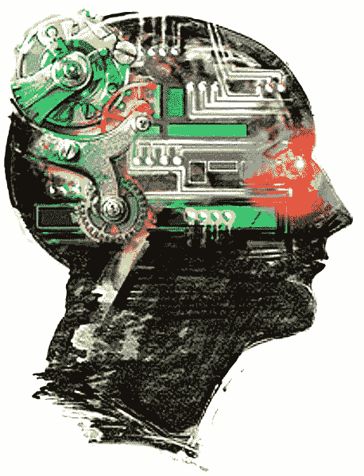

# 2018 年你需要知道的 15 个人工智能(AI)统计数据

> 原文：<https://towardsdatascience.com/15-artificial-intelligence-ai-stats-you-need-to-know-in-2018-b6c5eac958e5?source=collection_archive---------1----------------------->

人工智能(AI)每天都在以惊人的速度增长，随之而来的是，围绕该行业及其正在变革的各种行业的[统计数据](http://www.cmo.com/features/articles/2017/8/24/15-mindblowing-stats-about-artificial-intelligence-dmexco.html#gs.Q0Gg7Zs)也在发生变化。该技术已经在简化医疗保健行业的工作流程、减少教育部门管理任务的工时以及降低制造业的间接成本方面取得了巨大成功。似乎每天都有新的人工智能初创公司冒出来，目的是改变我们日常的思维、互动和工作方式。

为了向这项技术致敬，我们[收集了大量与人工智能相关的数据](https://enterprisersproject.com/article/2018/2/state-ai-10-eye-opening-statistics)，以便让你了解这项技术如今有多流行。这些统计数据涵盖了截至 2018 年的技术状况，其中包括像 [WorkFusion](https://goo.gl/Kwcee6) 这样的公司成为该行业的领导者。这家软件公司为寻求提高投资回报率的企业提供各种智能自动化解决方案。

以下是 2018 年你需要知道的 [15 个 AI 统计](https://www.forbes.com/sites/louiscolumbus/2018/01/12/10-charts-that-will-change-your-perspective-on-artificial-intelligences-growth/#438c96204758):

*   根据 Adobe 的数据，截至目前，只有 15%的企业在使用人工智能，但预计 31%的企业将在未来 12 个月内添加人工智能。
*   据斯坦福大学统计，自 2000 年以来，活跃的创业公司数量增加了 1400%。
*   据 Adobe 称，自 2000 年以来，风险资本家对人工智能初创公司的投资飙升了 6 倍。
*   根据 Adobe 的数据，自 2013 年以来，需要人工智能的工作份额增加了 450%。
*   斯坦福大学的数据显示，对于使用人工智能的企业，表现最佳的公司表示，他们使用该技术进行营销的可能性是行业同行的两倍多，分别为 28%和 12%。
*   根据 BridghtEdge 的说法，下一个大的营销趋势被视为消费者个性化(29%)，其次是人工智能(26%)。
*   Monster.com 最受欢迎的三项技能是机器学习、深度学习和自然语言处理。
*   国际数据公司(IDC)预测，到 2021 年，全球人工智能发送的复合年增长率将为 50.1%，达到 576 亿美元。这要归功于对零售、银行、医疗保健和制造业的投资，这些领域将占全球人工智能支出的一半以上。
*   Adobe 还发现，47%的数字化成熟组织，即那些拥有先进数字化实践的组织，都有明确的人工智能战略。
*   Juniper Research 在一项研究中发现，到 2022 年，全球人工智能支出将从 2018 年的 20 亿美元增长到每年 73 亿美元。这是因为公司将大力投资于人工智能工具，这些工具将帮助他们区分和改善他们为客户提供的服务。
*   根据叙事科学的数据，大约 61%拥有创新战略的公司正在使用人工智能来识别数据中的机会，否则他们会错过这些机会。对于没有这一战略的公司，这一数字仅为 22%。
*   佩奇表示，约 38%的消费者认为人工智能将改善客户服务。
*   PointSource 的一项研究发现，当人工智能被战术性地部署时，34%的购物者将在网上花更多的钱。约 49%的人表示，当人工智能出现时，他们愿意更频繁地在线购物。
*   根据埃森哲的数据，人工智能医疗保健市场预计到 2021 年将达到 66 亿美元。该研究补充说，到 2026 年，临床健康人工智能应用可以为美国医疗保健经济每年节省 1500 亿美元。
*   根据 IDC 的数据，在全球范围内，机器人进口已经从 2000 年的大约 10 万台增加到 2015 年的大约 25 万台。