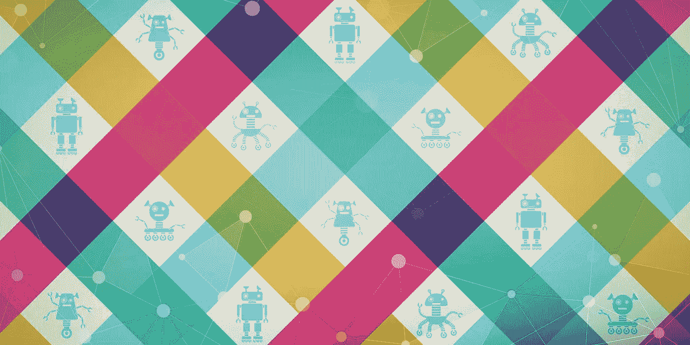

# 加入 15 个数据科学 Slack 社区

> 原文：<https://towardsdatascience.com/15-data-science-slack-communities-to-join-8fac301bd6ce?source=collection_archive---------0----------------------->

## 放松时伸出援手，提升你的职业生涯

image created by [Formulated.by](https://formulated.by/) :]

【2020 年 11 月:此榜单已更新 [**此处**](https://roundtable.datascience.salon/top-data-science-machine-learning-slack-communities) **。**

他们说这需要一个村庄，但在这个数字时代，它实际上只需要一个聊天室，就可以立即将你与世界各地的资源联系起来，从而推动你的职业生涯。我们梳理了我们的联系人和数据，为您带来了一些最佳数据科学和机器学习 slack 社区的列表。来吧，登录并花些时间与您的同事讨论在您的工作流程中阻碍您的问题、要避免的陷阱或让生活更轻松的提示。快乐懈怠！

*   [Data Quest](https://www.dataquest.io/chat)(7829):Slack chat，来自世界各地的数据科学家在这里交流
*   [数据科学沙龙](https://datasciencesalon.slack.com/)(1500)[DSS](https://datascience.salon/ny6-19/)和 [DSSelevate](https://www.datascience.salon/dss-elevate-virtual-conference) 社区官方 slack 频道。电子邮件 info@formulated.by 请求加入
*   [Watson 开发者社区(wвC)](http://wdc-slack-inviter.mybluemix.net/)(6671):IBM Watson 开发者
*   [Verta 社区](https://join.slack.com/t/verta-community/shared_invite/zt-cdwlgw8j-XXuI2~mPvfhH_5ukG4P5Og)(140):MLOps 社区的 Slack 聊天
*   [数据话语](https://datadiscourse.herokuapp.com/) (2962):谈论大数据
*   [R-数据分析团队](https://slofile.com/slack/r-data-team) (420):学习和探索 R 数据分析工具的全球聊天
*   [数据科学家/spark ml 小组](http://data-scientist.github.io/)(不适用):Apache Spark、Python Scikit-Learn、Scala Breeze、R 关于数据科学和机器学习的讨论，或关于大数据领域的任何其他主题
*   [数据科学家](https://docs.google.com/forms/d/1wJMsrzt1qMVDTkrKNzXikR8yfowQWaHzwngFavkyLu0/viewform)(不适用):数据科学家、数据仓库和 BI 相关的东西
*   [开放数据社区](http://slack.opendatacommunity.io/) (5510):基于 Slack 的数据科学家社区
*   [Spark NLP](https://join.slack.com/t/spark-nlp/shared_invite/enQtNjA4MTE2MDI1MDkxLWVjNWUzOGNlODg1Y2FkNGEzNDQ1NDJjMjc3Y2FkOGFmN2Q3ODIyZGVhMzU0NGM3NzRjNDkyZjZlZTQ0YzY1N2I) (1000):专注自然语言处理的 Slack 社区，涵盖所有 NLP 相关主题。
*   [Grakn 社区](https://grakn.ai/slack.html) (665):分布式知识库
*   [uda city 上的深度学习](https://deep-learning-slack.udacity.com/)(13646):uda city 上的深度学习社区
*   人工智能研究人员 (2242):人工智能松弛聊天
*   [AI Meetup 系列](https://xixslack.herokuapp.com/) (805):各种线下 AI 赛事
*   [机器学习组](https://machine-learning-group.herokuapp.com/) (2069): ML 专家
*   [ML-AI](http://ml-ai-invite.herokuapp.com/) (578):一般行业聊天
*   [数据科学社区](https://www.dataquest.io/chat)(不适用):为数据从业者提供的聊天平台，以及与来自世界各地的数据科学家交流的场所
*   [泰姆莱松弛社区](http://twimlai.slack.com/)(不适用)通过[https://twimlai.com/meetup.](https://twimlai.com/meetup.)的注册表格加入
*   AI-ML-数据科学爱好者 (300):数据科学家和 ML 专家分享技巧和寻找项目的地方。

我们错过什么了吗？请随意将您最喜欢的 ML Slack 社区添加到此列表中。