# 15 个惊人的数据可视化(以及你能从中学到什么)

> 原文：<https://towardsdatascience.com/15-stunning-data-visualizations-and-what-you-can-learn-from-them-fc5b78f21fb8?source=collection_archive---------1----------------------->

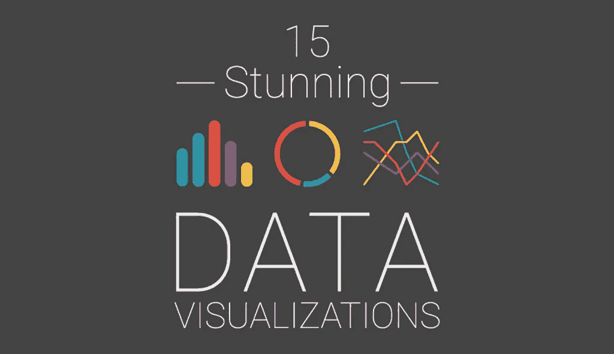

我们淹没在数据中。每天都有 [2.5 万亿字节的数据产生](http://www-01.ibm.com/software/data/bigdata/what-is-big-data.html)。这相当于全球 90%的信息——仅在过去两年中就产生了这些信息。这就是我们所说的“大数据”

但是它从哪里来呢？无处不在，从传感器和社交媒体网站到数字图像和视频。我们拥有的数据比我们知道的要多得多，所以现在是时候组织和理解这些数据了。

这就是数据可视化发挥作用的地方。在等待我们的地震式转变中，有些人称之为数据的[工业革命](http://www.popsci.com/best-data-visualizations?image=3)，我们必须更好、更有效地创建创新的数据可视化，使复杂的数据易于理解。

为了启发你自己的工作，我们汇编了 15 个数据可视化，它们不仅会让你大吃一惊，还会让你更清楚地了解什么是好的可视化，什么是坏的可视化。

# 1.它是互动的

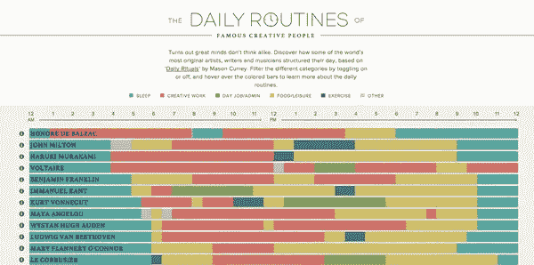

互动作品[著名创意人士的日常事务](https://podio.com/site/creative-routines)是数据可视化的一个完美例子，它结合了一个有效和引人入胜的作品的所有必要成分:它将大量数据结合到一个页面中；它用颜色来轻松区分趋势；它可以让浏览者对数据有一个整体的了解；它通过允许用户与作品互动来吸引用户；令人惊讶的是，它简单易懂，一目了然。

# 2.它揭示了趋势

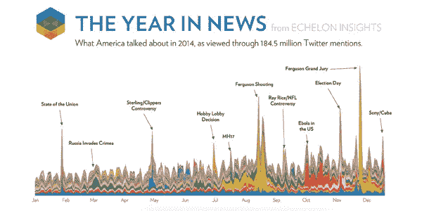

[一年新闻](http://echeloninsights.com/wp-content/uploads/2014/12/theyearinnews20141.png)是一个很好的例子，说明一个熟练执行的数据可视化可以揭示隐藏在数据山表面下的模式和趋势。通过分析 1.845 亿次 Twitter 提及，Echelon Insights 能够提供美国在 2014 年谈论什么的鸟瞰图。

# 3.它使用动画

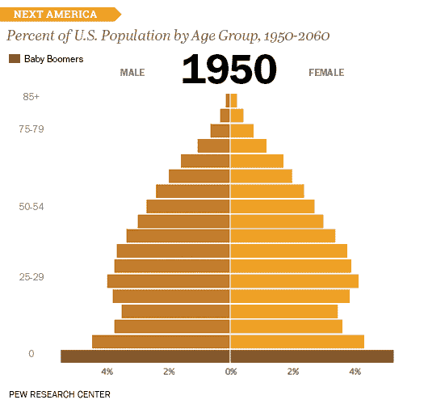

皮尤研究中心创建的美国年龄金字塔是一个值得注意的例子，说明了如何通过使用执行良好的动画来有效地传达随着时间的推移而发生的变化和趋势。这种类型的数据可视化不仅将大量信息打包到一个单一的视觉效果中——23 个条形图被合并到一个单一的 GIF 合成中——它还可以在社交媒体上轻松共享并嵌入到任何地方。

# 4.它使用真实的图像

如今有如此多的数据可视化，很难找到一个尚未被探索的独特角度。然而，设计师 Marion Luttenberger 创作的这组极富想象力的信息图却并非如此。

Luttenberger 使用现实生活中的图像作为他的信息图表的基础，能够为一个向奥地利吸毒者提供援助的组织起草一份完整的年度报告，并且仍然清晰有效地传达该组织的使命。

# 5.它使用隐喻

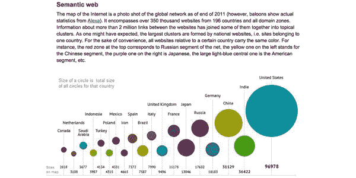

交流复杂思想的有效方法是使用符号和隐喻。举个例子，这个雄心勃勃的互联网数据可视化是由 Ruslan Enikeev 创建的。通过使用太阳系中行星的比喻，Enikeev 能够创建一个“互联网地图”，帮助用户可视化每个网站的相对范围和影响力。例如，网站流量由地图上圆圈的大小来表示。

# 6.它将数据放入上下文中

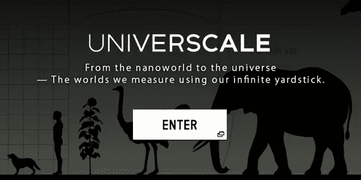

数据可视化的最大优势之一是，它们能够将孤立的信息片段放到更大的环境中，这是无与伦比的。尼康的这个富有洞察力的互动作品的目标是通过使用比较，给用户一种物体大小的感觉，无论是大的还是小的。例如，在银河系旁边，一个普通的物体，比如一个球或一辆车，似乎比我们想象的要小。

# 7.它节省你的时间

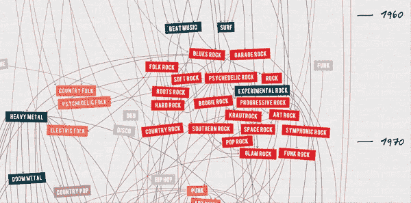

有效数据可视化的另一个标志是它能够总结大量信息，并在这个过程中节省您的时间和精力。举例来说，这种数据可视化在一页上代表了 100 年来岩石的演变。它不仅为您简化了信息——将一个世纪的信息浓缩到一段不到一分钟就可以观看的内容中——它还提供了从电子蓝调到黑暗金属等各种流派的实际音频样本。

# 8.它给你视角

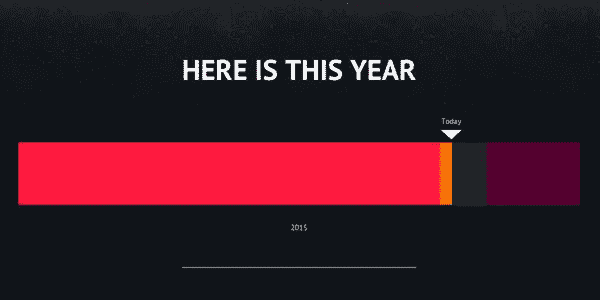

作为人类，我们不能不从自己的自我中心和完全独特的角度来看待宇宙和生命。然而，这种数据可视化通过将我们自己的生活——以及当天的事件——置于更大的时间背景中，从当年到当前的千年，为我们提供了一些视角。

# 9.它解释了一个过程

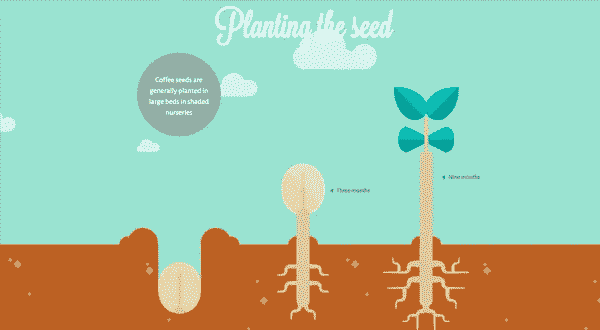

本着使复杂的事物易于理解的目标，这张信息图提供了一个咖啡豆从咖啡豆到杯子的旅程的视觉呈现。通过将这个过程分解成几个部分，这种数据可视化为读者提供了一点点易于消化的信息。

# 10.它激发了用户的想象力

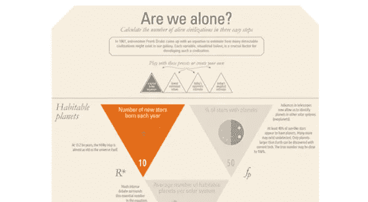

一个好的信息图不仅能消化复杂的数据，还能激发读者的想象力，让他们想象出不同的假设情况和可能性，就像这个例子一样。通过呈现一种互动的、类似游戏的体验，这张信息图迅速吸引了用户，让他们从头到尾都保持兴趣。

# 11.它漂亮地展示了数据

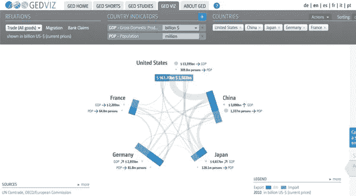

这张信息图采用密集的材料，如指标和数字，并以一种美丽、干净和吸引人的格式呈现出来。这种设计不仅看似简单实用，还为用户提供了许多与图形交互的选项，例如添加国家、指标和关系类型。

# 12.它讲述了一个故事

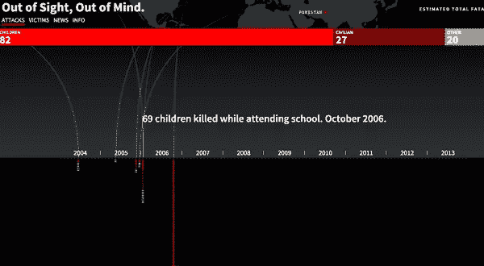

有效的数据可视化不仅能以令人信服的方式传达信息，还能讲述一个值得讲述的故事。例如，这篇文章讲述了巴基斯坦每一次已知的无人机袭击和受害者的故事。通过将信息提炼为易于理解的视觉格式，这张信息图戏剧性地揭示了不应被忽视的令人不安的事实。

# 13.它提供对原始数据的访问

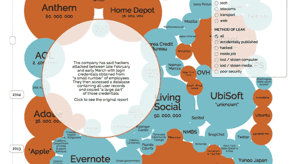

这种数据可视化不仅具有前面提到的所有特性，还允许用户直接访问所有原始数据(右下角的查看链接)。此外，通过使用根据数据泄露的大小而形成的气泡，查看者可以获得数据泄露“情况”的真实概览如果观众想深入了解信息的细节，他们也可以通过浏览不同的过滤器和原始数据来深入或浅显地了解信息。

# 14.它赋予用户权力

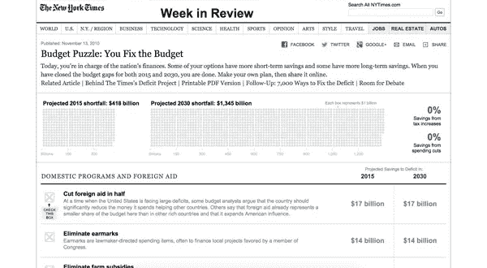

与信息访问民主化和赋予用户权力的全球趋势相一致，这种数据可视化出色地揭示了平衡国家预算的过程。通过将预算平衡交给日常用户，该项目利用集体思维的力量来解决大问题。

# 15.它是有教育意义的

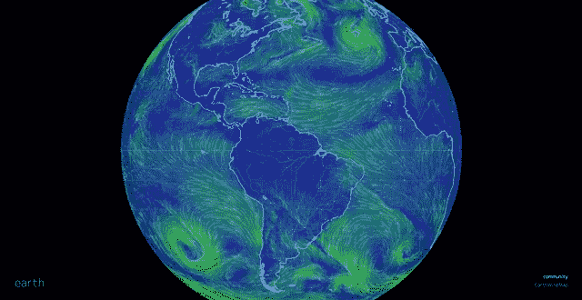

这一块超越了一个普通的数据可视化，成为一个教育和互动的微型网站。通过将足够的数据和信息组合到一个交互式应用程序中，这种数据可视化成为学生学习风、海洋和天气情况的有用课堂工具。

# 轮到你了

交互式数据可视化是独一无二的，因为它们吸引了五种感官中的几种:通过音频吸引了**听觉**，通过惊人的视觉吸引了**视觉**，通过点击、悬停和滚动内容的交互式体验吸引了**触觉**。

虽然您可能认为自己制作数据可视化过于昂贵和耗时，但是您可以探索一些免费的工具，这些工具允许非设计人员和非程序员创建他们自己的交互式内容。

例如，Visme 是一个在线工具，允许你创建交互式图表、图形和地图。这里可以免费试用[。](http://www.visme.co/)

如果你想获得更多成为更好的视觉传达者的提示和指导，别忘了订阅我们下面的每周时事通讯。

*本帖* [*原版*](http://blog.visme.co/examples-data-visualizations/) *最早出现在* [*Visme 的视觉学习中心*](http://blog.visme.co/) *。*