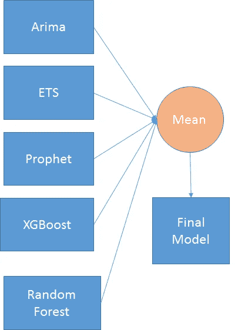

# 数据科学竞赛一等奖-企鹅的随机漫步

> 原文：<https://towardsdatascience.com/1st-prize-in-data-science-competition-random-walk-of-penguins-4e0dd0f688dc?source=collection_archive---------9----------------------->

在由 [DrivenData](https://www.drivendata.org/) 主办的数据科学竞赛[企鹅随机漫步](https://www.drivendata.org/competitions/47/penguins/)中荣获一等奖。在此分享制胜之道。

Penguins — Photo by [Loïc Mermilliod](https://unsplash.com/photos/3xI5eHi3QKo?utm_source=unsplash&utm_medium=referral&utm_content=creditCopyText) on [Unsplash](https://unsplash.com/search/photos/penguins?utm_source=unsplash&utm_medium=referral&utm_content=creditCopyText)

# 介绍

企鹅是世界上最有魅力的动物之一，已经抓住了新闻人物、科学家、电影制片人和普通大众的想象力。除了一般的内在价值，它们被认为是重要的生态系统指标。换句话说，监测这些美丽的物种可以告诉我们许多关于南极总体健康状况的信息，因为企鹅是重要的磷虾和鱼类捕食者，影响猎物数量和环境条件的变化(自然或人为)最终将通过分布或种群数量的变化来检测。

关于企鹅数量的数据是有限的，因为大多数被监测的群体都在永久性的研究站附近，而其他地点只是偶尔被调查。由于数据非常零散，时间序列相对较短，很难建立统计模型来解释过去的动态或提供可靠的未来预测。目标是创建更好的模型来估计南极难以到达的地点的数量，从而大大提高我们使用企鹅来监测南大洋健康状况的能力！

这个项目是由 **Oceanites 公司、Black Bawks 数据科学有限公司和石溪大学希瑟·林奇博士的实验室**合作完成的。由 **NASA 慷慨提供的奖品(奖项 NNX14AC32G)** 。

# 所提供数据的详细信息

从 1875 年**到 2013 年**在南极洲的 **548** 不同地点提供了三种企鹅的数据，即阿德利企鹅、帽带企鹅和巴布亚企鹅。总共有 648 种企鹅类型和地点的组合。数据中有许多缺失值。挑战在于从 2014 年到 2017 年增加企鹅数量。

# 模型概述

该解决方案分为两个主要部分

*   数据的插补
*   模型结构

## 数据的插补

在运行模型之前，对每个站点和企鹅类型组合进行了数据插补。插补按以下顺序进行

*   对于 R 模型是 Stine，对于 Python 模型是 Linear
*   最后一次观察仅在 R 车型中进行
*   在 R 和 Python 模型的情况下，下一个观察向后进行
*   在 R 模型和 Python 模型中替换为零

# 模型结构

Model Builder

为每个站点和企鹅类型组合建立 5 个模型。因此，对于站点和企鹅类型的 648 个组合中的每一个，构建了以下模型

*   Python 中的 XGBoost
*   Python 中的 RandomForest
*   R 中的 ARIMA
*   R 中的 ETS
*   先知在 R

每 648 个组合就产生一个所有这些模型的平均值。

感谢阅读。如果你仍然喜欢它，请访问[驱动数据博客](http://drivendata.co/blog/random-walk-of-the-penguins/)中一篇有趣的博文

*原载于*[*ambarishg . github . io*](https://ambarishg.github.io/portfolio/0_RandomWalkWithPenguins/)*。*