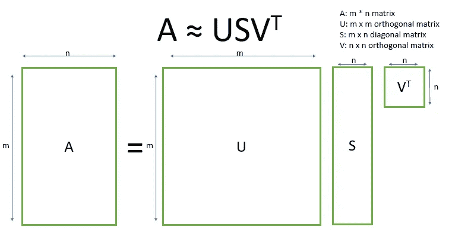
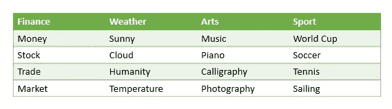
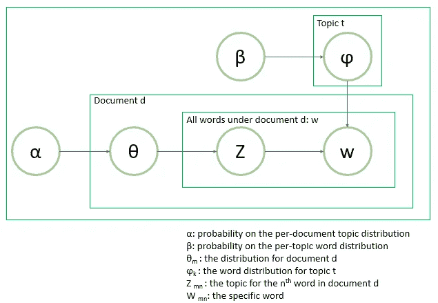

# 2 种潜在的降维和主题建模方法

> 原文：<https://towardsdatascience.com/2-latent-methods-for-dimension-reduction-and-topic-modeling-20ff6d7d547?source=collection_archive---------3----------------------->


Photo: [https://pixabay.com/en/golden-gate-bridge-women-back-1030999/](https://pixabay.com/en/golden-gate-bridge-women-back-1030999/)

在最先进的[单词嵌入](/3-silver-bullets-of-word-embedding-in-nlp-10fa8f50cc5a)技术之前，潜在语义分析(LSA)和潜在狄利克雷分配(LDA)区域是处理自然语言处理问题的好方法。LSA 和 LDA 都有相同的输入，即矩阵格式的**单词包**。LSA 专注于降低矩阵维数，而 LDA 解决**主题建模**问题。

我将不会讨论数学细节，因为这方面有很多很好的材料。你可以参考一下。为了便于理解，我没有做停用词去除等预处理。当你使用 LSA、LSI 和 LDA 时，这是很关键的部分。看完这篇文章，你会知道:

*   潜在语义分析(LSA)
*   潜在狄利克雷分配
*   拿走

# 潜在语义分析(LSA)

用于自然语言处理任务的 LSA 是由 Jerome Bellegarda 在 2005 年提出的。LSA 的目标是降低分类维数。这个想法是，如果单词有相似的意思，它们会出现在相似的文本中。在自然语言处理领域，我们通常使用潜在语义索引(LSI)作为替代名称。

首先，我们有 m 个文档和 n 个单词作为输入。当列和行分别是文档和单词时，可以构造 m * n 矩阵。您可以使用计数出现或 TF-IDF 分数。然而，在大多数情况下，TF-IDF 优于计数出现，因为高频率并不能说明更好的分类。


Photo: [http://mropengate.blogspot.com/2016/04/tf-idf-in-r-language.html](http://mropengate.blogspot.com/2016/04/tf-idf-in-r-language.html)

TF-IDF 的思想是高频可能不能提供太多的信息增益。换句话说，生僻字为模型贡献了更多的权重。如果在同一文档(即培训记录)中出现的次数增加，单词的重要性将增加。另一方面，如果它出现在语料库(即其他训练记录)中，则会减少。详情你可以查看这个[博客](/3-basic-approaches-in-bag-of-words-which-are-better-than-word-embeddings-c2cbc7398016)。

挑战在于矩阵非常稀疏(或高维)且有噪声(或包含大量低频词)。因此采用截断奇异值分解来降低维数。



奇异值分解的思想是寻找最有价值的信息，用低维 t 来表示同一事物。

```
tfidf_vec = TfidfVectorizer(use_idf=True, norm='l2')
svd = TruncatedSVD(n_components=dim)transformed_x_train = tfidf_vec.fit_transform(x_train)
transformed_x_test = tfidf_vec.transform(x_test)print('TF-IDF output shape:', transformed_x_train.shape)x_train_svd = svd.fit_transform(transformed_x_train)
x_test_svd = svd.transform(transformed_x_test)print('LSA output shape:', x_train_svd.shape)explained_variance = svd.explained_variance_ratio_.sum()
print("Sum of explained variance ratio: %d%%" % (int(explained_variance * 100)))
```

输出

```
TF-IDF output shape: (11314, 130107)
LSA output shape: (11314, 50)
Sum of explained variance ratio: 8%
```

我们可以看到维数从 130k 减少到 50。

```
from sklearn.linear_model import LogisticRegression
from sklearn.model_selection import cross_val_score, KFoldlr_model = LogisticRegression(solver='newton-cg',n_jobs=-1)
lr_model.fit(x_train_svd, y_train)cv = KFold(n_splits=5, shuffle=True)

scores = cross_val_score(lr_model, x_test_svd, y_test, cv=cv, scoring='accuracy')
print("Accuracy: %0.4f (+/- %0.4f)" % (scores.mean(), scores.std() * 2))
```

输出

```
Accuracy: 0.6511 (+/- 0.0201)
```

# 潜在狄利克雷分配

2003 年，大卫·布莱、吴恩达和迈克尔·乔丹推出了《LDA》。它是无监督学习，主题模型是典型的例子。假设每个文档混合了各种主题，每个主题混合了各种单词。



Various words under various topics

直观地说，您可以想象我们有两层聚合。第一层是类别分布。例如，我们有财经新闻、天气新闻和政治新闻。第二层是词在类别中的分布。例如，我们可以在天气新闻中找到“晴天”和“云”，而在财经新闻中则有“钱”和“股票”。

然而，“a”、“with”和“can”对主题建模问题没有贡献。这些单词存在于文档中，并且在类别之间具有大致相同的概率。因此，停用词的去除是获得更好结果的关键步骤。



对于特定的文档 d，我们得到主题分布θ。从这个分布(θ)中，题目 t 将被选择，并从ϕ.中选择相应单词

```
from sklearn.feature_extraction.text import CountVectorizer
from sklearn.decomposition import LatentDirichletAllocationdef build_lda(x_train, num_of_topic=10):
    vec = CountVectorizer()
    transformed_x_train = vec.fit_transform(x_train)
    feature_names = vec.get_feature_names()lda = LatentDirichletAllocation(
        n_components=num_of_topic, max_iter=5, 
        learning_method='online', random_state=0)
    lda.fit(transformed_x_train)return lda, vec, feature_namesdef display_word_distribution(model, feature_names, n_word):
    for topic_idx, topic in enumerate(model.components_):
        print("Topic %d:" % (topic_idx))
        words = []
        for i in topic.argsort()[:-n_word - 1:-1]:
            words.append(feature_names[i])
        print(words)lda_model, vec, feature_names = build_lda(x_train)
display_word_distribution(
    model=lda_model, feature_names=feature_names, 
    n_word=5)
```

输出

```
Topic 0:
['the', 'for', 'and', 'to', 'edu']
Topic 1:
['c_', 'w7', 'hz', 'mv', 'ck']
Topic 2:
['space', 'nasa', 'cmu', 'science', 'edu']
Topic 3:
['the', 'to', 'of', 'for', 'and']
Topic 4:
['the', 'to', 'of', 'and', 'in']
Topic 5:
['the', 'of', 'and', 'in', 'were']
Topic 6:
['edu', 'team', 'he', 'game', '10']
Topic 7:
['ax', 'max', 'g9v', 'b8f', 'a86']
Topic 8:
['db', 'bike', 'ac', 'image', 'dod']
Topic 9:
['nec', 'mil', 'navy', 'sg', 'behanna']
```

# 拿走

要访问所有代码，你可以访问我的 github repo。

*   两者都使用**词袋作为输入矩阵**
*   奇异值分解的挑战在于我们很难**确定最优维数**。一般来说，低维消耗较少的资源，但我们可能无法区分相反意义的词，而高维克服它，但消耗更多的资源。

# 关于我

我是湾区的数据科学家。专注于数据科学和人工智能领域的最新发展，尤其是 NLP 和平台相关领域。你可以通过 [Medium](http://medium.com/@makcedward/) 、 [LinkedIn](https://www.linkedin.com/in/edwardma1026) 或者 [Github](https://github.com/makcedward) 联系到我。

# 参考

[1] SVD 教程:[https://cs . fit . edu/~ dmitra/sci comp/Resources/singular-value-decomposition-fast-track-Tutorial . pdf](https://cs.fit.edu/~dmitra/SciComp/Resources/singular-value-decomposition-fast-track-tutorial.pdf)

[2]http://www1.se.cuhk.edu.hk/~seem5680/lecture/LSI-Eg.pdf CUHK LSI 教程:

[3]斯坦福 LSI 教程:[https://nlp.stanford.edu/IR-book/pdf/18lsi.pdf](https://nlp.stanford.edu/IR-book/pdf/18lsi.pdf)

[4]https://cs.stanford.edu/~ppasupat/a9online/1140.html 和 LSA 解释: