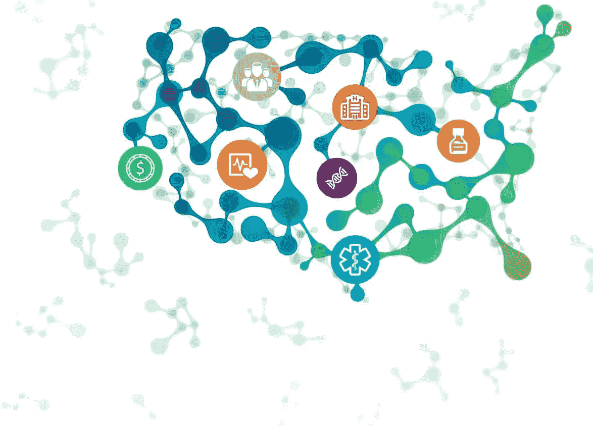

# 2018 年美国 20 所攻读数据科学硕士学位的大学(校内)

> 原文：<https://towardsdatascience.com/20-universities-for-pursuing-master-of-science-in-data-science-on-campus-in-the-usa-2018-9970d5d25bd5?source=collection_archive---------0----------------------->

Image source: FT US Healthcare & Life Sciences Summit

在过去的一年中，我一直在研究美国提供数据科学硕士(MS)或计算机科学硕士(MS)的数据科学专业的大学。

考虑到各种因素，如提供的课程，课程的持续时间，大学的位置，进行的研究和就业前景，我想出了最好的 20 所大学，以帮助您快速选择。这篇文章最适合没有或很少研究经验的人，他们希望在完成硕士学位后从事该行业。

如果你只是在寻找大学的名字，请随意跳到最后。

***注*** *:* *下面提到的大学排名不分先后。*

# 1.[卡内基梅隆大学](https://mcds.cs.cmu.edu/)

**姓名**:计算数据科学硕士
**课程时长** : 2 年
**地点**:宾夕法尼亚州匹兹堡
**核心课程:**机器学习、云计算、交互式数据科学、数据科学研讨会
**可用课程:**:系统、分析学、以人为中心的数据科学
**单元完成** : 144

虽然卡耐基梅隆大学的机器学习专业的 MS 很有竞争力，但是 MIIS 的项目也值得考虑。

# 2.[斯坦福大学](https://statistics.stanford.edu/academics/ms-statistics-data-science)

**姓名**:统计学硕士:数据科学
**课程时长** : 2 年
**地点**:加州斯坦福
**核心课程**:数值线性代数、离散数学与算法、最优化、工程中的随机方法*或*随机算法与概率分析、统计推断导论、回归模型与方差分析或统计建模导论、现代应用统计学:学习、现代应用统计学:数据挖掘

# 3.[佐治亚理工学院](https://www.analytics.gatech.edu/)

**姓名**:分析学理学硕士
**课程期限** : 1 年
**地点**:佐治亚州亚特兰大
**核心课程**:商业中的大数据分析，以及数据和可视化分析、
**可用课程**:分析工具、商业分析和计算数据分析
**学分** : 36

专攻机器学习的计算机科学硕士也是最好的项目之一。

# 4.[华盛顿大学](https://www.datasciencemasters.uw.edu/)

**姓名**:数据科学理学硕士
**课程时长** : 2 年
**地点**:华盛顿州西雅图
**核心课程**:统计学导论&概率、信息可视化、应用统计学&实验设计、数据科学的数据管理、数据科学家的统计机器学习、数据科学的软件设计、可扩展数据系统&算法、以人为中心的数据科学。
**学分** : 45

统计系提供收费的[理学硕士(MS)方向“统计学——高级方法和数据分析”](https://www.stat.washington.edu/academics/graduate/programs/fulltimemasters)也很神奇，值得一看。

# 5.[哥伦比亚大学](http://datascience.columbia.edu/master-of-science-in-data-science)

**姓名**:数据科学硕士
**课程时长** : 1.5 年
**地点**:纽约市纽约
**核心课程**:概率论、数据科学算法、统计推断与建模、数据科学计算机系统、数据科学机器学习、探索性数据分析与可视化
**学分** : 30

哥伦比亚大学的[计算机科学 MS 与机器学习赛道](http://www.cs.columbia.edu/education/ms/machinelearning/)对于学习和加深你对机器学习的理解也是很神奇的。

# 6.纽约大学

**姓名**:数据科学硕士
**课程时长** : 2 年
**地点**:纽约市纽约
**核心课程**:数据科学导论、数据科学的概率与统计、机器学习、大数据
**可用课程:**数据科学、数据科学大数据、数据科学数学与数据、数据科学自然语言处理、数据科学物理、数据科学生物学 **学分** 

# 7.[明尼苏达大学双城分校](https://datascience.umn.edu/)

**姓名**:数据科学硕士
**课程时长** : 2 年
**地点**:明尼苏达州明尼阿波利斯
**核心课程**:数据挖掘导论、数据库系统原理、应用回归分析、并行计算导论:架构、算法和编程、非线性优化导论、应用多元方法
**必修课程:**统计学、算法和基础设施

# 8.[西北大学](http://www.mccormick.northwestern.edu/analytics/)

**姓名**:分析学理学硕士
**课程期限** : 15 个月
**地点**:伊利诺伊州埃文斯顿
**核心课程**:统计学、机器学习、优化、数据库和数据管理方面的课程构成了 MSiA 固定课程的核心。

这个项目竞争非常激烈，因为招收的学生只有大约 35 名，来自不同的背景。

# 9.[北卡罗来纳州立大学](https://analytics.ncsu.edu/)

**姓名**:分析学理学硕士
**课程时长** : 10 个月
**地点**:北卡罗来纳州罗利
**课程**:固定课程，重点是分析工具和技术、分析基础、分析方法和应用 I 以及分析方法和应用 II

# 10.[康奈尔大学](https://stat.cornell.edu/academics/mps)

**姓名**:应用统计学专业研究硕士(MPS)
**课程时长** : 1 年
**地点**:纽约州伊萨卡
**核心课程**:带矩阵的线性模型、概率模型与推理、MPS 专业发展、应用统计学 MPS 数据分析项目
**可选项**:统计分析与数据科学
**学分** : 30

# 11.[德克萨斯大学奥斯汀分校](https://www.cs.utexas.edu/graduate-program/masters-program)

**姓名**:计算机科学硕士(申请方向)
**课程期限** : 2 年
**地点**:得克萨斯州奥斯汀
**核心课程**:由学生选择
**可提供的方向:**理论、系统、**申请
学分** : 30

# 12.[马萨诸塞大学阿姆赫斯特分校](http://ds.cs.umass.edu/masters-concentration-data-science)

**名称**:计算机科学硕士(数据科学专修)
**课程期限** : 2 年
**地点**:马萨诸塞州阿姆赫斯特
**核心课程**:从数据科学理论、数据系统和数据科学 AI 核心 **学分** : 30

# 13.[加州大学圣地亚哥分校](http://cse.ucsd.edu/graduate/degree-programs/ms-program)

**姓名**:计算机科学硕士(AI 深度)
**课程时长** : 2 年
**地点**:加州圣地亚哥
**深度地区:**人工智能。你可以选择像人工智能这样的课程:概率推理和学习，机器学习，神经网络，统计学习理论等等。
**学分**:根据硕士计划在论文和综合考试中选择而变化。

# 14.[宾夕法尼亚大学](https://dats.seas.upenn.edu/)

**姓名**:数据科学工程硕士
**课程时长** : 1.5 年
**地点**:宾夕法尼亚州费城
**核心课程**:概率介绍&统计学、编程语言&技术、数理统计、大数据分析与机器学习
**可提供的课程:**论文、以数据为中心的编程、统计学-数学基础、数据收集-表示-管理-检索、数据分析-人工智能

# 15.[南加州大学](https://www.cs.usc.edu/academic-programs/masters/)

**姓名**:计算机科学硕士(数据科学方向)
**课程时长** : 2 年
**地点**:美国加州洛杉矶
**核心课程**:人工智能的算法分析、数据库系统与基础
**可修课程:**数据系统与数据分析 **学分** : 32

# 16.[芝加哥大学](https://grahamschool.uchicago.edu/academic-programs/masters-degrees/analytics)

**姓名**:分析学理学硕士
**课程期限** : 1.5 年
**地点**:伊利诺伊州芝加哥
**核心课程**:统计分析、商业应用的线性和非线性模型、机器学习和预测分析、时间序列分析和预测、数据挖掘原理、大数据平台、用于分析的数据工程平台、领导技能:团队、战略和沟通 **要完成的课程** : 14

# 17.科罗拉多大学博尔德分校

**姓名**:计算机科学专业理学硕士
**课程时长** : 2 年
**地点**:科罗拉多州博尔德
**课程**:机器学习、神经网络与深度学习、自然语言处理、大数据、HCC 大数据计算以及更多
**可用曲目:**数据科学与工程 **学分**

# 18.[达拉斯德克萨斯大学](https://catalog.utdallas.edu/now/graduate/programs/ecs/computer-science#computer-science-ms)

**姓名**:计算机科学硕士(数据科学方向)
**课程时长** : 2 年
**地点**:得克萨斯州达拉斯
**课程**:机器学习、计算机算法设计与分析、大数据管理与分析、数据科学统计方法 **学分** : 27

# 19.[罗格斯大学](https://msds-cs.rutgers.edu/msds/frontpage)

**姓名**:数据科学硕士
**课程时长** : 2 年
**地点**:新泽西州新不伦瑞克
**核心课程**:概率统计、数据结构与算法、海量数据存储与检索工具、海量数据挖掘、数据交互与可视化分析 **学分** : 36

这是一个新项目，还没有毕业生。

# 20.[马里兰大学，学院公园](http://www.cs.umd.edu/)

**姓名**:计算机科学理学硕士
**课程时长** :
**地点**:马里兰州大学城
**数据科学选修课程:**计算机算法设计与分析 **学分** : 30

[数据科学研究生证书](https://oes.umd.edu/graduates-post-baccalaureates-professionals/professional-graduate-programs/data-science)如果你负担不起整整两年的硕士学习，也可以考虑。

总结一下，我把大学的名字列在下面-

1.  MCDS 卡耐基梅隆大学
2.  斯坦福大学—统计学(数据科学)硕士
3.  佐治亚理工学院-分析学硕士
4.  华盛顿大学—数据科学硕士
5.  哥伦比亚大学—数据科学硕士
6.  纽约大学—数据科学硕士
7.  明尼苏达大学双城分校——数据科学硕士
8.  西北大学-分析学硕士
9.  北卡罗来纳州立大学-分析学硕士
10.  康奈尔大学-应用统计学硕士
11.  德克萨斯大学奥斯汀分校—计算机科学硕士(应用方向)
12.  马萨诸塞大学阿姆赫斯特分校—计算机科学硕士(数据科学专业)
13.  加州大学圣地亚哥分校—计算机科学硕士(人工智能深度)
14.  宾夕法尼亚大学-数据科学硕士
15.  南加州大学—计算机科学硕士(数据科学方向)
16.  芝加哥大学-分析学硕士
17.  科罗拉多大学博尔德分校——计算机科学专业硕士
18.  德克萨斯大学达拉斯分校—计算机科学硕士(数据科学方向)
19.  罗格斯大学—数据科学硕士
20.  马里兰大学帕克学院-计算机科学硕士

请在评论中随意提及你认为应该进入追求数据科学前 20 名的大学。

附:我不再关注这篇文章，因为我已经有一段时间没有研究大学了。感谢您抽出时间阅读。万事如意！