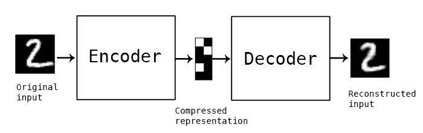
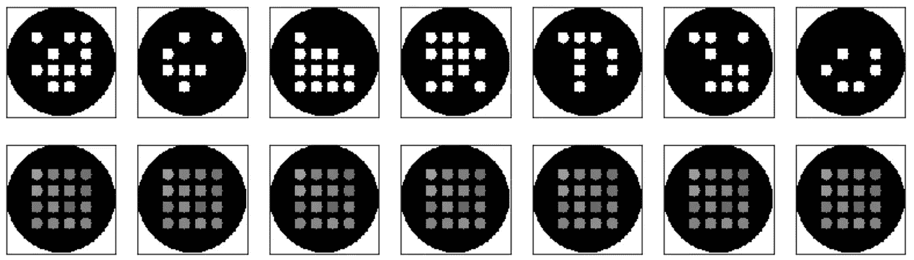
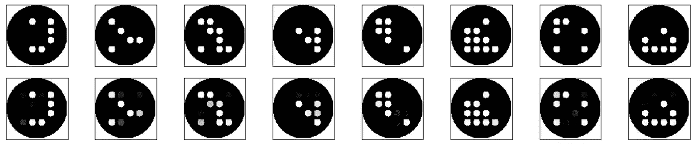
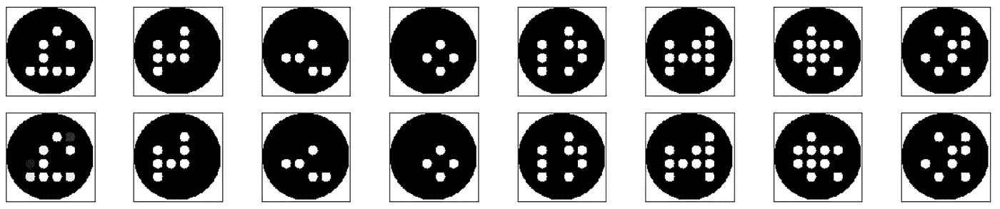

# 25 盏灯

> 原文：<https://towardsdatascience.com/25-lights-c4cc2c3f1832?source=collection_archive---------12----------------------->

## 第一部分:问题介绍和简单解决方案

第二部分:[使用真实世界的数据](/25-lights-part-ii-e021b66e449b)

现在是进入机器学习的绝佳时机。有一些工具和资源可以帮助任何拥有一些编码技能和需要解决的问题的人去做有趣的工作。我一直在关注针对程序员的 [**实用深度学习**](http://course.fast.ai) 和大卫·西尔维的[**强化学习课程**](https://www.youtube.com/watch?v=2pWv7GOvuf0)**[**没有博士学位的机器学习**](https://www.youtube.com/watch?v=vq2nnJ4g6N0&t=2s) 是对深度学习技术的极好介绍。这些，连同所有链接自《黑客新闻》的论文和 [**两分钟论文**](https://www.youtube.com/user/keeroyz) 都激励我尝试一些想法。**

**我过去曾做过物联网设备的设置过程，通过 BTLE 从 iPhone 连接到它。依赖单一通道进行设置的漏洞之一是[中间人攻击](https://en.wikipedia.org/wiki/Man-in-the-middle_attack)。击败 MitM 的一种方法是对交换的公钥使用带外认证。这可以通过在设备的发光二极管上编码一个随机的位模式，并从手机的摄像头中读取它们来实现。这将是 Apple Watch 设置协议的一个不太复杂的版本，但仍然非常有效。**

**我正在考虑的设备在前面有一个 5x5 的灯阵列。2 ⁵可以编码 33，554，432 种可能性，非常适合密钥交换验证。现在的挑战是找到一种从图像中自动提取位模式的方法。**

**首先，我尝试改编了 Fast.ai MOOC 早期使用的 VGG16 net。我尝试了几轮培训，并应用标准建议来微调网络。这未能产生有意义的结果。VGG16 和像它一样的深网在识别单一类别方面很棒，但我不确定它是否能跟踪 25 盏灯。在第二部分中，我展示了类似 VGG16 的网络是如何工作的。休息之后，思考和阅读其他项目和[技术](https://arxiv.org/pdf/1412.6622.pdf)，我遇到了[自动编码器](https://en.wikipedia.org/wiki/Autoencoder)。自动编码器是一种神经网络，它将输入编码成较小的向量，然后将该向量解码回原始大小。损失函数用于比较输入和输出之间的差异。然后，可以训练自动编码器来最小化损失。**

****

**Autoencoder diagram from the Keras blog**

**自动编码器不是最复杂的技术，但最好从简单的解决方案开始。 [**在 Keras 中构建 auto encoders**](https://blog.keras.io/building-autoencoders-in-keras.html)**是一个很好的介绍，我在这里的探索紧随那个帖子。****

# ****图象生成****

****为了训练自动编码器，我们需要一些图像。下面是绘制我们想要识别的图像的 Python 代码。幸运的是，我们可以很容易地生成训练所需的图像。真实世界的图像将很难获得这里所需要的数量。****

# ****简单自动编码器****

****现在我们有了图像生成器，我们可以制作一个非常简单的自动编码器。这几乎与 Keras 博客中的第一个自动编码器[相同。](https://blog.keras.io/building-autoencoders-in-keras.html)****

****在批量大小为 128 的 500 次迭代之后，我们得到 0.1012 的损失。这大约是 autoencoder 博客中第一次尝试的损失水平。这是我们看到的。输入图像在顶部，解码在底部。****

********

****这看起来没有我希望的那么好，但是请注意点颜色的细微变化。再给它几千次迭代吧。****

****5000 次迭代得到 0.0031 的损失。****

********

****这还差不多。现在又多了 5000，应该不错。****

****迭代 10000 次后，损耗为 0.000288。****

********

****它看起来不错，但这种简单的网络经不起真实世界的输入。看看我的下一篇文章，我将展示如何识别照片中的点图案。然后如何用 CoreML 在 iPhone 上运行网络。****

## ****第二部分:[使用真实世界的数据](/25-lights-part-ii-e021b66e449b)****