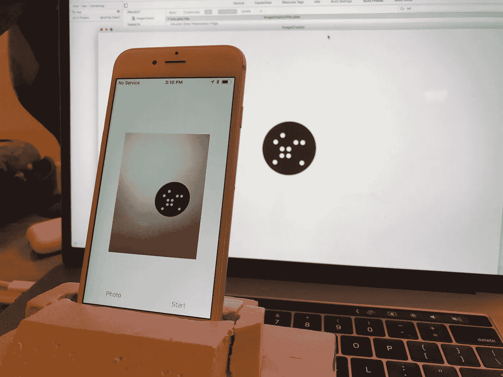
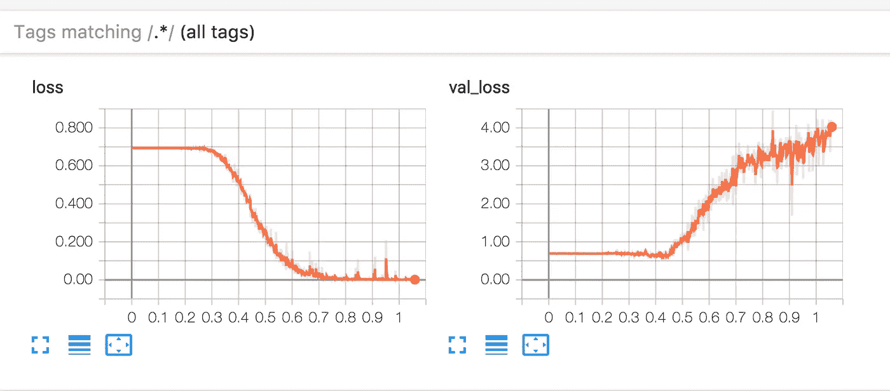
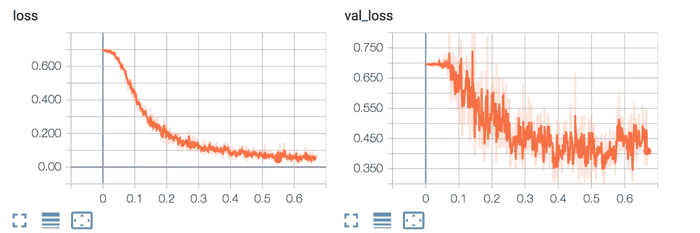
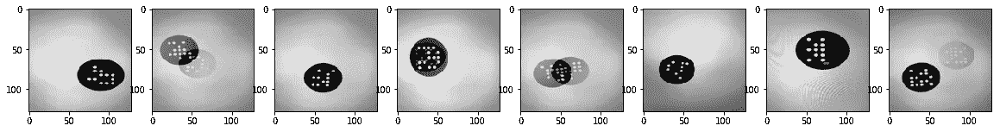
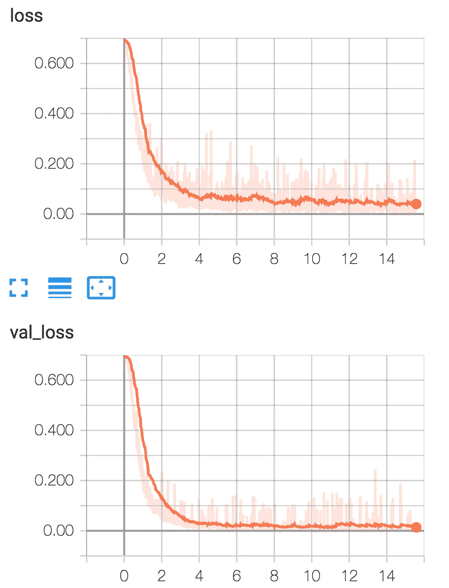

# 25 盏灯

> 原文：<https://towardsdatascience.com/25-lights-part-ii-e021b66e449b?source=collection_archive---------5----------------------->

## 第二部分:使用真实世界的数据

在第[部分](/25-lights-c4cc2c3f1832) I 中，我展示了一个简单的全连接自动编码器，可以用随机位模式再现图像。autoencoder 是一个很好的选择，可以用来说明网络训练时发生了什么，并表明它在理论上是可行的。然而，一个简单的全连接网络在现实生活中是行不通的。这是因为将图像展平成一维会丢失很多空间信息。此外，一个单独的隐藏层并不能处理真实照片在大小、位置、旋转、模糊等方面的所有变化。

## **处理照片**

我的目标是构建一个演示 iPhone 应用程序，它可以拍摄模式的照片，并显示检测到的位模式。这意味着训练集将不得不使用照片，而不是纯粹的计算机生成的图像。处理真实世界的照片需要比第一篇文章更复杂的方法。幸运的是，在图像识别方面有大量的研究可以借鉴。 [ImageNet](http://www.image-net.org/challenges/LSVRC/) 竞赛的获胜者发布他们的结果，复制获胜的网络是一个很好的开始。一个用于迁移学习的流行网络是 VGG-16。在我们设计中，我们可以大量借鉴网络。VGG-16 是一个深度卷积网络(DCNN)。如果你对 CNN 不熟悉，我发现这个[视频](https://www.youtube.com/watch?v=FmpDIaiMIeA)是一个极好的教程。简短的解释是，CNN 使用一堆卷积滤波器，这些滤波器擅长提取空间信息和空间关系。

下面是我用过的网络。它不同于 VGG，因为它使用平均池代替最大池，具有更少的层和不同的损失函数。

对于笔记本的其余部分，请查看[完整的 jupyter 笔记本和支持工具](https://github.com/briandw/25Lights)。我已经包括了 macOS 图像服务器、iOS 图像记录器和最终的 iOS 识别应用程序。

## 创建培训和验证集

现在我们已经建立了我们的网络，我们需要更好的数据来训练。在我们的第一个例子中，我们使用了按需绘制的简单图像。这些照片太干净了，没有一张真正的照片会有的任何不规则性。由于所需的数量，使用真实照片是一个挑战。我最初尝试使用纯合成图像，但未能通过真实照片验证。然后，我创建了一个大约 15k 照片的训练集。这些照片是由一部指向电脑屏幕的 iPhone 拍摄的。手机通过本地网络连接检索位模式，然后将图片保存到磁盘。直到大约 90k 的图像被包含在训练集中，我才能够得到好的结果。为了提高训练的质量，对图像应用了随机仿射变换。应用此变换可以移动、缩放和倾斜图像。



iOS app capturing images from the screen

收集完图像后，我保留了其中的 10%作为验证集。一个好的验证集将使你知道训练进展如何，以及要达到你的目标还需要哪些额外的步骤。fast.ai 的 Rachel Thomas 有一篇关于这个话题的优秀文章。

## 过度拟合



This is what overfitting looks like

我第一次尝试使用一个类似 VGG 的网络，并没有包括任何正规化。这显然是个错误。上图是过度拟合的经典案例。左边的**损失**图显示了网络在训练数据上的表现。右边的 **val_loss** 显示了网络如何处理验证集。我喜欢认为神经网络是懒惰的骗子，它们会利用任何优势来获得正确的答案。一个大的网络和一个小的训练集必然会导致过度拟合。最初的训练集是 10k 张图像。在这种尺寸下，网络更容易“记住”每张图像的值，而不是学会以概括的方式看到这些点。

## 如何避免过度拟合



The same data as above, but with batch normalization and dropout

避免过度拟合的一些技巧是:

*   更大的训练集(更大的训练集、数据论证、更多样的输入源)
*   正规化(批量正规化，退出)
*   改变网络拓扑(使网络变小)

增加漏失和批量归一化非常有效地防止了第一张图中看到的失控过拟合。然而，数据集仍然太小，无法在验证集上获得好的结果。早期训练仅导致 0.4 的验证损失和 0.1 以下的训练损失。这个差异被称为[差异](https://en.wikipedia.org/wiki/Bias–variance_tradeoff)。要获得好的结果，需要低于 0.02 的验证损失。当使用更大、更多样的训练集时，可以获得更好的结果。


Final training run

## 调试网络

一旦训练达到一个合理的表现水平，检查网络出错的情况是一个好主意。对这些情况进行简单的目视检查通常就足够了。

第一件事是计算有多少图像有一个或多个不正确的位。大约 92%的图像是完全正确的。那么剩下的 8%是怎么回事呢？以下是一些错过的图片:



有一堆重影和模糊的照片，合理的东西要错过。我回去删除了所有有重影或其他主要问题的照片，然后从头开始重新运行培训。结果如下:



Final loss of 0.04 and validation loss of 0.02

最终错误率为 97%。如果有必要接近 100%,就需要更多种类的图像，集中在当前网络做得不好的情况下。

## iPhone 实现和 CoreML

我打算写第三篇关于用训练好的模型制作一个 iOS 应用的文章。然而，它真的很简单，不值得一提。

一旦你训练好你的模型，安装 [CoreML 工具](https://pypi.python.org/pypi/coremltools)。你需要有一个 Python 2.7 环境，因为 CoreML 不支持 Python 3。然后在您的笔记本中创建一个新的单元格，并运行以下命令。

```
import coremltoolscoreml_model = coremltools.converters.keras.convert(model)
coreml_model.save(“Lights.mlmodel”)
```

一旦您导出了您的模型，创建一个新的项目并导入它。唯一棘手的部分是将图像转换成 CoreML 模型的输入。

要将图像转换为 CoreML:

1.  按照我们的模型输入的形状制作一个多层阵列。在这种情况下是 1×128×128，32 位浮点。
2.  将图像渲染到 8 位灰度绘图环境中。
3.  提取字节并将其转换为浮点数，然后将其写入数组。
4.  为模型创建一个输入对象，并从 MLModels predictionFromFeatures 方法获取预测。

更多细节请看一下 [iOS CoreML 代码](https://gist.github.com/briandw/3662437e975ace767caa9ef27d9d6712)。

关于如何使用 CoreML 模型的完整教程，请查看 [CoreML 和视觉机器学习](https://www.raywenderlich.com/164213/coreml-and-vision-machine-learning-in-ios-11-tutorial)。

## 结论

用错误的方法解决这个问题太麻烦了！有很多图像识别系统的例子可以在不使用深度卷积网络的情况下完成这种任务。传统的 CV 技术可以用更小的二进制数更快地解决这个问题。然而，这是一个非常有趣的学习练习，帮助我找到了如何解决新的 ML 任务带来的问题。

当我把这个问题作为一个 ML 训练练习来考虑时，我不确定它是否可行。我遇到的所有例子都是分类任务，比如 ImageNet。这些分类任务有一个最终的热门矢量输出，并使用了损失函数，如分类交叉熵。在对其他网络做了更多的阅读并对损失函数有了更好的理解后，我意识到像二进制交叉熵这样的东西应该是可行的。事后看来，我应该[更早](http://yeephycho.github.io/2017/09/16/Loss-Functions-In-Deep-Learning/)开始详细阅读损失函数。

所需的训练数据的大小和呼吸也有点令人兴奋。与其他训练集相比，超过 85，000 个示例并不算大，但仍然非常大。用[胶囊网络](https://medium.com/ai%C2%B3-theory-practice-business/understanding-hintons-capsule-networks-part-i-intuition-b4b559d1159b)再试一次会很有趣。胶囊网络应该具有更好的相对位置感，并且需要更少的例子。

把我学会使用的所有技术放在一起，看着它们工作是非常令人满意的。[吴恩达的](http://www.andrewng.org/)和[杰瑞米·霍华德的](http://course.fast.ai/)视频课程是很好的向导。在大多数 ML 课程材料中，有大量的时间花在正则化和管理你的训练数据和验证集上。我希望我已经证明了这是有充分理由的。感谢您阅读我的项目。我很想在下面的评论中听到关于这篇文章的任何评论或建议。