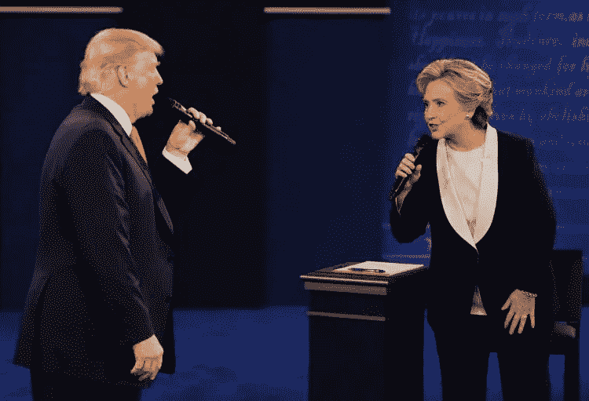
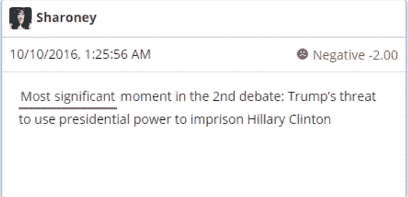
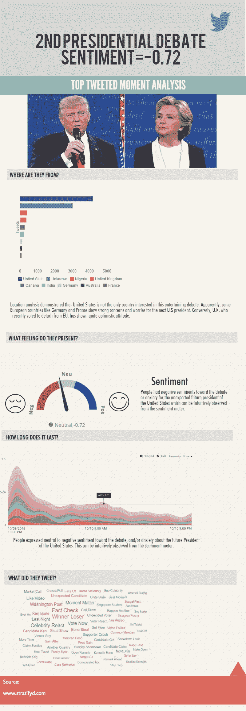

# 第二场总统辩论——热门推文时刻分析

> 原文：<https://towardsdatascience.com/2nd-presidential-debate-top-twitted-moment-analysis-4a19c52a1d1f?source=collection_archive---------0----------------------->

## **情绪** =-0.72:

毫不奇怪，观众对第二次总统辩论持中立或消极态度，并且/或者对未来的美国总统感到焦虑。这一点可以从情绪量表上直观的观察到，略负的分数。

**地理反应:**

地理位置分析表明，美国并不是唯一对这场引起争论感兴趣的国家。显然，德国和法国等一些欧洲国家对下一任美国总统表现出强烈的担忧和担心。相反，最近投票脱离欧盟的英国表现出相当乐观的态度。

有人怀疑俄罗斯试图影响美国大选(来源:[https://www . the guardian . com/us-news/2016/sep/05/Russia-influence-us-president-election-investigation](https://www.theguardian.com/us-news/2016/sep/05/russia-influence-us-presidential-election-investigation))一些未知地点的推文会不会来自俄罗斯？

## “真正的赢家”:

Ken Bone

在唐纳德·特朗普和希拉里·克林顿的第二次总统辩论中，肯·伯恩的红色开衫、白色领带和黑框眼镜无疑吸引了更多的眼球。大多数观众欣赏他在全国舞台上的首次亮相。他成了网络红人，给辩论的基调带来了感染力。伯恩先生为让美国再次伟大做出了自己的主张！

Ken Bone’s Cardigan

Ken Bone 的羊毛衫可能是今年最受欢迎的万圣节服装或圣诞礼物之一。 [GQ 在这里展示了你可以在哪里买到它](http://www.gq.com/story/we-found-ken-bone-red-debate-sweater)。

在 Stratifyd [Signals 平台](http://stratifyd.com)中，分析来自社交媒体渠道的情绪很容易。Twitter、脸书、YouTube 和 Yelp 的内置数据连接器可以快速导入数据。Signals 通过机器学习处理数据，提取出最重要的主题和趋势，并在易于使用的可视化界面中呈现出来。

尝试我们的一个自助服务用户帐户，了解可视化分析有多简单。这里是应用商店中 Priceline 应用的[视觉分析的链接。App Store 和 Google Play 只是 Signals 中许多预建数据连接器中的两个。也可以上传自己的数据。](https://signals.stratifyd.com/explorer.html?d=57c4af8576eabf0700bd387a&jq=%5B%5D&t=8iCRUyVb1%2FKBFinpsnMObfA270mIY8yuUG9%2B6TKBdyITRNQQ)

获得您的试用帐户，看看用户说什么。与我们聊天，或发送电子邮件到 clientsupport@stratifyd.com。

www。stratifyd.com