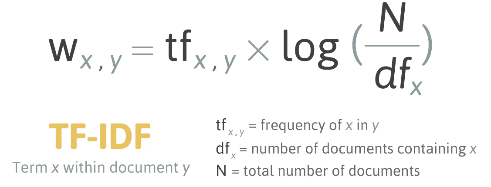

# 比单词嵌入更好的单词袋中的 3 种基本方法

> 原文：<https://towardsdatascience.com/3-basic-approaches-in-bag-of-words-which-are-better-than-word-embeddings-c2cbc7398016?source=collection_archive---------2----------------------->


Photo: [https://pixabay.com/en/hong-kong-china-city-chinese-asian-383963/](https://pixabay.com/en/hong-kong-china-city-chinese-asian-383963/)

如今，每个人都在谈论单词(或字符、句子、文档)嵌入。单词袋还值得用吗？我们应该在任何场景中应用嵌入吗？

看完这篇文章，你会知道:

*   为什么人们说单词嵌入是灵丹妙药？
*   什么时候单词袋会战胜单词嵌入？
*   词汇袋中的 3 种基本方法
*   我们如何用几行文字构建单词包？

# 为什么有人说嵌入这个词是灵丹妙药？


Photo: [https://pixabay.com/en/books-stack-book-store-1163695/](https://pixabay.com/en/books-stack-book-store-1163695/)

在自然语言处理领域，嵌入是解决文本相关问题的成功方法，其性能优于单词袋(BoW)。事实上，BoW 引入了诸如大特征维数、稀疏表示等限制。关于文字嵌入，你可以看看我之前的[帖子](/3-silver-bullets-of-word-embedding-in-nlp-10fa8f50cc5a)。

我们还应该用弓吗？在某些情况下，我们可以更好地使用 BoW

# 什么时候单词袋会战胜单词嵌入？


Photo: [https://www.ebay.co.uk/itm/Custom-Tote-Bag-Friday-My-Second-Favorite-F-Word-Gift-For-Her-Gift-For-Him-/122974487851](https://www.ebay.co.uk/itm/Custom-Tote-Bag-Friday-My-Second-Favorite-F-Word-Gift-For-Her-Gift-For-Him-/122974487851)

在以下情况下，您仍然可以考虑使用 BoW 而不是 Word 嵌入:

1.  构建基线模型。通过使用 scikit-learn，只需要几行代码就可以构建模型。以后，可以用深度学习来咬它。
2.  如果您的数据集很小，并且上下文是特定于领域的，BoW 可能比单词嵌入更好。上下文是非常领域特定的，这意味着你不能从预先训练的单词嵌入模型(GloVe，fastText 等)中找到相应的向量。

# 我们如何用几行文字构建单词包？

使用传统的强大的 ML 库，有 3 种简单的方法来构建 BoW 模型。

***统计出现次数***


Photo: [https://pixabay.com/en/home-money-euro-calculator-finance-366927/](https://pixabay.com/en/home-money-euro-calculator-finance-366927/)

统计单词出现次数。使用这种方法的原因是关键字或重要信号会反复出现。所以如果出现的次数代表单词的重要性。更多的频率意味着更多的重要性。

```
doc = "In the-state-of-art of the NLP field, Embedding is the \
success way to resolve text related problem and outperform \
Bag of Words ( BoW ). Indeed, BoW introduced limitations \
large feature dimension, sparse representation etc."count_vec = CountVectorizer()
count_occurs = count_vec.fit_transform([doc])
count_occur_df = pd.DataFrame(
    (count, word) for word, count in
     zip(count_occurs.toarray().tolist()[0], 
    count_vec.get_feature_names()))
count_occur_df.columns = ['Word', 'Count']
count_occur_df.sort_values('Count', ascending=False, inplace=True)
count_occur_df.head()
```

输出

```
Word: "of", Occurrence: 3
Word: "bow", Occurrence: 2
Word: "way", Occurrence: 1
```

***归一化计数出现次数***

如果你认为极高的频率可能会主导结果并造成模型偏差。标准化可以容易地应用于流水线。

```
doc = "In the-state-of-art of the NLP field, Embedding is the \
success way to resolve text related problem and outperform \
Bag of Words ( BoW ). Indeed, BoW introduced limitations \
large feature dimension, sparse representation etc."norm_count_vec = TfidfVectorizer(use_idf=False, norm='l2')
norm_count_occurs = norm_count_vec.fit_transform([doc])
norm_count_occur_df = pd.DataFrame(
    (count, word) for word, count in zip(
    norm_count_occurs.toarray().tolist()[0], 
    norm_count_vec.get_feature_names()))
norm_count_occur_df.columns = ['Word', 'Count']
norm_count_occur_df.sort_values(
    'Count', ascending=False, inplace=True)
norm_count_occur_df.head()
```

输出

```
Word: "of", Occurrence: 0.4286
Word: "bow", Occurrence: 0.4286
Word: "way", Occurrence: 0.1429
```

***术语频率-逆文档频率(TF-IDF)***



Photo: [http://mropengate.blogspot.com/2016/04/tf-idf-in-r-language.html](http://mropengate.blogspot.com/2016/04/tf-idf-in-r-language.html)

TF-IDF 采用了另一种方法，这种方法认为高频可能不能提供太多信息增益。换句话说，生僻字为模型贡献了更多的权重。

如果在同一文档(即培训记录)中出现的次数增加，单词的重要性将增加。另一方面，如果它出现在语料库(即其他训练记录)中，则会减少。

```
doc = "In the-state-of-art of the NLP field, Embedding is the \
success way to resolve text related problem and outperform \
Bag of Words ( BoW ). Indeed, BoW introduced limitations \
large feature dimension, sparse representation etc."tfidf_vec = TfidfVectorizer()
tfidf_count_occurs = tfidf_vec.fit_transform([doc])
tfidf_count_occur_df = pd.DataFrame(
    (count, word) for word, count in zip(
    tfidf_count_occurs.toarray().tolist()[0],   
    tfidf_vec.get_feature_names()))
tfidf_count_occur_df.columns = ['Word', 'Count']
tfidf_count_occur_df.sort_values('Count', ascending=False, inplace=True)
tfidf_count_occur_df.head()
```

输出(该值与标准化计数发生次数完全相同，因为演示代码只包含一个文档)

```
Word: "of", Occurrence: 0.4286
Word: "bow", Occurrence: 0.4286
Word: "way", Occurrence: 0.1429
```

# 密码

此示例代码将在计数发生、标准化计数发生和 TF-IDF 之间进行比较。

使用不同的矢量化方法获取模型的样本函数

```
def build_model(mode):
    # Intent to use default paramaters for show case
    vect = None
    if mode == 'count':
        vect = CountVectorizer()
    elif mode == 'tf':
        vect = TfidfVectorizer(use_idf=False, norm='l2')
    elif mode == 'tfidf':
        vect = TfidfVectorizer()
    else:
        raise ValueError('Mode should be either count or tfidf')

    return Pipeline([
        ('vect', vect),
        ('clf' , LogisticRegression(solver='newton-cg',n_jobs=-1))
    ])
```

使用另一个示例函数来构建两端管道

```
def pipeline(df, mode):
    x = preprocess_x(df)
    y = preprocess_y(df)

    model_pipeline = build_model(mode)
    cv = KFold(n_splits=10, shuffle=True)

    scores = cross_val_score(
        model_pipeline, x, y, cv=cv, scoring='accuracy')
    print("Accuracy: %0.4f (+/- %0.4f)" % (
        scores.mean(), scores.std() * 2))

    return model_pipeline
```

让我们检查一下需要处理的词汇数量

```
x = preprocess_x(x_train)
y = y_train

model_pipeline = build_model(mode='count')
model_pipeline.fit(x, y)print('Number of Vocabulary: %d'% (len(model_pipeline.named_steps['vect'].get_feature_names())))
```

输出

```
Number of Vocabulary: 130107
```

通过传递“计数”(计数发生)、“tf”(正常计数发生)和“tfi df”(TF-IDF)来调用管道

```
print('Using Count Vectorizer------')
model_pipeline = pipeline(x_test, y_test, mode='count')print('Using TF Vectorizer------')
model_pipeline = pipeline(x_test, y_test, mode='tf')print('Using TF-IDF Vectorizer------')
model_pipeline = pipeline(x_test, y_test, mode='tfidf')
```

结果是

```
Using Count Vectorizer------
Accuracy: 0.8892 (+/- 0.0198)
Using TF Vectorizer------
Accuracy: 0.8071 (+/- 0.0110)
Using TF-IDF Vectorizer------
Accuracy: 0.8917 (+/- 0.0072)
```

# 结论

你可以从 [github](https://github.com/makcedward/nlp/blob/master/sample/nlp-bag_of_words.ipynb) 中找到所有代码。

根据以前的经验，我试图通过给出一个简短的描述来解决产品分类的问题。例如，给定“新鲜苹果”，预期类别是“水果”。仅仅通过使用计数发生方法已经能够有 80+的精确度**。**

在这种情况下，由于每个训练记录的字数只有几个字(从 2 个字到 10 个字)。使用单词嵌入可能不是一个好主意，因为没有**的邻居**(单词)来训练向量。

另一方面，scikit-learn 提供了其他参数来进一步调整模型输入。您可能需要了解以下特性

*   ngram_range:除了使用单个单词，还可以定义 ngram
*   二进制:除了计算出现次数，还可以选择二进制表示。
*   max_features:可以选择最大字数来减少模型的复杂性和大小，而不是使用所有的单词。

此外，一些预处理步骤可以在上述库中执行，而不是自己处理。例如，停用字词删除、小写字母等。为了有更好的灵活性，我将使用我自己的代码来完成预处理步骤。

# 关于我

我是湾区的数据科学家。专注于数据科学、人工智能，尤其是 NLP 和平台相关领域的最新发展。你可以通过[媒体博客](http://medium.com/@makcedward/)、 [LinkedIn](https://www.linkedin.com/in/edwardma1026) 或 [Github](https://github.com/makcedward) 联系我。