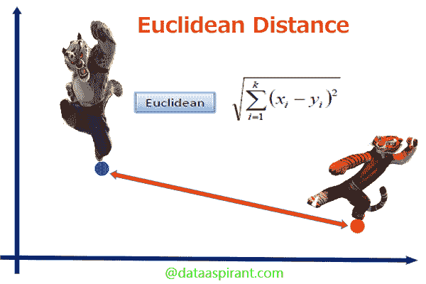
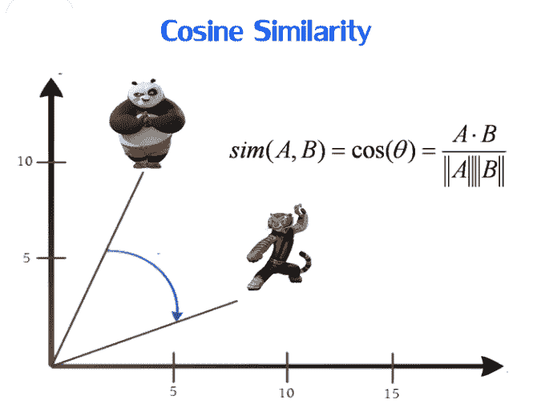
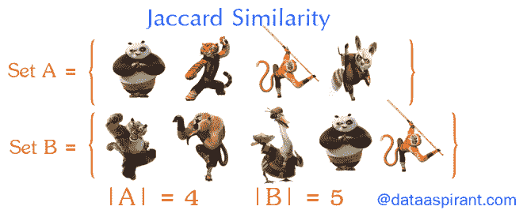

# 3 文本挖掘中的基本距离度量

> 原文：<https://towardsdatascience.com/3-basic-distance-measurement-in-text-mining-5852becff1d7?source=collection_archive---------2----------------------->


Photo Credit: [https://pixabay.com/en/hong-kong-night-light-rail-city-2288999/](https://pixabay.com/en/hong-kong-night-light-rail-city-2288999/)

在自然语言处理中，我们还想发现句子或文档之间的相似性。文本不像数字和坐标那样，我们不能比较“苹果”和“桔子”之间的不同，但是可以计算相似性得分。

# 为什么？

因为我们不能简单地在“苹果是水果”和“橘子是水果”之间做减法，所以我们必须找到一种方法将文本转换成数字来计算它。有了分数，我们就能明白两个物体之间有多么相似。

# 什么时候？

在我的数据科学工作中，我尝试:

*   比较两篇文章是否描述相同新闻
*   识别相似文档
*   通过给出产品描述来分类

# 怎么会？

在本文中，我们将介绍 4 种基本的距离测量方法:

*   欧几里得距离
*   余弦距离
*   雅克卡相似性

在进行任何距离测量之前，必须对文本进行标记。如果你不熟悉分词，你可以访问这篇文章。

***欧氏距离***



Photo Credit: [http://dataaspirant.com/2015/04/11/five-most-popular-similarity-measures-implementation-in-python/](http://dataaspirant.com/2015/04/11/five-most-popular-similarity-measures-implementation-in-python/)

比较两个物体之间的最短距离。它使用从中学学到的勾股定理。

分数是指两个物体之间的距离。如果为 0，则表示两个对象是相同的。以下示例显示了比较第一个句子时的得分。

```
print('Master Sentence: %s' % news_headlines[0])
for i, news_headline in enumerate(news_headlines):
    score = sklearn.metrics.pairwise.euclidean_distances([transformed_results[i]], [transformed_results[0]])[0][0]
    print('-----')
    print('Score: %.2f, Comparing Sentence: %s' % (score, news_headline))
```

输出

```
Master Sentence: Elon Musk's Boring Co to build high-speed airport link in Chicago
-----
Score: 0.00, Comparing Sentence: Elon Musk's Boring Co to build high-speed airport link in Chicago
-----
Score: 1.73, Comparing Sentence: Elon Musk's Boring Company to build high-speed Chicago airport link
-----
Score: 4.36, Comparing Sentence: Elon Musk’s Boring Company approved to build high-speed transit between downtown Chicago and O’Hare Airport
-----
Score: 4.24, Comparing Sentence: Both apple and orange are fruit
```

***余弦相似度***



Photo Credit: [http://dataaspirant.com/2015/04/11/five-most-popular-similarity-measures-implementation-in-python/](http://dataaspirant.com/2015/04/11/five-most-popular-similarity-measures-implementation-in-python/)

确定两个物体之间的角度是寻找相似性的计算方法。分数的范围是 0 到 1。如果得分为 1，则表示它们的方向相同(而不是大小相同)。以下示例显示了比较第一个句子时的得分。

```
print('Master Sentence: %s' % news_headlines[0])
for i, news_headline in enumerate(news_headlines):
    score = sklearn.metrics.pairwise.cosine_similarity([transformed_results[i]], [transformed_results[0]])[0][0]
    print('-----')
    print('Score: %.2f, Comparing Sentence: %s' % (score, news_headline))
```

输出

```
Master Sentence: Elon Musk's Boring Co to build high-speed airport link in Chicago
-----
Score: 1.00, Comparing Sentence: Elon Musk's Boring Co to build high-speed airport link in Chicago
-----
Score: 0.87, Comparing Sentence: Elon Musk's Boring Company to build high-speed Chicago airport link
-----
Score: 0.44, Comparing Sentence: Elon Musk’s Boring Company approved to build high-speed transit between downtown Chicago and O’Hare Airport
-----
Score: 0.00, Comparing Sentence: Both apple and orange are fruit
```

***Jaccard 相似度***



Photo Credit: [http://dataaspirant.com/2015/04/11/five-most-popular-similarity-measures-implementation-in-python/](http://dataaspirant.com/2015/04/11/five-most-popular-similarity-measures-implementation-in-python/)

该度量是指所有单词中常见单词的数量。更多的共同点意味着两个对象应该是相似的。

Jaccard 相似度=(A 和 B 的交集)/(A 和 B 的并集)

范围是 0 到 1。如果分数为 1，则表示它们是相同的。第一句和最后一句之间没有任何常用词，所以得分为 0 分。以下示例显示了比较第一个句子时的得分。

```
print('Master Sentence: %s' % news_headlines[0])
for i, news_headline in enumerate(news_headlines):
    y_compare = calculate_position(transformed_results[i])
    x1, x2 = padding(y_actual, y_compare)
    score = sklearn.metrics.jaccard_similarity_score(x1, x2)
    print('-----')
    print('Score: %.2f, Comparing Sentence: %s' % (score, news_headline))
```

输出

```
Master Sentence: Elon Musk's Boring Co to build high-speed airport link in Chicago
-----
Score: 1.00, Comparing Sentence: Elon Musk's Boring Co to build high-speed airport link in Chicago
-----
Score: 0.67, Comparing Sentence: Elon Musk's Boring Company to build high-speed Chicago airport link
-----
Score: 0.17, Comparing Sentence: Elon Musk’s Boring Company approved to build high-speed transit between downtown Chicago and O’Hare Airport
-----
Score: 0.00, Comparing Sentence: Both apple and orange are fruit
```

# 结论

你可以从 [github](https://github.com/makcedward/nlp/blob/master/sample/nlp-3_basic_distance_measurement_in_text_mining.ipynb) 中找到所有代码。

三种方法也有相同的假设，即文档(或句子)相似，如果有共同的单词。这个想法非常简单明了。它适合一些基本情况，如比较前两句话。然而，通过比较第一句和第三句，得分相对较低，尽管两句都描述了相同的新闻。

另一个限制是上述方法**不处理同义词**场景。例如购买和购买，它应该有相同的意思(在某些情况下)，但上述方法将对待这两个词是不同的。

那么暗示是什么呢？你可以考虑使用 Tomas Mikolov 在 2013 年提出的单词嵌入。

# 关于我

我是湾区的数据科学家。专注于数据科学、人工智能，尤其是 NLP 和平台相关领域的最新发展。

中:【http://medium.com/@makcedward/】T2

领英:【https://www.linkedin.com/in/edwardma1026 

github:[https://github.com/makcedward](https://github.com/makcedward)

https://www.kaggle.com/makcedward