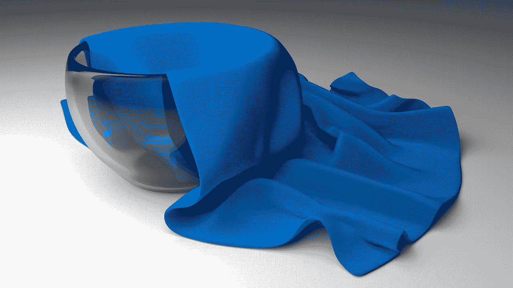

# 计算机图形学中人工智能的 3 个挑战

> 原文：<https://towardsdatascience.com/3-challenges-of-artificial-intelligence-in-computer-graphics-223e06bd846b?source=collection_archive---------10----------------------->

## 缩小虚拟世界和现实世界之间的差距

计算机图形不仅仅是惊人的视觉效果。它为我们提供了为不同目的重建物理世界的工具，例如工业或医疗应用。
这个领域的**图形图灵测试**很久以前就通过了，正如当前的摄影和电影技术状态所证明的。现实和幻想几乎无法区分，动画师可以在几天内创造出逼真的世界。

> ***图形图灵测试:*** *受试者观察并与真实或计算机生成的场景互动。如果受试者不能比随机猜测更好地从模拟现实中确定现实，则测试通过。*

在这个话题上，人工智能的最新进展提供了相当大的帮助。Ian Goodfellow 几年前推出了一种新型的神经网络架构，称为**生成对抗网络(GAN)** ，能够推动计算机图形学中可能出现的边界。应用是无穷无尽的，但正如斯坦·李教导我们的那样,*强大的力量伴随着巨大的责任。事实上，如果没有适当的控制，生成与现实难以区分的图像和视频可能会对我们的社会构成真正的威胁。看看这段人工智能生成的假奥巴马的视频，就明白我的意思了。*

[*深度假奥巴马——生成性敌对网络*](https://www.youtube.com/watch?v=AmUC4m6w1wo&t=2s)

# 用于流体模拟的人工智能新兴领域

模拟流体的动力学一直是一个巨大的数学挑战。最先进的技术需要巨大的计算能力，对于实时模拟更是如此。首先，需要提醒的是，术语流体包括液体、气体和等离子体。烟、风、水、火是流体的一些例子。
如果你熟悉**计算流体动力学(CFD)** ，你在你的道路上已经多次遇到纳维尔-斯托克斯方程。这些偏微分方程将运动流体的速度、压力、温度和密度联系起来，扩展了之前引入粘度效应的更简单的模型。我们不打算描述它们，因为它们非常复杂，没有适当的流体力学背景不适合，但如果你对它们感兴趣，你可以查看文章末尾的链接。寻找这些方程的解是不合适的，原因有两个:它们依赖于数据，因此方法被截断以适合计算预算，并且可能表现出非常慢的渐近收敛。

为了解决这些问题，机器学习最近引入了一种新的方法，将流体动力学环境建模为监督回归问题。神经网络和回归森林给出了很好的结果，但是它们需要由精确解算器提供的解的数据集。这在模拟测试期间是不可能的，因为初始帧是由模型本身生成的(它不是一个精确的解算器)。结果是不完善的，这一模型的应用受到限制。

描述物理世界的一种新的令人兴奋的方法涉及到无创或天真物理学的概念。人工智能的这一新领域涉及基于经验预测涉及宏观对象的物理交互结果的能力。让我们看一个例子:婴儿不知道什么是重力，但是通过经验，他们拥有重力的概念。这个想法是创造能够模拟直觉物理的人工神经模型。Tompson 等人的工作属于这一阵营，他们开发了一种新颖的定制 ConvNet 架构来取代现有的基于欧拉的求解器，并引入了一种新的训练损失来保证更快的收敛。

# 非线性软组织动力学:皮肤建模

获得逼真的人体模型是计算机图形学的主要目标之一。身体的表面需要自然变形。在实时应用中，身体由骨骼运动控制。由于这个原因，表面被链接到它的骨骼姿态，并且皮肤的动画是它的一个功能。这是如何实现的？

最常见的算法是**线性混合蒙皮(LBS)** ，也被 **Unity** 和 **Unreal** 使用。它计算量不大，并且在大多数情况下都能给出好的结果。尽管如此，还是有一些缺点。主要问题是在关节旋转过程中，强烈的弯曲或不真实的效果会导致体积的过度损失。

第二个重要的策略是数据驱动的身体模型。该模型划分了姿势和形状的参数，并允许对身体进行更深入的控制。这里的主要问题是缺乏对非线性动力学的控制。我说的非线性动力学是什么意思？软组织，像人的腹部，对力的反应不是线性的。它弹跳，旋转，抖动。这些运动不能用非线性模型来恰当地描述。
为了解决这个问题，引入了数据驱动的动力学模型。这些算法通常用于面部运动或布料动态。Casas 和 Otaduy 最近应用了最后一个类别的一个非常有趣的应用(本文最后的链接)。他们成功开发了一个数据驱动的模型，以模拟用公开可用的骨骼运动数据训练的非线性软组织动力学。与每个机器学习模型一样，这种新方法也不能正确描述远离训练集的变形。必要时，克服这一限制的唯一方法是采用基于物理学的人体模型。这些模型非常精确，但要复杂得多。

# 计算机图形学中的布料和材料理解

第三个巨大的挑战是布料的模拟。布料材料回收方法需要复杂的实验装置来获得物理特性。再现织物的正确行为可能极其复杂，研究人员正在应用机器学习方法来重现它的动态。了解布料的特性不仅在动画中有应用，在完全不同的领域也有应用。让我们考虑一个服装虚拟试穿系统:捕捉这种材料的动态可以打开电子商务中提供的一系列新服务。如果我们考虑虚拟现实的进步，这一点尤其正确，它将允许更真实的虚拟购物，给我们提供虚拟试穿衣服的可能性。
目前，反演动力系统的物理性质有多种方法。最直接的方法是通过测量、物理量采样和估计相关属性。第二个重要策略是模拟、优化和迭代动态系统，逐渐提取更接近真实值的特征。

# 结论

我们刚刚看到了人工智能在计算机图形学中的三个挑战。在物理世界的再现中，这三个范畴是融合在一起的:想想一面被风吹动的旗帜。在这种情况下，所有三个概念都出现在一个事件中。

*当然，还有一系列未解决的问题，我将在下面的文章中分析它们。如果你喜欢这篇文章，我会喜欢你点击鼓掌按钮👏所以其他人可能会偶然发现它。对于任何意见或建议，不要犹豫留下评论！*

要查看更多我的故事:

[人工智能是种族歧视吗？](https://medium.com/p/817fa60d75e9?source=your_stories_page---------------------------)(及其他关注点)

[如何教会一个 AI 玩游戏:深度强化学习](https://medium.com/p/28f9b920440a?source=your_stories_page---------------------------)

[人工智能遇上艺术:神经转移风格](https://medium.com/p/50e1c07aa7f7?source=your_stories_page---------------------------)

## 我是一名数据科学专业的学生，热爱机器学习及其无尽的应用。你可以在 maurocomi.com[找到更多关于我和我的项目的信息。你也可以在](http://www.maurocomi.com) [Linkedin](https://www.linkedin.com/in/mauro-comi/) 、 [Twitter](https://twitter.com/mauro_ai) 上找到我，或者直接发邮件给我。我总是乐于聊天，或者合作新的令人惊奇的项目。

## 参考

[*https://www.grc.nasa.gov/www/k-12/airplane/nseqs.html*](https://www.grc.nasa.gov/www/k-12/airplane/nseqs.html)

*杨，s，梁，j，&林，M. C. (2017 年 10 月)。基于学习的视频布料恢复。IEEE 计算机视觉和模式识别会议论文集(第 4383–4393 页)。*

*卡萨斯博士&奥塔杜伊硕士(2018)。为交互式化身学习非线性软组织动力学。*

*汤姆普森，j .，施拉克特，k .，斯普雷赫曼，p .，&柏林，K. (2016)。用卷积网络加速欧拉流体模拟。arXiv 预印本 arXiv:1607.03597。*