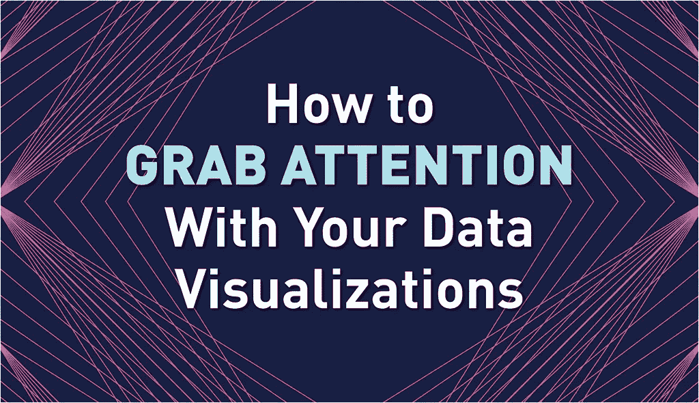
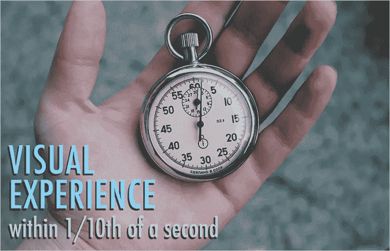
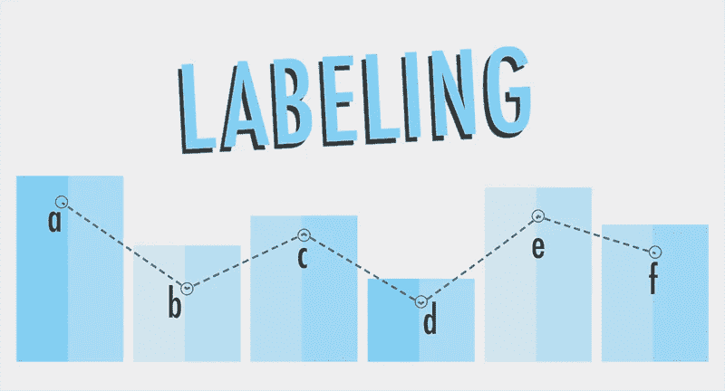
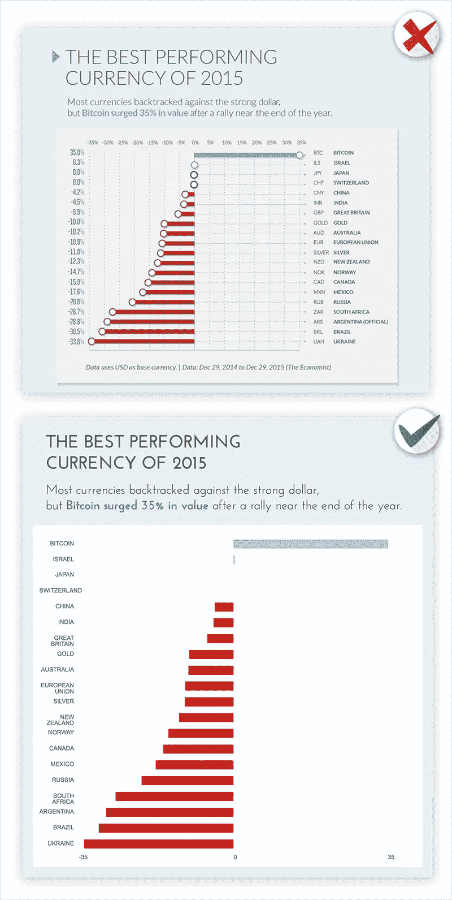

# 吸引读者注意力的 3 个专家数据可视化技巧

> 原文：<https://towardsdatascience.com/3-expert-data-visualization-tips-for-grabbing-readers-attention-206d8c4621bf?source=collection_archive---------4----------------------->

你看这个帖子的那一刻，你就在评判它。在你意识到它之前，你已经在判断它看起来有多长，在页面和图像中什么颜色是可见的，视觉效果是否会引起任何情绪反应，等等。

不管你是谁，也不管你是否意识到了这一点，每当你看到一个视觉场景——无论是看网页、走进房间还是打开电视，你都会在十分之一秒内开始理解这个视觉体验。这被称为“前注意处理”——在你注意视觉之前，你确实在处理它们。

Combine text and images just like this using Visme. [It’s free and easy.](http://www.visme.co/?vc=Graphic-CTA)

最有效的数据可视化利用了人类是前注意力视觉动物的概念——在我们意识到我们被呈现的东西之前，我们已经开始理解事物，判断大小、形状、颜色、对比度等。

考虑到这一点，你应该仔细考虑你正在做的设计选择，以及你的视觉效果是否在注意力集中之前带来了清晰或者引起了混乱。你给预先注意大脑带来的清晰度越高，你就越有可能激励和引导用户继续探索你的内容，从而向他们展示更多的信息和知识。

这里有 3 个专家数据可视化技巧，我建议你在每个项目中仔细考虑，以最成功地抓住你预先注意的观众的注意力和兴趣。

# 专家数据可视化技巧

# 1 千瓦特

对于任何交流任务来说，你能做的最重要的事情就是知道你真正想说什么。这是我的“最差”缩写 KWYRWTS(发音为“k-whir-wits”)。它又长又难打，也不可能记住。但是，这是你能做的最重要的事情。在你能与任何人交流任何事情之前，你必须知道你的信息。这适用于生活的方方面面，不仅仅是工作。

例如，如果我去麦当劳，走到柜台前，开始谈论天气、政治，或者即使我半正题地谈论意大利面条和肉丸，我也是在浪费每个人的时间(更不用说惹恼排在我后面的人了)。我需要做我该做的事，那就是点一些汉堡和薯条。

那么 KWYRWTS 如何应用于数据可视化呢？我不能只决定数据在说什么——这不是用你的数字撒谎。关键是你需要理解你试图用你的视觉化来完成什么。

我们为什么要可视化数据？唯一的原因是揭示模式、异常值、趋势、相关性，并进行比较，这些在查看数字表时不容易(或根本不容易)发现。但是魔鬼就在这里的细节中。

例如，假设你的老板交给你公司 12 个季度的财务表现数据，并让你为你的 CEO 写一份报告。你是做什么的？您的第一反应可能是创建一个包含 12 个数据点的销售总额、利润和股价的折线图。但是这允许你用手头的数据来决定使用什么图表，共享什么数据等等。这不是一种战略方法。

正确的做法是首先弄清楚报告的目的是什么。问问你自己:

*   正在调查哪些业务状况？
*   CEO 需要根据这份报告做出什么决定？
*   你还能获得哪些数据来帮助她做决定？
*   想象一下，答案是小配件部门在 12 个季度中有 6 个季度都在亏损，她需要考虑是关闭它、投资它还是不管它？
*   现在你会怎么做？

好吧，也许你需要做一份季度报告，但要按部门分列……也许这不是关于总销售额，而是关于利润……或者也许这完全是关于这样一个事实，即世界对小部件的需求已经下降，因为当汽油价格低时，它总是这样，但即将到来的汽油价格高峰肯定会导致小部件销售的反弹，所以燃料价格预测数据显示以及对小部件销售的预测将是最合适的。

KWYRWTS 是任何项目中最重要的第一步。知道你的首席执行官的注意力持续时间很短，她必须在午餐前做出 20 个艰难的决定，所以她的预先注意力可能比大多数人都更精细，这意味着你必须非常清楚图表在第一个十分之一秒对她说了什么，以及对数字进行更深入的调查可能会揭示什么。如果她看到倾斜线，但它们是错误的倾斜线，她在 1/10 秒内的判断可能会不正确。

# 2 设计简单

Combine text, icons and images just like this using Visme. [It’s free and easy.](http://www.visme.co/?vc=Graphic-CTA)

设计师凭直觉知道少即是多。拥抱空白。眼睛需要在所有内容之间寻找一个位置。不要压倒你的观众。

这种更简单的视觉美感有很多论据。没有什么比你预先注意的听众更重要了。正如我所说的，当有人浏览你的数据可视化时，他们正在对它进行评判。在那一瞬间(潜意识里)他们在对自己说什么？

*   “什么最重要？”
*   “我应该在这里看什么？”
*   “我应该忽略什么？”
*   “这对我来说是不是太复杂了？”
*   “这是不是太长了，不值得我浪费时间？”
*   “这看起来可信吗？”
*   还有更多…

[研究表明](http://bhv.io/ScienceOfInfoGFX)信息图设计中最重要的因素之一是理解受众的周边视觉——用户一眼看到的东西将决定他们下一步看哪里。换句话说，以一种预先注意的方式，你不仅需要把他们吸引到你的视觉化图像上的一个特定点，而且要意识到你需要给他们一些下一步要看的东西！

我能想到的解释这个想法的最好的例子是地图界面。您正在绘制餐馆的位置和排名。所以你在地图上有一些点，但是你也想指出它们有多好，这样一看，你的观众就可以确定最好的餐馆。

想象一下，在这张地图上有 100 家餐馆，每家餐馆的图标旁边都有多达 5 颗星。那会分散你的视觉注意力，并且会让你的用户不知所措——尤其是在注意力集中之前。你最好不要考虑排名，或者只使用颜色或对比来表示相对得分，而不是试图在界面上挤进那么多视觉信息。

# 3 标签

Combine text and shapes to create visuals using Visme. [It’s free and easy.](http://www.visme.co/?vc=Graphic-CTA)

正如上一篇数据可视化技巧文章中提到的，标签越少越好。出于类似的原因，但它不仅仅是留下空白，用更少的元素减少视觉混乱。你应该始终认为你的标签是“最好拥有的”,需要在图形中进行讨论。假设没有标签，除非绝对需要。

对我来说，完美的图表除了上面的一些形状之外什么也没有。一切都是相对的。即使我没有实际值，我也能知道一个东西比另一个东西大多少。现在你的老板和你的数据人员会强烈反对这种哲学。他们会说，没有数字的图表完全是浪费时间，绝对是荒谬的。好吧，那么，你会问他们，需要贴什么标签？(默认什么都没有，现在说服我必须包括什么。)

在这一点上，他们会说一切都需要标记，轴线需要 20 个刻度线，我们需要背景中的网格，这样我就可以看到每个点在图表中的位置，这样我就可以在 10%的精度内确定每个点的实际值。

猪食。如果什么都重要，那么什么都不重要。

只标注必须标注的内容。在图表上标出四个重要的点。每个轴可能只需要两个刻度线(0 和最大值)，轴可能是浅灰色的，而不是像其他标签一样的粗体黑色，您可能会删除数据后面的网格线。

事实上，所有的标签都可以是浅灰色或更小的，除了一个点代表这个图表的全部目的。(还记得 KWYRWTS 吗？这个列表中的第一个数据可视化技巧是什么？这将有助于指导什么被贴上标签，以及如何在视觉上强调它。)哦，当我们在做的时候，让我们把那个键放在角落里，用内嵌标签来解释图表上的任何颜色和形状。

你的预先注意的观众现在有更少的事情要判断，并且更有可能在宝贵的 1/10 秒内找到正确的事情来看，这将帮助他们停留和看得更久，并专注于你需要他们专注的地方。

把你的下一个项目看作是测试你 1/10 秒设计技巧的机会。试着快速看一下你自己的图表。瞥一眼它，试着预先注意地判断它。这很难做到，但是在设计的时候考虑你的快速浏览的观众和你的深度研究的观众是非常有效的。因为，别忘了，每个人都是前者，而只有部分人是后者。

*本帖* [*原版*](http://blog.visme.co/data-visualization-tips/) *最早出现在 Visme 的* [*视觉学习中心*](http://blog.visme.co/) *。*