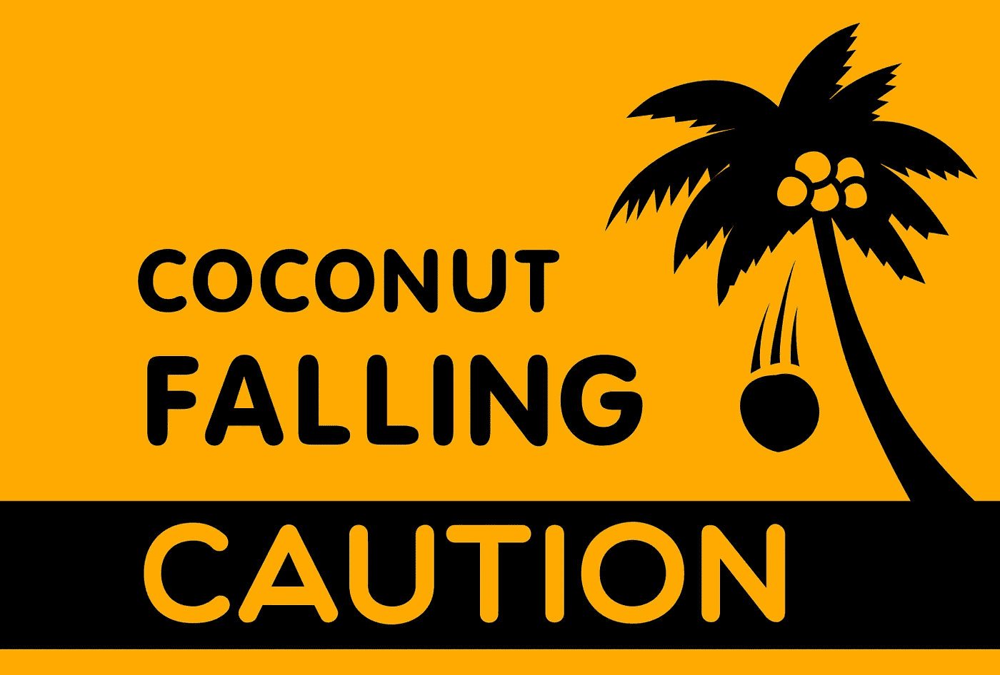
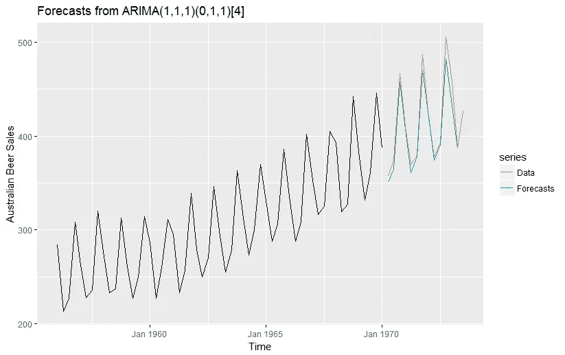
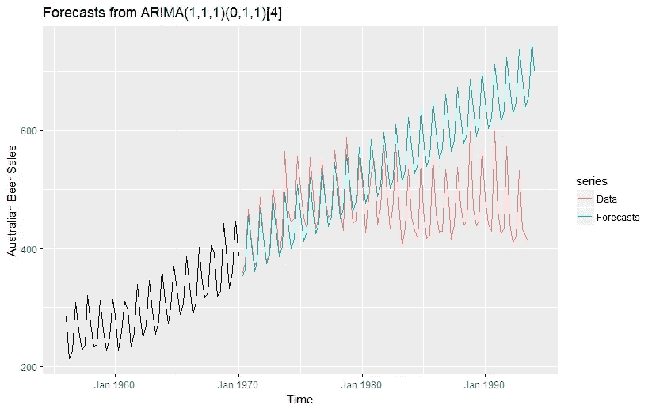
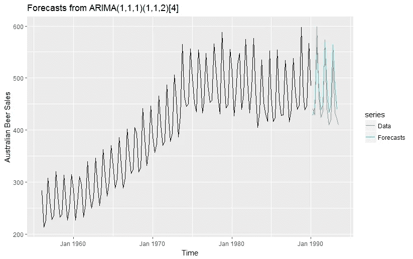
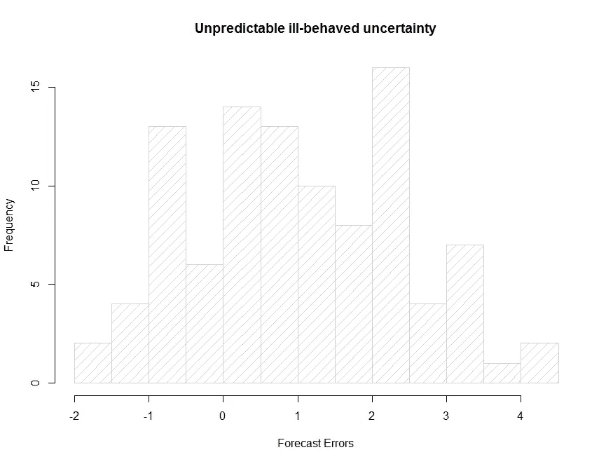
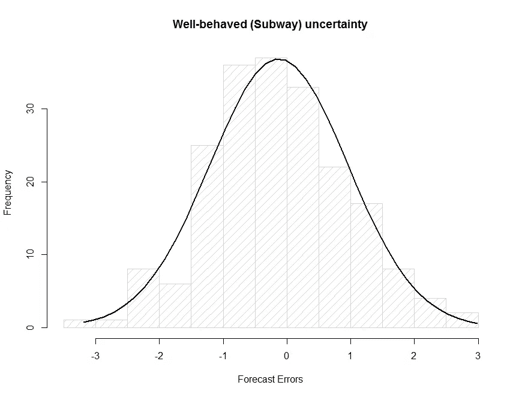

# 关于时间序列预测的 3 个事实让有经验的机器学习从业者感到惊讶。

> 原文：<https://towardsdatascience.com/3-facts-about-time-series-forecasting-that-surprise-experienced-machine-learning-practitioners-69c18ee89387?source=collection_archive---------2----------------------->

ime 序列预测是数据科学领域中的一匹黑马:它是商业中应用最广泛的数据科学技术之一，广泛用于金融、供应链管理以及生产和库存规划，并且在统计学和动态系统理论中有着良好的理论基础。然而，与图像识别和自然语言处理等更近、更受欢迎的机器学习主题相比，它仍然处于局外人的地位，在数据科学和机器学习的入门课程中，它很少或根本没有受到任何对待。

我最初接受的培训是神经网络和其他机器学习方法，但在我的职业生涯让我成为需求预测专家后，我倾向于时间序列方法。

最近几周，作为我的团队努力扩展传统时间序列预测能力并进入基于 borader ML 的业务方法的一部分，我发现自己与经验丰富的 ML 工程师进行了几次讨论，他们通常非常擅长 ML，但对时间序列方法没有太多经验。

从这些讨论中，我意识到时间序列预测有几件事是预测界认为理所当然的，但对其他 ML 实践者和数据科学家来说是非常令人惊讶的，尤其是与处理标准 ML 问题的方式相比。

这种脱节的症结在于，时间序列预测可以被视为一个监督学习问题，因此整个 ML 方法——回归、神经网络、支持向量机、随机森林、XGBoost 等……—可以扔向它。但同时，时间序列预测问题有几个独特的怪癖和特质，使它们不同于监督学习问题的典型方法，这需要 ML 工程师重新思考他们建立和评估模型的方法。

根据我最近的讨论，以下是 ML 从业者在应对预测挑战时遇到的 3 个最大的惊喜:

## 每次想要生成新的预测时，都需要重新训练模型:

对于大多数 ML 模型，你训练一个模型，测试它，必要时重新训练它，直到你得到满意的结果，然后在一个保留的数据集上评估它。在您对模型的性能感到满意之后，您就可以将它部署到生产中了。一旦投入生产，您就可以在新数据到来时对其进行评分。几个月后，如果有大量新的训练数据，您可能需要更新模型。模型训练是一次性的活动，或者最多是定期进行，以保持模型的性能，从而考虑新的信息。

对于时间序列模型，情况并非如此。相反，每当我们想要生成新的预测时，我们都必须重新训练我们的模型。为了理解为什么会发生这种情况，请考虑下面的例子:

我们将使用 ARIMA 模型来预测澳大利亚的季度啤酒销量(数据集取自 Hyndman 的预测包 R)。首先，我们将根据 1956 年至 1970 年的数据训练一个模型，然后根据 1970 年至 1973 年的数据进行测试。使用季节性 ARIMA(1，1，1)(0，1，1)模型，我们可以得到一个相当不错的预测(MAPE =1.94%)(图 1)。

接下来，我们将使用相同的模型预测一直到 1993 年的销售情况。从图 2 中可以看出，预测不再那么好:预测继续遵循 1970~1973 年的模式，但实际模式已经改变——我们从 1956 年到 1974 年看到的持续趋势在 1974 年后开始减弱，季节性变化的幅度也开始变化。如果你用同样的 ARIMA(1，1，1)(0，1，1)来预测 1990 年到 1993 年的销售额，你会得到更差的精度(MAPE = 44.92%)。

相反，我们将不得不重新设计第二个模型，考虑新的数据和销售模式的变化。这一次，我们将根据 1956 年至 1990 年的数据训练一个 ARIMA(1，1，1)(1，1，2)模型，并使用它来预测 1990 年至 1993 年的值，然后我们会得到一个更合理的 MAPE 值，与我们第一次实验中获得的值更接近(MAPE=5.22%)。

为了直观地理解为什么会发生这种情况，首先考虑一个经典的 ML 任务:对猫图像进行分类。猫的视觉属性随着时间的推移是稳定的(除非我们开始考虑进化的时间尺度)，所以当我们训练神经网络来识别猫的图片时，一个隐含的假设是，定义猫的特征在可预见的未来将保持不变。我们不期望猫在下周、明年、甚至十年后会有所不同。给定足够的数据，我们本周训练的模型在可预见的未来也足够好。

用统计学的说法，我们说猫图片特征的分布是一个平稳分布，这意味着它的属性，如均值和标准差，随着时间的推移保持不变。

现在回想一下，当开发数据集的分布和生产数据集的分布不同时，ML 项目中的一个常见陷阱就会发生，导致模型在生产中失败。对于时间序列，开发数据集和生产数据集几乎总是来自不同的分布，因为真实世界的商业时间序列(如澳大利亚啤酒销售)数据不是*稳定的，并且分布的统计属性会随着新的实际数据的出现而不断变化。*

解决这个问题的唯一方法是在每次获得新数据时重新训练模型。请注意，这与持续学习不同，在持续学习中，已经训练好的模型会随着新数据的到来而更新。每次您想要生成一个新的预测时，您实际上是在从头开始重新训练一个新的模型(尽管这将是一个有趣的研究课题，看看连续学习是否可以应用于时间序列预测)。

从实践的角度来看，这意味着将预测算法部署到生产中与部署其他 ML 模型是非常不同的。你不能只是部署一个静态模型并对其评分，模型服务的概念对时间序列预测没有意义。相反，您需要确保训练和模型选择可以在生产中即时完成，并且您必须确保您的整个训练集可以在生产中存储和处理。这让我想到了这篇博文的第二点:

## 有时，您必须取消培训/测试拆分:

让我们回到寻找 ML 模型的基本方法:通常你使用训练集建立一个模型，然后在测试集上评估它。这要求您有足够的数据来留出一个测试集，并且仍然有数据来构建模型。但是与图像处理或 NLP 中使用的数据集相比，时间序列数据通常非常小。某一产品在某一给定地点的两年周销售数据只有 104 个数据点(几乎不足以捕捉任何季节性)。一个季度的经济指标数据，10 年来只有 40 个数据点。对于如此小的数据集，我们没有足够的时间留出 20%或 30%的数据用于测试。交叉验证也没有多大帮助，因为根据您想要使用的算法，CV 在最好的情况下很难为时间序列模型建立，在最坏的情况下根本不适用(想想看:试图使用 1 月和 3 月的训练数据预测 2 月的值是没有意义的，这相当于泄漏)。

因此，我们转而采用 AIC、AICc 或 BIC 等信息标准。这些是模型选择度量，本质上是试图通过分析来近似测试步骤。这个想法是，我们没有一个经验的方法来确定一个模型的泛化误差，但我们可以通过使用信息理论的考虑来估计这个误差。

在实践中，我们训练一组预先确定的模型，然后选择具有最低 AIC 或 BIC 的模型。除了允许用有限的数据训练模型之外，当我们想要自动生成预测时，使用这样的模型选择标准是非常方便的。例如，在零售业中，我们必须对数百万个单独的时间序列进行预测是很常见的——一个大型的再培训者将在数百个地点运送 2 万~ 3 万件产品，从而产生数百万个单独的时间序列(每个产品/地点组合一个时间序列)。

在这种情况下，每个单独的数据集都很小，但您必须处理数百万个数据集，因此分析师或工程师不可能对每个系列的测试集进行评估，自动模型选择就变得至关重要。

许多预测工具都使用这种方法:Rob Hyndman 在 R (1)中流行的预测包在其 **auto.arima()** 和 **ets()** 函数中使用 AIC 进行模型选择，许多商业需求预测应用程序(如 Oracle 的 RDF)使用 BIC 进行模型选择。参见 Hastie 和 Tibshirani (2)关于使用 AIC 和 BIC 进行模型选择的介绍。

## 预测的不确定性与预测本身一样重要，甚至更重要:

将预测与其他监督学习任务区分开来的另一点是，你的预测几乎总是会出错。在给定足够的训练数据的情况下，处理图像分类问题或 NLP 问题的人可以合理地期望最终准确地分类所有新的输入样本。您所要做的就是确保您的训练数据和真实世界的数据是从同一个分布中采样的。正如我在第一点和第二点中提到的，在商业预测应用程序中通常不是这样，你的预测几乎总是错的。您准确预测下周将售出多少件 M 号阿迪达斯红色衬衫的可能性有多大？所以你需要的不仅仅是一个点的预测，还有对预测不确定性的衡量。

在需求预测和库存应用程序中，预测的不确定性对于使用预测的应用程序至关重要。预测的不确定性(由预测间隔或预测分位数表示)是您将用来计算安全库存的因素，也就是您希望保持的额外库存数量，以确保您不会失去任何客户。

他们在金融时间序列建模中进一步发展了这一思想，他们实际上有专门为时间序列的不确定性建模而建立的模型类别，而不是时间序列本身，如 ARCH 和 GARCH 模型。

马里达吉斯*等人* (3)谈到地铁的不确定性和椰子的不确定性。椰子不确定性，暗指当某人在海滩上时，一个椰子意外地落在他的头上，是“未知的未知”的不确定性，无论我们如何努力，都无法预测的事件。

更一般地，一些时间序列表现出不良的不确定性，这是不可预测的。预测误差的分布不遵循任何已知的分布。此类信息对于做出判断性决策很有用，但不能建模和用于预测。

另一方面，地铁的不确定性(暗指乘坐地铁从 A 到 B 需要多长时间的不确定性)遵循一个已知的分布，比如正态分布或泊松分布，并且可以被建模和用于将预测限制在一定的范围内，即使无法预测精确的值。

那些习惯于在其他 ML 领域中可实现的非常高的准确度的人，更重要的是，被当前的机器学习炒作所吸引的决策者和商业领袖，需要明白，通常时间序列模型所能达到的最好的结果就是地铁不确定性。坚持认为如果我们能找到正确的算法和正确的数据，足够深的神经网络或足够丰富的非结构化数据集，我们将能够实现更好的预测，这是危险的误导。有时，我们能得到的最好结果是可管理的不确定性，我们应该相应地构建我们的数据管道和决策支持系统。

# **参考:**

(1)[https://cran . r-project . org/web/packages/forecast/forecast . pdf](https://cran.r-project.org/web/packages/forecast/forecast.pdf)

(2) Hastie，Tibshirani，Friedman，[统计学习的要素](http://statweb.stanford.edu/~tibs/ElemStatLearn/)，第 7 章(第 228-229 页)

(3) Makridakis，s .，Hogarth，R.M. & Gaba，A. (2009)经济和商业世界中的预测和不确定性。国际预测杂志