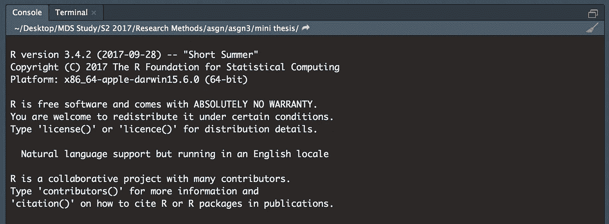

# 如何在 RStudio 上更新 R 的 3 种方法(适用于 Windows 和 Mac)

> 原文：<https://towardsdatascience.com/3-methods-how-to-update-r-on-rstudio-for-windows-mac-13ec2005aeb1?source=collection_archive---------2----------------------->

你上次更新 R 和 RStudio 是什么时候？

一年前安装了 RStudio 和 R，之后再也没有更新过。今天我刚刚注意到我不能安装新的 R 包，因为我的旧 R 版本。因此，我探索了一些更新 R 的方法，并希望与也希望在 RStudio 上更新 R 的人分享。

## 问题是

RStudio 和 R 不能自行更新，因为一些包在切换到新版本后可能无法工作(如果出现问题，您仍然可以在 RStudio 中[降级 R 版本)。安装新版本后，以前安装的软件包将不会进入下一个版本。因此需要额外的程序来移动包装。](https://support.rstudio.com/hc/en-us/articles/200486138-Using-Different-Versions-of-R)

这里有 3 种方法可以在 RStudio 中更新 R 版本。注意，我们需要移动 install R 包，我将在最后展示如何移动。

## 在 RStudio 上更新 R 的 3 种解决方案

## 解决方案 1)手动安装

第一种方法是从 [R 网站> CRAN](http://www.r-project.org) 下载新版 R。然后重启 RStudio。新的 R 版本会自动加载。



The new R version appear right after I install R and restart RStudio — (Image by author)

## 解决方案 2)仅 Windows 使用 installr

[installer](https://cran.r-project.org/web/packages/installr/)是帮助安装和更新软件的 R 包。

更新 R 所需的 R 代码是:(代码归功于 [Cara Wogsland](https://stackoverflow.com/users/5843367/cara-wogsland)

```
install.packages("installr")
library(installr)
updateR()
```

你可以在 [R-Statistics 网站](https://www.r-statistics.com/2013/03/updating-r-from-r-on-windows-using-the-installr-package/)上找到如何使用 installr 更新 RStudio 的教程。

## 解决方案 3)仅 Mac 使用更新程序

与 installr 类似， [updateR](https://github.com/AndreaCirilloAC/updateR) 是帮助在 Mac OS 上更新 R 的包。

你需要的 R 代码是这 5 行:(代码归功于[jroberayals](https://stackoverflow.com/users/4099259/jroberayalas)

```
install.packages('devtools') #assuming it is not already installed
library(devtools)
install_github('andreacirilloac/updateR')
library(updateR)
updateR(admin_password = 'Admin user password')
```

你可以在这个博客上找到关于如何使用更新包[的深入教程。](https://andreacirilloblog.wordpress.com/2015/10/22/updater-package-update-r-version-with-a-function-on-mac-osx/)

## 如何移动先前安装的 R 包

这是 Mac OS 用户(使用上述解决方案 1 或 3)的说明。对于 Windows 用户，**installer**包将为您完成这项工作

(功劳归于 [RyanStochastic](https://stackoverflow.com/users/1580411/ryanstochastic) 和 [micstr](https://stackoverflow.com/users/4606130/micstr) ):

**1。将所有文件夹从旧的 R 版本移动到新的 R 版本。**

```
/Library/Frameworks/R.framework/Versions/x.xx/Resources/library
```

一次用新旧 R 版本替换 x.xx。

*注意，您必须只移动当前不在目标文件夹中的包(因为那些是基础包，您不想破坏它们)。但是如果您已经替换了所有内容，下一步将为您解决这个问题。*

如果找不到正确的路径，可以运行这个命令来检查:`installed.packages()`

**2。更新被移动的包**

在 r 中运行以下命令，对弹出的每个问题键入“y”。

```
update.packages(checkBuilt=TRUE)
```

3.在 R 中键入以下命令，检查是否一切顺利

```
version
packageStatus()
```

就是这样！希望你们成功更新 r。如果没有，请查看下面的参考链接。

注意:如果您在 Jupyter Notebook 中使用了 R 和 IRKernel，升级 R 将导致 Jupyter Notebook 中的 R 不可用。[按照以下步骤](https://irkernel.github.io/installation/#binary-panel)重新安装 IRKernel，它将再次工作。

参考资料:[https://stack overflow . com/questions/13656699/update-r-using-r studio](https://stackoverflow.com/questions/13656699/update-r-using-rstudio)

*最初发表于* [*沃拉特纳珀斯*](http://www.byperth.com/2017/11/01/3-methods-update-r-rstudio-windows-mac/) *。*