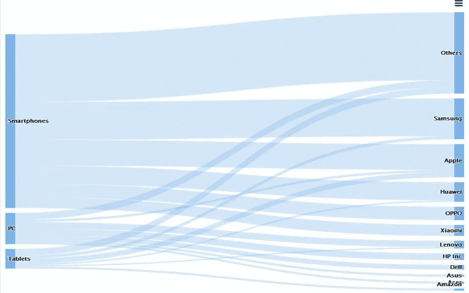
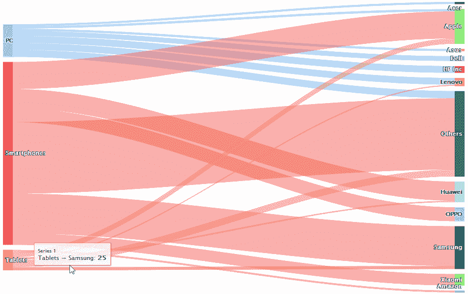
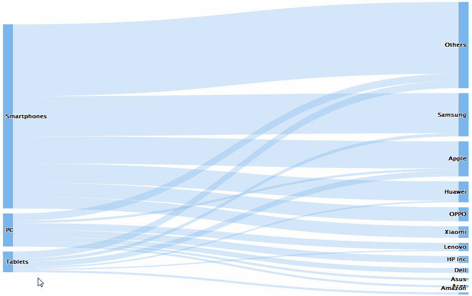
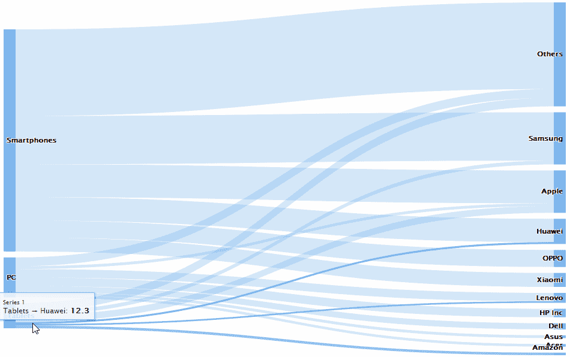
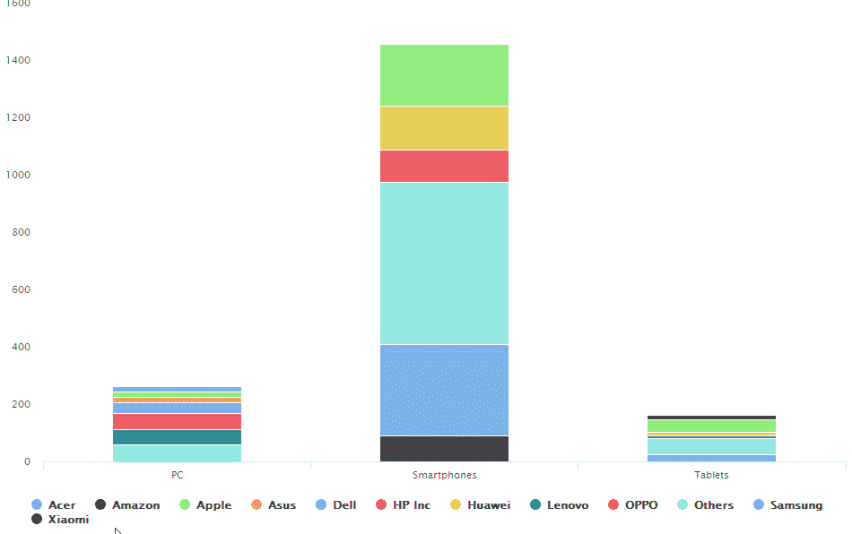

# 交互式数据可视化的 3 条规则

> 原文：<https://towardsdatascience.com/3-rules-for-interactive-data-visualizations-a-showcase-with-r-and-highcharts-e452f5c37f44?source=collection_archive---------8----------------------->

## 一个展示 R 和 Highcharts 的橱窗



# 为什么你应该让可视化互动。

交互式数据可视化更好的原因有两个:

*   **更多信息。**通过使用工具提示、点击事件、过滤能力等，交互性允许你嵌入比静态可视化更多的信息。
*   **更容易感知更复杂的数据。**只在需要时显示某些信息并在不需要时隐藏的可能性将使用户只关注他们正在寻找的细节。因此，可视化可能包含更多的信息，可以快速抓住关键点。
*   **促进探索。每个人都喜欢与他们调查的对象互动。响应性数据鼓励人们探索更多，从而获得更多见解。**
*   **更好玩。嗯，事实就是这样:厌倦了几十个静态的 PowerPoint 演示文稿或枯燥的图表互动给我们的(企业)生活带来了一点多样性:)。**

# 完美互动可视化的 3 条规则。

具有交互式数据可视化的良好 UX 依赖于 3 个主要规则:

*   先概述一下，
*   缩放和过滤，
*   然后是细节点播。

这个神圣的三位一体也被称为 Shneiderman 的可视化咒语，他在 1996 年[制定了这个咒语。](https://www.cs.umd.edu/~ben/papers/Shneiderman1996eyes.pdf)

为了展示咒语的真正力量，让我们用不太标准的图表来探索一些关系。我查看了主要厂商 2017 年[智能手机](https://www.statista.com/statistics/271490/quarterly-global-smartphone-shipments-by-vendor/)、[个人电脑](https://www.statista.com/statistics/263393/global-pc-shipments-since-1st-quarter-2009-by-vendor/)和[平板电脑](https://www.statista.com/statistics/276651/global-media-tablet-shipments-since-3rd-quarter-2011-by-vendor/)的出货量。我很想在桑基图上尝试一下，在我看来，桑基图非常强大，不仅可以显示流量，还可以显示关系。

首先，一些数据争论。最初的文件可能有所有 xls 格式讨厌的主要问题:多个标签，标题，缩进和非常不整洁的格式。在将文件限制为 1 个选项卡并将它们转换为。csv，对于所有随后的数据争论，我使用 R，这最终是我的最爱。

对于 Sankey chart，我将使用由 [Joshua Kunst](http://jkunst.com/) 制作的 R 中的[high chart](http://jkunst.com/highcharter/)库作为 Highcharts javascript 库的 R 包装器。您实际上不需要任何 Javascript 知识，但只需一点 JS 就可以对其进行显著扩展。

第一个简单的默认图表如下所示:



```
highchart() %>%
  hc_add_series(data = sales, type = "sankey",
                hcaes(from = product, to = company, weight = units))
```

看起来不坏，但只要遵循 3 步咒语，它会变得更好，所以让我们继续吧！

# **先概述一下**

我们的原始图表有点太详细，彩色流显示了每个依赖关系，这比“先概述”要多一点。此外，它不会让您轻松地第一时间了解正在发生的事情。为了解决这个问题，让我们到目前为止使用一种颜色，不要被细节分散注意力，按降序排列产品和公司，这样人们可以立即看到排名。



除此之外，我改变了“弯曲度”,使流动更加透明，覆盖了默认值:

```
hc_plotOptions(sankey = list(
      colorByPoint = FALSE,
      curveFactor = 0.5,
      linkOpacity = 0.33
    ))
```

# **缩放和过滤**

有时候，咒语的一部分并不适用于特定的图表或特定的数据。我们的桑基图表没有那么大，过滤值会对公司比较产生负面影响。

另一方面，突出感兴趣的对象服务于相同的目的。默认情况下，每个流都会高亮显示。我希望能够突出显示每个产品或公司，以了解未来的流入/流出。

在这一部分，我们需要 R 中的纯 JavaScript 来配置鼠标悬停在节点上的事件:



```
hc_plotOptions(sankey = list(
point = list(
      events = list(
        mouseOver = JS(
          "function () { if (this.isNode) {
      this.linksFrom.forEach(function(l) {
      l.setState('hover');
      });
      this.linksTo.forEach(function(l) {
      l.setState('hover');
      });
      }
      }  "

        ),
        mouseOut = JS(
          "function () { if (this.isNode) {
      this.linksFrom.forEach(function(l) {
      l.setState('');
      });
      this.linksTo.forEach(function(l) {
      l.setState('');
      });
      }
      }  "

        )
      )
    )
)
```

但是，如果我们使用另一种图表类型，例如，堆积条形图，那么过滤效果会很好:



```
highchart() %>%
  hc_add_series(data = sales_stacked, 
                type = "column",
                hcaes(x = product, y = units, group = company)) %>%
  hc_plotOptions(column = list(stacking = "normal")) %>%
  hc_xAxis(categories = unique(sales_stacked$product))
```

通过点击(不点击)图例，你可以过滤公司，这是 Highcharter 中条形图的默认行为。因此可以对图表进行过滤，只显示感兴趣的公司。

# **详情点播**

在这里，我们将充分利用互动的力量，让视觉化变得完美。用户可能对哪些细节感兴趣？它可以是:

*   按供应商和产品列出的出货量。
*   特定公司装运的特定产品的单位数量。
*   产品在公司出货量中所占的份额，以及公司在特定产品销售中所占的份额。

前两个是由工具提示中的高图表的默认行为提供的。后者应该由我们来写:

```
hc_plotOptions(sankey = list(
     tooltip = list(
     pointFormat =  "{point.fromNode.name} → {point.toNode.name}: <b>{point.weight}</b> Mio units<br/>
{point.product} contribute <b>{point.product_share} %</b> in {point.company} sales: <br/>
    {point.company} contributes <b>{point.company_share} %</b> in {point.product} sales "
    )
)
)
```

如果利益相关者需要静态格式的图表，我还会添加一个选项来下载图像形式的图表:

```
hc_exporting(enabled = TRUE,
               buttons = list(
                 contextButton = list(
                   y = -30
                   )
               ))%>%
  hc_chart(spacingTop = 30)
```

最后的结果是:

你可以在整篇文章中看到应用咒语是如何显著改善图表的，现在它看起来很好。

此外，你可能注意到了最后一个图表，它是响应性的，更能吸引你的注意力，与之前的普通 gif 相比，你可能更渴望探索它。这显示了互动的力量。

你可以在 [GitHub](https://github.com/v-kozhevnikov/Interactive_dataviz_rules) 上找到所有代码。

最后一个图表完全是用 JavaScript 编写的，但只是为了嵌入到介质中。你几乎可以完全用 R 编写代码，只需为事件添加一点 JS，如我的 [GitHub](https://github.com/v-kozhevnikov/Interactive_dataviz_rules) repo 所示。很多时候，你可以在 Google 和 stackoverflow 的帮助下找到需要的代码，而不需要深入研究 JS。