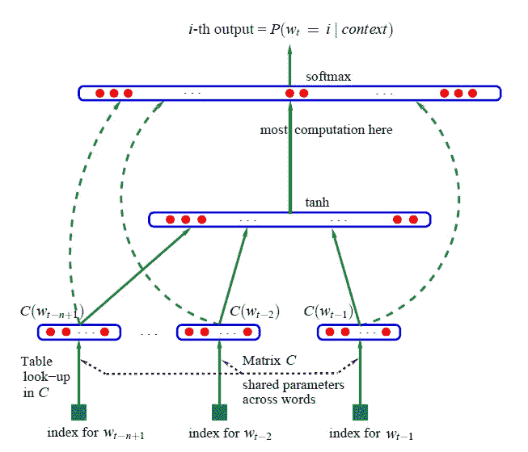
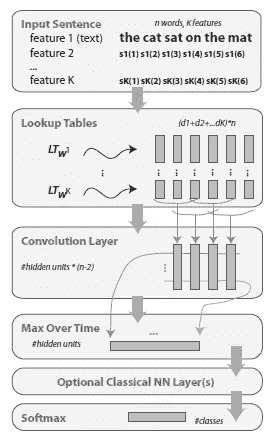
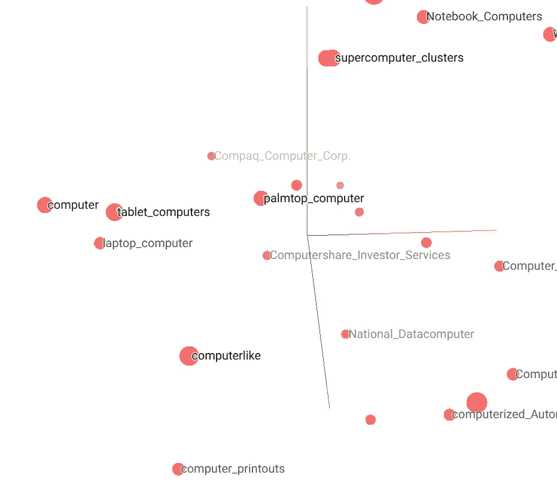

# 自然语言处理中单词嵌入的三大法宝

> 原文：<https://towardsdatascience.com/3-silver-bullets-of-word-embedding-in-nlp-10fa8f50cc5a?source=collection_archive---------1----------------------->


Credit: [https://pixabay.com/en/books-stack-book-store-1163695/](https://pixabay.com/en/books-stack-book-store-1163695/)

单词嵌入是解决许多自然语言处理问题的银弹。现代的 NLP 架构大多采用了单词嵌入和放弃[单词包(BoW)](/3-basic-approaches-in-bag-of-words-which-are-better-than-word-embeddings-c2cbc7398016) 、[潜在狄利克雷分配(LDA)、潜在语义分析(LSA)](/combing-lda-and-word-embeddings-for-topic-modeling-fe4a1315a5b4) 等。

看完这篇文章，你会知道:

*   单词嵌入的历史
*   文字嵌入设计
*   应用现成的单词嵌入模型
*   嵌入可视化
*   拿走

# 单词嵌入的历史

传统上，我们使用词袋来表示特征(例如 TF-IDF 或计数矢量化)。除了 BoW，我们可以在单词特征上应用 LDA 或 LSA。然而，它们也有一些局限性，如高维向量、稀疏特征等。单词嵌入是低维向量中的一个稠密特征。在大多数自然语言处理问题中，单词嵌入提供了更好的向量特征。

2013 年，Mikolov 等人使单词嵌入流行起来。最终，单词嵌入是 NLP 中最先进的技术。他发布了 word2vec 工具包，并允许我们享受美妙的预训练模型。后来，gensim 提供了一个惊人的包装器，以便我们可以采用不同的预训练的单词嵌入模型，包括 Word2Vec(由谷歌)，GloVe(由斯坦福)，fastText(由脸书)。

在 Tomas 等人推出 Word2Vec 的 12 年前，Bengio 等人发表了一篇论文[1]来处理语言建模，这是单词嵌入的最初想法。当时，他们把这个过程命名为“学习单词的分布式表示”。



Capture from A Neural Probabilistic Language Model [2] (Benigo et al, 2003)

2008 年，Ronan 和 Jason [3]引入了预训练嵌入的概念，并表明这是一种解决 NLP 问题的惊人方法。直到 2013 年，Tomas 发布了预训练模型(word 2 vec ), word embedding 才开始出名。



Capture from A Unified Architecture for Natural Language Processing [3] (Collobert & Weston, 2008)

时间线:

*   2001 年:Bengio 等人提出了单词嵌入的概念
*   2008 年:罗南和杰森引入了预训练模型的概念
*   2013 年:Mikolov 等人发布了预训练模型 Word2Vec

# 文字嵌入设计

***低维***


Photo Credit: [https://www.foodnetwork.com/recipes/food-network-kitchen/four-layer-birthday-cake-3363221](https://www.foodnetwork.com/recipes/food-network-kitchen/four-layer-birthday-cake-3363221)

为了解决高维问题，单词嵌入使用预定义的向量空间如 300 来表示每个单词。出于演示的目的，我使用三维来表示以下单词:

*   苹果:[1.11，2.24，7.88]
*   橙色:[1.01，2.04，7.22]
*   汽车:[8.41，2.34，-1.28]
*   表格:[-1.41，7.34，3.01]

如预定义的向量空间(即，在上面的演示中为 3)，维度(或特征)的数量是固定的，无论语料库有多大。与 BoW 相比，当唯一字增加时，维数会增加。假设我们的文档中有 10k 个唯一的单词，BoW 中的特征数量是 10k(没有过滤高/低频单词)，而在我们的演示中维度可以保持为 3。

***语义关系***


Photo Credit: [https://gointothestory.blcklst.com/similar-but-different-c722f39d923d](https://gointothestory.blcklst.com/similar-but-different-c722f39d923d)

通常，单词向量编码单词之间的语义关系。这是单词嵌入的一个非常重要的概念，因为它有利于处理自然语言处理问题。词向量如果有相似的意思就会闭合。比如买和买会更近。与 BoW 不同，它只代表 0 或 1(表示有一个词或没有接近)，它不能代表两个词是否有相似的意思。

在上面的例子中，你可能会注意到苹果的向量和橘子的向量比其他的更接近，而苹果的向量相对远离汽车的向量。

***【连续词袋】&***

Mikolov 等人提出了两种新的架构[4],这两种架构降低了计算复杂度并包含了额外的上下文。

CBOW 就是在目标词( **w** )前后同时使用 **n** 个词。例如，“词向量编码词之间的语义关系”。如果窗口(n)是 3，这里是预测列表的子集:

*   情况 1，单词前:{Empty}，单词后:(单词，向量，编码)，预测单词:“the”
*   案例 2，词前:(the)，词后:(向量，编码语义)，预测词:“词”

Skip-gram 使用相反的方法，使用目标单词来预测目标单词前后的 n 个单词。例如，“词向量编码词之间的语义关系”。如果窗口(n)是 3，这里是预测列表的子集:

*   案例 1，预测单词:“the”，单词:(单词，向量，编码)
*   案例 2，预测单词:“单词”，单词:(向量，编码，语义)


Capture from Efficient Estimation of Word Representations in Vector Space (Tomas et al., 2013)

***阴性采样***

而不是利用所有其他单词作为负面标签训练记录。Mikolov 等人提出使用合适的少量负训练记录来训练模型。从而使整个操作变得更快。

如果你不熟悉负抽样，你可以查看这篇文章了解更多信息。

# 应用现成的单词嵌入模型

介绍了历史和模型结构，我们如何使用单词嵌入来解决自然语言处理问题？

有两种处理单词嵌入的方法:

*   利用现成的模型
*   构建特定领域的模型。

本文将采用第一种方法。选择 3 个知名的预训练模型，并利用 gensim 加载这些模型。著名的 NLP 库 Gensim 已经实现了处理这 3 种模型的接口。为了简单起见，你可以用我的包装器来加载这三个模型。

***Word2Vec***

这个[单词向量](https://code.google.com/archive/p/word2vec/)是在谷歌新闻上训练的，由谷歌提供。基于来自谷歌新闻数据的 1000 亿个单词，他们训练了 300 个维度的模型。

Mikolov 等人使用 skip-gram 和负采样建立了这个模型，该模型于 2013 年发布。

```
word_embedding = WordEmbedding()
word_embedding.load(source='word2vec', file_path=word2vec_file_path)print(word_embedding.get_vector(source='word2vec', word='apple'))
```

输出

```
[-0.06445312 -0.16015625 -0.01208496  0.13476562 -0.22949219  0.16210938
  0.3046875  -0.1796875  -0.12109375  0.25390625 -0.01428223 -0.06396484
...]
```

***手套***

斯坦福大学 NLP 团队提供了单词表示的全局向量( [GloVe](https://nlp.stanford.edu/projects/glove/) )。斯坦福大学基于 2，6，42，840 亿个令牌提供了从 25，50，100，200 到 300 个维度的各种模型。

斯坦福大学自然语言处理小组应用词-词共现概率来构建嵌入。换句话说，如果两个词同时出现很多次，这两个词可能有相似的意思，所以矩阵会更接近。

```
word_embedding = WordEmbedding()
word_embedding.load(source='glove', file_path=glove_file_path)print(word_embedding.get_vector(source='glove', word='apple'))
```

输出

```
[ 0.52042001 -0.83139998  0.49961001  1.28929996  0.1151      0.057521
 -1.37530005 -0.97312999  0.18346     0.47672001 -0.15112001  0.35532001
...]
```

快速文本

[fastText](https://fasttext.cc/) 由脸书发布，提供 3 款 300 尺寸。用子词训练预训练模型中的一个。比如“差”，它会被“di”、“dif”、“diff”等等训练。

```
word_embedding = WordEmbedding()
word_embedding.load(source='fasttext', file_path=fasttext_file_path)print(word_embedding.get_vector(source='fasttext', word='apple'))
```

输出

```
[ 0.26407328  0.30484504  0.04900438 -0.44377801  0.16519009 -0.09473443
 -0.01351437 -0.17237368  0.0374852   0.34962645  0.14334701 -0.11134619
...]
```

# 嵌入可视化

最先进的自然语言处理技术之一是单词嵌入，它实际上是什么？这是一个矩阵，最简单的方法是 x 和 y 坐标，但我们有 300 维，而不是 2 维。

我们可以通过使用主成分分析(PCA)或 T-分布随机邻居嵌入(t-SNE)来可视化它。通过利用 TensorBoard，可以轻松呈现可视化。

```
word_embedding.build_visual_metadata(embedding=embedding, words=words, file_dir='./word_embedding')
```



# 拿走

要访问所有代码，可以访问我的 github repo。

*   应该使用哪种现成模型？根据您的数据，**有可能所有这些数据对您的领域特定数据**都没有用。
*   我们应该根据你的数据训练单词嵌入层吗？根据我的经验，如果您处理**领域特定的文本，并且您的大部分单词不能从现成的模型**中找到，您可以考虑构建定制的单词嵌入层。
*   由于浏览器资源问题，Tensorboard 选择了前 100000 个向量。推荐给**自己挑一小部分矢量**。
*   GloVe、Word2Vec 和 fasttext 的最大型号大小分别为~5.5GB、~3.5GB 和~8.2GB。GloVe、Word2Vec、fasttext 分别需要 9、1、9 分钟左右。在资源有限的情况下，It **可能不容易部署到生产**。

# 参考

[1] Yoshua Bengio，Ducharme Rejean 和 Vincent Pascal。一种神经概率语言模型。2001.[https://papers . nips . cc/paper/1839-a-neural-probability-language-model . pdf](https://papers.nips.cc/paper/1839-a-neural-probabilistic-language-model.pdf)

[2] Yoshua Bengio，Ducharme Rejean，Vincent Pascal 和 Janvin Christian。一种神经概率语言模型。2003 年 3 月。http://www.jmlr.org/papers/volume3/bengio03a/bengio03a.pdf

[3]科洛伯特·罗南和韦斯顿·杰森。自然语言处理的统一架构:具有多任务学习的深度神经网络。2008.【https://ronan.collobert.com/pub/matos/2008_nlp_icml.pdf 

[4]托马斯·米科洛夫、格雷戈·科拉多、程凯和杰弗里·迪恩。向量空间中单词表示的有效估计。2013 年 9 月。[https://arxiv.org/pdf/1301.3781.pdf](https://arxiv.org/pdf/1301.3781.pdf)

# 关于我

我是湾区的数据科学家。专注于数据科学、人工智能，尤其是 NLP 和平台相关领域的最新发展。你可以通过[媒体博客](http://medium.com/@makcedward/)、 [LinkedIn](https://www.linkedin.com/in/edwardma1026) 或 [Github](https://github.com/makcedward) 联系我。