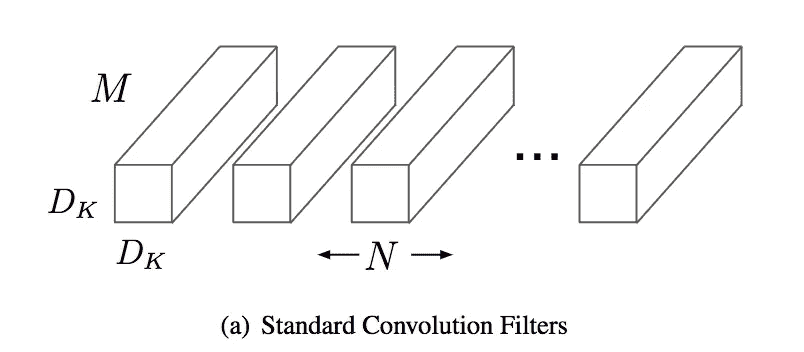
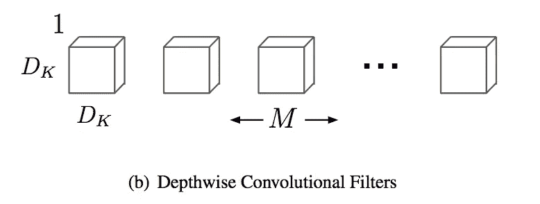
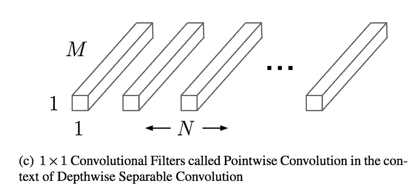
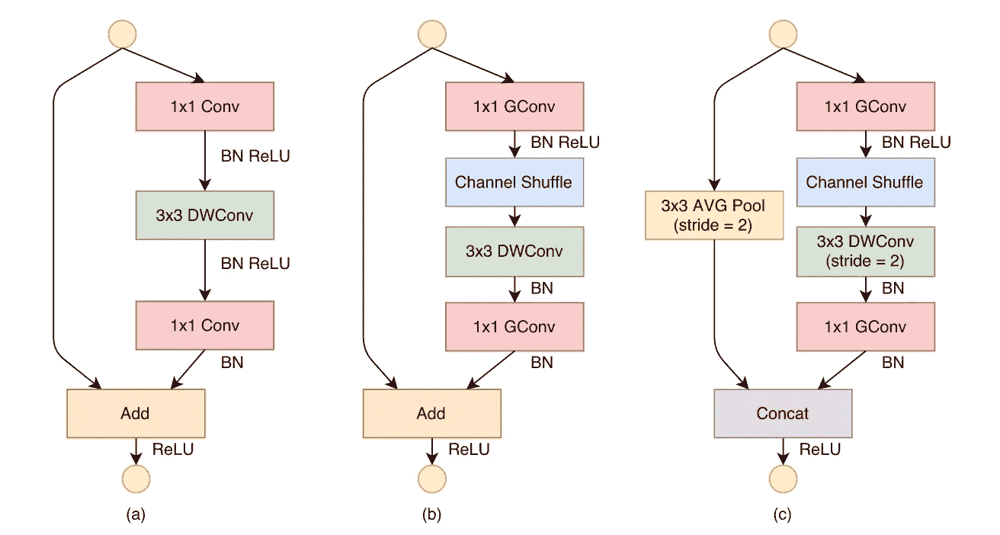
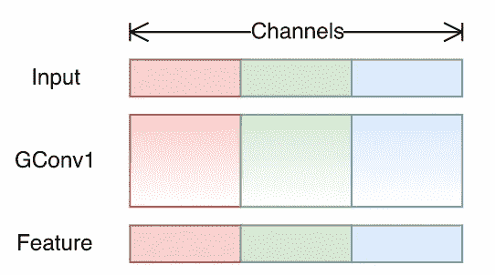
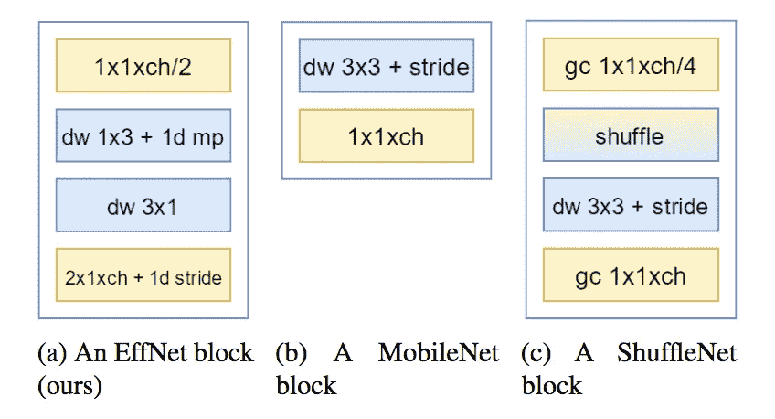
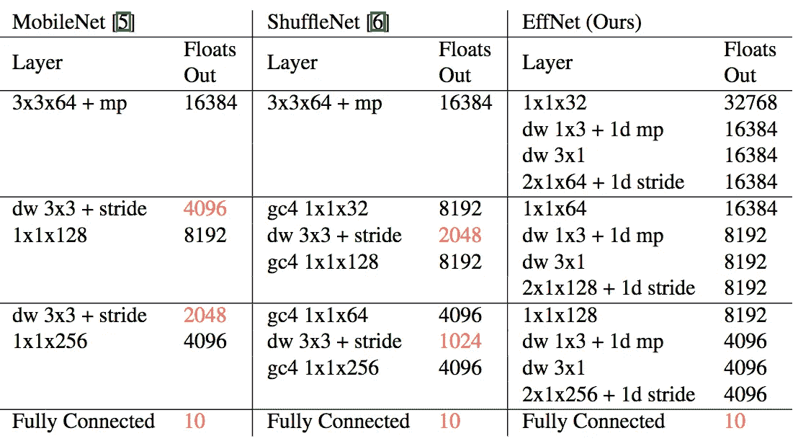
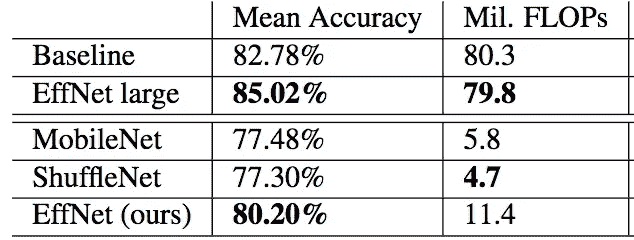

# 3 个小而强大的卷积网络

> 原文：<https://towardsdatascience.com/3-small-but-powerful-convolutional-networks-27ef86faa42d?source=collection_archive---------2----------------------->

为了在 ImageNet 上获得最佳精度，已经开发了许多 CNN 架构。计算能力不限这个比赛，何苦呢？

然而，您可能希望在旧的笔记本电脑上运行您的模型，可能没有 GPU，甚至在您的移动电话上。让我们看看三种 CNN 架构，它们效率很高，但精度性能却很低。

# MobileNet

Arxiv 链接:[(霍华德等人，2017)](https://arxiv.org/abs/1704.04861)

MobileNet 使用**深度方向可分离**T4 卷积。这个卷积块最初由[异常](https://arxiv.org/abs/1610.02357)引入。深度方向可分离卷积由两种运算组成:深度方向卷积和点方向卷积。

**标准卷积**作用于特征图的空间维度以及输入和输出通道。它的计算成本为**Df * M * N * Dk**；Df 表示输入特征映射的维数，M 和 N 表示输入和输出通道的数量，Dk 表示内核大小。

**深度方向卷积**分别在每个输入通道上映射一个卷积。因此它的输出通道数与输入通道数相同。It 计算成本为 **Df * M * Dk** 。

最后一个操作是**逐点卷积**。这是一个核大小为 1×1 的卷积，它简单地组合了由深度方向卷积创建的特征。It 计算成本为 **M * N * Df** 。

深度方向可分离卷积的计算成本是深度方向和点方向操作的成本之和。与普通卷积相比，它提供了 **1/N + 1/Dk** 的计算减少。内核大小为 3x3 时，操作次数减少了 8 倍！

MobileNet 还提供了两个参数，允许进一步减少其操作数量:**宽度乘数**(在 0 和 1 之间)减少通道数量。在每一层，不是产生 N 个通道，而是产生 alpha * N。该乘数可用于处理所需延迟和性能之间的权衡。另一个乘数存在:分辨率乘数**。它缩放图像的输入大小，在 224 到 128 之间。因为 MobileNet 使用全局平均池而不是 flatten，所以您可以在 224x224 图像上训练您的 MobileNet，然后在 128x128 图像上使用它！事实上，对于全局池，网络末端的全连接分类器仅取决于通道的数量，而不是特征映射的空间维度。**

# **沙狐球网**

**Arxiv 链接:[(张等，2017)](https://arxiv.org/abs/1707.01083)**

**ShuffleNet 引入了三种不同的随机单元。由**组卷积**和**信道洗牌**组成。**

****

**一个**组卷积**就是几个卷积，每个卷积取输入通道的一部分。在下图中，您可以看到一个组卷积，有 3 个组，每个组取 3 个输入通道中的一个。**

****

**AlexNet [(Krizhevsky et al，2012)](https://papers.nips.cc/paper/4824-imagenet-classification-with-deep-convolutional-neural-networks) 首先提出将一个网络分成两个 GPU。**

**这大大减少了计算成本。让我们举一个可行的例子:如果有 4 个输入通道和 8 个输出通道，我们选择两组，每组有 2 个输入通道和 4 个输出通道。**

**对于一个组，计算成本将是 **Df * Dk * 4 * 8** ，而对于两个组，成本是(Df * Dk * 2 * 4) * 2 或 **Df * Dk * 4 * 4** 。一半的手术！作者用 8 组达到了最好的结果，因此减少甚至更重要。**

**最后，作者添加了一个**通道混洗**，随机混合组卷积的输出通道。产生这种随机性的诀窍可以在[这里](https://github.com/arthurdouillard/keras-shufflenet/blob/master/shufflenet.py#L37-L48)看到。**

# **EffNet**

**Arxiv 链接: [(Freeman 等，2018)](https://arxiv.org/abs/1801.06434)**

**EffNet 使用**空间可分离卷积**。它非常类似于 MobileNet 的深度方向可分卷积。**

****

**可分离的深度方向卷积是 EffNet 块的蓝色矩形。它由与行核(1x3)的深度方向卷积组成，随后是可分离池，最后是与列核(3x1)的深度方向卷积。**

**让我们看看计算增益。使用 3x3 内核的正常深度方向的成本为 3 * Df * M。使用 1x3 内核的第一个深度方向的计算成本为 3 * Df * M。可分离池将特征映射高度减半，具有边际成本。具有 3×1 内核的第二深度方向的成本为 3 * Df /2 * M。因此，总成本为 **1.5 * (3 * Df * M)** 。比正常深度少一半！**

**EffNet 相对于 MobileNet 和 ShuffleNet 所做的另一项优化是在开始时没有“正常卷积”:**

****

**引用作者的话:**

> **MobileNet 和 ShuffleNet 都避免替换第一层，声称这一层已经相当便宜了。我们恭敬地不同意这种说法，并认为每一次优化都是有价值的。在优化了网络中的其余层之后，第一层成比例地变大。在我们的实验中，**用我们的 EffNet 块替换第一层为相应的层**节省了 30%的计算。**

# **TL；速度三角形定位法(dead reckoning)**

**MobileNet、ShuffleNet 和 EffNet 是 CNN 架构，旨在优化操作数量。每个人都用自己的版本取代了经典卷积。**

****MobileNet** ( [github](https://github.com/arthurdouillard/keras-mobilenet) )深度方向可分离卷积使用深度方向卷积，后跟点方向卷积。此外，它还引入了两个超参数:减少通道数量的宽度乘数和减少特征映射空间维度的分辨率乘数。**

****shuffle net**([github](https://github.com/arthurdouillard/keras-shufflenet))分组使用逐点卷积。为了组合每个组产生的特征，还引入了洗牌层。**

**最后，**EffNet**([github](https://github.com/arthurdouillard/keras-effnet))使用空间可分离卷积，它只是沿 x 和 y 轴分离的深度方向卷积，它们之间有一个可分离池。**

****

**Benchmark on CIFAR 10**

**这篇文章已经被翻译成中文了！[此处](https://yq.aliyun.com/articles/592935)。**