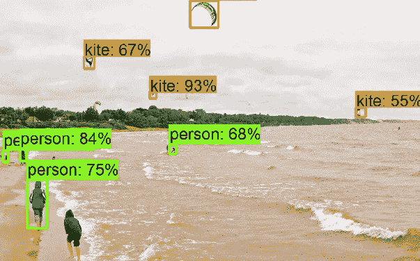
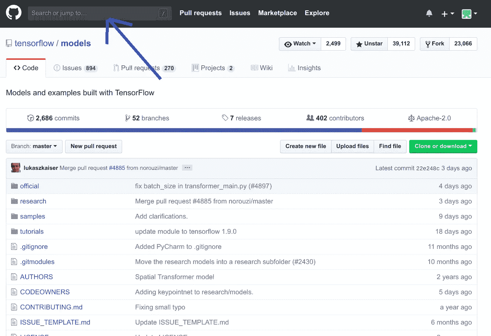
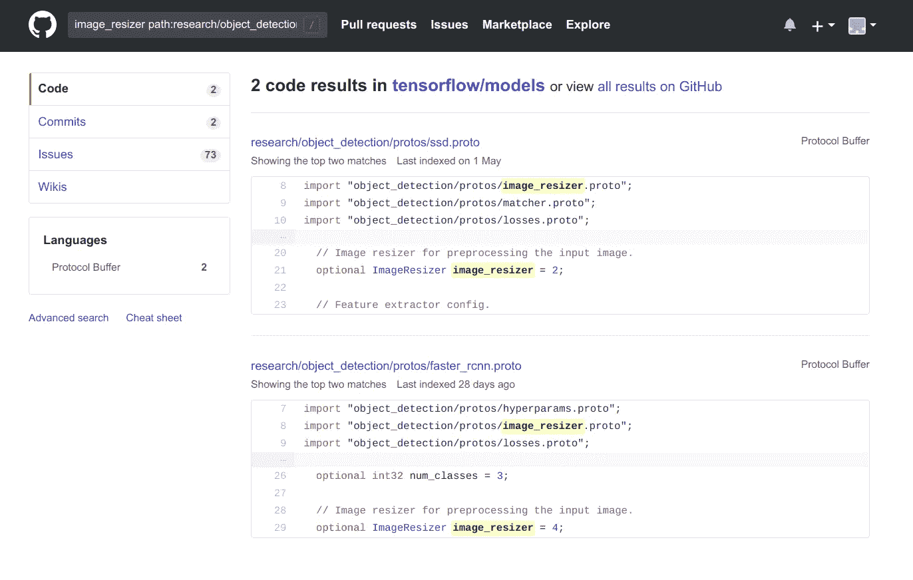
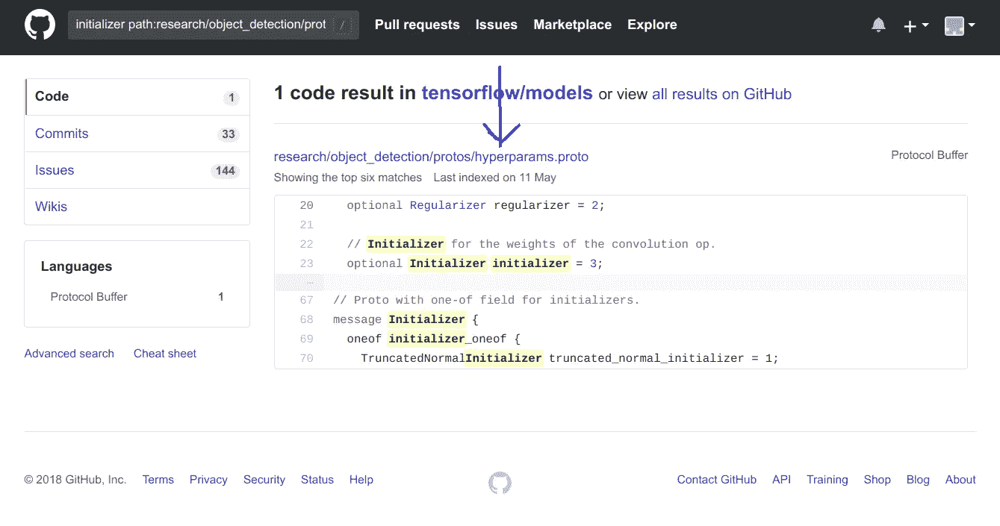
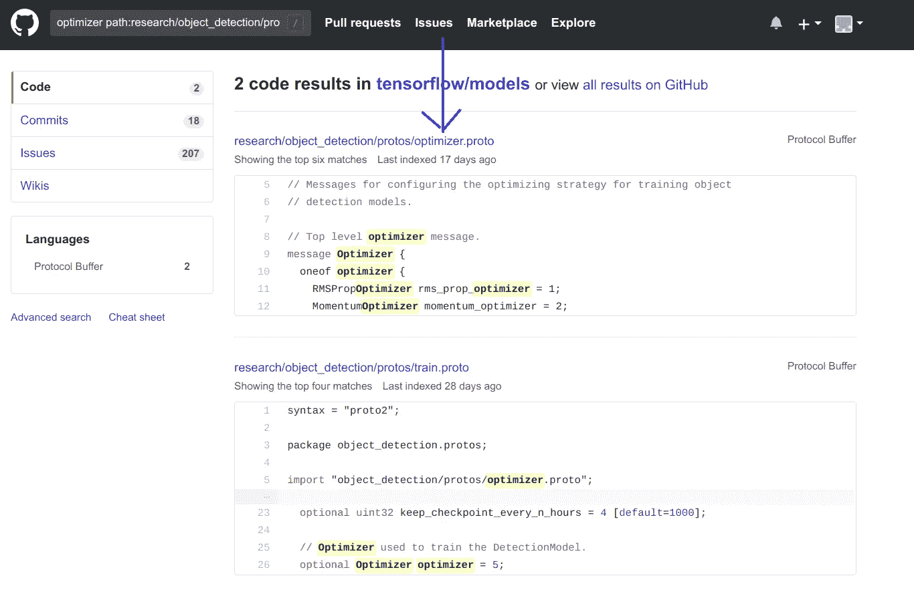

# 在 TensorFlow 对象检测 API 中更新更快的 R-CNN/SSD 模型参数的 3 个步骤

> 原文：<https://towardsdatascience.com/3-steps-to-update-parameters-of-faster-r-cnn-ssd-models-in-tensorflow-object-detection-api-7eddb11273ed?source=collection_archive---------1----------------------->



我写过一篇关于配置 TensorFlow 对象检测 API 的文章。请参考这个故事[这里](https://becominghuman.ai/tensorflow-object-detection-api-tutorial-training-and-evaluating-custom-object-detector-ed2594afcf73)来配置 API。那个故事是这篇文章的先决条件。

在这个故事中，我将讨论如何改变预训练模型的配置。这篇文章的目的是你可以根据你的应用程序配置 [TensorFlow/models](https://github.com/tensorflow/models) ，API 将不再是一个黑盒！

文章概述:

*   了解协议缓冲区和`proto`文件。
*   利用`proto`文件的知识，我们如何理解模型的[配置文件](https://github.com/tensorflow/models/tree/master/research/object_detection/samples/configs)
*   更新模型参数需要遵循的 3 个步骤
*   杂项示例:

1.  更改权重初始值设定项
2.  更改权重优化器
3.  评估预训练模型。

## 协议缓冲区

为了修改这个模型，我们需要了解它的内部机制。 [TensorFlow 对象检测 API](https://github.com/tensorflow/models/) 使用[协议缓冲区](https://developers.google.com/protocol-buffers/)，这是一种独立于语言、独立于平台且可扩展的机制，用于序列化结构化数据。它就像规模较小的 XML，但是更快更简单。API 使用协议缓冲语言的 *proto2* 版本。我将尝试解释更新预配置模型所需的这种语言。有关协议缓冲语言的更多详细信息，请参考本[文档](https://developers.google.com/protocol-buffers/docs/proto)和 [Python 教程](https://developers.google.com/protocol-buffers/docs/pythontutorial)。

协议缓冲区的工作可以用以下 3 个步骤来解释:

*   在`.proto`文件中定义消息格式。这个文件就像所有消息的蓝图，它显示了消息接受的所有参数，参数的数据类型应该是什么，参数是必需的还是可选的，参数的标签号是什么，参数的默认值是什么等等。API 的 protos 文件可以在[这里](https://github.com/tensorflow/models/tree/master/research/object_detection/protos)找到。为了便于理解，我使用的是[grid _ anchor _ generator . proto](https://github.com/tensorflow/models/blob/master/research/object_detection/protos/grid_anchor_generator.proto)文件。

从第 30-33 行可以清楚地看到，参数`scales`和`aspect_ratios`对于消息`GridAnchorGenerator`是强制的，而其余的参数是可选的，如果没有通过，将采用默认值。

*   定义消息格式后，我们需要编译协议缓冲区。这个编译器将从`.proto`文件生成类文件。在安装 API 的过程中，我们运行了以下命令，该命令将编译协议缓冲区:

```
# From tensorflow/models/research/
protoc object_detection/protos/*.proto --python_out=.
```

*   在定义并编译好协议缓冲区之后，我们需要使用 Python 协议缓冲区 API 来写入和读取消息。在我们的例子中，我们可以将配置文件视为协议缓冲 API，它可以写入和读取消息，而忽略 TensorFlow API 的内部机制。换句话说，我们可以通过适当地更改配置文件来更新预训练模型的参数。

## 了解配置文件

很明显，配置文件可以帮助我们根据需要改变模型的参数。下一个问题是我们如何改变模型的参数？本节和下一节将回答这个问题，在这里`proto`文件的知识将会派上用场。出于演示的目的，我使用了[fast _ rcnn _ resnet 50 _ pets . config](https://github.com/tensorflow/models/blob/master/research/object_detection/samples/configs/faster_rcnn_resnet50_pets.config)文件。

第 7–10 行暗示`num_classes`是`faster_rcnn`消息的参数之一，而后者又是消息`model`的参数。同样，`optimizer`是父`train_config`消息的子消息，而`batch_size`是`train_config`消息的另一个参数。我们可以通过检查相应的 [protos](https://github.com/tensorflow/models/tree/master/research/object_detection/protos) 文件来验证这一点。

Snippet of [faster_rcnn.proto](https://github.com/tensorflow/models/blob/master/research/object_detection/protos/faster_rcnn.proto)

从第 20 行和第 26 行可以清楚地看出`num_classes`是消息`faster_rcnn`的`optional`参数之一。我希望到目前为止的讨论有助于理解配置文件的组织。现在，是正确更新模型的一个参数的时候了。

> 步骤 1:决定要更新的参数

假设我们需要更新[faster _ rcnn _ resnet 50 _ pets . config](https://github.com/tensorflow/models/blob/master/research/object_detection/samples/configs/faster_rcnn_resnet50_pets.config)文件第 10 行提到的`image_resizer`参数。

> 步骤 2:在存储库中搜索给定的参数

目标是定位参数的`proto`文件。为此，我们需要在存储库中进行搜索。



Search in the repository

我们需要搜索以下代码:

```
parameter_name path:research/object_detection/protos#in our case parameter_name="image_resizer" thus,
image_resizer path:research/object_detection/protos
```

这里`path:research/object_detection/protos`限定了搜索域。更多关于如何在 GitHub 上搜索的信息可以在[这里](https://help.github.com/articles/searching-code/)找到。搜索`image_resizer path:research/object_detection/protos`的输出如下所示:



Search result of `image_resizer path:research/object_detection/proros`

从输出中可以清楚地看到，要更新`image_resizer`参数，我们需要分析`image_resizer.proto`文件。

> 第三步:分析`proto`文件

[image_resizer.proto](https://github.com/tensorflow/models/blob/master/research/object_detection/protos/image_resizer.proto) file.

从第 8-10 行可以清楚地看出，我们可以使用`keep_aspect_ratio_resizer`或`fixed_shape_resizer`来调整图像的大小。在分析第 23-44 行时，我们可以看到消息`keep_aspect_ratio_resizer`有参数:`min_dimension`、`max_dimension`、`resize_method`、`pad_to_max_dimension`、`convert_to_grayscale`和`per_channel_pad_value`。而且，`fixed_shape_resizer`有参数:`height`、`width`、`resize_method`、`convert_to_grayscale`。所有参数的数据类型都在`proto`文件中提及。因此，要更改`image_resizer`类型，我们可以在配置文件中更改以下几行。

```
#before
image_resizer {
keep_aspect_ratio_resizer {
min_dimension: 600 
max_dimension: 1024
    }
}#after
image_resizer {
fixed_shape_resizer {
height: 600
width: 500
resize_method: AREA
  }
}
```

上面的代码使用 AREA resize 方法将图像的大小调整为 500 * 600。TensorFlow 中可用的各种调整大小的方法可以在这里找到[。](https://www.tensorflow.org/api_docs/python/tf/image/ResizeMethod)

> 杂项示例

我们可以使用上一节中讨论的步骤来更新/添加任何参数。我将在这里演示一些常用的示例，但是上面讨论的步骤可能有助于更新/添加模型的任何参数。

## 改变重量初始化器

*   决定更改[文件 faster _ rcnn _ resnet 50 _ pets . config](https://github.com/tensorflow/models/blob/master/research/object_detection/samples/configs/faster_rcnn_resnet50_pets.config)第 35 行的参数`initializer`。
*   在存储库中搜索`initializer path:research/object_detection/protos`。从搜索结果来看，很明显我们需要分析`hyperparams.proto`文件。



Search result of `initializer path:research/object_detection/proros`

*   [hyperparams.proto](https://github.com/tensorflow/models/blob/b9ca525f88cd942882ca541ec5ac9d27bb87a24f/research/object_detection/protos/hyperparams.proto) 文件中的第 68–74 行解释了`initializer`配置。

```
message Initializer {
  oneof initializer_oneof {
    TruncatedNormalInitializer truncated_normal_initializer = 1;
    VarianceScalingInitializer variance_scaling_initializer = 2;
    RandomNormalInitializer random_normal_initializer = 3;
  }
}
```

我们可以使用`random_normal_intializer`代替`truncated_normal_initializer`，因为我们需要分析 [hyperparams.proto](https://github.com/tensorflow/models/blob/b9ca525f88cd942882ca541ec5ac9d27bb87a24f/research/object_detection/protos/hyperparams.proto) 文件中的第 99–102 行。

```
message RandomNormalInitializer {
  optional float mean = 1 [default = 0.0];
  optional float stddev = 2 [default = 1.0];
}
```

很明显`random_normal_intializer`有两个参数`mean`和`stddev`。我们可以更改配置文件中的以下行来使用`random_normal_intializer`。

```
#before
initializer {
    truncated_normal_initializer {
        stddev: 0.01
       }
}#after
initializer {
    random_normal_intializer{
       mean: 1 
       stddev: 0.5
       }
}
```

## 更改权重优化器

*   决定更改[fast _ rcnn _ resnet 50 _ pets . config](https://github.com/tensorflow/models/blob/master/research/object_detection/samples/configs/faster_rcnn_resnet50_pets.config)文件第 87 行父消息`optimizer`的参数`momentum_optimizer`。
*   在存储库中搜索`optimizer path:research/object_detection/protos`。从搜索结果来看，很明显我们需要分析`optimizer.proto`文件。



Search result of optimizer `path:research/object_detection/proros`

*   [optimizer.proto](https://github.com/tensorflow/models/blob/7025590841588e82f371ef0fef7dd77a8a71efb8/research/object_detection/protos/optimizer.proto) 文件中的第 9–14 行，expain `optimizer`配置。

```
message Optimizer {
  oneof optimizer {
    RMSPropOptimizer rms_prop_optimizer = 1;
    MomentumOptimizer momentum_optimizer = 2;
    AdamOptimizer adam_optimizer = 3;
  }
```

很明显，我们可以使用已经被证明是很好的优化器的`adam_optimizer`来代替`momentum_optimizer`。为此，我们需要对 f[aster _ rcnn _ resnet 50 _ pets . config](https://github.com/tensorflow/models/blob/master/research/object_detection/samples/configs/faster_rcnn_resnet50_pets.config)文件进行以下更改。

```
#before
optimizer {  
  momentum_optimizer: {
      learning_rate: {
           manual_step_learning_rate {
          initial_learning_rate: 0.0003
          schedule {
            step: 900000
            learning_rate: .00003
          }
          schedule {
            step: 1200000
            learning_rate: .000003
          }
        }
      }
      momentum_optimizer_value: 0.9
    }#after
optimizer {
  adam_optimizer: {
      learning_rate: {
       manual_step_learning_rate {
          initial_learning_rate: 0.0003
          schedule {
            step: 900000
            learning_rate: .00003
          }
          schedule {
            step: 1200000
            learning_rate: .000003
          }
        }
      }
    }
```

## 评估预训练模型

Eval 等待 300 秒检查训练模型是否更新！如果你的 GPU 很好，你可以同时训练和评估这两者！一般情况下，资源会被耗尽。为了克服这一点，我们可以首先训练模型，将其保存在目录中，然后评估模型。为了以后进行评估，我们需要在配置文件中进行以下更改:

```
#Before
eval_config: {
  num_examples: 2000
  # Note: The below line limits the evaluation process to 10 evaluations.
  # Remove the below line to evaluate indefinitely.
  max_evals: 10
}#after
eval_config: {
num_examples: 10
num_visualizations: 10
eval_interval_secs: 0
}
```

`num_visualizations`应该等于待评估的数量！可视化的数量越多，评估所需的时间就越长。如果你的 GPU 有足够的能力同时训练和评估，你可以保留`eval_interval_secs: 300`。此参数用于决定运行评估的频率。我按照上面讨论的 3 个步骤得出了这个结论。

简单地说，协议缓冲区的知识帮助我们理解了模型的参数是以消息的形式传递的，要更新参数我们可以参考`.proto`文件。讨论了找到正确的`.proto`文件以更新参数的 3 个简单步骤。最近在 [neptune.ai](https://neptune.ai/) 上偶然看到[这篇文章](https://neptune.ai/blog/how-to-train-your-own-object-detector-using-tensorflow-object-detection-api)，对进一步参考有用。

请在评论中提及您想要在配置文件中更新/添加的任何参数。

希望这篇文章有所帮助。

索达