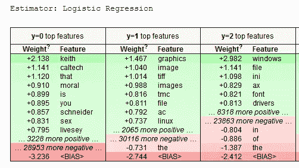
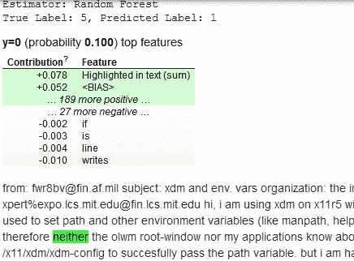
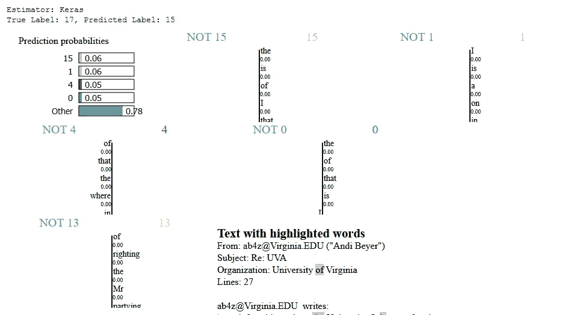
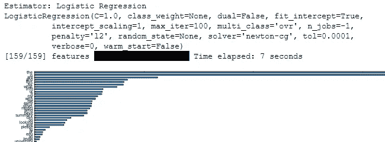
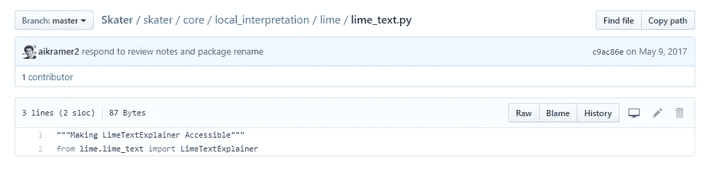

# 向管理层和客户解释 NLP 模型的 3 种方法

> 原文：<https://towardsdatascience.com/3-ways-to-interpretate-your-nlp-model-to-management-and-customer-5428bc07ce15?source=collection_archive---------4----------------------->


Photo: [https://cdn.pixabay.com/photo/2017/02/22/20/02/landscape-2090495_960_720.jpg](https://cdn.pixabay.com/photo/2017/02/22/20/02/landscape-2090495_960_720.jpg)

机器学习(ML)和人工智能(AI)改变了做生意的格局。许多公司雇佣数据科学家(我就是其中之一:)来交付数据产品。

交付具有“高”精度的引擎是绝对容易的(这是我用双引号引起来的[原因](/how-can-use-player-name-to-predict-world-cup-with-80-accuracy-262d076544c4))。如果有人问原因，我们可以说这个模型是黑箱或者是几年前的统计计算，但是现在我们不能这么说了。我们还需要说服产品团队和管理层相信我们的模型，但我们不能简单地说引擎从数据中“学习”了什么，或者它是一个无法解释的黑盒。

当然，在某些特殊的场景中，我们可能不需要解释模型。例如，您不想向公众解释欺诈检测模型。否则，公众可以找到“黑”系统的方法。

看完这篇文章，你会明白:

*   什么是模型解释？
*   为什么我们需要解释模型？
*   解读自然语言处理模型
*   拿走
*   参考

# 什么是模型解释？

模型解释意味着提供原因和背后的逻辑，以实现模型的可问责性和透明性。有许多类型的模型解释，包括:

*   在 ***探索性数据分析*** (EDA)中，我们可能会应用主成分分析(PCA)或 t-分布随机邻居嵌入(t-SNE)来了解特征
*   ***建成模型*** 后，我们将使用各种度量来度量分类和回归模型。准确度、精确度和召回率用于分类，而均方误差(MSE)用于回归。这种度量帮助我们理解模型性能
*   除了 ***性能*** 之外，还可以从模型中检索静态特征汇总，如特征重要性。然而，它只存在于基于决策树算法中，如随机森林算法和 XGBoost 算法。
*   当 ***评估模型*** 时，我们想知道为什么预测错了。我们可以利用图书馆来解释它，这样我们就可以修复它。


Photo: [https://pixabay.com/en/whiteboard-man-presentation-write-849812/](https://pixabay.com/en/whiteboard-man-presentation-write-849812/)

在解释模型之前，我们可以先了解模型解释的标准:

***可解释性***

*   内在:我们不需要训练另一个模型来解释目标。例如，它使用决策树或线性模型
*   事后:该模型属于黑箱模型，我们需要使用另一个模型来解释它。在接下来的部分中，我们将重点关注这一领域

***接近***

*   特定于模型:一些工具仅限于特定的模型，如线性模型和神经网络模型。
*   模型不可知:另一方面，一些工具能够通过构建写盒模型来解释任何模型。

***级***

*   全局:说明特征权重等整体模型。这给了你一个通用的模型行为
*   局部:说明具体预测结果。

# 为什么我们需要解释模型？

如前所述，我们应该在大部分场景中进行解释，因为:

*   ***问责*** 。模型应该有责任为消费者提供一个正确(相对)的答案。作为模型作者，我们应该验证模型特性，以保证它有助于做出正确的决策，但不要尽可能多地包含特性。
*   ***透明度*** 。机器学习不是一个黑匣子，我们应该向客户和管理层提供透明的模型。这样他们就知道你为什么这么做了。就像开源一样，人们更愿意使用开源，因为他们知道你在做什么。
*   ***信任度*** 。如果消费者想要使用分类或预测结果，这是基本要求。大多数时候，用户有一些领域的知识，如交易者需要了解为什么你提供购买/出售特定股票的决定。

# 解读自然语言处理模型

如你所知，我主要关注 NLP。因此，我只演示解释 NLP 模型的能力，尽管下面的库也可以解释其他问题，如回归和图像。

对于下面的演示，为了便于理解，我没有做任何预处理。在现实生活中的商业问题，我们应该做预处理的所有时间。否则，垃圾进垃圾出。

几个库帮助解释模型，包括解释像我五岁( [ELI5](https://github.com/TeamHG-Memex/eli5) )、本地可解释的模型不可知解释([LIME](https://github.com/marcotcr/lime))【1】和[溜冰者](https://github.com/datascienceinc/Skater)。

*   ***库:*** 我将演示我们如何使用 ELI5 和石灰。滑冰者怎么样？请继续关注，将解释我为什么不在 NLP 中使用它的原因。
*   ***算法:*** 在下面的演示中，会包括线性模型(scikit-learn 中的 Logistic 回归)、集成模型(scikit-learn 中的随机森林，XGBoost)和深度学习模型(keras 中的自建词嵌入)。关于文字嵌入，可以查看我之前的[帖子](/3-silver-bullets-of-word-embedding-in-nlp-10fa8f50cc5a)了解详情。

**ELI5**


Photo: [http://explain-like-i-am-five.tumblr.com/post/158611418472/eli5-the-concept-of-bankruptcy](http://explain-like-i-am-five.tumblr.com/post/158611418472/eli5-the-concept-of-bankruptcy)

ELI5 提供了全局模型解释和局部模型解释。你可能简单地认为全局模型解释是一个重要的特性，但它不仅支持决策树算法，如 Radom Forest 和 XGBoost，还支持所有 sci-kit 学习估计器。

ELI5 作者将其称为**排列重要性**用于全局解释。为了计算得分，特征(一个词)将被其他词(噪音)代替并预测它。其思想是，当没有提供特定单词时，可以通过获得分数降低多少来推断特征重要性[2]。比如“我喜欢苹果”。它可能会更改为“我喜欢橙色”，然后它会对新创建的记录进行分类，以了解“苹果”的重要性。当然，我们需要假设被替换的单词(例如橙色)是噪声，并且它不应该在分数上提供大的变化。

```
for pipeline in pipelines:
    print('Estimator: %s' % (pipeline['name']))
    labels = pipeline['pipeline'].classes_.tolist()

    if pipeline['name'] in ['Logistic Regression', 'Random Forest']:
        estimator = pipeline['pipeline']
    elif pipeline['name'] == 'XGBoost Classifier':
        estimator = pipeline['pipeline'].steps[1][1].get_booster()
#     Not support Keras
#     elif pipeline['name'] == 'keras':
#         estimator = pipeline['pipeline']
    else:
        continue

    IPython.display.display(
        eli5.show_weights(estimator=estimator, top=10,
        target_names=labels, vec=vec))
```



上图意味着，如果输入包括“keith ”,则 y=0 的得分增加 2.138。另一种情况是“the”，它将在 y=1 和 y=2 时分别降低分数-0.731 和-1.387。

对于局部模型解释，ELI5 使用 LIME 算法。显示格式不同于石灰，但使用相同的想法。

```
number_of_sample = 1
sample_ids = [random.randint(0, len(x_test) -1 ) for p in range(0, number_of_sample)]for idx in sample_ids:
    print('Index: %d' % (idx))
#     print('Index: %d, Feature: %s' % (idx, x_test[idx]))
    for pipeline in pipelines:
        if pipeline['name'] in ['Logistic Regression', 'Random Forest']:
            estimator = pipeline['pipeline'].steps[1][1]
        elif pipeline['name'] == 'XGBoost Classifier':
            estimator = pipeline['pipeline'].steps[1][1].get_booster()
        #     Not support Keras
#         elif pipeline['name'] == 'Keras':
#             estimator = pipeline['pipeline'].model
        else:
            continueIPython.display.display(
            eli5.show_prediction(estimator, x_test[idx], top=10, vec=vec, target_names=labels))
```



ELI5 解释了测试数据，判定可能是 y=0，概率为 0.031。它还突出显示了一些高正面得分和负面得分单词。

***石灰***


Photo: [https://www.weightlossresources.co.uk/recipes/calorie-counted/drinks/lime-soda-1-pint-309537.htm](https://www.weightlossresources.co.uk/recipes/calorie-counted/drinks/lime-soda-1-pint-309537.htm)

顾名思义，LIME 只关注本地模型可解释和模型不可知的部分。

将训练好的模型和目标记录传递到石灰库。将创建线性词袋模型，并为训练白盒模型提供大量生成的记录。while box 模型作为一个二元分类器工作，指示单词存在的影响。比如“我喜欢苹果”。它可能会更改为“我喜欢”，然后它会对新创建的记录进行分类，以了解“苹果”有多重要。

所以不管提供的模型是什么，它也可以通过生成记录来解释模型。无论是 scikit-learn 库、XGBoost 甚至是 Keras 单词嵌入模型。在我的示例代码中，我在 sci-kit learn API 接口中实现了 Keras，这样我也可以使用 LIME 来解释 Keras 的单词嵌入模型。

```
number_of_sample = 1
sample_ids = [random.randint(0, len(x_test) -1 ) for p in range(0, number_of_sample)]for idx in sample_ids:
    print('Index: %d' % (idx))
#     print('Index: %d, Feature: %s' % (idx, x_test[idx]))
    for pipeline in pipelines:
        print('-' * 50)
        print('Estimator: %s' % (pipeline['name']))

        print('True Label: %s, Predicted Label: %s' % (y_test[idx], pipeline['pipeline'].predict([x_test[idx]])[0]))
        labels = pipeline['pipeline'].classes_.tolist()

        explainer = LimeTextExplainer(class_names=labels)
        exp = explainer.explain_instance(x_test[idx], pipeline['pipeline'].predict_proba, num_features=6, top_labels=5)
        IPython.display.display(exp.show_in_notebook(text=True))

#         break
#     break
```



LIME 构建了二进制分类器，因此我们可以看到，它用权重来表示它是否是 0、9、15 类，并突出显示高正负得分单词。

***滑手***


Photo: [https://pixabay.com/en/skateboard-youth-skater-boy-skater-1869727/](https://pixabay.com/en/skateboard-youth-skater-boy-skater-1869727/)

对于全局解释，Skater 提供了特征重要性和部分相关方法。

尝试了几次，无法找到提供 sci-kit 学习管道包的方法。必须将原始文本转换为 numpy 格式并单独传递模型。第二件事是，当有大约 800 个独特的单词时，需要大约 2 分钟来准备特征重要性。

```
%matplotlib inline
import warnings
warnings.filterwarnings('ignore')
import matplotlib.pyplot as pltfrom skater.model import InMemoryModel
from skater.core.explanations import Interpretationtransfromed_x_test = vec.transform(x_test[:2]).toarray()interpreter = Interpretation(transfromed_x_test, feature_names=vec.get_feature_names())for pipeline in pipelines:
    print('-' * 50)
    print('Estimator: %s' % (pipeline['name']))

    if pipeline['name'] in ['Logistic Regression', 'Random Forest']:
        estimator = pipeline['pipeline'].steps[1][1]
    else:
        continue

    print(estimator)

    pyint_model = InMemoryModel(estimator.predict_proba, examples=transfromed_x_test)

    f, axes = plt.subplots(1, 1, figsize = (26, 18))
    ax = axes
    interpreter.feature_importance.plot_feature_importance(pyint_model, ascending=False, ax=ax)
    plt.show()
```



Skater 提供了每个单词的特征重要性。

**部分依赖**【3】是一串数字，用来一一表示目标与特征之间的关系(线性、单调或复杂)。通过提供可视化，我们可以可视化一个特征和目标之间的影响。但是，如果有 NLP，我们可能不会使用部分依赖。

用于本地解释。[滑手](https://github.com/datascienceinc/Skater/blob/master/skater/core/local_interpretation/lime/lime_text.py)包装 LIME 模块进行本地文本解释。所以我会更喜欢用原生石灰，而不是纯粹的包装纸。



Photo: [https://github.com/datascienceinc/Skater/tree/master/skater/core/local_interpretation/lime](https://github.com/datascienceinc/Skater/tree/master/skater/core/local_interpretation/lime)

# 拿走

你可以通过我的 [github](https://github.com/makcedward/nlp/blob/master/sample/nlp-model_interpretation.ipynb) repo 访问代码

*   当你阅读 [**Christoph 的博客**](https://christophm.github.io/interpretable-ml-book/) 时，你可以参考上面代码中的[局部代理模型(LIME)](https://christophm.github.io/interpretable-ml-book/lime.html) 部分。
*   作为一名数据科学家，我们必须解释模型行为，以便**产品团队和管理层信任可交付成果**和**调试您的模型。**否则你可能不知道你造的是什么。
*   对于 NLP 问题，特征重要性或置换特征重要性**要求太多特征** (word)。不太有用/推荐用在 NLP 方面。
*   LIME **在某些场景下无法正确解释模型**。例如，分数可以每次都不同，因为它随机生成样本。会有另一篇文章介绍如何解决。
*   对于 ELI5，在 ELI5 中的 show_weight(全局解释)中支持 **sci-kit 学习管道**，但在 show_prediction (局部解释)**中不支持**。**原因在[这里提到的是](https://github.com/TeamHG-Memex/eli5/issues/15)。要克服它，你可以简单地直接使用石灰。**
*   分类器为 XGBoost 分类器使用 ELI5(版本:0.8)时有 [bug](https://github.com/TeamHG-Memex/eli5/issues/259) 。如果使用 **XGBoost 分类器，由于 Eli 5 bug(xgb _ classifier . get _ booster())，必须执行一些变通方法**
*   对于 Keras 模型，实现了 sci-kit learn API 接口，但仍无法使用 ELI5。ELI5 将检查对象类型以防止意外的库。
*   特别感谢迪潘詹(DJ)萨卡补充对溜冰部分。

# 关于我

我是湾区的数据科学家。专注于数据科学、人工智能，尤其是 NLP 和平台相关领域的最新发展。

从[http://medium.com/@makcedward/](http://medium.com/@makcedward/)访问我的博客

从 https://www.linkedin.com/in/edwardma1026[获得连接](https://www.linkedin.com/in/edwardma1026)

探索我来自 https://github.com/makcedward[的代码](https://github.com/makcedward)

从 https://www.kaggle.com/makcedward[查我的内核](https://www.kaggle.com/makcedward)

# 参考

*   [1]马尔科·图利奥·里贝罗、萨梅尔·辛格、卡洛斯·盖斯特林。“我为什么要相信你？”解释任何分类器的预测。2016 年 9 月。[https://arxiv.org/pdf/1602.04938.pdf](https://arxiv.org/pdf/1602.04938.pdf)
*   [2]布雷曼·利奥。《随机森林》。2001 年 1 月[https://www.stat.berkeley.edu/~breiman/randomforest2001.pdf](https://www.stat.berkeley.edu/~breiman/randomforest2001.pdf)
*   [3]杰罗姆·弗里德曼，2001 年。"贪婪函数逼近:梯度推进机."2001 年 4 月[https://statweb.stanford.edu/~jhf/ftp/trebst.pdf](https://statweb.stanford.edu/~jhf/ftp/trebst.pdf)