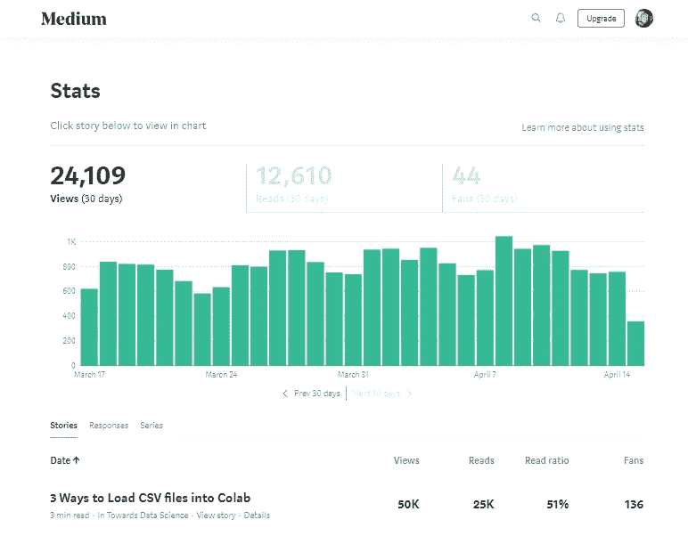

# 入门:将 CSV 文件加载到 Colab 的 3 种方法

> 原文：<https://towardsdatascience.com/3-ways-to-load-csv-files-into-colab-7c14fcbdcb92?source=collection_archive---------0----------------------->

没有数据，数据科学就什么都不是。是的，那是明显的。不太明显的是将数据转换成允许您浏览数据的格式所涉及的一系列步骤。您可能拥有 CSV 格式的数据集(逗号分隔值的缩写)，但不知道下一步该做什么。这篇文章将通过允许您将 CSV 文件加载到 Colab 来帮助您开始学习数据科学。

**Colab**(co laboratory 的缩写)是谷歌的一个免费平台，允许用户用 Python 编码。Colab 本质上是 Jupyter 笔记本的谷歌套件版本。与 Jupyter 相比，Colab 的一些优势包括更容易安装软件包和共享文档。然而，当加载像 CSV 文件这样的文件时，它需要一些额外的编码。我将向您展示三种将 CSV 文件加载到 Colab 并将其插入 Pandas 数据帧的方法。

(注意:Python 包中包含了常见的数据集。我不会在本文中讨论加载这些数据集。)

首先，请登录您的 Google 帐户，进入 Google Drive。点击左侧的**新**按钮，如果安装了**协同实验室**(如果没有，点击**连接更多应用**，搜索协同实验室并安装)。从那里，如下所示导入熊猫(Colab 已经安装了它)。

```
import pandas as pd
```

## 1)从 Github(文件< 25MB)

The easiest way to upload a CSV file is from your GitHub repository. Click on the dataset in your repository, then click on **查看 Raw** 。将链接复制到原始数据集，并在 Colab 中将它存储为一个名为 url 的字符串变量，如下所示(一个更简洁的方法，但不是必需的)。最后一步是将 url 加载到 Pandas read_csv 中以获得 dataframe。

```
url = 'copied_raw_GH_link'df1 = pd.read_csv(url)# Dataset is now stored in a Pandas Dataframe
```

## 2)从本地驱动器

要从本地驱动器上传，请从以下代码开始:

```
from google.colab import files
uploaded = files.upload()
```

它会提示您选择一个文件。点击**选择文件**，然后选择并上传文件。等待文件 100%上传。一旦 Colab 上传了文件，您应该会看到它的名称。

最后，键入以下代码，将其导入到 dataframe 中(确保文件名与上传文件的名称相匹配)。

```
import iodf2 = pd.read_csv(io.BytesIO(uploaded['Filename.csv']))# Dataset is now stored in a Pandas Dataframe
```

## 3)通过 PyDrive 从 Google Drive

这是三种方法中最复杂的一种。我将展示给那些将 CSV 文件上传到 Google Drive 进行工作流控制的人。首先，键入以下代码:

```
# Code to read csv file into Colaboratory:!pip install -U -q PyDrive
from pydrive.auth import GoogleAuth
from pydrive.drive import GoogleDrive
from google.colab import auth
from oauth2client.client import GoogleCredentials# Authenticate and create the PyDrive client.
auth.authenticate_user()
gauth = GoogleAuth()
gauth.credentials = GoogleCredentials.get_application_default()
drive = GoogleDrive(gauth)
```

出现提示时，点击链接获得认证，以允许谷歌访问您的驱动器。您应该会看到一个屏幕，顶部显示“ **Google Cloud SDK 想要访问您的 Google 帐户**”。在您允许权限后，复制给定的验证码并将其粘贴到 Colab 中的框中。

完成验证后，转到 Google Drive 中的 CSV 文件，右键单击并选择“**获取可共享链接**”。该链接将被复制到您的剪贴板中。将这个链接粘贴到 Colab 中的一个字符串变量中。

```
link = '[https://drive.google.com/open?id=**1DPZZQ43w8brRhbEMolgLqOWKbZbE-IQu**'](https://drive.google.com/open?id=1DPWWI61v2brRhbEMolgLqOWKbZbE-IQu') # The shareable link
```

你想要的是等号后面的 id 部分*。要获得这一部分，请键入以下代码:*

```
fluff, id = link.split('=')print (id) # Verify that you have everything after '='
```

最后，键入以下代码，将该文件放入数据帧中

```
downloaded = drive.CreateFile({'id':id}) 
downloaded.GetContentFile('Filename.csv')  
df3 = pd.read_csv('Filename.csv')# Dataset is now stored in a Pandas Dataframe
```

## 最后的想法

这是将 CSV 文件上传到 Colab 的三种方法。根据文件的大小和组织工作流的方式，每种方法都有其优点。一旦数据有了更好的格式，比如熊猫数据帧，就可以开始工作了。

## **奖励方式——我的动力**



非常感谢你的支持。为了纪念这篇文章达到 50k 的浏览量和 25k 的阅读量，我提供了一个将 CSV 文件导入 Colab 的额外方法。这个很简单干净。在你的 Google Drive (" **My Drive** ")中，在你选择的位置创建一个名为 **data** 的文件夹。这是您上传数据的地方。

从 Colab 笔记本中，键入以下内容:

```
from google.colab import drive
drive.mount('/content/drive')
```

就像第三种方法一样，命令会将您带到 Google 身份验证步骤。您应该会看到一个屏幕，上面显示 **Google Drive 文件流想要访问您的 Google 帐户。**得到允许后，复制给定的验证码，粘贴到 Colab 中的框内。

在笔记本中，点击笔记本左上角的炭笔 **>** ，点击**文件**。找到您之前创建的**数据**文件夹并找到您的数据。右击您的数据并选择**复制路径**。将这个复制的路径存储到一个变量中，就可以开始了。

```
path = "*copied path*"
df_bonus = pd.read_csv(path)# Dataset is now stored in a Pandas Dataframe
```

这种方法的伟大之处在于，你可以从你自己的 Google Drive 中创建的单独的数据集文件夹中访问数据集，而无需第三种方法中涉及的额外步骤。