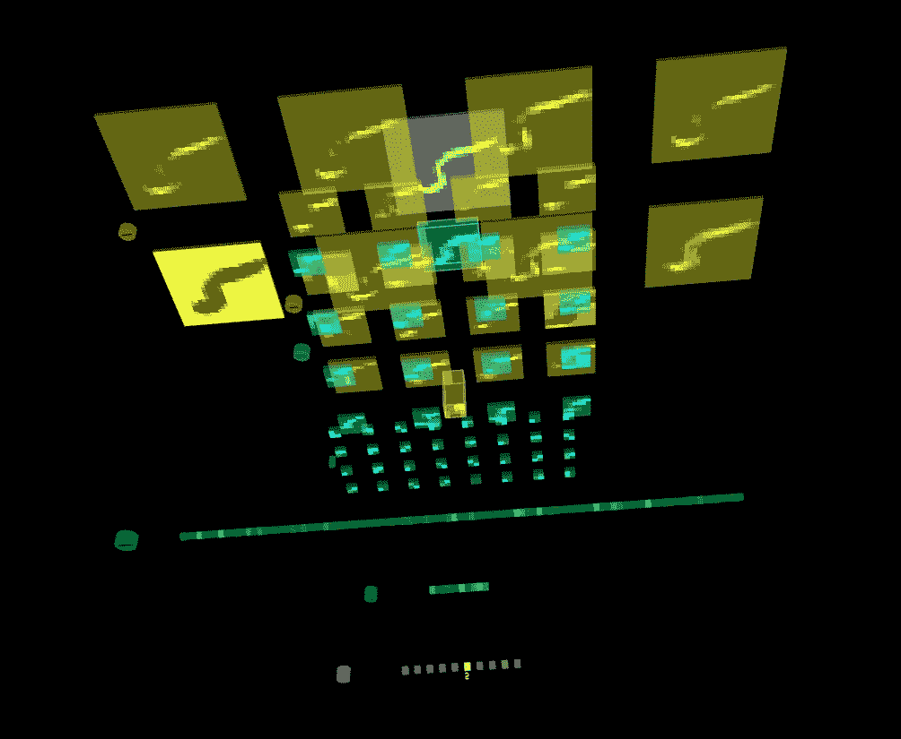

# TensorSpace.js 实现神经网络图层的三维可视化

> 原文：<https://towardsdatascience.com/3d-visualization-of-nn-layers-with-tensorspace-js-7a8ef5440125?source=collection_archive---------19----------------------->

## 介绍

你有没有想过:“CNN 内部到底发生了什么？”，“我的模型学习了哪些功能？”，“如何正确地可视化我的深层网络的中间层，而无需编写大量代码和安装几十个库？”。

如果你的答案是肯定的——tensor space . js 是你梦寐以求的图书馆！

## TLDR:

*   [GitHub 教程代码](https://github.com/asakryukin/TSTutorial/tree/master)
*   [TensorSpace.js 网页](https://tensorspace.org/)

tensor space . js——是一个神奇的框架，可以在您的浏览器中实现神经网络层的 3D 可视化！它的第一个版本刚刚在一周前发布(如果你正在 2018 年 11 月阅读这篇文章)，可以与 Tensorflow、Tensorflow.js 和 Keras 模型配合使用。

在本文中，我将向您介绍可视化张量流模型的基本步骤。我将解释您应该如何训练和导出您的模型以与 TensorSpace.js 兼容，以及我将解释如何在您的浏览器中可视化保存的模型。

## 先决条件

我假设您已经安装了 Tensorflow。

另外，为了保持简短，我不会详细介绍 TensorSpace.js 的安装。这相当简单，你可以使用我的 [GitHub 代码](https://github.com/asakryukin/TSTutorial/tree/master)模板，并安装所有 TensorSpace.js 依赖项。

## 模特培训

为了简单起见，这里我们将使用 Tensorflow 训练一个简单的 CNN 模型来识别 MNIST 数字。

首先，让我们创建一个 DataHandler 类来处理我们的数据:

该类从 csv 文件中加载 MNIST 数据，将其分成训练集和测试集，并提供训练批次。

接下来，我们将创建一个模型类来创建、训练和保存我们的模型。这里我们将使用具有 3 个卷积层和 2 个全连接层的简单 CNN。

现在，在训练您的模型时，您应该记住一些重要的注意事项:

1.  为您想要可视化的所有层定义“名称”(因为您将在模型转换和网络可视化阶段使用这些名称)。注意，这里我们使用的是纯 tensorflow 方法，还有像`tf.layers.conv2d`这样的包装器，实际上是在后台创建多个变量。
2.  使用`tf.saved_model`方法导出你的模型，而不是`tf.train.`

在这里，我们希望可视化 3 个卷积层、相应的最大池层、密集层和 softmax 函数后的模型输出。

此外，我们输出图形变量列表只是为了确保我们知道想要显示的变量的正确名称。我们将使用以下变量:

*   l1/Relu
*   l1max
*   l2/Relu
*   l2max
*   l3/Relu
*   l3max
*   l4/Relu
*   l5/BiasAdd
*   输出

最后，我们还将输出。验证图像的 json 文件，我们将使用它进行流可视化。

## 模型导出

训练完我们的模型后，您应该会得到包含以下内容的模型文件夹:

*   变量
*   ——variables . data-00000/00001
*   — —变量.索引
*   已保存 _ 模型. pb

现在我们需要将我们的模型转换为 Tensorflow.js 模型。如果您之前没有安装，只需在终端中键入:

`pip install tensorflowjs`

现在，让我们用要可视化的张量流变量的名称创建一个变量:

`vs='l1/Relu,l1max,l2/Relu,l2max,l3/Relu,l3max,l4/Relu,l5/BiasAdd,output'`

**注意:在所有阶段，遵循与初始化时相同的命名顺序。**

现在我们把它转换成 Tensorflow.js 模型！

`tensorflowjs_converter --input_format=tf_saved_mode --output_node_names=$vs --saved_model_tags=serve Model TensorSpace/mnist/model`

这里 Model 是包含保存模型的文件夹，TensorSpace/mnist/model 是转换输出的目标。因此，在您的 TensorSpace/mnist/model 文件夹中，您应该会获得以下文件:

*   第 1 组-第 1 部分，共 1 部分
*   tensorflowjs_model.pb
*   权重 _ 清单. json

现在我们可以开始可视化部分！

## TensorSpace.js 可视化

最后，我们需要创造。将输出结果的 html 文件。

不要把时间花在设置 TensorFlow.js 和 JQuery 上，我鼓励你只使用我在 TensorSpace 文件夹中的模板。文件夹结构如下所示:

*   index.html—输出 html 文件以运行可视化
*   lib/-存储所有依赖项的文件夹
*   data/ —包含的文件夹。带有网络输入的 json 文件
*   model/-包含导出模型的文件夹

对于我们的 html 文件，我们需要首先导入依赖项并编写一个 TensorSpace 脚本。

在脚本中，我们需要定义所有要可视化的图层(带参数)。可能的层的完整列表可以在[这里](https://tensorspace.org/html/docs/layerIntro.html)找到。接下来，我们在`model.load`方法中加载转换后的模型，指明生成的模型文件的路径和要可视化的变量的名称。最后，我们运行`model.init`来处理输入文件(我们在模型训练结束时生成的文件)。

瞧，现在你可以在任何兼容[的浏览器](https://tensorspace.org/html/docs/startSystem.html)中运行你的 html 文件，并从内部探索你的模型！

您的结果应该类似于:

3D Network visualization with TensorSpace.js

现在，您可以开始探索您的网络工作流程了！

## 结论

在本教程中，我们接触了 TensorSpace.js 功能的一小部分。我鼓励你使用[代码](https://github.com/asakryukin/TSTutorial)并在你自己的模型上试用它！

如果你有问题或者你想探索 TensorSpace.js 的其他功能或者它在其他模型上的应用(Keras，Tensorflow.js ),请在下面留下评论！

*   [GitHub 教程的代码](https://github.com/asakryukin/TSTutorial/tree/master)
*   [TensorSpace.js 网页](https://tensorspace.org/)