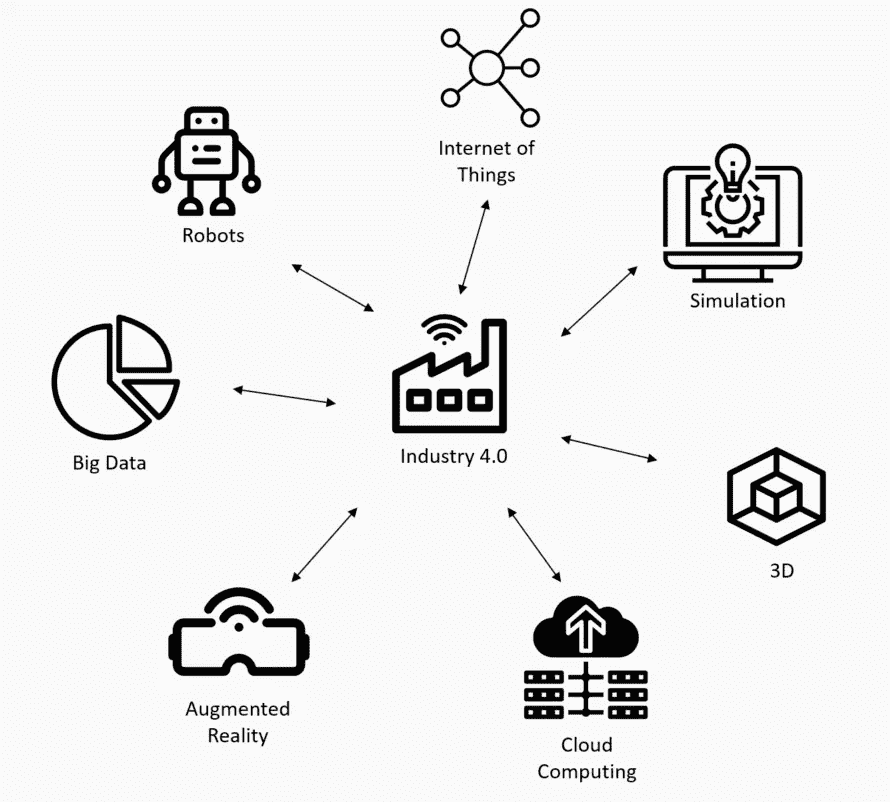
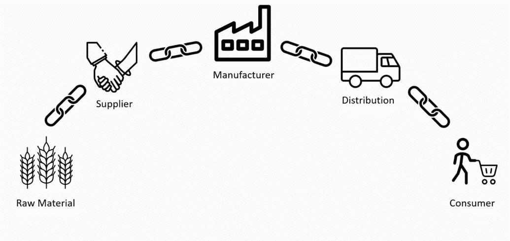
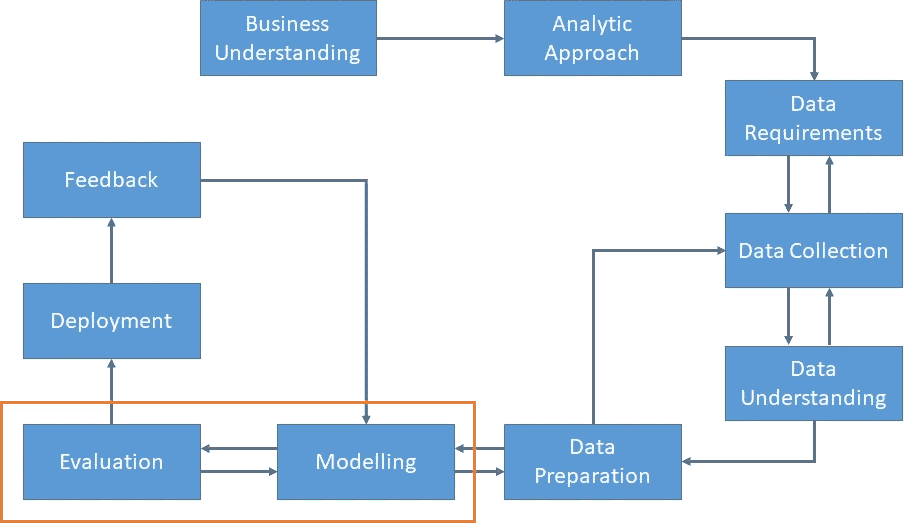

# 4.0 行业技术和供应链

> 原文：<https://towardsdatascience.com/4-0-industry-technologies-supply-chain-97c857de14ae?source=collection_archive---------9----------------------->

# **新行业的典范**

在现代社会，需求越来越复杂和个性化。在行业中，这意味着为了满足人们和公司的需求，必须采用更高效、更智能的生产方式，最大限度地提高所有相关流程的利润，从根本上降低成本，缩短生产时间。简而言之，优化生产。目前，供应链不再仅仅是沿着供应链跟踪产品的系统，而是成为获得竞争优势甚至建立自己品牌的一种方式。

因此，第四次工业革命的特征是智能工厂的创建，这些工厂实施并集成了最先进的技术，如网络物理系统(将有形资产与数字双胞胎相结合)、IIoT(工业物联网)、数据分析、增材制造、3D 打印和人工智能。应用这些技术可以实现必要的优化和自动化，从而降低成本和缩短制造时间。这将允许我们生产数千种不同的产品配置，并以非常低的成本生产非常小批量的产品。

供应链是这些技术的使用能够引起流程优化和自动化革命的主要领域之一。供应链目前面临的主要问题是缺乏透明度和难以追踪通过供应链的货物。

Figure by the author

众所周知，Maersk 是一家国际集装箱货物运输公司，在该行业拥有最大的市场份额(约 20%)。管理集装箱运输的成本目前高于集装箱本身的实际运输成本，这是由于必须在所涉国家和有关当局进行授权和办理手续。简而言之，因为缺乏信息的透明度和资产的可追溯性，这减慢了整个过程，并大大提高了成本。

这就是为什么物联网、区块链和大数据技术的应用和集成，参考第四次工业革命，将标志着生产流程的转折点，这也是我们将在整篇文章中探讨的内容。

特别是，物联网技术在这场革命中具有特殊的意义，以至于人们创造了一个新的特定术语来指代这些技术在 4.0 行业背景下的应用:工业物联网(或 IIoT)。作为这些可扩展和可集成生态系统的一部分的设备必须受到极其有效的管理，因为不同网络物理系统之间的认证和通信是这些技术中的关键，所生成数据的收集、处理或存储中的故障可能会在整个生产链中产生灾难性的后果，甚至对人员损失产生影响。

这就是为什么数据的分散、不可变和集成管理至关重要，正是在这种背景下，区块链技术可以提供不同的价值。由于这项技术的应用，每个集成设备的活动和身份都可以记录在生产系统中，而没有操纵数据及其后果的风险。

此外，区块链可以通过机器之间的通信协议进行集成，允许在设备本身之间创造新的经济，在这种经济中，它们可以通过智能合同就原材料、能源、零件、维护甚至物流的供应达成协议，一旦满足之前建立的条件，智能合同的支付将自动执行。已经有通过区块链进行微支付的例子，或者与出售数据的传感器发生纠纷的例子，以及在自己和充电点之间进行电力交易的电动汽车的例子。

这种整合涉及数百个流程的精简和自动化，这些流程目前需要大量的中间步骤，这些步骤阻碍并增加了当前的生产流程。此外，对监管(和人类)第三方干预的需求显著减少，这将极大地降低随之而来的相关费用。这样，可以实现满足个性化和单一化生产需求所必需的边际成本的降低。关键是生产过程的非中介化，这样公司就可以接收到对一个分散的门户网站的请求，这个门户网站是廉洁的，所有相关方都可以轻松访问。

一旦存储在安全和透明网络中的这些数据可用，涉及数据科学背景的技术(如数据分析、机器学习和大数据)就可以处理数据。这使我们能够提取重要信息，并对需求、零件价格和维护进行准确高效的预测分析，以确保供应链和生产系统的正常运行

# **供应链目标和当前的低效率**

从基于产品和客户的供应链系统的角度来看，这需要不同代理之间的合作，如买方、供应商、分销商……有许多目标需要强调:

**1)数据共享和处理的效率:**

像库存或资源运输这样的资产管理需要通过协作来提高效率。在这些方之间有效地共享信息可以在正确的时间将货物交付到正确的地方，最大限度地降低成本并满足客户的需求，或者相反，混乱。因此，如何在整个行动中共享和处理信息是极其重要的。

**2)优化运输和物流:**

参与运输、订购和装运货物的每个代理依赖于避免高成本和不良同步的活动的优化。在这种情况下，自动交易非常有用，但是必须特别小心，并且必须有人定期检查系统的正常运行。

**3)质量改进反馈:**

知道系统的问题或缺陷在哪里，将允许代理专注于指出漏洞或错误的可信信息。这是基于有效管理的原则“不能测量的就不能改进”。

**4)建立长期稳定性:**

在供应链生态系统中建立信任关系可以创造运营的稳定性，并加强共同业务计划的合作计划、协调和分配，从而提高商品交换的协调性，并由此建立更好的客户-制造商关系。

# **与供应链相关的物联网特性:**

物联网被理解为集成了电子设备、软件、传感器和致动器的设备、车辆和家庭应用的网络，这些设备、车辆和家庭应用相互连接，目的是收集、存储和共享信息，并有可能执行与信息相关的特定操作。

众所周知，微处理器、控制器和传感器的价格下降使得物联网系统激增，这些系统可以收集、传输和存储大量数据。

目前，该概念远远超出了机器对机器(M2M)通信，并描述了一种用于设备、系统和服务的高级连接网络，其符合各种各样的协议、域和应用。

物联网，更具体地说是它的工业版本 IIoT，被称为在运营效率、商业机会和制造商收入方面彻底改革供应链。将通过以下方式实现这一目标:

**1)资产可追溯性:**

过去，跟踪数字和条形码是为了管理供应链上的货物。目前，RFID 方法和 GPS 传感器可以监控产品从生产到到达最终客户的状态和位置。能够及时获得对交付管理和质量的控制，以及对需求的预测，这使它成为某种游戏规则的改变者。

**2)与供应商的关系:**

据 IBM 称，公司产品价值的 65%来自供应商。通过跟踪资产获得的数据使制造商能够优化生产计划和与供应商的关系模式识别，从而揭示重要的商业机会。因此，特别关注与他们有关的整个过程是至关重要的，因为更高质量的服务和产品会促进与客户更好的关系。

**3)股票和预测:**

物联网传感器可以跟踪库存和库存供应，只需点击一下鼠标，就可以进行未来制造，还可以将信息存储在云中的共享空间，所有相关方都可以轻松访问。所有这些使得生产计划更加高效。

**4)联网运输:**

无论是纵向还是横向，供应链都不会停止增长，确保所有集装箱和船队都连接在一起，从而在整个供应链中实现完整有效的信息传输，这一点变得越来越重要。

# **与供应链相关的区块链特性:**

简而言之，区块链是一个信息存储系统，安全，匿名，去中心化，并且由于它使用的加密技术，免于操纵。

区块链可以理解为一系列包含我们想要保存的信息的文本文件，形成了一个区块链，其中每个区块都包含前一个区块的信息，这个包含前一个区块的信息，以此类推。

因此，区块链是一个计算机网络，其中作为网络一部分的所有设备都保留了网络的副本。这不同于传统的数据库服务器，在传统的数据库服务器中，信息只有一个副本，它集中在一台服务器上，每个用户都在这台服务器上搜索信息。

相比之下，区块链可以在组成网络的所有设备中找到，它是一个去中心化和分布式的数据库，相对于传统数据库，这一特征使记录的信息更加安全，难以被操纵或丢失，这就是区块链成功的关键。

共识和智能合同允许区块链自动处理供应链流程中发生的交易。因此，当前的区块链应用程序利用了这一特性，如 Hyperledger 和 IBM 基于其技术的解决方案。

# **与供应链相关的数据科学特性**

预测分析被定位为能够革新供应链的最强大的工具。以至于到 2020 年，这个行业的市场价值预计将超过 9 万亿美元。数据科学以及不仅能够从中提取相关信息，而且能够做出准确预测的能力，使得能够捕捉实时决策，从而显著改善该领域的战略和绩效行动。

机器学习是近年来发展迅猛的数据科学子领域之一。它可以定义为:

*“机器学习是一门让计算机像人类一样学习和行动的科学，通过以观察和现实世界互动的形式向它们提供数据和信息，以自主的方式随着时间的推移改善它们的学习。”*

与深度学习携手，这门科学使我们能够建立具有人工智能的系统，这种系统可以利用计算机每秒进行数百万次计算的能力，并在决策过程和重复任务的自动化方面提供巨大帮助。

目前，这些都是无处不在的技术(它们是我们生态系统的一部分，也是我们日常生活的一部分)，我们在任何地方都能发现它们:从图像识别(能够比 T4 医生更准确地检测癌症)，到游戏引擎(能够击败世界上最伟大的围棋选手)、聊天机器人和欺诈检测器。

Figure by the author

这些技术的引擎是我们今天可以获得的数量惊人的数据。由于技术和传感器价格的大幅下降，我们现在可以创建、存储和发送比历史上任何时候都多的数据。仅在过去的两年里，全球就有高达 90%的数据被创建。按照我们目前的速度，每天会产生 25 万亿字节的数据，而且这一速度还会继续增长。这些数据为机器学习模型提供了信息，也是这门科学近年来蓬勃发展的主要驱动力。

具体而言，数据分析和机器学习模型的应用将影响供应链的三个主要领域:

**1)需求预测:**

根据过去的事件和趋势对产品和商品的未来需求进行有效预测是在不增加成本的情况下改善售后服务的一个关键组成部分。

这些技术的应用可以消除库存积压，并允许仓库在它们之间工作，增加供应链的完整性和流动性，主要目标是实现服务零件的高可用性、产品的运行时间和最小的风险以及更好的客户服务。

**2)预测定价:**

这方面的经典处理方法是通过电子表格，根据过去的价格来评估服务零件的价格。问题是零件和产品在不同的地点以不同的价格出售，这转化为糟糕的客户体验和制造商获得利益的机会的丧失。

通过使用预测算法来估计零件的价格，制造商必须考虑影响销售的不同因素，包括零件的位置、季节性、天气和需求。机器学习模型允许考虑所有这些因素，从而对价格进行更加精确的调整。

**3)预见性维护:**

中断修复服务是被动和低效的。高达 55%的服务失败是因为服务零件在需要时不可用，这转化为产品停机时间的增加、库存故障、产品所有者的收入损失和客户不满。

通过物联网和预测分析的协同集成，不同方将能够在服务零件接近故障时进行检测和通信，因此，制造商可以确定何时需要新零件，主动将它们引导到经销商或维修中心，而不是存储它们，占用库存空间。所有这些都有助于减少库存过剩和与之相关的额外成本。此外，提高零件填充率，避免计划外停机的成本和腐败，并最终改善客户体验。

# **结论**

物联网技术与区块链和大数据的融合可以解决供应链面临的许多问题。应用工业 4.0 技术使我们能够利用物联网实时监控供应链流程的每个部分，验证数据的完整性和透明度，通过区块链智能合同建立设备之间的经济，并利用数据科学对服务部分的需求、价格和维护进行精确预测。

所有这些都转化为生产过程功效和效率的根本改善，并带来必要的优化，以满足公众的新需求，提供最佳的客户体验，并最终改善行业生态系统。这为制造商节省了成本，从而为客户提供了更好的服务，并最终提高了人们的生活质量。这使我们走上了可持续发展的道路。

我写这篇文章的目的是帮助你理解当前的技术范式及其在行业中的应用，具体来说就是在供应链中的应用。为了鼓励你不断学习这些技术，探索它们的无限可能。未来是光明的，在每个人的合作下，我们将能够更快地实现我们的目标。