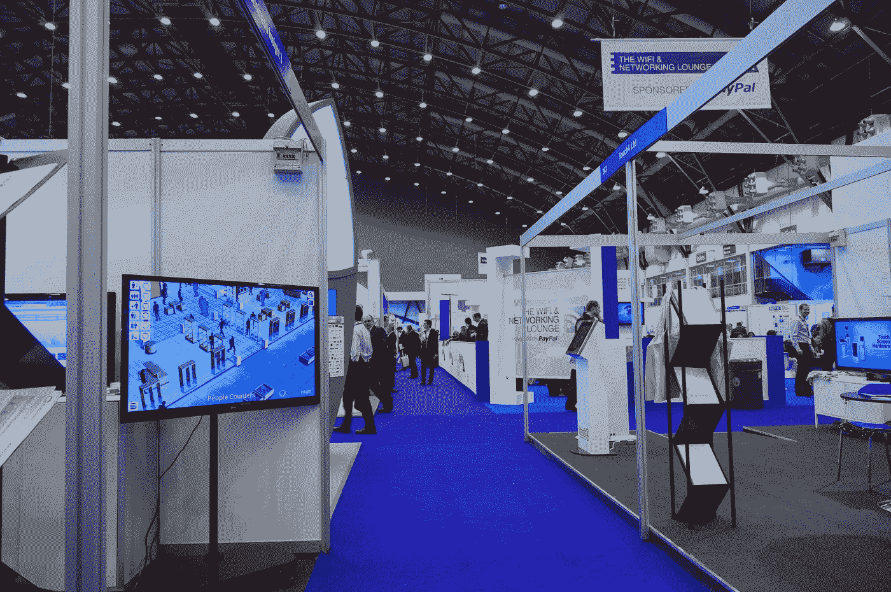
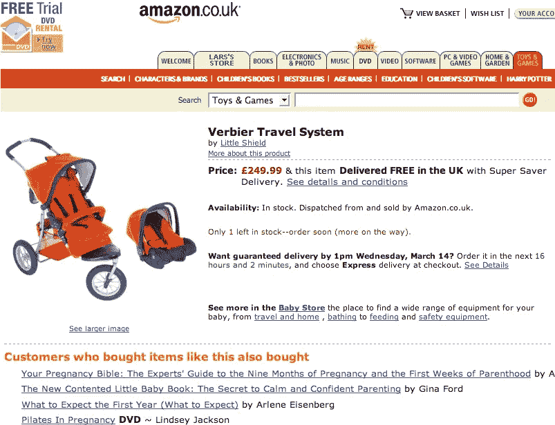
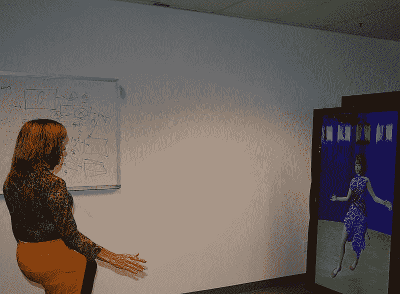
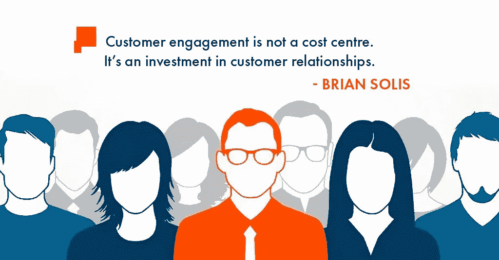

# 零售业中的 4 个人工智能案例

> 原文：<https://towardsdatascience.com/4-cases-of-artificial-intelligence-ai-in-retail-57746abafe7e?source=collection_archive---------5----------------------->

我们已经走过了很长一段路，以前所有的购物都是在实体场所进行，有镜子和销售助理来帮你。由于过去 25 年的数字革命，现在你可以在网上购买任何东西，这也开始影响人们在实体店购物的方式。人工智能(AI)是商业世界现代技术的基石，因为所有行业的公司都受益于自动化、定制和推荐引擎的好处，这些引擎将更多的消费者带到了他们的业务场所。

这在零售业务中尤其如此，人工智能开始在购物体验中发挥作用，因为消费者可以根据自己的兴趣找到合适的商品。此外，虚拟现实(VR)正在[让顾客](https://www.psfk.com/2018/01/5-ai-retail-trends-redefining-experience.html)不用实际穿上就能更容易地试用物品。其中许多企业使用机器人流程自动化(RPA)技术将正确的产品推给正确的人，而 [WorkFusion](https://goo.gl/QeH245) 为寻求改善客户购物体验的公司提供了一个平台。

下面是 AI 在零售业的四个案例。

**1)浏览数字目录**

人工智能为我们带来了先进的推荐引擎，使消费者能够在通常所需时间的一小部分内找到合适的商品。消费者可以浏览数字目录，询问他们关于偏好和他们正在寻找的商品类型的问题，而不是浏览数百种实体商品。根据他们的尺寸、个人信息、颜色偏好和其他因素，目录可以向他们展示适合他们的商品。销售书籍、配饰或其他任何东西的非服装零售商也是如此。

**2)高级手势识别**

除了拥有这些数字目录，零售商还可以通过监控购物者的面部和手势来监控商品在购物者中的成功程度。购物者对某种商品的反应告诉这些机器人销售助理，该商品是否是潜在的热门商品或无用商品。此外，通过更多地了解商品如何影响用户，推荐引擎可以更有效地找到适合特定用户的商品。

**3)在虚拟镜像上检查自己**

除了试穿衣服，你还可以用虚拟镜子来看看一件衣服穿在你身上是什么样子。公司一直在开发人工智能平台，允许用户在短时间内尝试许多不同的项目。如果你正在寻找合适的服装，你可以使用这项技术来确定哪件衣服最适合你，以及哪件衣服或配件与那件衣服相配，从而提供无限数量的服装选择。

**4)视频分析在客户互动中的应用**

自然，零售商在他们的商店里有摄像头，这些摄像头被用来提高这些商店的安全性，以及客户服务和合规性。计算机视觉技术的进步为消费者带来更舒适的体验和更有利可图的购物体验铺平了道路。这种零售监控可以帮助零售商了解其客户的产品暴露水平、参与度和整个商店的导航路线，这对于决定不同商品的摆放位置至关重要。

**总之，好赌**

随着一些零售商在商店中实施人工智能的成功，这项技术似乎很快就会成为该行业的一个重要组成部分。与一家软件公司合作，帮助零售商的创意团队找到销售产品的创新方法，可以在竞争日益激烈的美国经济中大有作为。人工智能可以通过便利性和定制化改善消费者体验，从长远来看，这将导致满意的客户和更高的利润率。