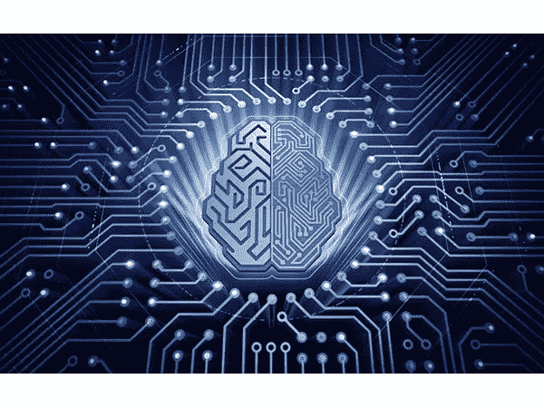

# 需要警惕的 4 种机器学习趋势

> 原文：<https://towardsdatascience.com/4-machine-learning-trends-to-watch-out-for-9eae26cdc3a7?source=collection_archive---------5----------------------->

IT 界对机器学习(ML)及其改变后代与世界互动方式的潜力怎么看都不够。有了这项技术，自动驾驶汽车已经从理论变成了现实，距离在开放的道路上被广泛接受还不到十年。ML 还有其他有价值的应用,如通过研究和应对一些最常见的欺诈活动来实现先进的欺诈检测技术，以及通过网络安全软件帮助阻止网络钓鱼欺诈的电子邮件过滤能力。

对于[这项技术来说，天空是无限的，](https://www.kdnuggets.com/2016/06/machine-learning-trends-future-ai.html)这项技术可能很快会以更先进的认知学习应用和推荐引擎的个性化功能的形式让我们的生活变得更轻松。WorkFusion 提供了一系列[智能自动化软件](https://www.workfusion.com/?utm_source=other&utm_medium=medium&utm_name=karl-utermohlen&utm_term=4-machine-learning-trends-to-watch-out-for)，帮助公司监控即将到来的威胁，自动化琐碎的任务并节省管理费用。

这里有四种机器学习趋势，可能在不久的将来成为现实:

**1)云上的智能**

算法可以帮助公司挖掘对其业务的洞察力，但这种主张可能成本高昂，不能保证底线的增加。公司经常不得不收集数据，雇用数据科学家，并培训他们处理不断变化的数据库。现在更多的数据指标变得可用，存储数据的成本正在下降，这要归功于云。不再需要管理基础设施，因为随着运营规模的增加，云系统可以生成新的模型，同时提供更准确的结果。越来越多的开源 ML 框架加入进来，获得预先训练的平台，可以标记图像，推荐产品和执行自然语言处理任务。

**2)量子计算能力**

ML 可以帮助公司处理的一些任务是对高维空间中的大量向量进行操纵和分类。目前的算法需要大量的时间来解决这些问题，使公司花费更多的时间来完成他们的业务流程。量子计算机很快就会风靡一时，因为它们可以在很短的时间内处理高维向量。与传统算法相比，这些算法能够在更短的时间内增加处理的向量和维数。

**3)改进的个性化**

零售商已经在开发推荐引擎方面掀起了波澜，这些引擎能够更准确地触及他们的目标受众。更进一步，ML 将能够以更精确的方式改进这些引擎的个性化技术。这项技术将提供更具体的数据，然后他们可以在广告上使用这些数据来改善消费者的购物体验。

**4)数据上的数据**

随着可用数据量的增加，存储这些数据的成本也以大致相同的速度下降。ML 在生成最高质量的数据方面具有巨大的潜力，这将导致更好的模型、改进的用户体验和更多的数据，这些数据有助于重复但改进这个循环。特斯拉等公司每小时都会添加一百万英里的驾驶数据，以增强其自动驾驶能力。随着该公司收集更多关于自动驾驶技术可能存在的缺陷的数据，其自动驾驶功能会从这些数据中学习并改进推动这些自动驾驶车辆前进的软件。

WorkFusion 有一个[机器人流程自动化(RPA)](https://www.workfusion.com/rpaexpress?utm_source=other&utm_medium=medium&utm_name=karl-utermohlen&utm_term=4-machine-learning-trends-to-watch-out-for) 套件，可以帮助公司积累更多关于其业务流程的数据，产生支持解决方案的方法。