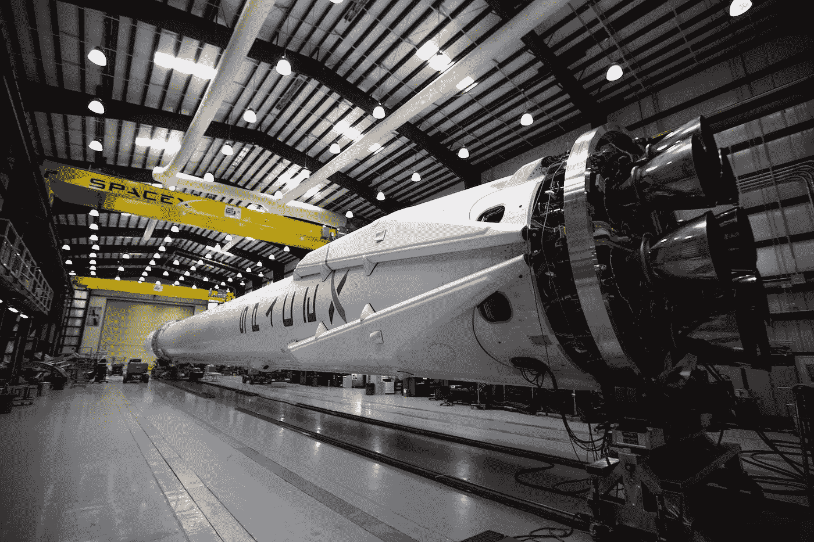

# 4 个月的机器和深度学习

> 原文：<https://towardsdatascience.com/4-months-of-machine-deep-learning-89f6ab56a2fd?source=collection_archive---------0----------------------->

## 这不是火箭科学。是线性代数。

[Photo by: SpaceX](https://unsplash.com/photos/YSvUYqf9Mjk)

***(2017 年 8 月更新)*** *我不干了。我学习了。我是一名数据工程师。*

“数据工程师”这个头衔很奇怪，就像所有数据科学头衔一样，因为它非常依赖于公司、公司规模、行业等。更重要的是你的角色/工作描述。

*在*[*Format.com*](http://format.com)*，我将是他们的第一个“正式”数据工程师，我的角色无所不包。我将接管公司所有与数据相关的事务。这包括数据分析基础设施/管道(ETL/ELT、数据完整性、分析工具)，创建一个更加自助的报告、数据驱动的公司，并应用机器和深度学习来增强我们的洞察力，为我们的客户构建出色的新功能。*

我还有很多更深层次的东西要学，但坐在教室里不学无术不是我的风格。别担心，我会让你了解我的教育历程，同时，继续阅读下面的内容…

# (我做了什么)和(我是如何做的)

我不会用太多的细节来烦你，我会把你发送到我最初的中型帖子[这里](https://medium.com/towards-data-science/my-3-month-deep-learning-career-pivot-af94cd8d6a31)和我的后续 LinkedIn 帖子[这里](https://www.linkedin.com/pulse/self-study-guide-becoming-deep-learning-non-expert-jason-carter)。

> TLDR:我辞职了。我学习了。现在我需要一份工作。

现在你对事情了如指掌，让我告诉你剩下的。我没有完全按照我原来的学习计划，这是一个 4 个月的旅程，现在充满了额外的学习被挤了进来。由于我即将完成这个职业生活项目，我想更新一下。

让我首先与你分享我的“最终”时间表，然后我将讨论它背后的变化和推理，最后是一点初学者的建议。

> BTW:副标题——这不是火箭科学。是线性代数。—绝不意味着机器或深度学习是容易的。

# 我的时间表

在这一点上，我现在是全职学习，每天大概学习 10-14 个小时。我保持了一个像工作一样的日程安排，安排健身房和午休时间。大部分时间是在工作日，有时会在凌晨 1 点或 2 点睡觉，但也有几天我什么也没做。有时候是因为我太懒了(夏天来了！)其他时候是因为倦怠。

*提醒一下，我的背景是这样的——教育方面——我有一个软件工程学位和一个* [*Udacity 数据分析师纳米学位*](https://www.udacity.com/course/data-analyst-nanodegree--nd002) *。以及作为开发人员和分析师的工作经验。*

## 第一个月

*   [深度学习—第一部分](https://medium.com/towards-data-science/fast-ai-the-toc-of-practical-deep-learning-part-1-70c89187d654)(已开始)
*   尝试一场 [Kaggle](https://www.kaggle.com) 比赛
*   分享经验:中等
*   参加当地研讨会(一般人工智能讲座)

## 第二个月

*   [深度学习—第一部分](https://medium.com/towards-data-science/fast-ai-the-toc-of-practical-deep-learning-part-1-70c89187d654)(已完成)
*   [从零开始构建深度学习盒子](https://medium.com/towards-data-science/build-a-deep-learning-pc-for-1-000-cad-f3c5f26ba134)(阅读我的经验)
*   [MNIST 对抗性挑战](https://github.com/jasonicarter/MNIST-adversarial-images/blob/master/MNIST-adversarial-images.ipynb)(使用 [500px](https://medium.com/u/5075e6960d1?source=post_page-----89f6ab56a2fd--------------------------------) 面试项目作为练习)
*   使用 Python 的数据科学家，职业轨迹:数据营(已开始)
*   分享经验:中等
*   参加当地研讨会(人工智能讲座和小组讨论)

## 第三个月

*   深度学习—第 2 部分(开始+暂停)
*   [使用 Python 的数据科学家，职业轨迹:数据营](https://www.datacamp.com/tracks/data-scientist-with-python)(已完成)
*   吴恩达的机器学习:Coursera(已完成)
*   分享经验:中等
*   更多的本地工作室([deeplearning .](https://medium.com/u/e720f869de47?source=post_page-----89f6ab56a2fd--------------------------------):tensor flow 和 Kubernetes)

## 第 4 个月

*   深度学习，第 2 部分(已开始)
*   顶点:构建和部署端到端深度学习产品(已开始)
*   分享经验:中等

## 杂项

1.  需要注意的是，每个课程或项目都有大量的阅读材料——博客文章、斯坦福大学在线 CNN 课程、学术论文等——和往常一样，你会收获你所投入的。我已经做了大量的“额外”阅读，但当然也有我略读或个人没有兴趣了解更多的领域。
2.  我现在在读 4 个月左右(7 月中旬实际上是 3.5 个月，我提前了)，但这不会是整整一个月的学习，因为我计划很快开始找工作。

# 细节

我对我最初的计划做了三个主要的改变:

1.  使用 Python 的数据科学家(数据营)
2.  [吴恩达的机器学习](https://www.coursera.org/learn/machine-learning) (Coursera)
3.  顶点项目(端到端深度学习项目)

在最初开始深度学习第二部分后，我决定参加 DataCamp 的**数据科学家与 Python。稍微思考一下事情的实际方面，当前的角色并没有被划分为只有深度学习和只有“经典”机器学习。因此，尽管拥有实际的深度学习经验很棒，但在采访中说我不知道 [kNN](https://en.wikipedia.org/wiki/K-nearest_neighbors_algorithm) 和 [k-means](https://en.wikipedia.org/wiki/K-means_clustering) 算法之间的区别会令人尴尬。**

此外，虽然快速人工智能项目是用 Python 教授的，但它不是在教授 Python，而 DataCamp 职业生涯跟踪课程有许多 Python 特定的课程以及数据挖掘和操作。

鉴于我已经完成了 Udacity 的数据分析师课程，我发现 DataCamp 项目基本上是一种复习(有一些新的技巧和诀窍)，但这正是我所需要的。

一个好的总结应该是这样的:

*   *data camp 项目深度潜水较少，但涵盖的主题广泛。您可以亲自动手编写 Python 代码，这非常棒！*
*   *uda city 计划给出了每个机器学习算法的更多细节，如何使用它们，并有优秀的大规模项目。*

斯坦福大学的机器学习(Machine Learning)由吴恩达在 Coursera 上讲授，这可能是互联网上最著名的机器学习课程。这也是我想尝试一下的主要原因。还有，听朋友说这是个很棒的课程。

我参加这个课程的目的是在自己身上练习一些强化学习。尽管在我开始学习时，我已经参加了 Udacity 和 DataCamp 课程，这两个课程都涉及机器学习——从不同的角度来看，我认为向该领域最优秀的人学习肯定不会有什么坏处。

这门课程非常有趣，寓教于乐，富有挑战性。像其他事情一样，有些部分我完全理解，而其他部分我仍然不是 100%清楚。

我不认为八度音阶对我来说在任何新的角色中都是非常有用的，但是对于一些任务来说并不难。虽然这门课程是一次很好的经历，但我相信 Udacity 的数据分析师 nanodegree 更有实际用途。

我想，帮助我圆满完成旅程的最后一件事是**顶点端到端深度学习项目**。数据科学或机器/深度学习不仅仅是理论、算法、研究和发表论文！对我来说，我一直想做产品，做实施者，做东西。

在我的顶点项目中，我将定义一个问题，潜在的解决方案，源数据，建立和测试模型，生产模型，实现一个 API，UI 前端，并部署到“生产”。本质上，我要建立一个端到端的深度学习管道，从而产生一个活的产品

…或者至少，这是我的计划。

# 我对初学者的建议

开始学习。你也没有好的借口。哪怕是转行。

上几门数学课，但也就那么几门。

> 补充说明:据我所知，实际的机器和深度学习不涉及手动计算/编码 std、导数、反向传播、kNN 等，甚至不涉及没有库的 Python 尽管我敢肯定一些面试官不这么认为(也就是说不使用 str.split() func 拆分这个字符串，因为在生产中我们不使用库，这将向我们展示如何处理该业务案例。)

但是我跑题了…这并不是说你不需要数学，你当然需要理解术语的含义，如何解释它们，以及如何根据它们的信息来修正模型(或参数)。但是在机器和深度学习的实际实现中，博士并不是必需的:

> 这不是火箭科学。是线性代数。

但是它建议**而不是**去做的一件大事是用学习来充实你的时间。做一些实际的动手工作，用真实的数据练习，你会需要它来获得经验和面试，但更重要的是，一旦你开始新的职业生涯，你会需要它来解决现实世界中的问题。

我觉得我已经把我的脸塞满了机器和深度学习的“东西”，总是有新的论文可以阅读或发表的中等文章。调整自己的速度！我很确定我没有。

如果你想知道我会建议你按照什么顺序学习上述所有课程，请参考以下内容:

1.  使用 Python 的数据科学家(数据营)
2.  数据分析师纳米度(Udacity)
3.  吴恩达的机器学习(Coursera)
4.  深度学习(快速人工智能)
5.  从事个人项目或 Kaggle(在步骤 1-4 期间)

又及:我有一个小小的“阅读清单”，我一直在更新它，试图记录我在学习期间做过的更重要的事情。你可以在我的博客上看到:[http://jasonicarter.github.io/deep-learning-reading-list](http://jasonicarter.github.io/deep-learning-reading-list/)

# 我的下一步计划

找份工作。我的最后一项当然是回去工作。我会尽可能有选择地做这件事，并不是说我以前没有这样做过，但我认为考虑到这是一次职业转变，回顾一下过程的每个方面会有好处。

到目前为止，我一直在被动地审查公司，调查他们在机器和深度学习领域到底做些什么。一些角色“机器学习工程师”很少进行深度学习，而其他名为“数据工程师”的角色则需要相当多的 CNN 或 NLP 知识，以及像 Docker 和 Apache Spark 这样的东西。

我学到的两件事(或者那是学来的？)到目前为止有:

1.  实际上并没有什么“深度学习工程师”的角色，它只是被限制在 ML 的描述中，所以请仔细阅读工作职责部分。
2.  数据科学家、数据工程师甚至数据分析师的角色会因公司和工作职责的不同而有很大差异。这可能是企业和初创公司需求的子集。

对我个人来说，基于我的兴趣，我将寻找一个角色，允许我扩展我在深度学习(这本身是一个很大的领域)方面的专业知识，同时仍然使用一些“经典”的机器学习技术。如果他们加入一些 UI 开发工作(概念验证)，那就更好了……**全栈 ML 工程师**有人吗？？？