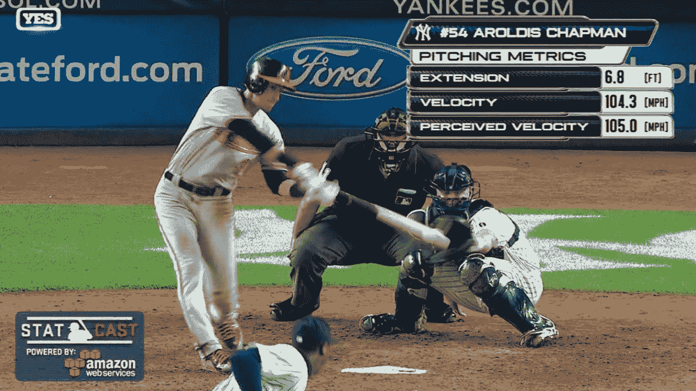
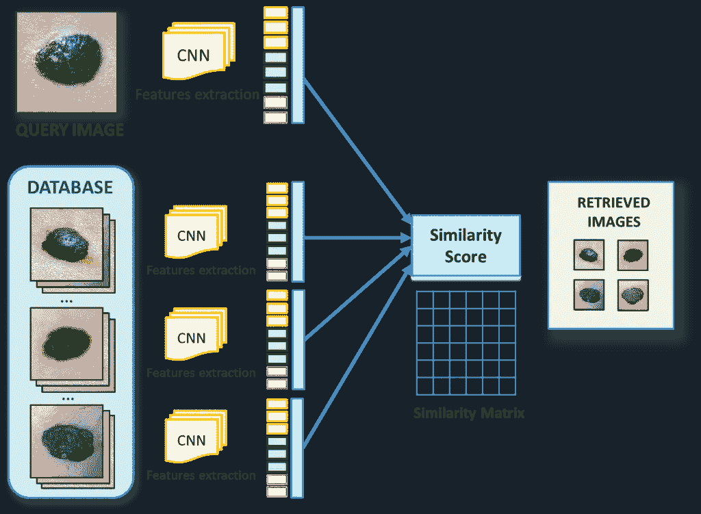
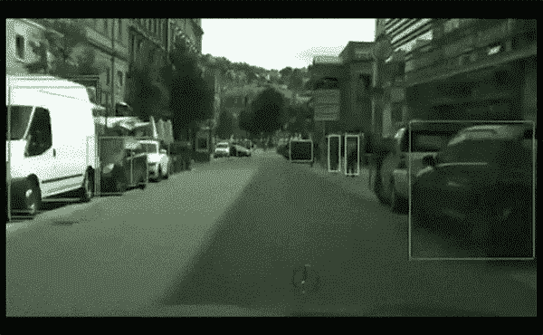
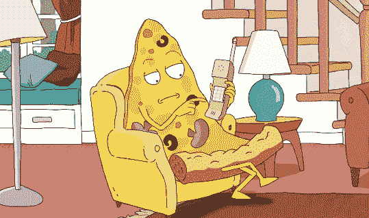
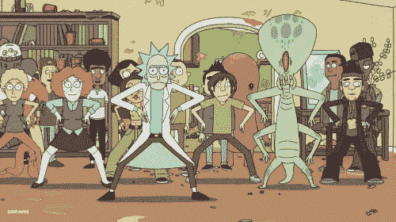
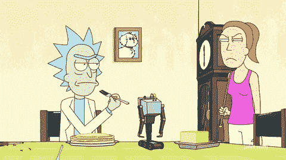
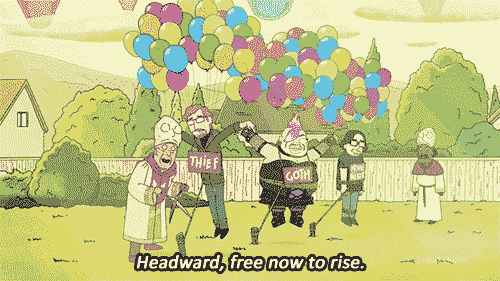

# 当我们所有的工作都没了，确保乌托邦

> 原文：<https://towardsdatascience.com/4-steps-to-ensure-utopia-when-our-jobs-are-gone-859801f95bd3?source=collection_archive---------6----------------------->

## **重新定义自我价值，呼唤你的代表(x2)，成为艺术家(比喻意义)**

‘Rick and Morty’ warn us all of what might happen :)

> 本文无意危言耸听，恰恰相反。这意味着人类要为人机合作的下一阶段做好心理准备。随着我们离奇点更近一步，我们会发现，在所有行业中，我们都有更多的时间，更多的控制权交给了计算机和算法。如果我们能正确地过渡到这个时代，对人类来说，这将是一个非常积极的时代。
> 
> 这篇文章旨在教育读者一种新的思维模式和工具集——激励我们所有人确保公司、联邦监管机构和个人采取正确的步骤来实现人工智能的未来。

> *“我不在工厂生产线上工作。我的工作目前还不错。”
> -每个人都曾经*

假的。让我带你浏览几个已经取代工作的现有计算机程序。做好准备，这 5 个例子会让你大吃一惊。

## **1)电影预告片视频编辑器**

洛杉矶电影预告片剪辑师的平均工资:42328 美元

[https://www.engadget.com/2016/09/01/ibm-watson-movie-trailer-morgan/](https://www.engadget.com/2016/09/01/ibm-watson-movie-trailer-morgan/)

为了 2017 年推出恐怖电影《摩根》(Morgan)，20 世纪福克斯公司(20th Century Fox)接洽 IBM，为该电影制作预告片。IBM 团队给沃森提供了一系列恐怖电影，直到它理解了每个场景的情感。使用自然语言处理、计算机视觉和正确的训练集，沃森随后观看了电影《摩根》，并“立即聚焦于总共 6 分钟的 10 个场景。人类编辑仍然需要安排场景来讲述一个连贯的故事，但沃森的参与将这个过程缩短到了 24 小时。预告片通常需要 10 天到一个月才能完成。”

## **2) MLB 棒球裁判**

*MLB 裁判的平均工资——12 万美元，最高 35 万美元/年*

当观众在电视上观看现场棒球比赛时，他们不仅得到了球员的高清特写镜头；他们还得到一个又一个统计数据，几乎是实时编辑的，告诉他们诸如球的速度、投球的准确性、运动员的速度等等。这是如何做到的？它是体育场内摄像机和传感器的昂贵组合，物体内传感器(蝙蝠和基地)，将数据发送到亚马逊网络服务器，这些服务器处理这些数据，并将其发送回直播电视工作人员，他们将这些信息输入他们预先设计的计算机图形包，并将其呈现给美国各地的电视。传感器和摄像头已经就位。服务器已经就位。从 2006 年开始，PITCHf/x 就出现在每一个体育场。唯一缺失的是人们普遍更喜欢电脑裁判，而不是人工裁判。每年[关于电脑裁判员的讨论](https://www.quora.com/Should-Major-League-Baseball-use-an-automated-system-to-call-balls-and-strikes)越来越热烈。作为一个小的下一步，已经提出将球/撞击传感器信息仅直接提供给人类裁判。

## **3)皮肤科医生**

*美国全国平均工资—****【293610 美元***

diagram of a machine-learning process to identify skin problems

2017 年，斯坦福大学的一组研究人员训练计算机像皮肤科医生一样准确地识别皮肤癌痣和病变的图像。他们在 2000 种皮肤病的 13 万张图像上训练了一种深度学习算法。结果详细记录在 [*Nature*](https://www.nature.com/nature/journal/v542/n7639/full/nature21056.html) 中，显示人工智能在挑选致命皮肤病变方面的表现与 21 名委员会认证的皮肤科医生一样好。

在未来，一个简单的手机应用程序可能会帮助患者自己诊断皮肤癌——美国最常见的癌症。

据《连线》报道，“斯坦福的 robo-derm 在这一点上可能是纯研究，但有很多人工智能初创公司(超过 100 家)和软件巨头(谷歌、微软、IBM)正在努力将深度学习应用到医院、诊所甚至智能手机中。”

来源:[有线](https://www.wired.com/2017/01/look-x-rays-moles-living-ai-coming-job/)， [CNN](http://www.cnn.com/2017/01/26/health/ai-system-detects-skin-cancer-study/index.html)

## 4)华尔街交易员

平均工资差别很大，根据经验、利基(对冲基金与大银行)和合伙人级别，从 8 万美元到 1100 万美元不等。

original image from the movie ‘The Wolf of Wall Street’

华尔街交易是最容易替代的工作之一。它没有多少“人性”。

然而具有讽刺意味的是，到 2025 年，通过使用人工智能，金融机构的成本收入比可能会提高 28%。这是因为他们正在削减雇佣人力的成本。2017 年，金融公司将在人工智能相关技术上花费超过 15 亿美元，到 2021 年每年花费 28 亿美元，这还不包括他们对人工智能创业公司的投资。

2014 年，高盛投资并开始安装一个名为 Kensho 的人工智能驱动的交易平台。[核桃算法](https://www.fnlondon.com/articles/the-hedge-funds-where-computers-call-the-shots-20170131)是一家初创对冲基金，从一开始就被设计为致力于人工智能。臭名昭著的怪异对冲基金公司 [Bridgewater Associates](https://www.theguardian.com/technology/2016/dec/22/bridgewater-associates-ai-artificial-intelligence-management) 雇佣了自己的团队来建立一个人工智能系统，该系统实际上可以自己运行操作。

来源: [AI 将大幅裁员](https://www.americanbanker.com/news/all-the-ways-ai-will-slash-wall-street-jobs)，[高盛解雇](http://www.newsweek.com/2017/03/10/how-artificial-intelligence-transform-wall-street-560637.html)

## **5)出租车、Lyft、优步司机**

*纽约市的 Lyft 司机——平均每小时 28 美元*

这是我们听到最多的行业。像梅赛德斯、宝马和特斯拉这样的公司已经发布或即将发布自动驾驶功能，使汽车具有一定的自动驾驶能力。谷歌已经正式将他们的无人驾驶汽车项目纳入自己的公司，名为 [Waymo](https://waymo.com/) 。

客观地看，Lyft 在 2015 年初约有 10 万名司机，2016 年初超过 30 万名。

‘Rick and Morty’ understand

这份职业清单还可以继续下去——教师、[农民](https://www.asirobots.com/farming/)、[私人助理](https://www.chatbots.org/)、[卖汉堡包的人](https://techcrunch.com/2017/03/07/meet-flippy-a-burger-grilling-robot-from-miso-robotics-and-caliburger/)、精神病学家、图书编辑、[零售商收银员](https://www.amazon.com/b?ie=UTF8&node=16008589011)，最终[代理生母](http://www.cbsnews.com/news/artificial-womb-baby-lamb-raises-hope-for-premature-babies/)，以及(我个人最喜欢的)机器学习计算机科学家。

当然，在未来十年左右的时间里，计算机和人类将会合作，因为我们人类仍在填补这些空白。但这就是为什么我们需要现在就做好准备，走在它的前面！当然，非常有才华的人仍然会因为他们独特的视角、视野或声誉而被雇佣。但对于我们其他人来说，我们现在应该做些什么来确保乌托邦呢？

# **拥抱乌托邦:2017 年我们可以立即采取的 4 项行动**

现在，在 2017 年，我们可以采取几种不同类型的行动，以确保我们在这场人工智能革命中领先一步:1)重新定义我们的幸福和自我价值的来源，2)确保我们人类的需求得到基本普遍收入的满足，3)确保人工智能和人类之间的正确动力到位，以及 4)成为一名艺术家(在隐喻意义上)。

# **1。重新定义自我价值和幸福**

Learn to let go. More time to dance.

我们需要思想上的转变来重新定义我们的自我价值，不是从我们朝九晚五的工作中，而是从我们是人，我们还活着这个简单的事实中。所以我们中的许多人只有当我们变得富有成效时，或者当我们的老板告诉我们我们做得很好时，或者当我们的工作得到了金钱上的回报时，才会感到高兴。我们需要简单地学习如何在这些事情之外快乐。我们需要学会如何放松，用其他活动来充实我们的一天。如果你和我一样，甚至去瑜伽也是你更喜欢的事情，因为这是你可以从你的日常“待办事项”清单中检查出来的另一件事。

试着想想一个时间自由的新世界为你打开的所有可能性。你知道那个你每天早上 9 点到下午 5 点穿着西装去的 salesforce 办公室吗？如果你愿意，现在你可以去那里打水枪。去吧，像个孩子一样跑来跑去！

# **2。基本普遍收入**

More of this commencement speech can be watched here: [http://money.cnn.com/video/technology/future/2017/05/31/capturing-carbon-dioxide.cnnmoney/index.html](http://money.cnn.com/video/technology/future/2017/05/31/capturing-carbon-dioxide.cnnmoney/index.html)

如果我们不工作，我们的钱从哪里来？我们如何负担得起我们的房子，我们的食物，我们的基本需求。我们如何积累财富，让我们自豪地把财富传给我们的孩子。要回答这些问题，我们需要进行政治思考。我们需要重组我们的税收体系。随着所有这些工作的消失，通勤者减少，基础设施减少，开销减少，有更多的钱可以支配。作为公民，在 2017 年的今天，我们需要确保我们的政治家充分理解这一新的经济流，并采取大胆措施为所有人创造基本收入。这一想法不仅得到了全球经济学家的支持，还对缓解美国目前日益加剧的极端贫富差距产生了间接的积极影响。甚至马克·扎克伯格在他的 2017 年哈佛毕业典礼演讲中也宣扬这一点。

举个例子，让我们回头看看棒球裁判，他现在失业了。在一个完美的世界中，MLB 将因使用人工智能而被征收重税，亚马逊也是如此，这些税收将通过政府渗透到该国的每个人。这就是所谓的“基本普遍收入”。这个想法是，仅仅为了成为人类和活着，你的政府应该有足够的钱来确保你的人类需求得到满足。这不会让你变得富有，但会让你活得健康。大多数计划建议推出这一概念，仅用$ 10K/人/年，称之为政府援助或补贴。

这不是一个新的想法。[第 17 届 BIEN(基本收入地球网络)大会](http://basicincome.org/)将于 2017 年 9 月 25 日至 27 日在葡萄牙里斯本举行。在考虑所有显而易见的反驳之前(这是共产主义，人们会变得懒惰，等等)，请仔细阅读这个话题。

*行动号召:前往*[*5Calls.org*](http://5Calls.org)*了解谁是你的众议员和参议员以及他们的电话号码。打电话给他们，说:“我在你的选区，我正在读关于基本普遍收入的书。我希望对人工智能辅助收入征税，因为我正在为计算机人工智能导致的大量失业做准备。我希望你能投票通过这个想法，我希望这个问题对你很重要。谢谢。”*

# **3。确保正确的动力动力**

Let’s be clear about who’s in control here.

你有没有打开优步并请求搭车，看到司机在 4 分钟之外，然后点击“确认”后，应用程序刷新并把你切换到 10 分钟之外的司机那里？你有没有想过，“他们为什么要这么做？”此外，你是否曾试图就此事或任何其他问题联系优步？几乎没有办法与优步取得联系，问他们关于他们如何做决定的问题，或者为什么这款应用会让你在不同的司机之间换来换去，或者你可以做些什么来确保这种事情不会发生在你身上。(补充说明，优步是一家极具欺骗性和操纵性的公司。下次你和一个低电量的朋友和一个 100%电量的朋友同时抓取优步搜索，看看他们是如何捕食人的。

把那个看似无关紧要的优步“4 分钟对 10 分钟”的问题放在脑后，现在让我们考虑一下经典的电车问题。一辆电脑控制的手推车有一瞬间的时间来决定它应该杀死 1 个重要的人还是 5 个不重要的人。它会做什么？这可能对你来说很可怕，但这是一个真实的问题。作为非计算机科学家公民，我们需要给我们的政治家留下深刻印象的是，围绕人工智能需要有严格的规则和条例。现在为此而努力的人是 Elon Musk 和 Sam Altman，他们的组织是 Open AI。

*行动号召:再次使用*[*5 calls . or*](http://5calls.org)*g，告诉你的代表，算法必须透明。如果一台医用电脑会提示一个病人有自杀倾向，我们需要知道原因。如果一个人被加入禁飞名单，我们需要知道原因。如果房屋贷款没有被批准，我们需要知道原因。*

# 成为一名艺术家

Be free!

艺术家是少数几个有动力去创造、制造、学习、探索世界并与世界互动的社会成员，而不是被金钱价值或通过预定的步骤爬上公司阶梯所驱动。一个艺术家知道如何在清晨醒来，追寻自己的好奇和渴望。为艺术而艺术是纯粹的。它是有表现力的，因此是人类的。我是被一个艺术家养大的。我被教导通过绘画、粘土、编织、写作、表演、舞蹈，通过像 photoshop、动画、定格、甚至代码这样的计算机工具来培养对自我表达的热爱。但那些只是我的媒介。任何媒体都可以是艺术家媒体。任何人都可以成为艺术家——你只需要像艺术家一样思考。科学家可以成为艺术家。一个科学家站在新发现的边缘，追求世界上的真理——这就是艺术。一个计算机开发者可以是一个艺术家。他们开发应用程序不是因为他们会因此变得富有，而是因为他们希望看到这个世界上存在这样的东西。找到你喜欢做的事情，只是为了做而做，像艺术家一样去做。

是的，当然计算机也能创造艺术，但是它们永远不会剥夺我们创造艺术和表达自己的能力。在未来，我们没有金钱或竞争优势的负担，我们创造东西，因为它让我们快乐。无论你做什么，像艺术家一样去做。

> 无论你做什么，像艺术家一样去做。

# 来源和阅读材料:

如果你对基本的普遍收入感兴趣，有这么多的来源，只要开始搜索([避开它！](https://duckduckgo.com/)为了获得公正的结果，不要谷歌“基本普遍收入”，尽可能阅读一切相关信息。

除此之外，以下是我在撰写本文时使用的 3 个来源:

 [## 资本之后的世界

### 人类梦想着一个没有人需要工作的富足世界。了解更多关于阿尔伯特·温格的新书…

worldaftercapital.org](http://worldaftercapital.org/)  [## 谁拥有未来？

### 谁拥有未来？在 Amazon.com 的杰伦·拉尼尔。*符合条件的优惠可享受免费*运输。“才华横溢”和“大胆地…

www.amazon.com](https://www.amazon.com/dp/1451654960/?tag=mh0b-20&hvadid=3520383689&hvqmt=b&hvbmt=bb&hvdev=c&ref=pd_sl_682i7s1bgh_b)  [## 人工智能有一个很大的问题:即使是它的创造者也无法解释它是如何工作的

### 去年，一辆奇怪的自动驾驶汽车被投放到新泽西州蒙茅斯县安静的道路上。的…

www.technologyreview.com](https://www.technologyreview.com/s/604087/the-dark-secret-at-the-heart-of-ai/) 

> 成为你想在世界上看到的改变。
> 
> -甘地