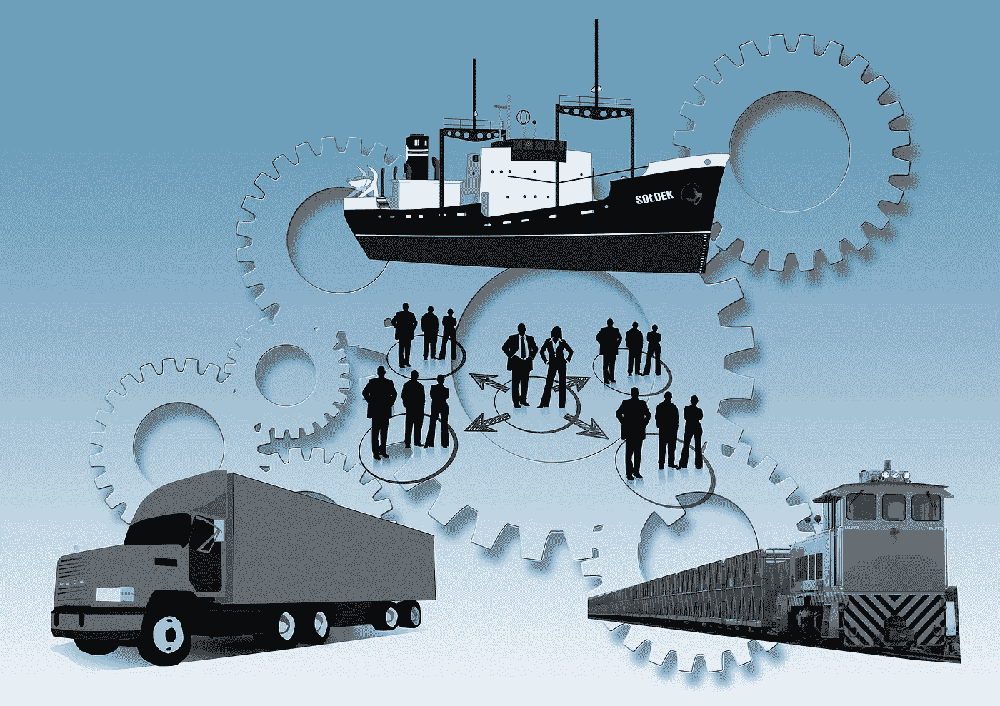
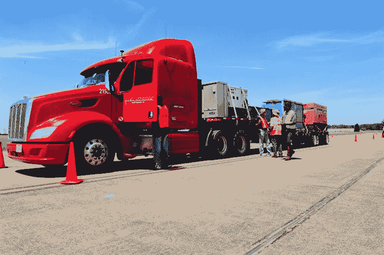
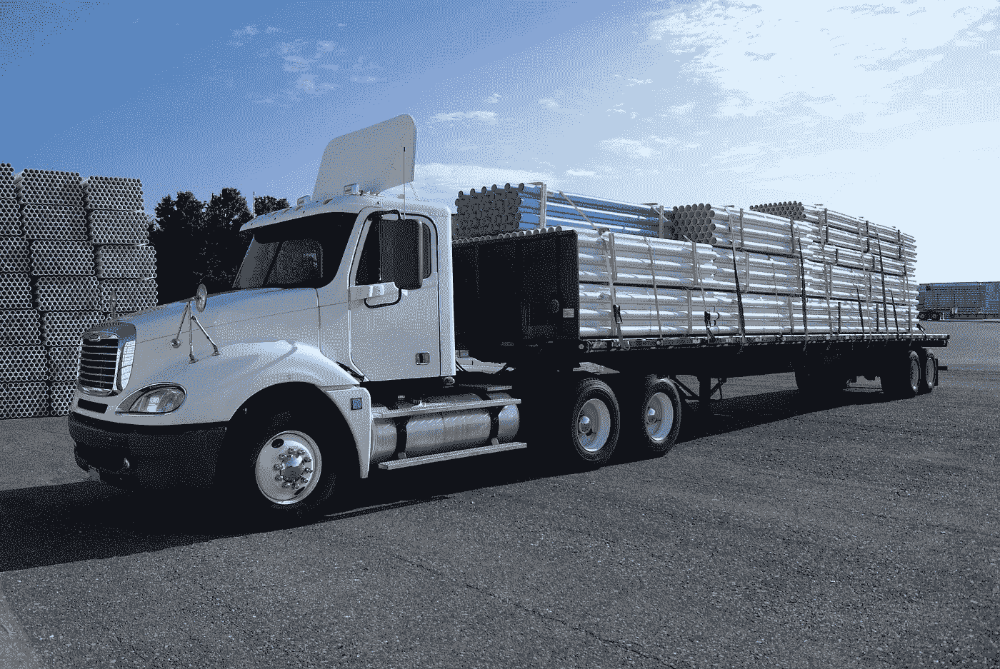
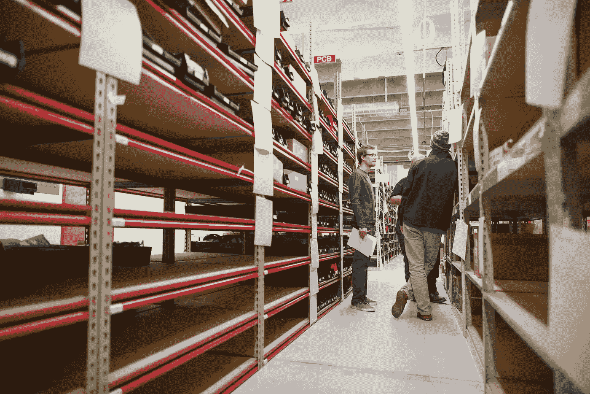
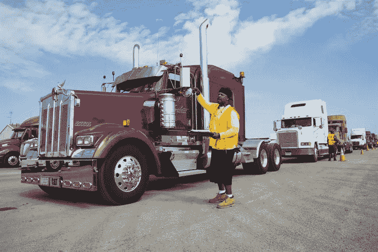

# 关于人工智能(AI)在物流中的作用要知道的 4 件事

> 原文：<https://towardsdatascience.com/4-things-to-know-about-the-role-of-artificial-intelligence-ai-in-logistics-f14323301900?source=collection_archive---------6----------------------->

确保公司的供应链工作流程在尽可能高的水平上运行的最重要的方法是拥有一个运转良好的物流团队。随着职业世界的日益数字化，越来越多的公司正在将人工智能(AI)添加到他们的供应链中，以便通过减少花费在计算如何、在哪里以及何时将包裹发送到某个地方的时间和金钱来最大化他们的资源。

从补充库存到寻找正确的运输方式和处理不可预见的路障，智能自动化公司如 [WorkFusion](https://goo.gl/CxjrCg) 在开发智能算法方面表现出色，这些算法可以处理各种变量，并通过其机器人流程自动化平台 [RPA Express](https://goo.gl/xCdpHJ) 生产物流解决方案。如今，设定运输价格是一项既需要人力又需要智能软件的任务，因为这两者可以共同努力，根据当前的市场条件来确定货物的公平价值。

以下是[关于人工智能及其在物流中的作用，你应该知道的四件事:](http://www.businessinsider.com/ai-supply-chain-logistics-report-2018-1)

**1)常见问题及解决方案**

最近的技术突破和托运人日益增长的需求推动企业探索人工智能以及它可以为物流团队提供的解决方案。该技术可以在供应链中提供的一些最常见的解决方案是资源管理、通过减少冗余和风险缓解来降低成本、支持传统预测技术、通过优化路线来加快交付、更好的客户服务等等。借助合适的智能自动化业务，公司能够无缝更新其 IT 系统，并增强其数据分析流程，以支持其物流流程。

**2)负载成本**

预测货物的价格可能会很棘手，因为运输成本会随着季节的变化而变化，甚至会根据每天或每天的时间而变化。人工智能可以帮助监控这些条件，并根据交货时间和货物的“路线”和目的地选择正确的价格。这些算法监控一系列参数，如交通、天气和社会经济挑战，帮助公司达成双方都能同意的公平价格。即使将一件物品从旧金山运送到洛杉矶的成本与将一件物品从洛杉矶运送到旧金山的成本不同，即使由于各地的经济和路线不同，所有其他物流因素都相同。

**3)优化库存**

人工智能还在信息的民主化和可访问性方面发挥着作用，因为该技术可以提供公平的报价，以确保双方获得公平的交易，同时还可以监控库存和装载能力，以便卡车在执行交付时不会犹豫不决。该技术还可以保护和管理供应商库存以及可供交付的卡车数量。智能算法会提前提供这些信息，这样客户就可以知道特定库存和卡车的准确价格和可用性，以便未来送货。AI 还提供数据分析，以了解哪些承运商过去以什么价格和服务水平运送了什么货物。

**4)应对突发情况**

当涉及到物流业务时，要做好意料之外的准备，因为一系列情况可能会影响产品的预期交付日期。飓风和洪水等自然灾害、承运人破产和员工罢工都会影响公司物流工作流程的自然进程。人工智能可以被训练从应急计划中学习，这些计划可以保证未来在紧急情况或中断的情况下采取纠正措施。如果天气袭击了原来的配送中心，该技术可以利用过去中断的信息来适应不断变化的环境，将卡车重新安排到不同的配送中心。

**结论**

物流和供应链是一个复杂的世界，需要大量的规划、弹性和在不可预见的情况发生时进行调整的能力。借助正确的人工智能平台，公司能够自动化物流工作流程，并为因道路建设或恶劣天气而脱轨的车辆选择备用路线。该技术还可以确保公司的库存得到补充，并确定哪些车辆最适合运输特定的货物，从而有助于减少确定运营物流所需的资金和时间。