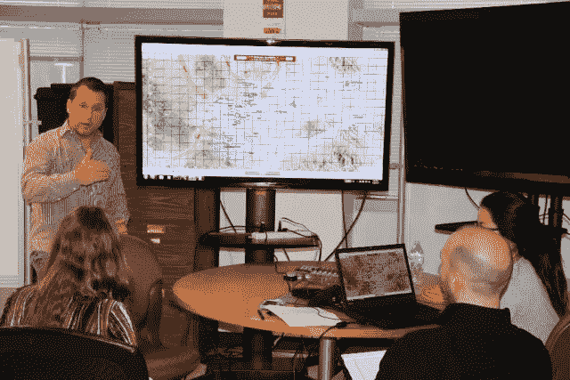
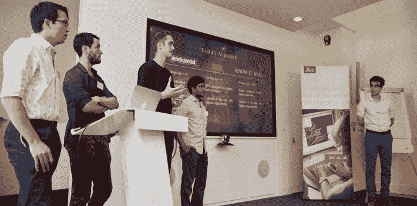
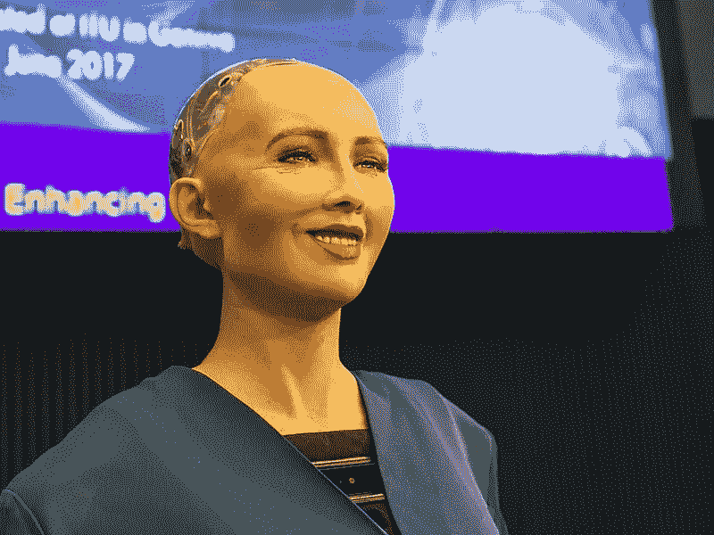

# 人工智能改变教育行业的 4 种方式

> 原文：<https://towardsdatascience.com/4-ways-ai-is-changing-the-education-industry-b473c5d2c706?source=collection_archive---------5----------------------->

由于人工智能(AI)的最新进展，学术界对学生来说变得更加个性化和方便。这项技术有许多应用正在改变我们的学习方式，让无法去上课的学生可以通过电脑或智能设备接受教育。受益的不仅仅是学生，因为人工智能还帮助自动化和加速管理任务，帮助组织减少花在繁琐任务上的时间，并增加花在每个学生身上的时间。

来自电子学校新闻的[最近的一项研究](https://edtechmagazine.com/k12/article/2017/07/ai-education-will-grow-exponentially-2021)发现，随着我们走向一个更加互联的世界，到 2021 年，教育行业[人工智能的使用](https://www.forbes.com/sites/theyec/2017/12/27/how-ai-impacts-education/#51684056792e)将增长 47.5%。该技术的影响将存在于从幼儿园到高等教育的任何地方，提供了利用个性化工具创建适应性学习功能的机会，以改善学生体验。这项技术或许能够更好地告知学生，基于他们特定的叙述，他们的工作前景可能会是什么样子，从而帮助他们超越他们的学术生活。WorkFusion 正在帮助组织使用智能自动化平台来改善教室中的评分和归档流程。

以下是人工智能改变教育行业的四种方式。

1.  **管理任务的自动化**

如前所述，人工智能在自动化和加速组织和教授的管理任务方面具有巨大的潜力。给家庭作业评分、评估论文和给学生的回答提供价值是教育工作者花费最多时间的地方。人工智能已经可以自动完成多项选择测试的评分过程，以便让教育工作者花更多时间与学生一对一相处，但该技术可能很快就能做得更多。软件开发人员正在创造新的方法来给书面回答和论文评分。录取过程也将受益，因为人工智能可以自动处理和分类文书工作。

**2)增加了智能内容**

智能内容的概念现在是一个热门话题，因为机器人可以像人类一样创建具有相同语法能力的数字内容，这项技术最终进入了课堂。人工智能可以帮助数字化教科书或创建可定制的学习数字界面，适用于所有年龄范围和年级的学生。一个名为 Cram101 的系统利用人工智能将教科书中的内容浓缩成更容易理解的学习指南，其中包括章节摘要、练习测试和抽认卡。另一个名为 Netex Learning 的平台允许讲师和教授在各种设备上设计数字课程和内容，包括视频、音频和在线助手。由于人工智能，数字讲座和视频会议等虚拟内容现在也成为现实。

**3)智能导师和个性化**

人工智能不仅仅可以将一堂课浓缩成抽认卡和智能学习指南，因为它还可以根据学生在课堂材料上遇到的困难来辅导学生。在过去，学生们能见到他们的教授的时间是有限的，这意味着办公时间或希望他们回复电子邮件。现在有像卡内基学习这样的智能辅导系统，它们使用来自特定学生的数据，以便给他们反馈并直接与他们合作。虽然这种人工智能应用程序仍处于早期阶段，但它很快就能成为一名成熟的数字教授，帮助学生满足任何领域的教育需求。此外，这些平台将很快能够适应各种各样的学习风格，以帮助每一位教育工作者和学生。

**4)虚拟讲师和学习环境**

甚至你真正的讲师可能很快就会被机器人取代。嗯，不完全是，但已经有虚拟人类向导和协调员可以通过使用手势识别技术以自然的方式思考、行动和与人类互动，对语言和非语言线索做出反应。随着南加州大学(USC)创新技术研究所等机构开发智能虚拟环境和平台，更加数字化的学习环境也正在成为现实。该组织使用人工智能、3d 游戏和计算机动画来创建真实的虚拟角色和社交互动。这项倡议不仅仅包括虚拟辅导员，因为增强现实可能很快也会成为教室的一部分。

**连接学术界的世界**

我们已经处于教育的未来，因为美国和全球其他地方的机构已经将人工智能添加到课堂上，希望它能让学生的工作更容易。这项技术还将用于改善管理任务和改善讲师管理课堂的方式。此外，该技术将为全国的机构节省数十亿美元的管理成本，减少管理费用，为更少的员工有效运作铺平道路。