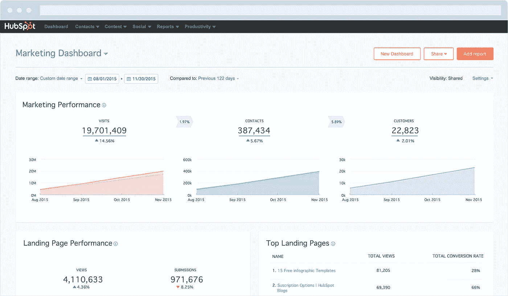
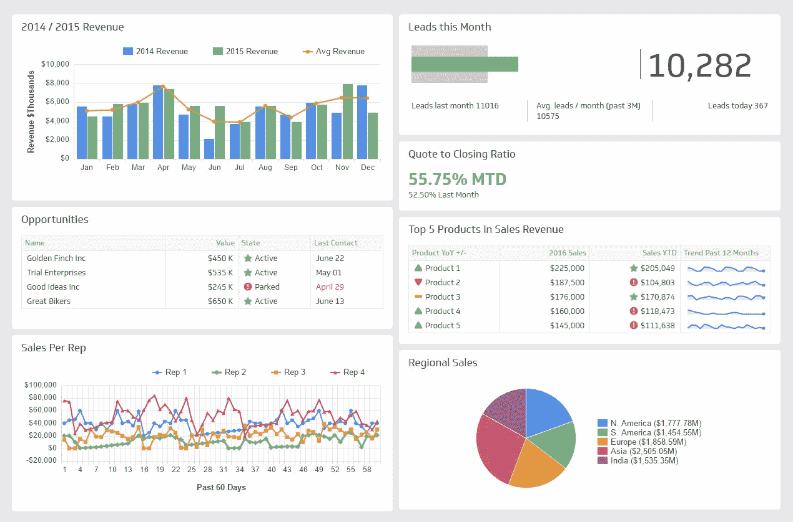
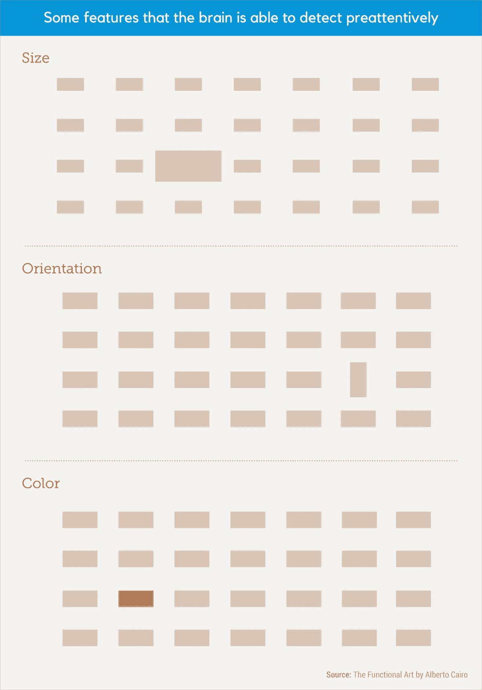
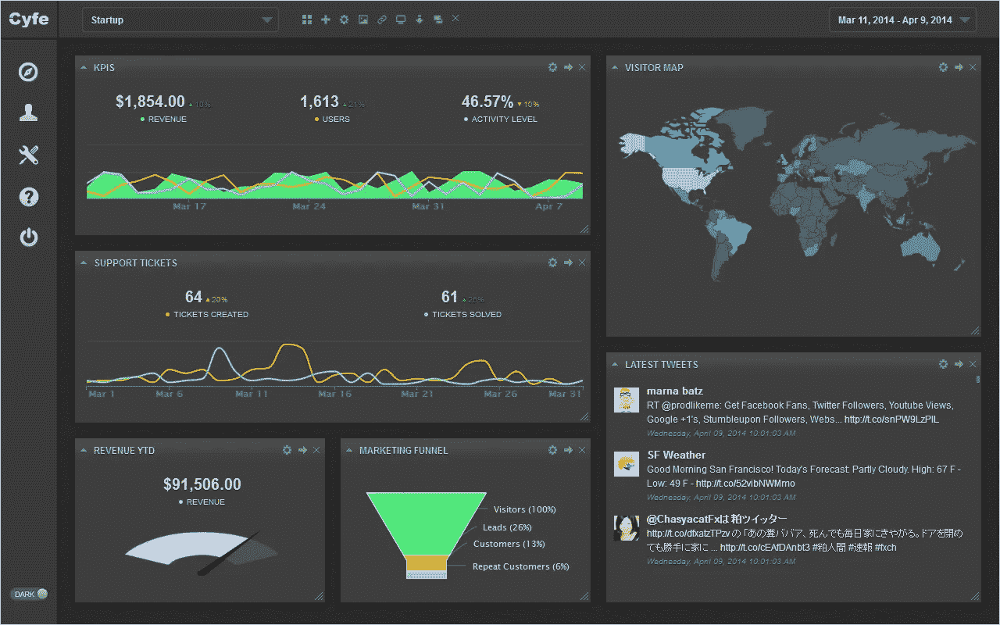

# 数据可视化可以提高销售和营销一致性的 4 种方式

> 原文：<https://towardsdatascience.com/4-ways-data-visualization-can-improve-sales-and-marketing-alignment-24af8706498d?source=collection_archive---------3----------------------->

骗局被揭穿了:一张照片的价值远远超过 1000 个字。这是科学。我们的大脑本质上是巨大的图像处理器——研究表明，传输到大脑的 90%的信息是视觉的。

你可以利用这种视觉力量来解决当今增长驱动型组织中最大的内讧问题之一——销售和营销之间的错位。

销售和营销之间的分歧最常见的原因是缺乏对彼此工作的理解。如果销售团队没有完成新业务，他们倾向于将其归咎于营销活动带来的低质量线索，而营销团队则将其归咎于杂乱无章的销售开发流程。

解决这类分歧的最佳工具是冷冰冰的硬数据。数据不容易被质疑，但首先它必须被理解。这就是数据可视化的用武之地。利用大脑对图像的偏好，您可以创建数据的可视化表示，这将使您的销售和营销团队更加高效和准确。

在你开始之前，你需要确保你有适合这项工作的工具——通常是一些 [CRM 软件](http://bit.ly/2m3enWr)和营销自动化的组合，尽管许多销售/营销团队也使用[第三方数据可视化工具](https://www.visme.co/graph-maker/?vc=In-Text-Blog-CTA)来增强他们的本地报告能力，提供更多动态插图。

让我们仔细看看您的组织应该创建的一些销售和营销图表:

# 1.视觉引发变化

[Source: Hubspot](https://www.hubspot.com/product-updates/a-new-design-for-your-marketing-dashboard)

# 创造什么

显示合格销售线索转化为交易的百分比及其来源的动态图表。这些可用于将收入归因于营销活动。

# 为什么要创建它

在一项针对吸烟者的研究中，研究人员发现，那些看到反对吸烟图片的人比那些看到吸烟后果文字的人更有可能戒烟。这要归功于图像引发的情感反应——视觉记忆和情感记忆储存在大脑的同一个区域。

您可以利用这种联系来帮助触发销售和营销策略的变化，从而提高一致性。清晰展示该部门贡献高价值线索的方式的营销图表将推动销售人员更加努力地从这些来源获得未来的线索。与此同时，当营销人员看到他们的收入贡献中缺乏直观传达的方面时，他们更有可能采取快速行动进行改进。

显然，收入图表没有反吸烟广告那样的情感分量，但在一个充满利益相关者的房间里看到这种可视化的体验，将比收入的模糊概念更能推动变革。

# 2.视觉创造速度

[Source: Klipfolio](https://www.klipfolio.com/resources/dashboard-examples/sales/salesforce)

# 创造什么

共享 CRM 仪表板，直观显示销售线索渠道和当前正在进行的交易。

# 为什么要创建它

阅读电子表格中列出的数据报告可能需要几分钟时间。但是研究表明大脑可以在 13 毫秒内解读图像。这是破纪录的速度，正是在快速变化的销售和营销环境中做出反应所需的速度。

使用视觉效果来展示销售线索在渠道中的位置，这是一种改变游戏规则的方式，可以改善您的销售和营销渠道。

只需一瞥，销售团队就可以清楚地看到潜在障碍出现在他们的终端，并快速解决它们，进一步提高他们对营销对其渠道的贡献的理解。

同时，营销团队可以快速查看他们的销售线索在开发过程中的进展情况，并使用该信息调整营销活动。

# 3.视觉识别模式

Our brains are hardwired to quickly detect patterns.

# 创造什么

可视化分析过去的购买趋势，以建立更准确的理想客户档案，从而产生更高质量的销售线索。

# 为什么要创建它

当你阅读一份很长的报告或数据表格时，很难注意到模式。至少，你需要一支荧光笔(可能还需要一些阿司匹林)来记录所有的信息。

视觉效果不同。我们的大脑天生就能注意到物体之间的关系，快速准确地捕捉模式。

销售和营销团队可以利用这种力量来注意买家行为的趋势——最高转换率的流量来自哪里，他们的人口统计细节是什么，谁负责这些线索，等等。

理想的客户档案和渠道模式将很快出现，从而更好地瞄准高质量的销售线索，并在销售端进行更好的战略规划。

# 4.视觉效果令人难忘

[Source: Cyfe](http://www.cyfe.com/)

# 创造什么

追踪带来最多和最少新业务的来源和活动的图表。

# 为什么要创建它

任何老师都会告诉你，让学生将信息锁定在长期记忆中的最佳方式——不仅仅是为了下一次突击测验——是将概念与相关的视觉效果配对。

事实上，研究表明，口头陈述三天后，听众成员[只能记住 10%的内容](http://digitalsplashmedia.com/2012/03/picture-superiority-effect-video-explanation/)。但是在口头和视觉演示三天后，观众能记住 65%的内容。

你不仅可以利用这一点来协调你的销售和营销团队，还可以维护这一点。每月(或每隔一段时间)创建图表，跟踪各种来源和活动的成功情况。

如果您不想构建新的可视化，您也可以构建一个仪表板，从您的活动中实时提取数据，并以图表、滚动条、计量器和其他插图的形式呈现出来。可视化地表示这些数据不仅可以帮助两个团队的成员在日常工作中记住每个来源的价值，还可以帮助他们注意到不同周期之间发生的变化。

如果你仍然需要数据可视化的力量的证明，看一看地图。毕竟，当你把它分解开来，地图是坐标和地理数据的图像表示。想象一下，试图从一个包含城市名称、纬度和经度的电子表格中找到自己的路。

# 轮到你了

视觉效果不错。将它们用于您的组织中的数据，您的营销和销售团队将很快找到折中的方法。

如果你没有预算订阅昂贵的第三方数据可视化工具，你也可以开始创建自己的营销图表，用这个[免费工具](https://www.visme.co/graph-maker/)显示实时数据。

*本帖* [*原版*](http://blog.visme.co/marketing-charts/) *最早出现在 Visme 的* [*视觉学习中心*](http://blog.visme.co/) *。*