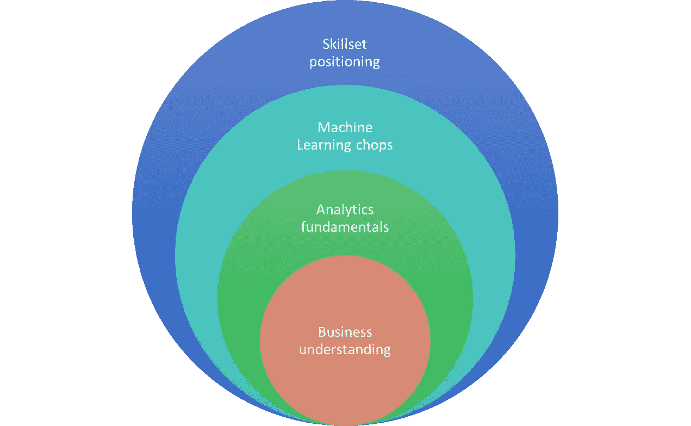

# 数据科学家面试失败的 4 种方式

> 原文：<https://towardsdatascience.com/4-ways-to-fail-a-data-scientist-job-interview-d9c4c85c683?source=collection_archive---------2----------------------->

Photo: Pixabay/[www_slon_pics](https://pixabay.com/en/despaired-businessman-business-2261021/)

“数据科学家”可能是本世纪最性感的工作。但是雇佣一个可不是那么回事。事实上，这对公司来说是极其痛苦的。对于有志之士来说，在核心数据科学领域获得一个完美的职位也是一件大事，这个职位不仅仅是一个荣耀的头衔，还能提供更多的东西。

虽然机器学习很难，但训练一个能让机器学习的人可能会更难(T2)。一个人通过专业知识的各种递增阶段发展成为一名多产的数据科学家。

对于试图确定一个的公司来说，这就像大海捞针。在 [Gramener](https://gramener.com/careers/) 雇佣数据科学家多年后，我看到了市场上一些明显重复出现的技能差距模式。虽然有数百种方法会导致面试失败，但这些方法可以归纳为四大途径。

## 拒绝的四种途径

考虑到在成千上万的申请者中只有少数人能够胜任这个丰富的机器学习职位，了解大多数人失败的地方是有帮助的。对于任何有抱负的数据科学家或希望升职的人来说，这些都是应该避免的明显陷阱。

> 意识到自己的弱点是改正它的第一步。

成为一名真正成功的数据科学从业者需要掌握一套专业技能。除了轻松的类比，还有什么更好的方式来说明这些角色的细微差别呢？我们将把这种成为数据科学家的经历与成为狙击手的经历进行比较，狙击手是另一项需要非凡技能的酷工作。

我们开始吧..那么，数据科学家面试失败的 4 种方式是什么？

## 1.用机器学习的流行语粉饰简历

Photo by [Inês Pimentel](https://unsplash.com/photos/opkaRk20tAw?utm_source=unsplash&utm_medium=referral&utm_content=creditCopyText) on [Unsplash](https://unsplash.com/?utm_source=unsplash&utm_medium=referral&utm_content=creditCopyText)

和任何工作一样，在简历中加入行业术语可能很有诱惑力。数据科学并不缺乏术语。虽然这种装点门面的行为确实提高了简历被人力资源部门的自动评分机器人选中的几率，但这可能会很快适得其反。

不难发现，纸上声称的 [*高级* *分析*](/decoding-deep-learning-a-big-lie-or-the-next-big-thing-b924298f26d4) *技能*实际上只不过是对 excel 数据透视表、SQL 查询或谷歌分析的基本熟悉。即使我们把浪费的时间放在一边，这种拙劣的策略也为巨大的失败和更大的消极情绪埋下了隐患。

对于我们有抱负的狙击手来说，这种行为等同于穿上士兵的服装，拿起一把枪，而没有投入训练成为一名士兵所需的时间。虽然听起来很荒谬，但一只羊披着狼皮去打猎一点也不好玩。

## 2.**将建模简化为仅仅进行库调用**

Photo by [Zhen Hu](https://unsplash.com/photos/VcpHtqee9sc?utm_source=unsplash&utm_medium=referral&utm_content=creditCopyText) on [Unsplash](https://unsplash.com/collections/1765636/lego?utm_source=unsplash&utm_medium=referral&utm_content=creditCopyText)

许多声称对建模了如指掌的候选人，除了解释模型函数调用和参数之外，还极力解释。甚至在问*像随机森林这样的技术*做什么之前，一个更重要的问题是*为什么首先需要它。*

公平地说，一个模型只需一行库调用就可以启动并运行。但是，机器学习远不止这些。人们需要理解，比如说，逻辑回归在哪里比 SVM 更合适。或者，当简单的外推比 ARIMA 或霍尔特-温特斯等预测技术更有效时。

一名优秀的狙击手需要做的不仅仅是瞄准射击。其实射击只是[狙击学校](https://www.thebalance.com/army-sniper-school-3345043)里 20%的课程。一个人需要细致入微的技能，如耐心、纪律和良好的观察，才能从远处估计目标范围。

## 3.缺乏数据分析的基本要素

Photo by [Daniel Cheung](https://unsplash.com/photos/ZqqlOZyGG7g?utm_source=unsplash&utm_medium=referral&utm_content=creditCopyText) on [Unsplash](https://unsplash.com/?utm_source=unsplash&utm_medium=referral&utm_content=creditCopyText)

虽然对机器学习技术的直观理解可以成为候选人的一大优势，但他们往往就此止步。投资于实践培训，以掌握更基本的技能，如统计和探索性数据分析，往往被忽视。

建模只占分析生命周期的一小部分。在任何一个成功的 ML 项目中，超过一半的时间花在数据准备、争论和方法上。几乎四分之一的时间是在模型解释和推荐中。

即使候选人在项目中标榜 90%的准确性水平，当他们努力解释什么是 p 值时，这是一个悲剧。看到他们在解释为什么我们需要模型的*置信区间*时信心下降，令人心碎。

在所有学科中，牢牢掌握基础知识是至关重要的，狙击手首先需要成为一名优秀的步兵。如果一个人不会修理在战斗中卡住或走火的枪，那么优秀的枪法还有什么用？

## 4.无法应用分析来解决业务问题

Photo by [James Pond](https://unsplash.com/photos/HUiSySuofY0?utm_source=unsplash&utm_medium=referral&utm_content=creditCopyText) on [Unsplash](https://unsplash.com/collections/1765636/lego?utm_source=unsplash&utm_medium=referral&utm_content=creditCopyText)

显然，掌握我们迄今为止讨论的所有方面是一项艰巨的任务。但我们仍然错过了链条中的一个关键环节，这也是大多数面试嘎然而止的地方。

数据科学家的最终使命是解决一个[业务问题](/5-reasons-why-businesses-struggle-to-adopt-deep-learning-85205e11d69a)，而不仅仅是分析数据或构建一个伟大的模型。这是数据分析的圣杯。人们需要构建正确的业务问题，并逐步形成解决这些问题的一系列步骤。甚至在将任何数据加载到工具之前。

当被问到企业如何解决客户流失问题时，当候选人带着数据分析的想法冲进来时，这是一个谈话杀手，或者更糟的是，抛出模型名称来预测流失。一个更好的开始是调查客户为什么注册，他们期望的价值，以及什么影响业务。

想象一下，一个狙击手专家*知道*所有的一切，但不能隐藏和伪装在地下或选择正确的目标来消灭。这样的人是真正的危险人物，对他们自己的部队来说，内部的危险比敌人更大。

## 总结:追求数据科学

Photo by [James Pond](https://unsplash.com/photos/1qkyck-UL3g?utm_source=unsplash&utm_medium=referral&utm_content=creditCopyText) on [Unsplash](https://unsplash.com/?utm_source=unsplash&utm_medium=referral&utm_content=creditCopyText)

总之，人们必须通过以下方式对数据科学进行严格的追求:

*   通过重新构思问题并逐步形成一系列步骤来应对挑战，从而解决一个**业务问题**，
*   将**基本技能**应用于统计和探索性数据分析，感受数据并迭代分析方法，
*   选择一系列分析技术或**机器学习模型**，然后为业务用户设计和解释结果
*   以及[展示](/how-to-flaunt-your-passion-for-analytics-in-data-science-job-interviews-2cb432cc3d3d)这些技能，并**正确定位**自己的专长，实现理想的角色契合

所以，祝你好运，弥合差距，并在分析人才市场创造一个凹痕！

Plugging the 4 common failure points in Data science interviews

*如果你觉得这很有趣，你会喜欢阅读我最近写的关于如何获得非直觉超能力以在数据科学职业生涯中更快提升的文章:*

 [## 让你在数据科学职业生涯中不可或缺的 4 种超能力

### 了解数据科学行业的这些最大挑战，以避免职业生涯停滞不前

towardsdatascience.com](/4-superpowers-that-will-make-you-indispensable-in-a-data-science-career-6571e8e7d504) 

*对数据科学充满热情？随时在*[*LinkedIn*](https://www.linkedin.com/in/gkesari/)*上加我，订阅我的* [*简讯*](https://gkesari.substack.com/) *。*