# 歌词 49 年:基于 Python 对 1970 年至 2018 年流行音乐语言变化的研究。

> 原文：<https://towardsdatascience.com/49-years-of-lyrics-why-so-angry-1adf0a3fa2b4?source=collection_archive---------13----------------------->

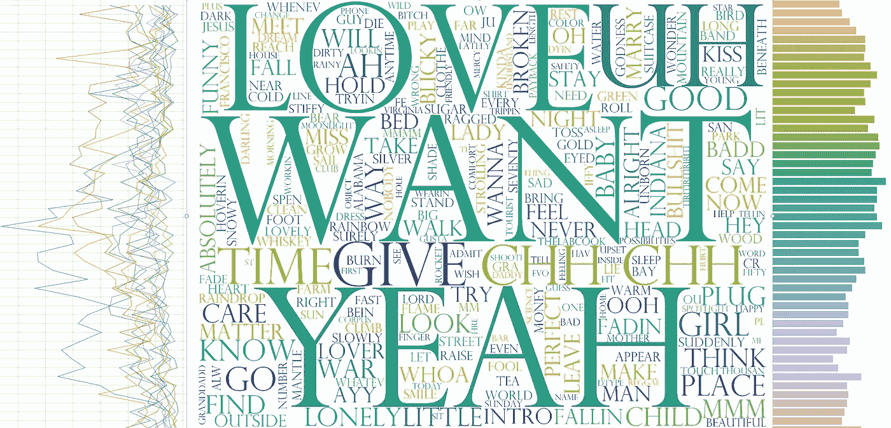

## 在过去的 49 年里，歌词变得更具攻击性和亵渎性了吗？我们使用 SpaCy 和 Keras 进行调查。

# 背景

这篇文章最初是作为一个关于流行音乐与几年前相比是好是坏的争论开始的。有几个理论可以解释为什么特定时间范围的音乐会引起我们的共鸣，这肯定会影响我们对音乐和艺术等主观事物的公正性。这里有一篇关于神经怀旧的优秀文章，详细讨论了这个问题。

但对我来说，作为一个数据驱动型的人，我认为某种程度的定量分析可以发挥作用。如果我能够浏览 1970 年至 2018 年的音乐，并从自然语言处理(NLP)的角度调查歌词，我会发现什么？我的意思是，我*知道*90 年代末的音乐是有史以来最好的音乐(见上面的神经怀旧文章)，但我如何证明/反驳这一点呢？我怎么能测量如此主观的东西呢？

我还想向其他研究人员/数据科学家/爱好者提供一些例子，说明如何收集、构建基于开源网页的数据，然后用于 API 调用。此外，我想展示如何使用[空间](http://www.spacy.io)来标记歌词，这样它们就可以通过一个训练有素的人工神经网络来输入。我使用 Requests、BeautifulSoup 和 SpaCy 进行收集和数据准备任务，使用 matplotlib 和 seaborn 进行可视化，使用 Keras 和 Tensorflow (GPU)来训练 ANN，然后用它进行预测。

## 关于附带代码的说明

您还会从 github repo 中的许多代码中看到，我专注于线性和可读性，以便其他人可以挑选适合他们目的的代码部分。它通常不会针对性能进行优化，我真正关注的是调查。你可以在这里找到 github 的所有源代码。

# 假设

在更多的争论之后，我们想出了下面的衡量标准，这些标准将被用来测试歌词，看看它们在 49 年间是如何变化的:

*   每首歌的总字数作为复杂性的度量。
*   每年最常用名词的变化。
*   副词的年使用量。
*   每年歌曲中出现的亵渎性/争议性词语(本身就是主观的)的数量。
*   歌曲中攻击/敌意的程度(我们将为此任务建立一个 Keras 序列模型)。

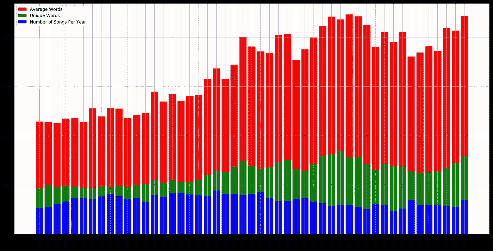

假设如下:

*   从 1970 年到 2018 年，单词量和语言复杂度都有所增加。
*   几个常见的名词出现在歌词的整个范围内，但最常见的名词会随着时间的推移而变化。
*   随着时间的推移，副词变得更具攻击性。
*   歌词中的亵渎性在过去 20 年(1998 年至 2018 年)显著增加。
*   现在的歌曲比 20 世纪 70 年代更具攻击性。

# 辅助实验(即将推出…)

我还将遍历歌词数据，查看特定的新术语何时出现在歌词中，这些新术语以前从未出现过。诸如“互联网、黑莓、iPhone、恐怖主义、经济衰退”之类的术语(在未来某个日期出现)。

我们开始吧！

# **数据收集**

我们使用三个数据集来运行这个实验:

1.  我们将自己收集一个数据集，其中包括 1970 年至 2018 年间的 3400 多首歌词。
2.  来自 www.freewebheaders.com[的禁止/限制词列表，我们将用来评估歌词中亵渎的感知水平。](https://www.freewebheaders.com/bad-words-list-and-page-moderation-words-list-for-facebook/)
3.  来自 [Kaggle](https://www.kaggle.com/dataturks/dataset-for-detection-of-cybertrolls) (最初用于检测网络巨魔)的训练数据集，我们将用来训练 Keras 顺序神经网络。然后我们将旋转训练好的神经网络来预测一首歌是否被认为是攻击性的。

## 初始收集(网页抓取)

我在网上找不到任何现成的歌词数据来做这个实验，所以我看了看 billboard.com 的年终 100 首歌曲。虽然他们有追溯到 70 年代以前的记录，但他们的数据集中有很多空白，包括 1991 年至 2006 年的前 100 名名单。幸运的是，有另一个网站([bobborst.com/](http://www.bobborst.com/))是由一个真正的音乐爱好者策划的，所有 2017 年之前的内容都可以在那里找到。

因此，大部分种子数据将从[http://www.bobborst.com/](http://www.bobborst.com/)收集，其余数据将从 billboard 收集。

我使用 Python 的请求库来获取数据，然后使用 beautiful soup([https://www.crummy.com/software/BeautifulSoup/bs4/doc/](https://www.crummy.com/software/BeautifulSoup/bs4/doc/))来执行收集。这是一个有趣的任务，因为一个网站是由 html 表组织的，另一个是由 div 组织的，所以我需要两个不同的转换。收集到的数据被存储在一个名为“所有歌曲”的熊猫数据框架中

完整的代码片段见下面 Github 上的函数。

```
def collect_songs_from_billboard(start_year,end_year):
```

随着初始数据收集的完成，我现在有了 4900 首歌曲的艺术家、排名、歌名和年份。虽然我真的很专注于歌词，但我没有实验所需的东西。这就是 https://genius.com/发挥作用的地方。

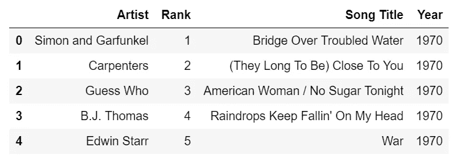

all_songs.head()

## 歌词和元数据收集(通过 genius.com)

快速的谷歌搜索将我们带到了一个名为[lyricsgius](https://github.com/johnwmillr/LyricsGenius)的库，它很好地包装了 genius.com API。然后，我们可以使用一个循环来遍历 all_songs，以便收集每首歌曲的歌词。这个 API 还为我们提供了专辑、发行日期、任何相关的 URL、歌曲作者以及歌曲的任何主要艺术家。下面是其工作原理的一个片段(完整代码见 Github)。

```
api = genius.Genius("YOUR API KEY GOES HERE", verbose = False)
try:
    song = api.search_song(song_title, artist = artist_name)
    song_album = song.album
    song_album_url = song.album_url
    featured_artists = song.featured_artists
    song_lyrics = re.sub("\n", " ", song.lyrics)
    song_media = song.media
    song_url = song.url
    song_writer_artists = song.writer_artists
    song_year = song.year
except:
    song_album = "null"
    song_album_url = "null"
    featured_artists = "null"
    song_lyrics = "null"
    song_media = "null"
    song_url = "null"
    song_writer_artists = "null"
    song_year = "null"
```

我们需要在这里使用 try/except，因为在 Billboard/鲍勃·博斯特存储艺术家/歌曲的方式与 genius.com 存储艺术家/歌曲的方式之间经常存在差异(例如，and vs &，以 The 开头的披头士乐队，等等)。我在检查一些遗漏时处理了其中的一些，但总体上决定看看我从最初的 4900 首歌曲中获得了多少。API 调用不是很快，所以遍历整个集合需要大约两个半小时才能完成。

# 调查数据(阶段 1)

## 一般数据特征

在我扔给 genius API 的 4900 首歌中，我拿回了 3473 首。我用《熊猫》和《T4》来观察歌曲年复一年的分布情况，看看有多少没有出现，以及这是否会对剩下的实验产生巨大的影响。

我运行了两次 API 集合，一次没有任何替换，一次替换了 Beatles、Jackson 5 和&。结果如下:

*   无替代:3378 条记录(占记录总数的 68.9%)。
*   替换:3473 条记录(占记录总数的 70.9%)。95 项记录的增加。

一些手动的进一步检查显示，有几首歌曲的标题在两个数据集上不匹配。我们可以花更多的时间来检查异常，但我们将继续了解我们没有 100%的数据集。

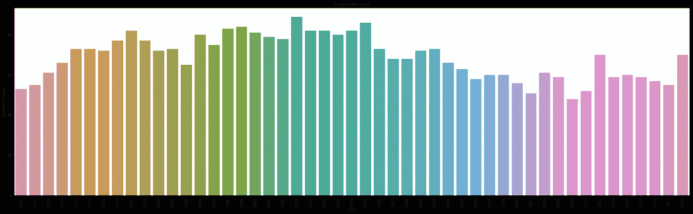

Songs with Lyrics

从上面可以看出，我们在 1990 年获得的数据量最多，在 2010 年获得的数据量最少。在我们继续进行的过程中，我们会记住这一点。

# 数据准备

对于数据准备，我们希望获得三样东西，2 个用于特征目的(这将有助于我们对语言复杂性的轻量级评估)，更关键的一个是从歌词中提取名词、动词、副词、停用词和特殊字符，以便执行一些更核心的分析。

## 空间标记化

SpaCy 是一个相当工业化的 NLP 库系列，可以快速跟踪数据准备，并可用于基于其预训练模型的所有其他类型的文本分析。我强烈建议在这里阅读[初级读本。](https://spacy.io/usage/models)

对于这个实验，我编写了一个函数，它获取动词、副词、名词和停用词词类(POS)标记，并将它们推入一个新的数据集。然后，我们将它们提取出来，并返回到一个丰富的数据集中，使我们能够进一步调查数据*和*准备好通过我们的亵渎检查和我们的攻击性人工神经网络。检查名为的函数:

```
def add_spacy_data(dataset, feature_column):
```

欲知详情。

我还使用 split 和 set 来计算每个数据集中的单词数和唯一单词数。让我们来看看新增加的数据。

# 调查数据(第 2 阶段)

我们现在可以看到我们丰富的数据集，其中包含更多细节:

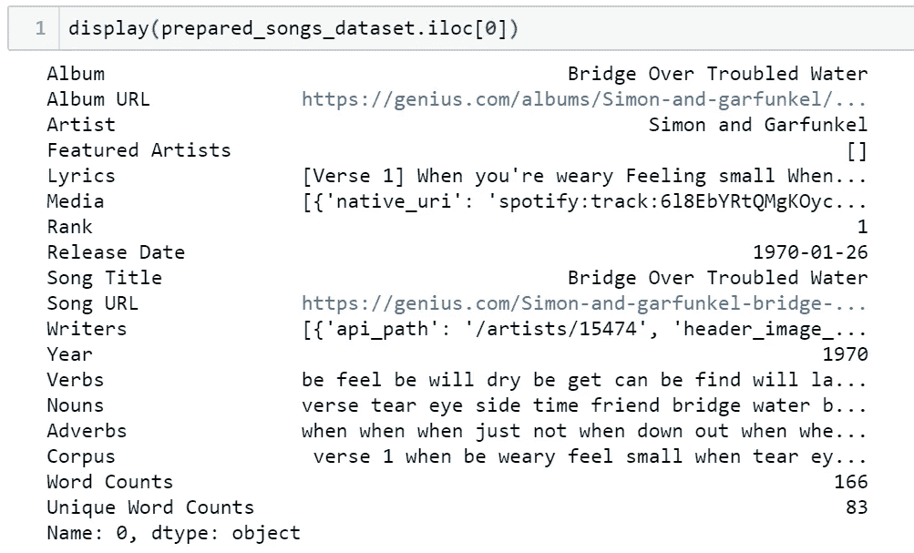

Enriched Row Example

我们在这里看到，我们有动词，名词，副词，语料库，字数，独特的字数现在可供我们使用。在这种情况下，我们删除了停用词，因为它们本身通常没有太多意义，我们希望将重点放在有影响的词上。让我们进一步看看单词故障。

## 歌词(原创内容)

```
[Verse 1] When you're weary Feeling small When tears are in your eyes I will dry them all I'm on your side When times get rough And friends just can't be found Like a bridge over troubled water I will lay me down Like a bridge over troubled water I will lay me down  [Verse 2] When you're down and out When you're on the street When evening falls so hard I will comfort you I'll take your part When darkness comes And pain is all around Like a bridge over troubled water I will lay me down Like a bridge over troubled water I will lay me down  [Verse 3] Sail on Silver Girl Sail on by Your time has come to shine All your dreams are on their way See how they shine If you need a friend I'm sailing right behind Like a bridge over troubled water I will ease your mind Like a bridge over troubled water I will ease your mind"
```

## 语料库(删除了停用词、标点和小写字母)

```
verse 1 when be weary feel small when tear eye I dry I be when time rough and friend not find like bridge troubled water I lay like bridge troubled water I lay verse 2 when be when be street when evening fall hard I comfort I will when darkness come and pain like bridge troubled water I lay like bridge troubled water I lay verse 3 sail silver girl sail Your time come shine all dream way see shine if need friend I be sail right like bridge troubled water I ease mind like bridge troubled water I ease mind
```

## 副词

```
when when when just not when down out when when so hard when all around how right
```

## 名词

```
verse tear eye side time friend bridge water bridge water street evening part darkness pain bridge water bridge water time dream way friend bridge water mind bridge water mind
```

## 动词

```
be feel be will dry be get can be find will lay will lay be be fall will comfort will take come be will lay will lay sail sail have come shine be see shine need be sail will ease will ease
```

我们将绘制词频(总的和唯一的)，以及每年使用的平均词频，看看我们是否能证明我们的复杂性增加和名词在 49 年间的演变。

## 每年平均字数和独特字数

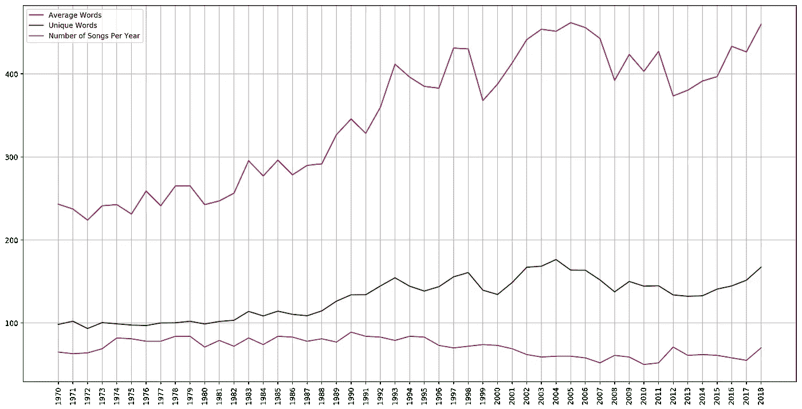

Songs Collected, Average Words, and Unique Words per Year

从上面的图表中我们可以看到，从 1970 年到 2018 年，每首歌的单词量一直呈上升趋势，一般来说，独特的单词随着总单词量的增加而上升。我们还可以看到，收集的歌曲总数似乎对这两者都没有直接影响。我们也可以用一个堆叠的条形图来看这个，看看是否有更多的见解。

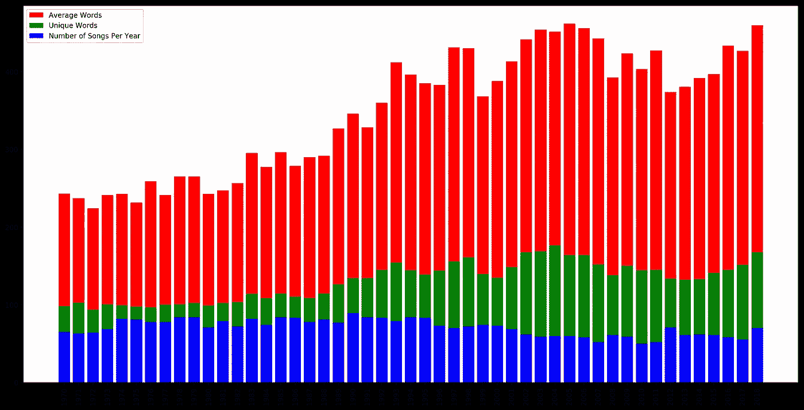

Songs Collected, Average Words, and Unique Words per Year (Stacked Bar)

这有助于我们确定 1978 年出现了最低数量的独特词，也支持了一个假设，即(通过独特性和字数的衡量)歌词随着时间的推移变得越来越复杂。我们也可以用 matplotlib 的 subplot 特性来叠加多个维度。这将有助于我们想象是否有任何明显的相关性。

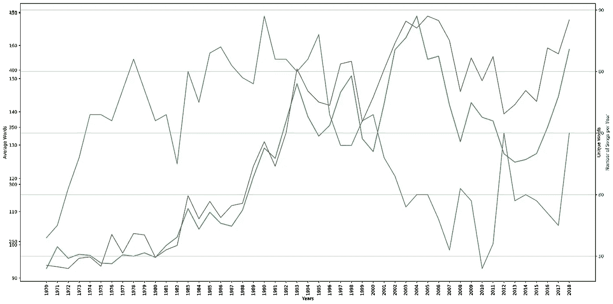

Songs Collected, Average Words, and Unique Words per Year (Multi Axis)

从这个角度来看，我们确实可以看到独特的单词和总单词彼此密切相关，并且收集的歌曲数量似乎与这些值没有明显的关系。其实当一些最复杂的歌词出现的时候，收藏其实是比较低的。由于我们对字数和唯一字数都进行了平均，如果数据导致了过大的问题，我们会看到收集未命中的下降。

看起来我们歌词最复杂的年份是 2004 年和 2005 年。下面我们就来看看他们。

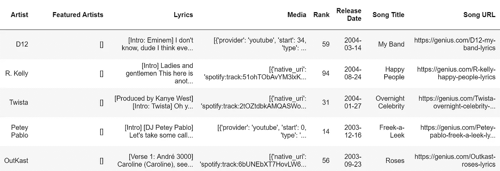

Most Words, 2004

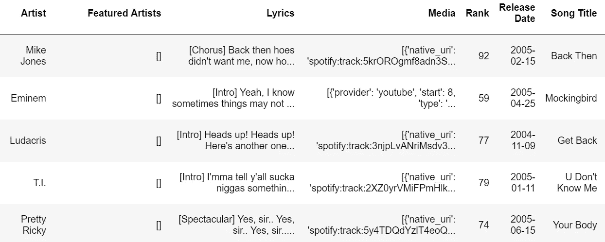

Most Words, 2005

我们可以在这里看到，在这两种情况下，前 5 名都是说唱/嘻哈歌曲，这在这种情况下是有意义的，因为这两种类型都是词重于当时的一些更流行的歌曲。您可以检查代码以获得更多与数据交互的方式，但是可以说使用独特的单词得到的结果是相似的。我没有能力收集歌曲的流派信息，但我认为你会看到这些流派在这个时间段非常流行，这将再次支持字数的增加。

我们来看一两个字云。

我写了一个函数，将 [wordcloud](https://github.com/amueller/word_cloud) 库包装成我喜欢的格式和字体包，并在这里通过它推送了一些年的数据。实际上，我在日常调查中大量使用词云来识别异常值和术语，这些异常值和术语可能会使我构建的模型产生偏差。他们也可以很漂亮。**请注意:**由于一些歌词可能包含亵渎的内容，这可能会显示在单词 clouds 中。

我们将看看最低复杂度和最高复杂度的年份，看看每个年份中最常见的是什么。

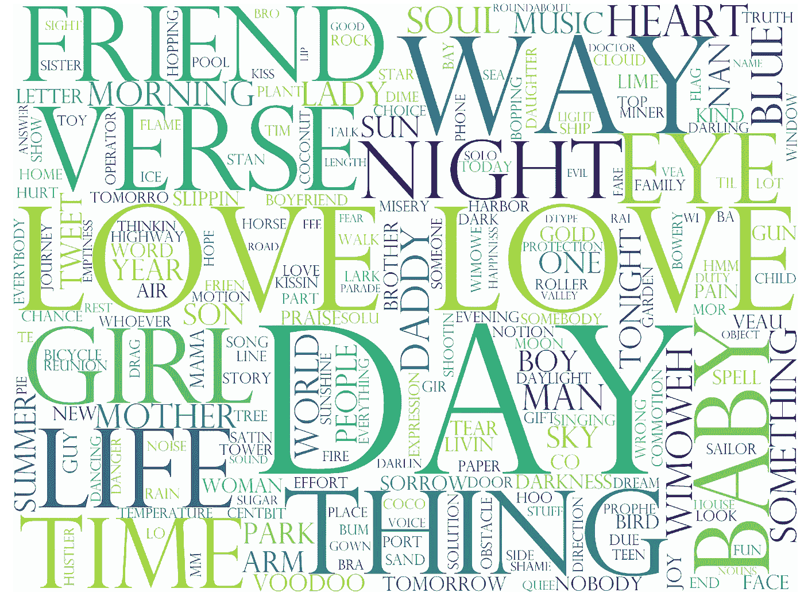

1972 Word Cloud

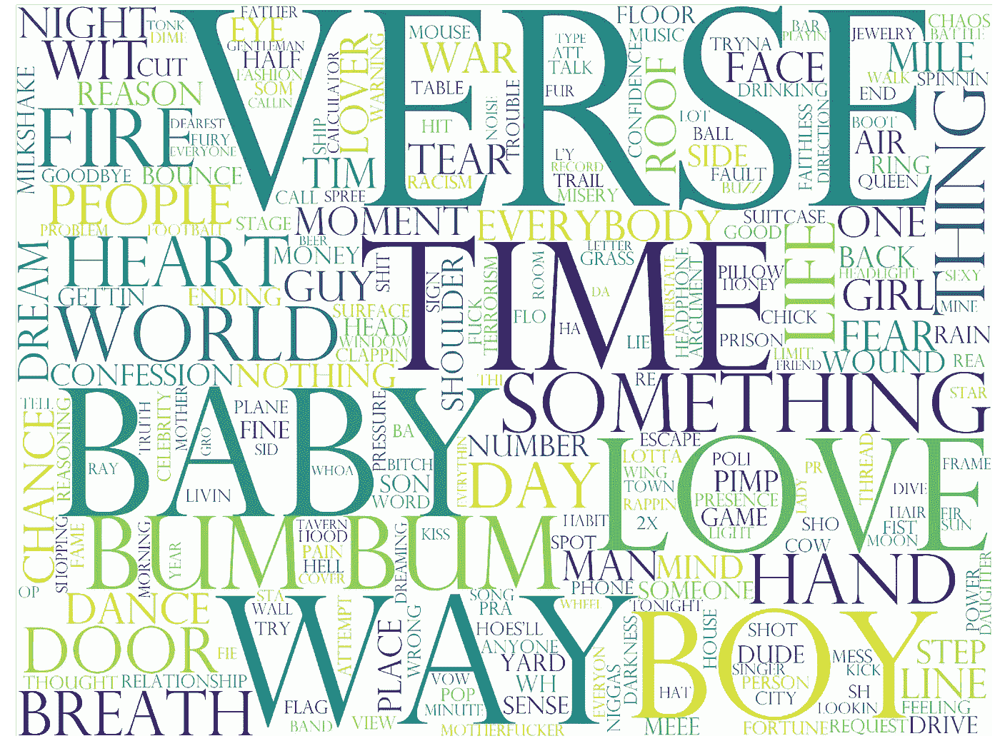

2004 Word Cloud

在单词 clouds 上面，看起来像诗句出现了很多。那是因为它们在歌词里是位置标记。我们可以回过头来把它们当作停用词，但是由于它在整个数据中似乎是一致的，我们或许可以继续下去。如果我们再回来，我们可能要清理它。单词云非常适合这个。

现在来看看这些年来最常见的术语。

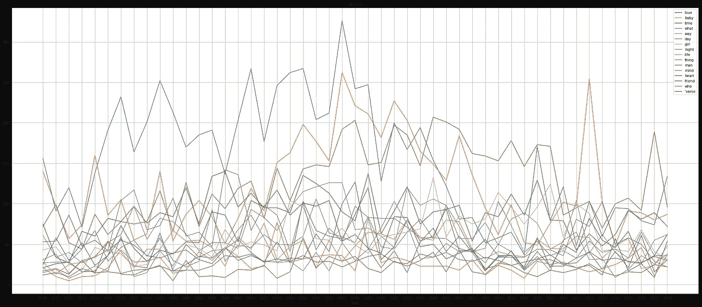

Nouns over the Years

从上面的形象化来看，好像爱情在 1993 年达到顶峰，然后被婴儿取代，接着被什么取代，但那真的是一个代词，所以我们可以倒向时间。宝贝在 2012 年过得很好。这支持了我们的假设，即歌词的主题随着时间的推移发生了变化，即使我们把它限制在所有年份看到的词。

# 亵渎分析

现在我们理解了数据，我们知道字数增加了，主题也变了，看起来我们的收集没有因为每年记录的差异而有太多偏差。我们现在可以继续分析歌词中亵渎的频率。

## 关于偏差的一点注记

我们用来检测脏话的字典是基于当今的文本、对话和媒介，所以它可能偏向于更现代的歌曲。我们可以凭直觉认为，今天的歌曲有更多的*公开的*亵渎，但我没有一个更古老、更隐蔽的亵渎形式的列表来进行这个实验。记住这一点，让我们继续。

我从 www.freewebheaders.com 下载了一本字典，里面有他们列出的 facebook 等网站的禁忌词汇。你可以在链接上读到更多，但只有在你不容易被冒犯的情况下才真正打开文件，它包含一些相当可怕的语言。然后，我遍历数据集，查看这些词何时出现，将它们与歌词一起存储，然后计算出现的频率。结果如下图所示。

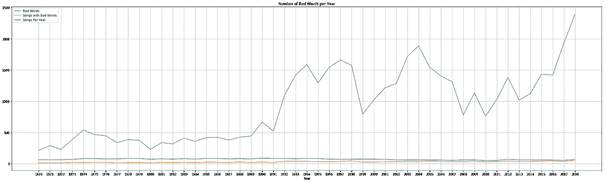

Bad Words per Year

这张图表支持了我们的假设，即近年来有更多的脏话，但这里有三个有趣的点:

*   从 1991 年起，亵渎行为显著增加。这可能是由于图表中增加了以前审查过的内容。
*   90 年代中期*和 2000 年代中期*亵渎行为有了显著增加。这很有趣，因为它发生在 20 多年前。
*   2018 年是有记录以来最世俗的一年。因为在写作中，脏话通常与积极性无关，这似乎支持了我们的攻击性增加假说。

# 攻击性分析

为了进行攻击性分析，我在 Kaggle 上找到了一个数据集，其中包含标记为攻击性/非攻击性的短信。我寻找一个隐蔽/公开/非攻击性的，但没有任何运气。

数据集包含 20，001 条消息，经过简短的空间处理(与歌词使用的方法相同)后，数据准备好传递到 [scikit-learn 的计数器矢量器](https://scikit-learn.org/stable/modules/generated/sklearn.feature_extraction.text.CountVectorizer.html)，然后，[单词包](https://en.wikipedia.org/wiki/Bag-of-words_model)数据准备好，传递到 Keras 顺序模型。你可以在这里找到一个不错的关于 Keras [入门的轻量级教程。](https://www.tensorflow.org/tutorials/keras/basic_classification)

我为模型尝试了几种不同的配置，但是当我将特性限制在 250 个时，产生了最积极的影响，考虑到源数据的简短性质和缺乏主题复杂性，这是有意义的。它可能不会像我们在完美世界中希望的那样将许多歌曲归类为攻击性，但我们正在寻找攻击性的上升趋势，并且该模型将平等地应用于所有数据。

Keras 模型相当深，我添加了多个下降层来帮助避免过度拟合。当我向模型中添加更多的层时，我会稍微提高精确度，并且数据集足够小，很容易测试。

```
_________________________________________________________________
Layer (type)                 Output Shape              Param #   
=================================================================
dense_49 (Dense)             (None, 128)               32128     
_________________________________________________________________
dropout_25 (Dropout)         (None, 128)               0         
_________________________________________________________________
dense_50 (Dense)             (None, 512)               66048     
_________________________________________________________________
dropout_26 (Dropout)         (None, 512)               0         
_________________________________________________________________
dense_51 (Dense)             (None, 512)               262656    
_________________________________________________________________
dropout_27 (Dropout)         (None, 512)               0         
_________________________________________________________________
dense_52 (Dense)             (None, 250)               128250    
_________________________________________________________________
dropout_28 (Dropout)         (None, 250)               0         
_________________________________________________________________
dense_53 (Dense)             (None, 250)               62750     
_________________________________________________________________
dropout_29 (Dropout)         (None, 250)               0         
_________________________________________________________________
dense_54 (Dense)             (None, 250)               62750     
_________________________________________________________________
dropout_30 (Dropout)         (None, 250)               0         
_________________________________________________________________
dense_55 (Dense)             (None, 128)               32128     
_________________________________________________________________
dense_56 (Dense)             (None, 128)               16512     
_________________________________________________________________
dense_57 (Dense)             (None, 128)               16512     
_________________________________________________________________
dense_58 (Dense)             (None, 1)                 129       
=================================================================
Total params: 679,863
Trainable params: 679,863
Non-trainable params: 0
_________________________________________________________________
```

git repo 中有两个 Jupyter 笔记本，一个有收集和分析代码，另一个有 ANN 训练代码。如果您自己运行这个，请确保在您尝试将它加载到分析代码之前，首先训练 ANN。那里有关于如何保存、加载和管道化你的模型的例子。

让我们看看我们的 ANN 预测了什么。

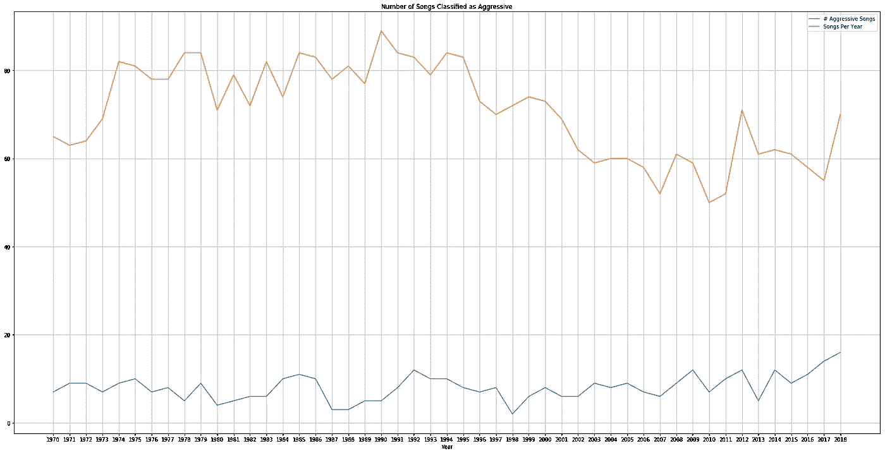

Aggressive Songs Per Year

从上面我们可以看到，我们的攻击性预测模型认为很多歌曲都是攻击性的，但它本身的趋势看起来有点下降，这与我们的假设相反。我们可以通过再次使用 matplotlib 的子图/多轴特性来查看它们的叠加。

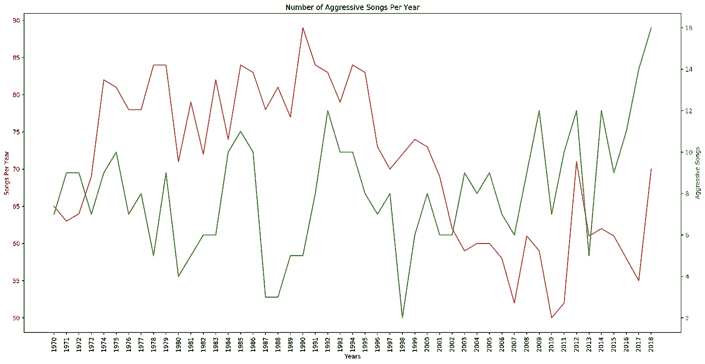

在这里，我们可以看到，当你缩放这两个图时，给定收集的歌曲数量与发现的攻击性歌曲数量，歌曲在 2002 年一直在攀升和反转。我们有理由怀疑我们的模型在预测方面的整体准确性，但这种基于遥远但可用的数据集(网络欺凌消息)的轻量级方法可以帮助我们了解情况。在这种情况下，我认为有足够的指标让我想要寻找更丰富的数据集和更复杂的方法来建立一个攻击检测模型。

# 结论

所以我们在这里。我们收集了自己的种子数据，用它从 API 中提取更多的数据，为文本分析准备数据，对照亵渎词汇的字典进行检查，建立一个人工神经网络来检测攻击行为，然后根据我们的数据运行它。让我们重温一下我们的假设，看看我们学到了什么。

*   从 1970 年到 2018 年，单词量和语言复杂度都有所增加。
*   **支持**。我们可以看到，通过测量频率和独特性，歌词已经变得复杂。
*   几个常见的名词出现在歌词的整个范围内，但最常见的名词会随着时间的推移而变化。
*   **支援**。我们现在知道爱在 1996 年失去了价值，但从未真正消失。1993 年和 2012 年是宝宝最好的时光。
*   随着时间的推移，副词变得更具攻击性。
*   **不支持**。我甚至没有画出图表，因为数据是如此不确定。请随意查看 git repo 并进行探索。
*   歌词中的亵渎性在过去 20 年(1998 年至 2018 年)显著增加。
*   **支持**。2018 年是有记录以来最亵渎的一年。
*   现在的歌曲比 20 世纪 70 年代更具攻击性。
*   **可能支持。我们怀疑我们的人工神经网络(82%基于它自己的数据)相对于歌词数据集的准确性，但它确实支持更多研究的需要。**

感谢阅读，让我知道你还想看什么！