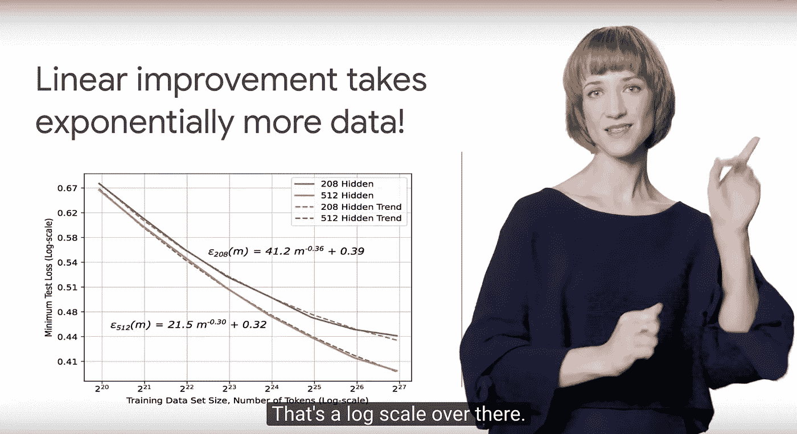

# 5 份数据科学摘要

> 原文：<https://towardsdatascience.com/5-bite-sized-data-science-summaries-a5afb8509353?source=collection_archive---------8----------------------->

本着团队合作的精神， [Next Rewind 视频系列](http://bit.ly/NextRewind2018)要求一群人从**谷歌云 Next SF 2018** 中挑选五个最喜欢的演讲，并在不超过五分钟的时间内对着镜头进行讨论。

> 5 个最喜欢的演讲。5 个视频摘要。5 分钟或更少。

我去了吗？你打赌！部分原因是因为我喜欢和大家分享让我开心的东西(惊喜！)部分原因是因为一年前我真的不擅长在摄像机前说话——除非我强迫自己练习，否则我永远也征服不了它无情的一眨不眨的眼睛。运气好的话，我会学着在应该指右边的时候停止指左边…

Niiiice pointing over there, buddy.

# 5 个最喜欢的演讲

以下是 2018 年我最喜欢的 5 个演讲，以及我选择它们的原因。我有从 300 多个演讲中选择的优先权，所以这些话题不是多余的！我认为数据科学爱好者最欣赏的就是他们。

所以，事不宜迟，以下是我的清单，从最基本到最基本排列。

## [#1 真正的企业已经将人工智能用于娱乐和盈利！](http://bit.ly/next_create)

如果你听过这样的观点，*“当然，这是一些闪亮的数学，但你不能用它做任何实际的事情。”*再想想！这太像 2008 年了。在过去的十年里，发生了很多变化。请允许我说一段简短的历史课题外话，这段视频里没有。

人工智能花了半个多世纪被大肆宣传，而不是发生。你可能会认为这是因为算法不存在，但[深度学习](http://bit.ly/quaesita_ai)(你称之为“AI”的那个东西)是 60 年代的[孩子](http://bit.ly/ivanenko)。

> 许多算法从 60 年代就有了，但那时工具还不太好，处理能力也不够强。

真正的原因是工具还不太好(相当于原型无线电的软件，只能由研究生使用，他们用胶带和梦想建造了它；在它附近呼吸，它就会分解)并且处理能力不够。

> 在云技术出现之前，除非你先建立一个数据中心，否则你无法建立一个原型。

云技术改变了这一切。云提供商与任何想尝试的人分享他们的硬件，这意味着人工智能是一个先试后买的提议，这在十年前是不可能的。

[云提供商](http://bit.ly/gcloudpstart)也在构建考虑到通用消费的工具，它们比过去好得多。这是我喜欢人类的一点:每当有人发明了一个有用的工具，其他人就会站出来让它更容易使用。与 19 世纪 90 年代的收音机相比，今天的收音机更容易安装，并且更有可能在高速飞行到最近的墙壁时幸存下来。

> 许多人没有意识到，今天应用人工智能的故事实际上是一个关于云的故事。

当然，没有数据，所有这些都是没有用的，这也是人工智能不断上升的另一个原因！世界正在收集比以往任何时候都多的数据，因此企业现在有燃料让人工智能运转起来。所以我要说的是:人工智能现在是真实的，这很令人兴奋！

> 这就是为什么我选择了一个用例演讲:人们需要知道这不再是科幻了。AI 在这里，太棒了！

但是后来我遇到了一个问题， [Rajen 最初的演讲](http://bit.ly/next_rajen)是如此密集的用例，以至于总结它们是不可能的(这是一个多么大的问题啊！)所以我用[我的 3 分钟](http://bit.ly/next_create)从[原创演讲](http://bit.ly/next_rajen)中挑选出一些很棒的建议，并鼓励你们去看看[完整的东西](http://bit.ly/next_rajen)，沉浸在示例盛宴的巨大规模中。

[My summary](http://bit.ly/next_create) of the [original talk](http://bit.ly/next_rajen) “Create Customer Value with Google Cloud AI” by Rajen Sheth

## [#2 什么是机器学习，我怎么吃？(没有博士学位)](http://bit.ly/next_leverage)

嘿，你知道我会抓住任何机会强调[研究人工智能和应用人工智能是不同的学科](http://bit.ly/quaesita_fail) …如果我能为应用方面大声疾呼，你很难指望我放弃这个机会，对吗？

> 我们需要更多工程师和技术爱好者能欣赏的语言基础和应用的直白对话。

[Lak 的原始演讲](http://bit.ly/next_lak)完全跳过了博士后队伍的标准线性代数，而是直接用工程师和技术爱好者可以欣赏的语言谈论基础知识和应用，因此它已经为我赢得了巨大的分数。它还用真实用例的例子来渲染想法，然后通过散布四个优秀的建议来完成交易，这是*我选择使用的那些*宝石[我的 3 分钟](http://bit.ly/next_leverage)详述:

*   [机器学习](http://bit.ly/quaesita_simplest)可以用来[解决很多你今天正在为之写规则的问题](http://bit.ly/quaesita_island)。
*   机器学习是你个性化应用的方式。
*   设计系统时，希望明年会有更多的数据。
*   使用一个[平台](http://bit.ly/gcloudpstart)，让您忘记基础设施并提供出色的预建模型。

[My summary](http://bit.ly/next_leverage) of the [original talk](http://bit.ly/next_lak) “Leverage AI on the Cloud to Transform Your Business” by Lak Lakshmanan

## [#3 现在可以用 SQL 做机器学习了(！！)](http://bit.ly/next_bigquery)

如果你庞大的数据库不会进入你的机器学习，那就把机器学习带入你的数据库吧！ [BigQuery](http://bit.ly/bq_ml) 刚刚为您提供了 SQL 中的线性和逻辑回归。现在，您不必知道导出数据库的痛苦，就可以将它插入到您的 [TensorFlow](http://bit.ly/quaesita_tf) 设置中！

> 如果你是一名专家分析师，你的货币是速度，但对大规模数据集的机器学习需要永远。

为什么会如此激动人心？如果你是一个专家分析师，你的货币就是速度 T21。你越快发现一个数据集中是否有潜力，你就能获得越多的赞赏。唉，如果你在大规模运营，你可能已经习惯了花费几乎永远的时间来导出数据，以尝试哪怕是一个基本的机器学习模型。不再！

> 这个。是。即时。满足感。

BigQuery ML 不仅为那些以令人瞠目结舌的规模运营的人加速了分析，而且本着超额完成的精神，它还提供了额外的可爱东西，如 ROC 曲线和特征分布分析。我用我的 [2 分钟](http://bit.ly/next_bigquery)滔滔不绝，给你一个当你加速时它看起来是什么样子的偷偷峰。如果你受到了启发， [Naveed 和 Abhishek 的原话](http://bit.ly/next_abhinav)有完整的演示。

[My summary](http://bit.ly/next_bigquery) of the [original talk](http://bit.ly/next_abhinav) “How to Do Predictive Analytics in BigQuery” by Abhishek Kashyap and Naveed Ahmad

## [**#4 数据科学家，你不再需要基础设施黑带**](http://bit.ly/next_kubeflow)

这是一个关于更好的工具的故事，这些工具使数据科学家能够做更多他们喜欢的事情，而不是那些感觉像是苦差事的事情。这也是关于更广泛的授权:**更好的工具使获取技术民主化，让人们成为自己光明未来的建筑师**。我已经在另一篇博文中对此大加赞赏了([没有这些无聊的部分，你怎么称呼人工智能？但是，把家务杂事抛开，让人们可以专注于创造性和做他们喜欢的事情，这让我陷入了狂热的激情，所以这就是为什么库伯弗洛的演讲在我的最爱列表中——这绝对是朝着那个方向迈出的一步。](http://bit.ly/quaesita_kubeflow)

数据科学家们，你们希望能够将可扩展的机器学习带到混合云环境中，但请看着我的眼睛，告诉我你们真的希望将宝贵的建模和分析时间花在 be learning [Kubernetes](http://bit.ly/k8scomic) 上，并弄清楚诸如基于作业提交的自动扩展、优化的虚拟机和数据泄漏预防之类的事情。没有吗？好吧，幸运的是你不需要。

我用[我的 3 分钟](http://bit.ly/next_kubeflow)带你了解机器学习可组合性、可伸缩性和可移植性的基础知识，然后从[大卫的原话](http://bit.ly/next_aronchick)中向你展示 [Kubeflow](http://bit.ly/kfstart2) 和[elastic file](http://bit.ly/elastifile)(数据可移植性)可以做什么的精彩演示。

[My summary](http://bit.ly/next_kubeflow) of the [original talk](http://bit.ly/next_aronchick) “Machine Learning Made Easy with Kubeflow and Elastifile” by David Aronchick

## [#5 TensorFlow 走上了越来越可爱的轨道](http://bit.ly/next_tensorflow)

好吧，让我们现实一点:不管怎样，前 5 名将会有一个[张量流](http://bit.ly/tfstart)的位置。这是数据科学饮食中的主食。我很高兴——而不是顺从地选择[劳伦斯的原话](http://bit.ly/next_laurence),因为它突出了令人敬畏的新功能，使 [TensorFlow](http://bit.ly/tfstart) 不仅比以往更好，而且更友好。我对这个非常兴奋，甚至在制作视频之前我就写了博客。如果你不喜欢看东西，可以获取 [9 关于 TensorFlow](http://bit.ly/quaesita_tf) 你应该知道的事情中的文字。或者在下一段得到这个总结。(*效率！*)

> TensorFlow 是数据科学的工业车床，专为大型数据集上的最先进的人工智能而设计。

如果你在处理巨大的数据集，或者如果你在追求人工智能的最新发展，那么 [TensorFlow](http://bit.ly/tfstart) 可能就在你的雷达上。这是数据科学的[工业车床](http://www.industrytap.com/worlds-largest-lathe-sale/14280)，在早期，它似乎也从工业车床那里获得了用户友好的建议。如果你尖叫着跑开，回来吧！它现在更可爱了，而且有一些令人难以置信的新功能。

我用[我的 2.5 分钟](http://bit.ly/next_tensorflow)向你展示我最喜欢的亮点，其中包括自我表达的机会，如果 Python 是你的母语，你会发现更容易接受，如果你不是 Python 爱好者，你也可以在其他语言中使用它——包括 JavaScript(你好，在浏览器中做任何事情！).在数据处理、模型共享以及在手机和烤面包机上支持机器学习方面也有所改进。

[My summary](http://bit.ly/next_tensorflow) of the [original talk](http://bit.ly/next_laurence) “What’s New with TensorFlow” by Laurence Moroney

其他 300+的演讲也很棒，但这五个温暖了我数据科学心中的一个特殊位置。希望你喜欢它们！(查看[下一个倒带视频系列](http://bit.ly/NextRewind2018)，查看各种技术主题的 flash 摘要。)

# 感谢阅读！YouTube 课程怎么样？

如果你在这里玩得开心，并且你正在寻找一个为初学者和专家设计的有趣的应用人工智能课程，这里有一个我为你制作的娱乐课程:

Enjoy the entire course playlist here: [bit.ly/machinefriend](http://bit.ly/machinefriend)

# 喜欢作者？与凯西·科兹尔科夫联系

让我们做朋友吧！你可以在 [Twitter](https://twitter.com/quaesita) 、 [YouTube](https://www.youtube.com/channel/UCbOX--VOebPe-MMRkatFRxw) 、 [Substack](http://decision.substack.com) 和 [LinkedIn](https://www.linkedin.com/in/kozyrkov/) 上找到我。有兴趣让我在你的活动上发言吗？使用[表格](http://bit.ly/makecassietalk)联系。