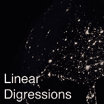

# 现在可以收听 5 个数据科学、人工智能和机器学习播客

> 原文：<https://towardsdatascience.com/5-data-science-ai-and-machine-learning-podcasts-to-listen-to-now-e5078b18d184?source=collection_archive---------2----------------------->

人工智能、机器学习和数据科学是当今技术和创新领域最热门的话题。有充分的理由，每天发生的突破使空间以令人难以置信的快速发展。我的 twitter feed 是我阅读新闻文章数量的证明，但我最喜欢的数据科学新闻消费方式是通过播客。

在这篇博客中，我与你分享了一些我最喜欢的人工智能和机器学习播客，这样你也可以了解该领域的最新趋势。无论你是一名希望获得各种主题知识的高管，还是一名磨练机器学习专业知识的从业者，我的播客列表都将满足你的需求。说完，现在就来欣赏你需要听的五个数据科学、人工智能和机器学习播客吧！

[**工业中的人工智能|作者丹·法盖拉**](https://itunes.apple.com/us/podcast/artificial-intelligence-in-industry-with-dan-faggella/id670771965)

丹是专注于人工智能的市场研究和咨询公司[tech emergency](https://www.techemergence.com/)的首席执行官和创始人。他的公司位于旧金山，帮助高管们完善人工智能和机器学习技术的战略采购。他的播客旨在介绍人工智能，是我向非从业者、高管和领导者推荐的，他们希望对人工智能应用有非常广泛而浅薄的了解。我很欣赏丹采访高技术 SME 的能力，如数据科学家和 MI 研究人员，但在一个可消化的格式。这个播客也有一个非常一致的日历，每周发布一次，时长 30-60 分钟。

[**数据怀疑论者|作者凯尔·波利奇**](https://itunes.apple.com/us/podcast/data-skeptic/id890348705)

凯尔的数据怀疑论播客将让你了解所有数据科学、机器学习和人工智能方面的新闻、话题和讨论。他的播客讨论了相关的机器学习或数据科学问题，然后对应用程序/主题进行了评论。我真的很喜欢这个播客中的讨论水平，虽然讨论可能相当技术性，但我不觉得他们是分析师、数据科学家和计算机科学家无法接近的，他们至少有一些工作知识或对行业有更深的了解。谈话的质量和支持这个播客的社区让我不断回来。DataSkeptic 每周发布一次，运行时间为 30-60 分钟。

[**线性题外话|作者本·贾菲和凯蒂·马龙**](https://itunes.apple.com/us/podcast/linear-digressions/id941219323)

这个播客又短又甜。本和凯蒂通过关注不寻常的机器学习和神经网络应用，使一些极具技术性的话题引人入胜。这个播客是为数据科学家和机器学习实践者设计的——但对话总是很有趣。该节目每周发布一次，时长 15-30 分钟，非常适合我骑车上班。

[**奥莱利数据展示|由奥莱利传媒**](https://itunes.apple.com/us/podcast/oreilly-data-show-oreilly-media-podcast/id944929220)

O'Reilly 播客揭示了实践者为解决一些及时的大数据和/或数据科学主题而采用的应用程序和方法。这个选择是我展示的所有播客中最普通的。主题主要集中在数据和数据科学，而不是专门的机器学习。由于与奥赖利媒体的联系，采访的质量非常高，并围绕着方法的技术应用。他们倾向于每两周发布一次播客，但是他们的时间表确实有点不同。这是我的播客系列中最不稳定的。但当它到来时，它总是值得一听。

[**偏导数|作者乔纳森·摩根**](https://itunes.apple.com/us/podcast/partially-derivative/id942048597)

我最喜欢的一首，偏导数，绝对值得一听。有些人甚至会说这是“数据社区的汽车话题”偏导数在讨论数据科学的一些非常技术性的方面时，总是引入书呆子文化参考。乔纳森(数据科学家/软件开发人员)、维迪亚(计算机工程师)和克里斯(政治学博士)三人组进行了巧妙的对话，夹杂着诙谐的戏谑。每次听这个组合，我都会学到新的东西。

我有没有漏掉一个播客？请给我留言，我会将它添加到我的播放列表中！