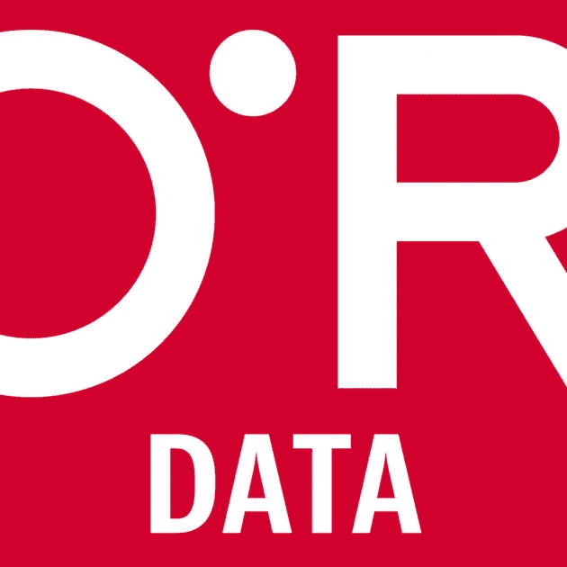
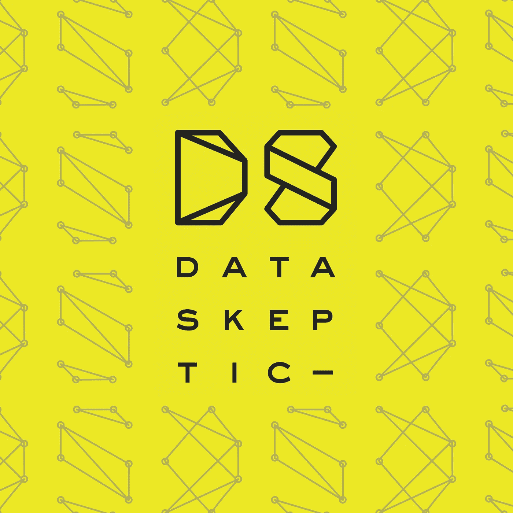
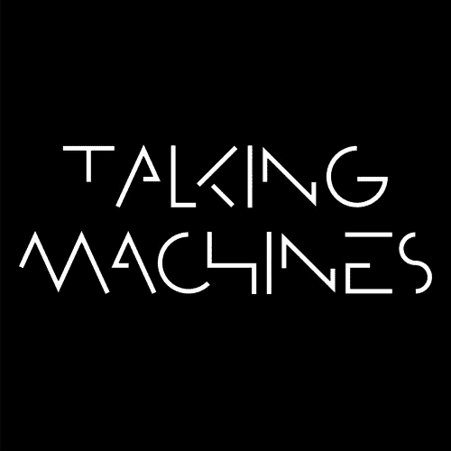

# 5 数据科学、人工智能和机器学习播客现在可以收听(更新)

> 原文：<https://towardsdatascience.com/5-data-science-ai-and-machine-learning-podcasts-to-listen-to-now-updated-12a4cb20a740?source=collection_archive---------10----------------------->

我对播客很着迷。从 15 分钟形式的快速复习到长达一小时的复杂主题深入探讨，这是我消费数据科学内容的首选媒介。你看，我是个跑步者。周末我会在芝加哥花几个小时训练，为长距离比赛增强耐力。播客格式允许我带着我最喜欢的数据科学专家上路，以最大限度地利用我的时间，让我可以同时学习和培训。

在这篇更新的博客中，我与你分享了一些我最喜欢的人工智能和机器学习播客，这样你也可以了解该领域的最新趋势，同时享受你喜欢的东西。无论你是一名希望获得各种主题知识的高管，还是一名磨练机器学习专业知识的从业者，我的播客列表都将帮助你跟上时代。如果你是一个播客迷，尝试一下这些优秀的数据科学节目。

[**线性题外话|作者本·贾菲和凯蒂·马龙**](https://itunes.apple.com/us/podcast/linear-digressions/id941219323)

这个播客又短又甜。这也是我推荐的 5 个播客中我最喜欢的一个。在线性题外话中，你可以期待随意的对话、有趣的轶事和令人敬畏的内容。两位主持人很好地发挥了彼此的优势；而且节目很有娱乐性。

Katie 是该小组的数据科学家。她为二人组评估的许多模型带来了专业知识和实践知识。我总是从她的解释中学习，因为她总是解释为什么以及如何完成。Ben 是这个团队的工程师，他在思考特定的实现和给出开发人员对解决方案的看法方面做得很好。

他们是否在讨论不同的统计方法来理解一双跑鞋是否值得购买；或者你可能如何使用 Shapley 值来理解特征如何在深度学习算法中工作——他们的讨论总是有趣且有启发性的。这个播客是为数据科学家和机器学习实践者设计的。该节目每周发布一次，时长 15-30 分钟，非常适合慢跑或 5 公里跑。

[**奥莱利数据展示|由奥莱利传媒**](https://itunes.apple.com/us/podcast/oreilly-data-show-oreilly-media-podcast/id944929220)

O'Reilly 是计算机科学、数据科学、数据基础设施和工程教育内容的可靠来源。该播客是一个宝贵的资源，揭示了实践者为解决一些及时的大数据和/或数据科学主题而采用的应用程序和方法。

本·洛里卡在招聘嘉宾方面做得非常出色，这些嘉宾在数据科学、工程架构和语言的技术应用方面拥有深厚的专业知识，使我们能够导航和使用这些工具。因此，采访的质量相当高。奥赖利倾向于每两周发布一次他们的播客；当然，他们也宣传他们的会议、出版物和讲座。我可以忍受公司的旋转，由于高生产价值和播客的广度和深度。

[**本周机器学习& AI |由山姆·查林顿**](https://itunes.apple.com/us/podcast/this-week-in-machine-learning-artificial-intelligence/id1116303051?mt=2)

TWiML&AI 是这个列表中的两个新成员之一。由备受推崇的机器学习顾问和演讲者 Sam Charrington 主持的讨论，你可以期待一些高质量的内容。

TWiML Talk 为数据科学家、开发人员、商业创新者和其他机器学习和人工智能爱好者提供了一个平台，分享他们关于机器学习研究、技术、商业、文化等方面的想法。该播客非常适合那些希望通过清晰、简洁和周到的解释了解复杂主题的高管和经理。

[**数据怀疑论者|作者凯尔·波利奇**](https://itunes.apple.com/us/podcast/data-skeptic/id890348705)

凯尔的数据怀疑论播客将让你了解所有数据科学、机器学习和人工智能方面的新闻、话题和讨论。他的播客讨论了相关的机器学习或数据科学问题，然后对应用程序/主题进行了评论。我真的很喜欢这个播客中的讨论水平，虽然讨论可能相当技术性，但我不觉得他们是分析师、数据科学家和计算机科学家无法接近的，他们至少有一些工作知识或对行业有更深的了解。最近他的播客转向了“假新闻”分析；我正在挖掘它。

谈话的质量和支持这个播客的社区让我不断回来。林作为主持人增加了一些轻松的时刻；但在她的片段中可能会有点傲慢。我不认为这削弱了一个强大的播客。DataSkeptic 每周发布一次，运行时间为 30-60 分钟。

[**会说话的机器|由手提袋制作**](https://itunes.apple.com/us/podcast/talking-machines/id955198749?mt=2)

第二个进入我的前五名的新节目，会说话的机器是一个很好的播客。在第四季中，主持人凯瑟琳·戈尔曼和尼尔·劳伦斯对我们行业中的热点话题进行了深刻的讨论。此外，你知道他们有四年的内容检查持久力！我非常兴奋能把这首好歌加入我的播放列表。

我有没有漏掉一个播客？请给我留言，我会将它添加到我的播放列表中！