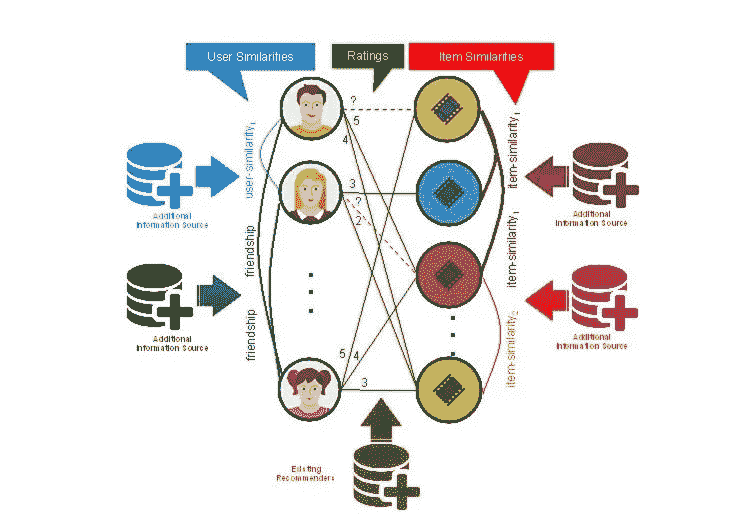

# 每个电子商务公司都应该做的 5 个数据科学项目

> 原文：<https://towardsdatascience.com/5-data-science-project-every-e-commerce-company-should-do-8746c5ab4604?source=collection_archive---------1----------------------->

随着互联网上的每一次点击，数据都在增加。为了理解这些庞大的数据并将其用于公司利益等，我们需要不同数据科学技术的帮助。

每天，人们只需点击一下鼠标，就可以在网上买卖东西，但为了让客户参与网站或改善客户体验，公司使用数据科学/机器学习，即在亚马逊网站上，当你寻找一种产品时，你会看到数字推荐。这些建议是通过机器学习算法生成的。它从用户过去的活动和购买中学习。这些公司存储客户的每次点击、客户阅读的每次评论、客户在社交媒体上分享的每个故事等数据，并使用这些数据来了解他们的客户或创建一个平台来帮助新客户。

# 它是如何开始的？

当你在网上购物时，你有没有感觉到，为什么他们以某种方式制作这个东西，或者为什么这个东西会在这里展示？或者想，这个东西怎么知道我在找什么？所有这些问题只有一个答案，那就是数据科学。电子商务是数据科学/机器学习技术的最大消费者之一，那些没有实施这些技术的人显然在下降。

 [## 电子商务行业中的数据科学和机器学习:内部人士谈论工具、用例…

### 机器学习已经毫无保留地吞没了我们的个人和私人空间，延伸到仅仅是…

海王星. ai](https://neptune.ai/blog/data-science-and-machine-learning-in-the-e-commerce-industry-tools-use-cases-problems) 

在本帖中，我们将讨论一个电子商务公司应该做的 5 个主要项目，以提高客户体验以及他们的收入或业务。

## 1.推荐系统

你记得在亚马逊、网飞或任何电子商务网站上看到过推荐吗？在过去的几年里，推荐系统已经接管了基于互联网的业务，为许多业务增加了价值。

**简介**

在了解推荐系统在电子商务中的好处之前，让我们先了解一下推荐系统的基础知识。

维基百科的定义，

> 一个**推荐系统**是信息过滤系统的一个子类，它试图预测用户对一个项目的“评分”或“偏好”。

推荐系统不仅仅是上述定义所描述的。它用于根据特定用户过去的搜索或其他客户的搜索或购买数据来筛选选择。它为用户提供了电子商务网站的个性化视图，并帮助他们选择相关产品。例如，在亚马逊网站上寻找新手机时，你可能也想买一个手机壳。亚马逊将通过分析客户以前的购买或搜索数据来决定这种可能性。

**热门推荐技巧**

有很多方法可以建立一个推荐系统。这些技术中的每一种都以不同的方式过滤或提供推荐。有以下三种主要的已知技术

1.  协同过滤
2.  基于内容的过滤
3.  混合推荐过滤

在协同过滤中，将基于收集的关于用户在网站上的活动的数据，并通过发现他们的活动与其他用户的活动之间的相似性来给出推荐。这是电子商务公司中最受欢迎的技术，因为这种特殊的技术在向客户推荐之前不需要了解商品。它只是试图找到不同用户兴趣之间的相似之处。

与协同过滤不同，基于内容的过滤基于用户的简档和项目描述提供推荐。这种技术可以根据用户过去喜欢的东西为他们筛选出产品。

混合推荐系统是协同过滤和基于内容的过滤的结合。混合技术可以用在许多不同的方面。我们可以使用协作过滤和基于内容的过滤分别进行预测，然后合并它们的结果，或者使用一种技术进行预测，将其结果作为另一种技术的输入。混血儿的一个最好的例子是网飞。

现在，我们对什么是推荐系统有了一个清晰的认识，我们将进一步讨论它们如何为企业增加价值。

**电子商务网站中推荐的重要性**

有很多电子商务网站，其中一些很难区分，因为他们出售类似的产品。在这种情况下，电子商务企业需要考虑如何让客户参与到网站/产品中来。我敢打赌，你们大多数人一定在想，为什么我们要在推荐系统中讨论这个问题。

想象一下，你正在一个电子商务网站上购买衣服。网站 1 没有实现任何推荐系统，因此作为用户，你必须浏览许多不同的产品。这可能会使顾客远离网站 1，因为在网站 1 上购物非常耗时。另一方面，他们的竞争对手网站 2 有推荐系统，结果网站 2 会比网站 1 更吸引人。每当用户点击一个产品，他或她就会在网站上看到类似或相关的产品推荐。

据观察，一个网站越吸引人，就会有越多的人去那里购物。这将最终增加电子商务公司的收入。

## 2.**顾客终身价值建模**

你们中的许多人可能听说过“有价值的客户”这个术语。这是什么意思？是什么让客户变得有价值？

**简介**

维基百科定义

> **客户终身价值**是对整个未来与客户关系的净利润的预测。

该定义明确指出，客户终身价值建模是计算客户在其一生中能为公司带来多少收入。此外，这是一个计算出来的数字，由客户的购买和与电子商务网站(或任何其他企业)的互动历史来预测

在我们试图理解为什么对一个企业来说了解客户的价值是重要的之前，让我们看看它是如何被计算出来的。

**计算客户终身价值**

有许多文章描述了计算客户终身价值的步骤。为了简单起见，这里我们将讨论在 [optimizesmart](https://www.optimizesmart.com/beginners-guide-to-ecommerce-analytics-lifetime-value-and-beyond/) 文章中使用的公式。

文章阐述了计算客户终身价值的基本公式，即

> (平均订单价值)x(重复订单数量)x(平均客户寿命)

平均订单价值-所有先前订单的平均值

重复销售次数——下订单的次数

平均客户寿命——一个人成为你客户的时间

**客户终身价值在电子商务网站中的重要性**

客户终身价值是客户将为公司带来的预测金额。但是单个客户能带来多少收入，我们为什么要关心这个？

假设一家公司有 2k 个老客户，通过计算所有这些客户的未来现金流，该公司可以预测未来的收入。公司为什么要知道自己未来的营收？公司根据对未来收入的预测，决定未来工作的策略，例如，他们可以承担多少工作或需要做多少额外工作等。不仅如此，这些公司还可以决定关注哪个客户。比方说，客户 A 将在未来十年带来 5000 英镑的收入，而客户 B 只会带来 1000 英镑的收入。看着这些数字，公司将决定营销策略，并试图保留来自客户 A 的现金流。

此外，CLV 在许多方面帮助电子商务企业

1.  定义公司的目标——增长、支出、未来销售、净利润等。
2.  优化企业营销策略。
3.  调整活动和广告。
4.  根据客户的购买决定交叉销售和追加销售。
5.  CLV 有助于决定客户获取成本，即吸引客户的成本。

这是任何电子商务业务都需要考虑的基本指标之一。它有助于企业决定他们的支出，并了解他们的忠诚客户。

## 3.客户保持-流失模型

客户流失模型是每个电子商务企业应该考虑实施的项目之一，以增加其业务的价值。由于流失模型与客户保持相关，我们需要首先了解什么是客户保持？

**客户维系**

维基百科的定义，

> **客户维系**指的是一个公司或产品在一定时期内维系其客户的能力。

客户保持是商业的一个重要方面，但是为什么呢？一旦顾客去电子商务网站订购了某样东西，他/她就有可能回来买更多的东西(只要他们满意)。留住客户有助于创造更高的客户终身价值。拥有新客户是好事，但现有客户比新客户带来的收入更多。

拥有忠诚的顾客有很多好处-

1.  拥有现有客户的可靠数据，有助于企业拓展市场。
2.  顾客欣赏你的营销策略，并愿意尝试新事物。
3.  从客户处收到的实时反馈。
4.  现有客户带来更多新客户，他们是营销的最佳来源。
5.  留住顾客也有助于吸引新顾客。看到一个公司给他们现有的客户奖励和额外的好处，它会吸引更多的人。

现在我们知道了客户保持对企业的好处，我们将试着了解如何实现客户保持。

有许多方法来实现客户保留，但最常用的模式是-流失模式。

**流失模型**

流失模型有助于识别最有可能转向不同电子商务网站的客户。一旦确定，公司可以采取行动，以保持其现有的客户。现在的问题是，流失模型如何识别这些客户？该模型可用于计算流失率，根据业务的性质，可以使用不同的指标。一些常见的指标是-

*   失去的客户数量
*   客户流失百分比
*   经常性业务损失的价值
*   经常性价值损失的百分比

**客户流失模型在电子商务中的重要性**

流失模式在许多方面有利于企业。在电子商务中实施流失模型的几个优点是

1.  流失率有助于识别流失客户，因此企业可以开展保留活动。
2.  流失模型可以帮助企业维持 CLV。
3.  它帮助企业跟踪进展。
4.  从流失模型中获得的信息对 BI 活动非常有帮助。

你可以在这里获得更多关于客户流失模型[的信息。](https://analyticsindiamag.com/is-customer-churn-the-most-important-metric-to-track-for-retailers/)

## 4.欺诈检测

大多数电子商务企业专注于获得更多的客户和创造更多的收入。为了实现他们的目标，这些公司希望他们的网站高效。如果公司不能提供安全保障，效率就无法拯救企业。

**简介**

根据维基百科的文章，

> 欺诈是一个价值数十亿美元的行业，而且每年都在增长。
> 
> 普华永道 2016 年全球经济犯罪调查显示，超过三分之一(36%)的组织经历过经济犯罪。

鉴于欺诈风险如此之高，在线企业应该考虑实施的另一个项目是在线欺诈检测。生活在一个数字世界里，每次点击都会发生数百万笔交易，似乎很容易在网上被抢劫。

网络诈骗有很多种方式-

*   身份盗窃
*   退款欺诈
*   友好欺诈
*   纯粹的欺诈
*   三角欺诈
*   关联欺诈
*   商家身份欺诈
*   预付费用和电汇诈骗

网上欺诈的清单非常庞大，欺诈者也变得越来越聪明。因此，为了有一个成功的电子商务业务，公司将需要考虑实施安全措施。例如，在线订购产品，但没有收到在线展示的产品。订购该产品的客户将不会再次使用该网站，并且可能会提供差评。这最终会吓跑新用户，还会影响业务收入。

现在的问题是，这些公司如何发现欺诈行为？在数据科学和机器学习技术的帮助下，这些欺诈者很容易被发现。为了使用数据科学技术，这些公司必须列出任何可能的欺诈行为。一些表明潜在欺诈的可疑行为示例如下-

*   送货地址与帐单地址不同
*   同一项目的多个订单
*   非同寻常的大订单，次日发货
*   用不同的卡给同一个地址下了多个订单
*   意外的国际订单

使用 DS/ML 可以检测到上述可疑行为。一些常用的技术-

*   数据挖掘——检测、验证、纠错以及填补缺失或不正确的数据
*   时间序列分析
*   聚类和分类以在数据中找到相关的组。这有助于异常检测
*   匹配算法，以避免任何错误警报，估计风险，并预测当前交易或用户的未来

**电子商务中欺诈检测的重要性**

任何关心客户安全和商业信誉的公司肯定会考虑在公司内部安装欺诈检测系统。欺诈检测系统可以从多方面帮助公司-

*   提高客户保持率
*   增加公司收入
*   减少未识别的交易
*   帮助增加公司的品牌价值

我们看到了在线公司及其客户如何因在线欺诈而遭受损失，以及这种数据科学/机器学习如何有所帮助。

## 5.重要评论-改善客户服务

许多公司使用内容营销来吸引顾客，但是为了留住忠诚的顾客，提供最好的服务是很重要的。改善客户服务在这里意味着什么？又是如何实现的？此外，数据科学如何帮助改善客户服务？

企业经营客户服务由来已久。传统的客户服务方式是通过电子邮件、邮件和电话联系客户，请他们对公司的产品和服务提供反馈。这些天来，公司，尤其是在线企业，在他们的网站上为他们的产品设置了评级和评论部分。但是，手动在线阅读每一篇评论并不容易。不仅如此，有时也很难理解那些评论，例如，包含不正确拼写或速记单词的评论等等。这就是数据科学发挥作用的地方。

使用数据科学技术，例如 NLP(自然语言处理),可以提取网站的评级和评论。这种技术有助于检索用户评论，并理解为什么给出差评。例如，单词云是一种显示单词在文本集合中有多重要的流行方式，N-grams 有助于寻找单词关联。这些技术和其他技术有助于数据科学家理解评论。

一旦评论被提取出来，数据科学家可以进一步分离它们并进行情感分析。有了这些信息，电子商务可以通过优先考虑将产生最大积极影响的产品更新来有效地最大化用户满意度。

# 摘要

通过这篇文章，我们讨论了电子商务公司应该考虑实施的不同项目。这些项目可以通过客户保留、良好的评论、增加的品牌价值、改善的客户服务和对客户的良好推荐来增加他们的业务价值，这将为客户提供更好的体验，而且还可以帮助公司销售更多的产品。还有许多其他项目，但这 5 个是任何电子商务企业的必需品。

# 参考

1.  [Hortonworks](https://hortonworks.com/article/how-to-improve-customer-service-using-big-data-analytics/)
2.  [顾客满意的好处和重要性](https://neilpatel.com/blog/benefits-and-importance-of-customer-satisfaction/)
3.  [数据科学](https://www.datascience.com/blog/data-science-for-ecommece-businesses-predictive-modeling)
4.  [流失模型](http://pervasive-tech.com/clv-and-churn-analysis-in-ecommerce/)和[客户保持](https://www.ngdata.com/what-is-customer-retention/)