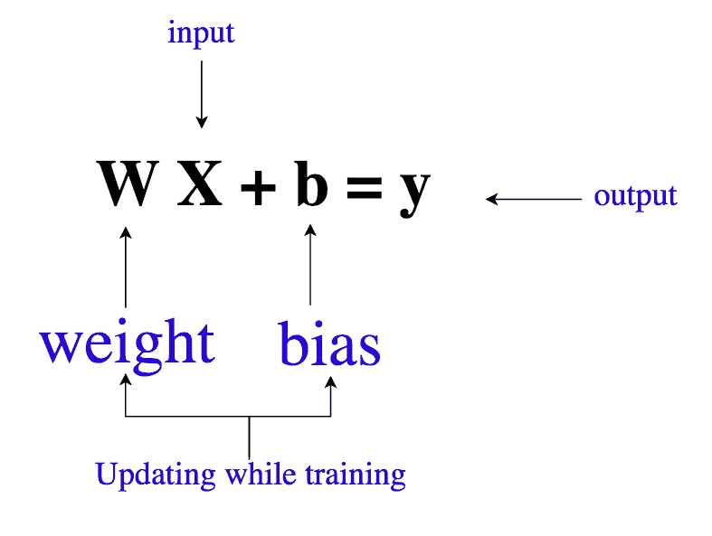
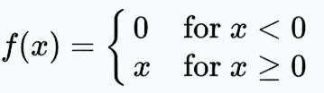
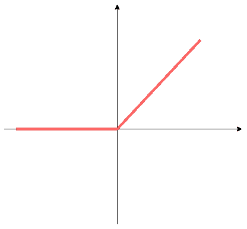
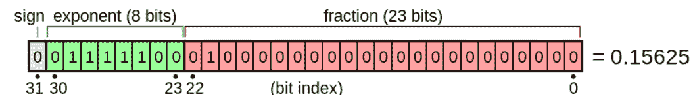
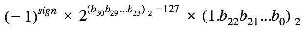
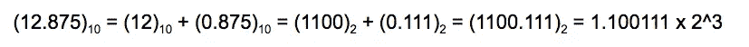
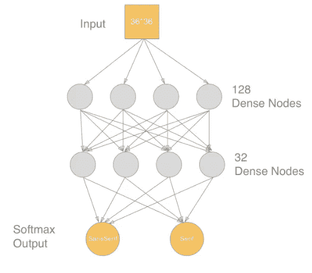

# 数据科学家访谈中的 5 个常见问题

> 原文：<https://towardsdatascience.com/5-frequently-asked-questions-in-data-scientist-interviews-6fb3eeeb497?source=collection_archive---------6----------------------->

最近被一些刚毕业的学生问到如何准备数据科学家面试的问题。一般来说，数据科学家或机器学习工程师面试由 3 部分组成:**数学**、**统计**和**机器学习算法**。本文最后会建议一些有用的备考资料。在这里，我们将讨论 5 个常见问题及其答案，让您了解如何回答数据科学家面试问题。

*   什么是权重和偏差？
*   你用过 ReLU 功能吗？你能解释它是如何工作的吗？
*   浮点数是如何存储在 32 位计算机内存中的？
*   什么是梯度下降和随机梯度下降？它们之间的区别是什么？
*   什么是反向传播？

**什么是权重和偏差？**



weight and bias

权重和偏差是模型的可学习参数。权值和偏差值在训练前随机初始化，训练时由 TensorFlow 自动计算。以下代码是更新权重和偏差的示例:

```
# How we train
train_step = tf.train.**GradientDescentOptimizer**(0.02).minimize(**cross_entropy**)
```

**你用过 ReLU 功能吗？你能解释它是如何工作的吗？**

ReLU 代表整流线性单元，是一个简单的非线性激活函数。任何负输入被设置为零，而正输入保持不变。



ReLU formula



ReLU 广泛应用于神经网络和深度学习。它作为线性开关工作。如果你不需要它，你就“关掉”它；如果你需要它，你就“打开”它。TensorFlow 通过 [tf.nn](https://www.tensorflow.org/api_guides/python/nn#Activation_Functions) 模块提供 ReLU 及其变体([noise ReLU，Leaky ReLUs，ELUs](https://en.wikipedia.org/wiki/Rectifier_(neural_networks)) )。例如，下面用 tf.nn.relu 创建了一个卷积层(用于 CNN ):

```
import tensorflow as tfconv_layer = tf.layers.conv2d(inputs=input_layer, filters=64,        kernel_size=[3, 3], padding='same', **activation=tf.nn.relu**)
```

**浮点数在 32 位计算机内存中是如何存储的？**

是的，这是一个“低级”问题，要求考生具备一些计算机硬件的背景知识。在 IEEE 754 标准中，浮点数的比特排列如下:



photo credit to [wikipedia](https://en.wikipedia.org/wiki/Single-precision_floating-point_format)

*   符号(1 位):确定数字的符号
*   指数(8 位):IEEE 754 中的指数偏差是 127，我们需要从值中减去 127
*   分数(23 位):有一个值为 1 的隐式前导位

因此，我们可以推导出真正的价值是



在这里，我可以展示如何将基数为 10 的实数 **12.875** 转换成 IEEE 754 二进制 32 格式。

*   12 = 8 + 4 = 1100
*   .875 = 0.5 + 0.25 + 0.125 = 2^-1 + 2 ^ -2 + 2^-3

所以 12.875 的二进制表示应该如下:



在这种情况下，数字是正数，所以符号位是`0`；指数是 3，加上 127(指数偏差)我们得到`130 = 1000 0010`；分数是= `10011100000000000000000.`

由此我们可以形成实数 12.875 的 32 位 IEEE 754 二进制 32 格式表示，如下:`0-10000010-10011100000000000000000.`

**什么是梯度下降和随机梯度下降？它们之间的区别是什么？**

想象你正从山顶走下一座小山，你的下一步是什么？梯度下降(GD)和随机梯度下降(SGD)是从当前位置计算下一步的两种常用方法。

GD 和 SGD 是深度学习中的优化器，通过慢慢地将权重(模型的参数)推向更好的结果。在实践中，您可以使用 GD 和 SGD 来训练和比较全连接网络。SGD 优化模型将比 GD 更准确，并且所需的训练时间更少。

在每一步，SGD 都采取非常小的一步而不是一大步，并使用微小的随机样本而不是完整的数据。SGD 是有效的，因为每次的数据集较小，并且通过多次执行来弥补。您可以使用 TensorFlow 函数[TF . contrib . keras . optimizer . SGD](https://www.tensorflow.org/versions/r1.2/api_docs/python/tf/contrib/keras/optimizers/SGD)逐步训练更深入、更准确的模型。

**什么是反向传播？**

基于梯度的优化器通常使用反向传播来调整**多层神经网络**中神经元的权重。



multi-layered neural network

反向传播包括以下步骤:

1.  当输入向量呈现给网络时，它通过网络一层一层地向前传播，直到到达输出层。
2.  损失函数计算网络输出与其预期输出之间的差异(称为“误差”)。
3.  为输出层中的每个神经元计算结果误差值。
4.  然后，误差值从输出通过网络传播回来，直到每个神经元具有反映其对原始输出的贡献的相关误差值。
5.  反向传播使用这些误差值来计算损失函数的梯度。
6.  这个梯度被馈送到优化方法，该优化方法又使用它来更新权重，以试图最小化损失函数。

通常，输入向量的规范化可以提高模型的性能。

本文列出了 5 个常见问题及答案，供您参考。对于准备工作，我推荐古德费勒、本吉奥和库维尔的《深度学习》一书。

*   数学&统计:第二、三、四章足以为这类面试中的理论问题做准备/修改
*   **机器学习算法**:第 5 章，60 页左右，简明易懂

如果你看完了深度学习圣经，我还会推荐[《机器学习的数学》](https://mml-book.github.io/)[《数据科学问答》](https://github.com/ShuaiW/data-science-question-answer#statistics-and-ml-in-general)。

采访总是检查数据科学家难题中缺失部分的好方法。作为数据科学家，我们可以称之为评估或测量。期望是你表现好，而不是完美。尽你所能学习和准备。你所能做的就是尽你最大的努力。

你都准备好了。祝你好运！