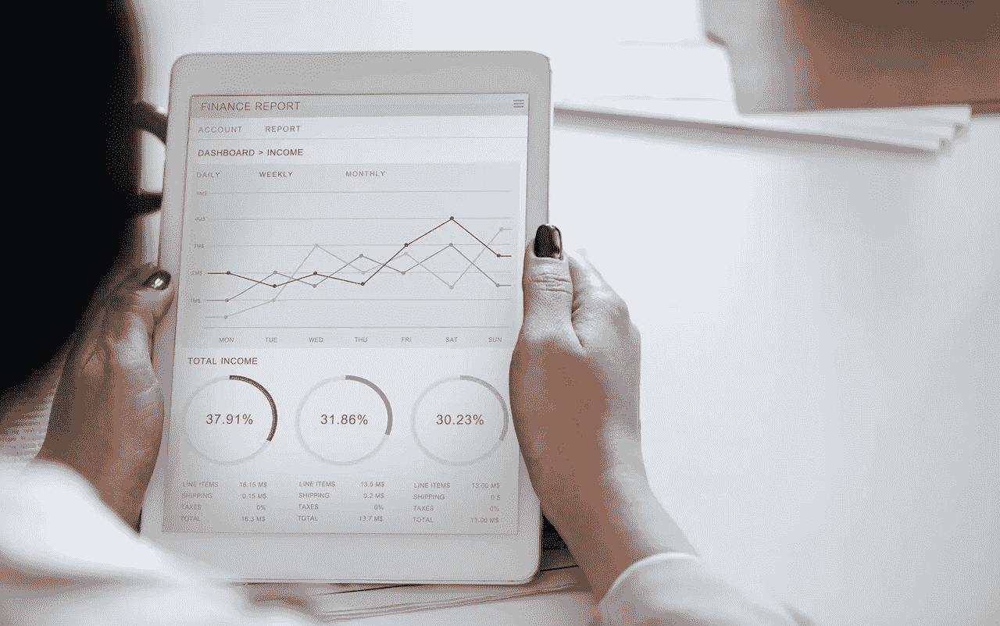

# 大数据和分析定义了 5 个行业

> 原文：<https://towardsdatascience.com/5-industries-becoming-defined-by-big-data-and-analytics-e3e8cc0c0cf?source=collection_archive---------7----------------------->

大数据平台不断改进的功能越来越多地为那些希望研究分析以使其公司受益的行业代表创造了新的机会。

这里有五个行业的业务运营受到大数据和分析的影响，以及它们能提供什么。

# 1.医学

医疗行业依靠专门的设备来跟踪生命体征、协助手术和进行诊断。它还使用大数据和分析工具以各种方式改善健康状况。

可穿戴跟踪器将信息传输给医生，并告诉他们患者是否服用了药物，或者他们是否在遵循治疗或疾病管理计划。随着时间的推移收集的汇编数据为医生提供了患者健康的全面视图，提供了比简单的亲自访问更深入的信息。

在其他情况下，公共卫生部门会查看大数据和分析，以优先对有风险的设施进行食品安全检查。研究人员还挖掘数据来揭示疾病模式最显著的地方。

此外，大数据和多种分析帮助医院管理者[减少等待时间并改善护理](https://www.sciencedirect.com/science/article/pii/S1876034116301368)。一些平台查看大量数据，然后找到其中的模式，并提出建议以取得进展。

# 2.零售

如果零售商不能正确预测顾客想要什么，然后提供这些东西，他们的商店可能会摇摇欲坠。大数据和分析提供了让人们开心和重返商店所需的洞察力。IBM 的一项研究发现，62%的零售业受访者表示，信息和分析[给了他们竞争优势](https://www-935.ibm.com/services/us/gbs/thoughtleadership/big-data-retail/)。

最有用的策略包括首先确定业务需求，然后弄清楚分析技术如何支持这些需求。例如，零售商可能希望让购物者在实体店停留更长时间。然后，它可以使用大数据和分析来创建个性化的、高度相关的材料，以激发和吸引店内游客。

分析软件也可以跟踪客户旅程的每一步。由此产生的见解可以告诉零售商如何吸引最高价值的购物者。研究天气数据可以预测雪铲和沙滩椅等季节性商品的需求也会增加，让零售商在大多数顾客到来之前订购这些商品。

# 3.建筑

建筑公司跟踪从基于材料的费用到完成任务所需的平均时间的一切。那么，数据分析[正在成为行业](https://www.dataforma.com/field-service-metrics-to-monitor/)的重要组成部分就不足为奇了。

当建筑专业人员监控现场服务指标，如自然减员、客户终身价值、推荐率和收入时，他们将能够更好地了解哪些方面进展顺利，哪些业务部分需要改进。此外，大数据根据预期的未来用途和趋势分析项目的最佳位置。一些项目甚至将传感器集成到建筑物和桥梁中，这些附件收集数据并将其发送回人们进行分析。

[代顿苏必利尔](https://www.cio.com/article/3054543/big-data/global-construction-company-uses-analytics-to-make-pricing-local.html)，一家混凝土建筑公司，为世界各地的项目提供材料。它意识到，当公司代表无法立即了解某些城市的材料成本时，提供价格透明度是多么困难。因此，企业开始在确定价格时使用分析和地理数据。

一个月后，超过 98%的销售代表使用了改进后的界面，并报告说提供报价的时间大大缩短了。

此后，该公司减少了定价过程中的不一致。分析工具提供的见解通常允许公司通过提供更适合客户情况的价格，向客户提供更低的价格。

# 4.银行业务

人们不一定认为银行业是一个非常高科技的行业，但一些品牌正在通过分析改变人们的看法。美国银行设计了一个名为埃丽卡[的虚拟助理，使用预测分析](https://newsroom.bankofamerica.com/press-releases/consumer-banking/bank-america-delivers-first-widely-available-ai-driven-virtual)和自然语言处理来帮助客户查看银行交易历史或即将到来的账单信息。

此外，Erica 在每笔交易中都变得更聪明。美国银行的代表表示，该助理最终将研究人们的银行习惯，并提供相关的金融建议。

大数据也有助于打击银行欺诈。QuantumBlack 建立的一个预测性机器学习模型在使用的第一周就检测到了相当于[10 万美元的欺诈交易](https://www.mckinsey.com/business-functions/mckinsey-analytics/our-insights/applying-analytics-in-financial-institutions-fight-against-fraud)。

# 5.运输

人们需要按时到达目的地，大数据和分析有助于公共交通提供商增加成功旅程的可能性。[伦敦交通局使用统计数据](https://www.bernardmarr.com/default.asp?contentID=693)来绘制客户旅程，为人们提供个性化的细节，并管理意外情况。代表可以告诉多少人在一辆给定的公共汽车上或尽量减少旅客必须步行登上公共汽车的距离。

分析也能帮助铁路行业的人们。车载传感器给出了列车制动机制、里程等细节。来自 100 列火车的数据集每年可以产生多达[2000 亿个数据点](https://www.siemens.com/innovation/en/home/pictures-of-the-future/digitalization-and-software/from-big-data-to-smart-data-heading-for-data-driven-rail-systems.html)。

检查信息的人试图找到有意义的模式来指导他们改进操作。例如，他们可能会发现导致设备故障的一连串事件，并让列车暂时停运。

对于寻求数据科学职业的人来说，交通部门也是最好的行业之一。

# 大数据和分析导致更明智的决策

在不太遥远的过去，专业人士在做出关键决策时很大程度上依赖猜测。

大数据和分析软件使他们能够浏览难以置信的大量信息，并在弄清楚如何处理各自行业的事情时感到自信。

*图像由* [*Rawpixel*](https://www.pexels.com/photo/white-ipad-955447/) 构成