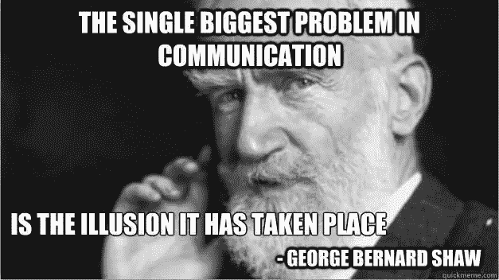

# 我在实际工作中从数据科学中学到的 5 条经验

> 原文：<https://towardsdatascience.com/5-lessons-i-have-learned-from-data-science-in-real-working-experience-3532c1b41fd7?source=collection_archive---------7----------------------->

## **被低估但重要的经验……**

[https://unsplash.com/photos/rk_Zz3b7G2Y](https://unsplash.com/photos/rk_Zz3b7G2Y)

我已经有一段时间没有在媒体上发帖了。从事数据科学已经快半年了，我犯了很多错误，并从一路上的错误中吸取了教训…通过艰难的方式。

> **没有失败，只有反馈**。
> 
> 而现实世界是一个反馈机制。

是的，你是对的，学习之旅并不容易。继续磨吧。学习提高。

通过我的学习经历，我终于意识到，大多数数据科学初学者(像我一样)可能会遇到一些常见的陷阱。如果你有，我希望我从这些陷阱中学到的 5 个最大的教训能在你的旅程中指引你。我们开始吧！

# 1.商业领域知识

老实说，当我第一次开始时，这一课给了我很大的打击，因为我没有强调领域知识的重要性。相反，我花了太多时间来提高我的技术知识(在没有真正理解业务需求的情况下建立一个复杂的模型)。

如果不彻底了解业务，你的模型很可能不会给公司增加任何价值，因为它根本不符合目的，不管你的模型有多准确。

提高模型精度最常用的技术是 [**网格搜索**](https://en.wikipedia.org/wiki/Hyperparameter_optimization) 来搜索模型的最佳参数。但是，只有通过了解业务需求并添加相关功能来训练您的模型，您才能显著提升您的模型性能。 [**特征工程**](https://machinelearningmastery.com/discover-feature-engineering-how-to-engineer-features-and-how-to-get-good-at-it/) 仍然非常重要，网格搜索只是改进你的模型的最后一步。

像往常一样，对你公司的业务真正感兴趣，因为你的工作是通过数据帮助他们解决问题。问问你自己，你是否真的对他们正在做的事情充满热情，并在工作中展示你的 ***同理心*** 。

## 永远知道你在说什么

仅仅了解业务本身是不够的，除非你能够清楚地表达你的想法，并以他们在业务环境中能够理解的术语向其他同事/利益相关者展示。

换句话说，永远不要使用利益相关者不熟悉的陌生(或者可能是自定义的)词语，因为这只会引起你和他们之间的误解。

> 尽管你的发现可能是正确的或见解可能是有影响力的，但你的可信度会受到质疑，你的发现只会是一个有争议的话题。

在您展示如何使用数据解决业务问题之前，我建议您首先展示您对业务的整体理解(包括日常工作中常用的技术术语)，然后确定可用数据回答的问题陈述。

# 2.注重细节的**思维模式和**工作流程

像一个**侦探**。用聚焦细节的激光进行你的调查。这在数据清理和转换过程中尤为重要。现实生活中的数据是杂乱的，你必须有能力在被淹没之前从噪音的海洋中提取信号。

因此，拥有注重细节的思维模式和工作流程对于在数据科学领域取得成功至关重要。如果没有一丝不苟的心态或结构良好的工作流程，您可能会在探索数据的过程中迷失方向。

你可能已经勤奋地进行了一段时间的[探索性数据分析(EDA)](https://en.wikipedia.org/wiki/Exploratory_data_analysis) ，但可能仍然没有获得任何见解。或者你可能一直用不同的参数训练你的模型，希望看到一些改进。或者，您可能正在庆祝艰巨的数据清理过程的完成，而实际上数据可能还不够干净，不足以提供给模型。我经历了这个漫无目的的过程，只是意识到我没有一个结构良好的工作流程，我的大脑只是希望最好的事情发生。

> 希望最好的事情发生让我无法控制自己在做什么。系统混乱了，我知道出了问题。

我退后一步，从更大的角度审视我一直在做的事情；我重组了自己的思路和工作流程，试图**让一切标准化、系统化**。而且成功了！

# 3.实验的设计和逻辑

系统化的**工作流程**给出了整个数据科学原型系统的宏观视图(从数据清理到解释模型结果等)。);一个**实验**是工作流程不可或缺的一部分，包括你的[假设检验](/data-science-simplified-hypothesis-testing-56e180ef2f71)逻辑以及模型构建过程。

正常的机器学习问题(Kaggle 竞赛等。)非常简单，因为您可以获得训练数据并开始构建模型。

然而，在现实世界中，在构建逻辑和设计实验来测试您的假设并使用合适的成功指标评估您的模型方面，事情会变得复杂。

在实验结束时，每一个主张或结论都应该有事实和数据的支持。不要未经证实就下结论。

# 4.通讯技能

如果这篇文章只有一个收获，我希望你能一直努力提高你的沟通技巧。不管你是数据科学的初学者、中级还是专家。

答应我一件事——你会**与他人分享你的想法**,同时注意**倾听他们的意见**。接受批评和反馈。

**说商业语言**用他们理解的术语与同事、经理和其他利益相关者交流。这与第一课——业务领域知识的重要性产生了共鸣。未能掌握业务语言会降低你与团队成员的沟通效率，因为人们可能很难从他们的角度理解你的话。

> 结果，时间被浪费了；人们会感到沮丧；你的信誉和与他们的关系可能会受到影响。真是两败俱伤的局面！

更糟糕的是，缺乏沟通技巧会导致商业利益相关者在理解你的分析结果时面临挑战。永远**以简单的方式交流你的想法、方法、结果和见解**尽管背后很复杂。简单地说，如果你对商务人士说商务语言，他们会感觉更舒服，感觉更有力量，也更愿意在这个过程中投入时间，从而更积极地参与谈话，理解你的分析。这也引出了最后一课——讲故事的重要性。

# 5.讲故事

如果现在还不明显，数据科学不仅仅是数据处理和模型构建，以向利益相关者展示结果。由于您的模型具有满足业务需求的卓越性能，您的最终目标应该是通过引人注目的数据故事向利益相关方交付您的成果，这些数据故事可以回答以下一些问题(取决于您的项目目标):

1.  *我们为什么要分析它？*
2.  *我们能从结果中获得什么启示？*
3.  我们能从中做出什么决定/行动计划？

讲述故事的艺术既简单又复杂。在数据驱动的分析中，人们常常会忽略这样一个事实，即有时即使是最好的模型性能和结果也会因为糟糕的故事讲述和演示而变得毫无用处。真是浪费！

## 想象你是利益相关者，是什么使一个引人注目和令人信服的故事？

让我们坐下来放松一下。再想象一下，当一位数据科学家现在向您展示一个对业务问题的高度准确的模型预测，而没有进一步的解释。你可能会想:印象深刻！模型做得很好…那么下一步是什么？然后呢？

你明白我在这里试图描绘的吗？模型结果和行动计划之间存在明显的差距。利益相关者不知道该做什么，即使你只是向他们展示一个高度准确的模型预测。我们必须从他们的角度来思考，回答他们的问题和顾虑，而不是仅仅满足业务目标，以最终制定行动计划，从而弥合差距。

弥合差距的方法有很多，我将简要强调两种方法，它们可以提供启发性的见解，并指导利益相关者制定行动计划。

## 设定比较基准

声称一款车型性能好而没有可比较的东西是不够的。换句话说，需要一个基准作为基线，这样我们才能知道模型是做得很好还是相反。

如果没有这个基准，声称一个模型表现良好实际上是没有意义的，因为仍然有一个问题没有回答: ***多好才算足够好？我为什么要相信你的结果？***

## 风险管理

这一点尤其重要，因为它将决定你的模型是否会投入生产。这意味着你必须从模型性能中展示最好和最坏的情况。

这就是风险管理的用武之地，因为涉众想要知道模型的限制，它在哪里有效，在哪里失败。他们想知道当模型投入生产时，公司要承担多大的风险，这最终会影响他们的最终行动计划。

因此，理解风险管理的重要性不仅会让你的结果更有说服力，还会大大增加利益相关者对你和你的结果的信心(因为你已经帮助公司管理和最小化了风险)。

[https://unsplash.com/photos/6jYoil2GhVk](https://unsplash.com/photos/6jYoil2GhVk)

感谢您的阅读。我希望你会发现这 5 课对你的学习之旅有用。我很高兴能通过你的学习经历了解更多关于你的课程，所以请随时与我分享，并留下你的评论！😃

和往常一样，我还有很多东西要学，也很想听听你关于如何改进我在 Medium 上的内容(技术或非技术)的意见。

如果您有任何问题，请添加我，让我们在 [LinkedIn](https://www.linkedin.com/in/admond1994/) 上聊天，或者访问我的[个人网站](http://admond1994.strikingly.com/)了解更多信息:

## 关于作者

[**Admond Lee**](https://www.linkedin.com/in/admond1994/) 目前是东南亚排名第一的商业银行 API 平台[**Staq**](https://www.trystaq.com)**—**的联合创始人/首席技术官。

想要获得免费的每周数据科学和创业见解吗？

[**加入 Admond 的电子邮件简讯——Hustle Hub**](https://bit.ly/3pGF8jv)，每周他都会在那里分享可行的数据科学职业技巧、错误&以及从创建他的初创公司 Staq 中学到的东西。

你可以在 [LinkedIn](https://www.linkedin.com/in/admond1994/) 、 [Medium](https://medium.com/@admond1994) 、 [Twitter](https://twitter.com/admond1994) 、[脸书](https://www.facebook.com/admond1994)上和他联系。

 [## 阿德蒙德·李

### 让每个人都能接触到数据科学。Admond 正在通过先进的社交分析和机器学习，利用可操作的见解帮助公司和数字营销机构实现营销投资回报。

www.admondlee.com](https://www.admondlee.com/)